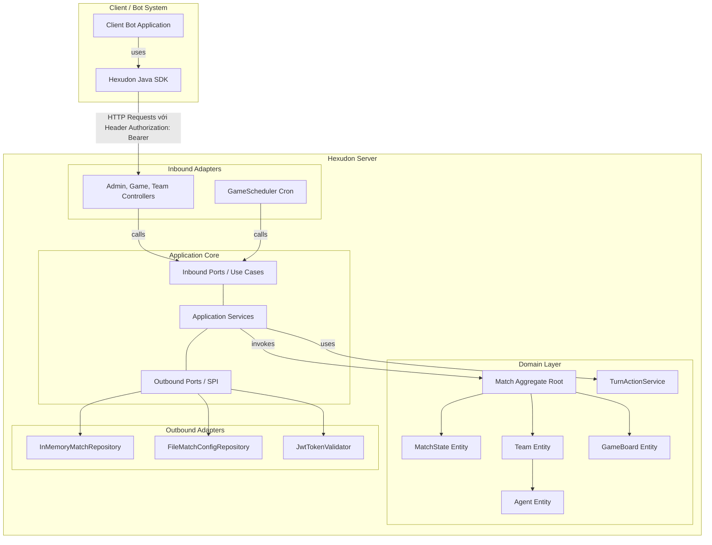

# Hexudon

Hexudon là một hệ thống mô phỏng game chiến thuật theo lượt (turn-based), đa tác tử (multi-agent) hoạt động trên lưới ô lục giác nằm ngang dạng **Odd-R offset**. Trong trò chơi này, các đội tham gia sẽ lập trình các Bot tự động để đăng ký, theo dõi trạng thái trận đấu và gửi danh sách hành động hàng ngày. Mục tiêu chính của trò chơi là tối ưu hóa việc thu thập các loại mì Udon tại các địa điểm cung cấp (`Spot`), phối hợp nhiên liệu di chuyển thông qua cơ chế sạc xăng của xe tiếp tế (`RefuelAgent`) cho xe tuần tra (`PatrolAgent`), và cạnh tranh điểm số trong điều kiện chi phí di chuyển thay đổi động theo mức độ ùn tắc giao thông (`TrafficLevel`).

Dự án được xây dựng và tổ chức theo phương pháp **Thiết kế hướng tên miền (DDD - Domain-Driven Design)** và **Kiến trúc Lục giác (Hexagonal Architecture / Ports & Adapters)**, giúp tách biệt hoàn toàn lõi nghiệp vụ mô phỏng với các thành phần công nghệ bên ngoài như Web Framework và Cơ sở dữ liệu.

---

## Overview

Dự án Hexudon cung cấp một nền tảng chạy game cục bộ (Game Server Engine), một bộ công cụ phát triển phần mềm (Java SDK) hỗ trợ lập trình viên xây dựng bot thông minh, và một ứng dụng bot mẫu (Bot Application) hoàn chỉnh:

*   **Game Server**: Bộ lõi động cơ game chịu trách nhiệm duy trì luật chơi, tự động cập nhật ngày đấu (turn) bằng Scheduler, tính toán điểm số và mật độ giao thông trên đường bộ.
*   **Java SDK**: Thư viện kết nối đóng gói sẵn HTTP Client, JSON Mapper, cơ chế tự động gửi lại (Retry) với thuật toán Exponential Backoff và các mô hình dữ liệu lưới lục giác giúp các bot dễ dàng giao tiếp với server mà không cần tự xây dựng các kết nối HTTP thô.
*   **Bot Application**: Ứng dụng bot mẫu hoàn chỉnh được phát triển dựa trên Java SDK, tích hợp sẵn các chiến thuật AI (như Greedy BFS và Wait) giúp người chơi dễ dàng chạy thử và phát triển thuật toán riêng.
*   **Đối tượng sử dụng**: Các lập trình viên hoặc đội chơi lập trình bot trí tuệ nhân tạo (AI) / chiến thuật tham gia đấu giải hoặc chạy thử thuật toán tìm đường trên lưới hex.

---

## Architecture

Hệ thống được thiết kế để tách biệt rõ ràng các thành phần thông qua các cổng giao tiếp (Ports) và bộ điều hợp (Adapters):



### Chi tiết các luồng tương tác:
1.  **Tương tác Client-Server**: Client Bot sử dụng thư viện `Hexudon Java SDK` gửi các gói tin HTTP (chứa Header xác thực định danh `Authorization: Bearer <token>`) tới endpoint REST của `Hexudon Server`.
2.  **Đăng ký và Thiết lập**: Bot thực hiện đăng ký và chọn loại Agent (`POST /api/game/agent-types`) trong giai đoạn trận đấu mở đăng ký (`REGISTERING`).
3.  **Tự động thúc lượt (Game Loop)**: Một bộ lập lịch nền (`GameScheduler`) trên Server sẽ liên tục theo dõi thời gian. Khi đến hạn kết thúc lượt, Scheduler sẽ kích hoạt tiến trình chạy mô phỏng chính thức: tính toán di chuyển, trừ xăng, thực hiện sạc xăng chéo, thu hoạch mì Udon, chấm điểm và tính toán lưu lượng giao thông ROAD để áp dụng chi phí xăng mới cho lượt sau.

---

## Project Structure

Thư mục gốc của repository được tổ chức thành ba module chính chạy trên nền cấu hình Maven đa module (Multi-module):

```text
hexudon (Root)
├── server              # Module chứa mã nguồn Game Simulation Engine (Spring Boot)
│   ├── src
│   │   ├── main/java   # Phân chia package theo layer: adapter, application, domain, infrastructure
│   │   └── resources   # Cấu hình application.yml, match_config.json mặc định
│   └── pom.xml
├── sdk                 # Module thư viện phát triển bot dành cho lập trình viên Java
│   ├── src
│   │   └── main/java   # Giao tiếp HTTP, Retry Backoff, cấu hình kết nối, mô hình map
│   └── pom.xml
├── bot                 # Module chứa mã nguồn Bot mẫu và các chiến thuật AI (Greedy, Wait)
│   ├── src
│   │   ├── main/java   # GameRunner, BotBrain, BotConfig và các thuật toán tìm đường (PathFinder)
│   │   └── resources   # Cấu hình logging và tệp thuộc tính config bot.properties
│   └── pom.xml
├── docs                # Thư mục chứa tài liệu thiết kế hệ thống
├── pom.xml             # File Maven parent cấu hình dependency và Java 21 toàn dự án
└── README.md           # Tài liệu giới thiệu tổng quan hệ thống (tệp tin này)
```

---

## Modules

### 1. [Server](file:///d:/Documents/GitHub/hexudon/server)
*   **Vai trò**: Game Engine trung tâm quản lý toàn bộ vòng đời trận đấu, bản đồ lưới lục giác, chấm điểm và mô phỏng các hành động của Agent.
*   **Tech Stack**: Java 21, Spring Boot 3.5.4, Maven.
*   **Chức năng chính**: 
    *   Quản lý cấu hình bản đồ nạp từ file JSON.
    *   Cung cấp REST API cho các bot đăng ký và tra cứu trạng thái.
    *   Bộ Scheduler tự động mô phỏng bước đi và chuyển ngày chơi khi đến hạn.
    *   Tính toán ùn tắc giao thông trên đường bộ (`ROAD`) để thay đổi chi phí xăng di chuyển động.
*   **Tài liệu chi tiết**: Xem thêm tại [server/README.md](file:///d:/Documents/GitHub/hexudon/server/README.md).

### 2. [SDK](file:///d:/Documents/GitHub/hexudon/sdk)
*   **Vai trò**: Thư viện Java Client chính thức giúp viết mã nguồn Bot nhanh chóng, che giấu các kết nối HTTP thô.
*   **Tech Stack**: Java 21, OkHttp 4.12.0, Jackson Databind (được quản lý bởi Spring Boot).
*   **Chức năng chính**:
    *   Cung cấp giao diện `HexudonClient` làm entry point chính.
    *   Triển khai `GameApi` để gọi các hàm đăng ký, lấy config và nộp hành động.
    *   Tích hợp sẵn bộ Retry tự động với thuật toán Exponential Backoff khi gặp sự cố mạng hoặc lỗi tạm thời từ server (5xx).
    *   Định nghĩa sẵn các lớp hình học lưới như tọa độ ô và hướng di chuyển để hỗ trợ bot tính toán tìm đường.
*   **Tài liệu chi tiết**: Xem thêm tại [sdk/README.md](file:///d:/Documents/GitHub/hexudon/sdk/README.md).

### 3. [Bot](file:///d:/Documents/GitHub/hexudon/bot)
*   **Vai trò**: Bot mẫu tự động tham gia trận đấu, kết nối và đồng bộ trạng thái với Game Server thông qua Java SDK để gửi các hành động chiến thuật.
*   **Tech Stack**: Java 21, Maven.
*   **Chức năng chính**:
    *   Đăng ký tự động số lượng Agent loại Patrol/Refuel phù hợp với cấu hình của Game Server.
    *   Vòng lặp thăm dò (polling) tự động theo dõi và cập nhật trạng thái trận đấu theo lượt.
    *   Tích hợp sẵn bộ não AI (`BotBrain`) có thể cấu hình được.
    *   Triển khai thuật toán BFS để tìm đường đi ngắn nhất trên lưới ô lục giác Odd-R offset.

---

## Tech Stack

Dưới đây là bảng tổng hợp công nghệ được sử dụng trên toàn bộ repository:

| Component | Technology |
| :--- | :--- |
| **Backend Language** | Java 21 (Sử dụng các cấu trúc hiện đại như Record, Pattern Matching) |
| **Backend Framework** | Spring Boot 3.5.4 |
| **Build Tool** | Apache Maven 3.9+ |
| **Database / Storage** | In-Memory (Bộ nhớ RAM JVM thông qua InMemoryMatchRepository) |
| **JSON Serialization** | FasterXML Jackson Databind (Tự động đồng bộ theo Spring Boot) |
| **Client SDK HTTP** | OkHttp 4.12.0 |
| **Logging (Bot)** | Java Util Logging (JUL) |
| **Testing Framework** | JUnit 5, Mockito, AssertJ |
| **Monitor / Dashboard** | *Chưa được implement hoặc chưa có tài liệu* |
| **Frontend / Web UI** | *Chưa được implement hoặc chưa có tài liệu* |

---

## Getting Started

### Yêu cầu cài đặt (Requirements)
*   **Java**: JDK 21 hoặc cao hơn.
*   **Build Tool**: Maven 3.9 hoặc cao hơn.

### 1. Biên dịch toàn bộ dự án
Chạy lệnh sau tại thư mục gốc để biên dịch cả `server`, `sdk` và `bot`:
```bash
mvn clean install
```

### 2. Khởi chạy Game Server
Để khởi chạy máy chủ mô phỏng cục bộ:
```bash
mvn spring-boot:run -pl server
```
Mặc định server sẽ chạy tại địa chỉ `http://localhost:8080`.

### 3. Khởi chạy Bot
Để khởi chạy bot mẫu kết nối tới server:
```bash
mvn exec:java -pl bot
```

### 4. Tích hợp SDK vào Bot tự phát triển
Thêm dependency của SDK vào file `pom.xml` của ứng dụng bot riêng của bạn:
```xml
<dependency>
    <groupId>com.naprock</groupId>
    <artifactId>hexudon-sdk</artifactId>
    <version>1.0.0</version>
</dependency>
```

> [!NOTE]
> **Ứng dụng Bot Mẫu**:
> *   Dự án đã tích hợp sẵn module `bot` làm mẫu. Bạn có thể sử dụng trực tiếp module này làm điểm bắt đầu để phát triển hoặc kiểm thử thuật toán AI của mình mà không cần tạo mới project từ đầu.

---

## Configuration

### Cấu hình phía Server
Cấu hình Spring Boot và Scheduler được đặt tại [server/src/main/resources/application.yml](file:///d:/Documents/GitHub/hexudon/server/src/main/resources/application.yml):
*   `server.port`: Cổng lắng nghe mặc định (`8080`).
*   `game.scheduler.rate-ms`: Chu kỳ quét thời gian của scheduler tính bằng mili-giây (Mặc định `1000`).
*   `game.config.file-path`: Đường dẫn lưu trữ cấu hình game JSON.

Tham số trò chơi và bản đồ được nạp từ file JSON cấu hình trận đấu:
*   `daySeconds`: Mảng quy định thời gian tối đa mỗi lượt chơi (ví dụ: `[5, 5, 5, 10]` giây).
*   `daySteps`: Mảng giới hạn số bước đi của Agent trong lượt tương ứng.
*   `fuelLimits`: Dung tích bình xăng của PatrolAgent (ví dụ: `20`).
*   `players`: Số lượng đội tối đa tham gia.

### Cấu hình phía Bot (Client)
Bot hỗ trợ nạp cấu hình động thông qua hệ thống phân cấp: **Thuộc tính hệ thống JVM** (System Property) -> **Biến môi trường** (Env Var) -> **Tệp bot.properties** -> **Giá trị mặc định**.

Để chỉnh sửa cấu hình tĩnh, hãy sao chép tệp `bot/src/main/resources/bot.properties.example` thành `bot/src/main/resources/bot.properties` và điều chỉnh các giá trị:

*   `HEXUDON_BASE_URL`: URL của Hexudon Server (Mặc định: `http://localhost:8080`).
*   `HEXUDON_TOKEN`: Token xác thực Bearer được cấp cho đội chơi (Bắt buộc).
*   `HEXUDON_TEAM_ID`: ID định danh của đội chơi (Bắt buộc).
*   `HEXUDON_GAME_ID`: ID của trận đấu cần tham gia (Bắt buộc).
*   `HEXUDON_PRACTICE`: Thiết lập chế độ luyện tập `true`/`false` (Mặc định: `false`).
*   `BOT_POLL_DELAY_MS`: Thời gian chờ giữa các lần polling trạng thái game tính bằng mili-giây (Mặc định: `1000`).
*   `BOT_DEBUG`: Kích hoạt log chi tiết của bot ở mức FINE nếu đặt là `true`.

### Cấu hình phía SDK Client
Khi khởi tạo `HexudonClient` thủ công trong code Java, các tham số chính bao gồm:
*   `baseUrl`: URL của Hexudon Server (Mặc định `http://localhost:8080`).
*   `teamId`: Định danh bắt buộc của đội chơi.
*   `token`: Bearer Token xác thực bắt buộc.

---

## API Overview

Ứng dụng Hexudon Server cung cấp các API thông qua HTTP REST. Toàn bộ các API chính thức nằm dưới tiền tố đường dẫn `/api/game`:

1.  **Cấu hình**:
    *   `GET /api/game/config`: Lấy cấu hình tham số bản đồ và ngày đấu.
2.  **Đăng ký**:
    *   `POST /api/game/agent-types`: Đăng ký lựa chọn danh sách loại Agent ban đầu trong giai đoạn `REGISTERING`. (Yêu cầu Header `Authorization: Bearer <token>`).
3.  **Trạng thái**:
    *   `GET /api/game/competitive/state`: Lấy thông tin trạng thái trận đấu hiện tại.
    *   `GET /api/game/day`: Lấy trạng thái của lượt chơi hiện tại dưới góc nhìn của đội chơi (Yêu cầu Header `Authorization: Bearer <token>`).
    *   `GET /api/game/result`: Tra cứu bảng xếp hạng và điểm số của trận đấu.

> [!IMPORTANT]
> **Lưu ý về Xác thực và Endpoint nộp Action**:
> *   Các request yêu cầu xác thực từ client lên server bắt buộc phải truyền mã JWT qua HTTP Header **`Authorization: Bearer <token>`** (Không sử dụng header `X-Team-Id` như các bản phác thảo cũ).
> *   **REST API nộp Action (`POST /api/game/actions`) hiện chưa có endpoint REST tương ứng trong Controller của Server**. Trong mã nguồn hiện tại, hành động di chuyển của các đội chỉ có thể được kiểm thử thông qua các bộ unit test/integration test nội bộ của Game Server.

*Tài liệu OpenAPI chi tiết mô tả cấu trúc JSON yêu cầu và phản hồi được lưu tại tệp tin:* [server/docs/api/API.md](file:///d:/Documents/GitHub/hexudon/server/docs/api/API.md).

---

## Domain Overview

Nghiệp vụ của trò chơi xoay quanh các khái niệm và quy tắc lõi sau:

1.  **Lưới lục giác (Map)**: Sử dụng hệ lưới lục giác ngang Odd-R offset. Địa hình ô bản đồ có 4 loại: PLAIN (đồng bằng), ROAD (đường bộ), MOUNTAIN (núi cao), và POND (ao hồ). Ô địa hình POND là ô bị cấm không thể di chuyển qua.
2.  **Agent (Tác tử)**: Mỗi đội sở hữu một nhóm Agent tự hành ban đầu được sinh ra tại vị trí cố định. Có hai loại Agent:
    *   `PatrolAgent` (Tuần tra): Di chuyển qua các ô sẽ tiêu tốn nhiên liệu và bước hành động. Nhiệm vụ duy nhất là đứng tại các ô có Spot để thu hoạch mì Udon.
    *   `RefuelAgent` (Tiếp tế): Di chuyển chỉ tốn bước đi, không tốn nhiên liệu. Khi đứng cùng hoặc kề cạnh ô tọa độ với PatrolAgent cùng đội ở bất kỳ bước mô phỏng nào, nó sẽ tự động nạp đầy nhiên liệu cho PatrolAgent.
3.  **Ùn tắc giao thông (Traffic)**: Khi nhiều Agent của các đội cùng di chuyển qua hoặc đứng lại ở các ô đường bộ (`ROAD`), mức độ ùn tắc của ô đó tăng lên. Cuối lượt chơi, hệ thống tính toán tỷ lệ ùn tắc và quy đổi thành mức độ `NORMAL` (xăng tiêu thụ = 1), `BUSY` (xăng tiêu thụ = 2), hoặc `CONGESTED` (xăng tiêu thụ = 4) áp dụng cho lượt chơi tiếp theo.
4.  **Điểm Spot và Điểm số**: Mỗi ô Spot chứa một lượng mì Udon hữu hạn cho từng đội chơi (kho hàng độc lập giữa các đội). Agent tuần tra đứng tại Spot thu hoạch sẽ nhận được Udon và ghi điểm vào bảng xếp hạng. Tồn kho của các Spot sẽ được làm đầy lại vào đầu mỗi lượt chơi mới.

---

## Bot Strategies

Module `bot` triển khai các chiến thuật thông minh thông qua giao diện `BotBrain`:

### 1. Greedy Strategy (`GreedyStrategy` - Mặc định)
Chiến thuật di chuyển tham lam sử dụng thuật toán tìm kiếm theo chiều rộng (BFS) trên lưới lục giác:
*   **Đối với tác tử tuần tra (PATROL)**:
    *   Nếu đang đứng trên một ô `Spot` còn mì Udon: thực hiện hành động chờ (`WaitAction`) để thu hoạch.
    *   Ngược lại: tìm kiếm ô `Spot` gần nhất còn mì bằng thuật toán BFS để tạo đường đi di chuyển (`MoveAction`). Nếu tất cả các spot đều hết mì, nó vẫn sẽ di chuyển về spot gần nhất để chờ phục hồi kho mì.
*   **Đối với tác tử tiếp tế (REFUEL)**:
    *   Tìm kiếm tác tử `PATROL` cùng đội có lượng xăng thấp nhất.
    *   Tính toán đường đi ngắn nhất đến vị trí của tác tử đó bằng BFS.
    *   Khi đứng chung hoặc kề cạnh tác tử tuần tra, nó sẽ đứng chờ để kích hoạt cơ chế nạp xăng tự động của Server.
*   *Lưu ý*: Chuỗi hành động di chuyển của mỗi tác tử trong ngày được cắt ngắn tương ứng với giới hạn bước đi tối đa của lượt đó (`daySteps`).

### 2. Wait Strategy (`WaitStrategy` - Fallback)
*   Chiến thuật an toàn yêu cầu tất cả tác tử đứng yên (Wait 1 step). Được kích hoạt tự động làm cơ chế phòng ngừa khi chiến thuật chính xảy ra lỗi ngoại lệ không mong muốn trong quá trình tính toán.

---

## Documentation

Dưới đây là danh sách các tài liệu tham khảo chính trong kho mã nguồn:

*   [server/docs/api/API.md](file:///d:/Documents/GitHub/hexudon/server/docs/api/API.md): Tài liệu đặc tả OpenAPI đầy đủ của hệ thống bao gồm cả các endpoint quản trị (Admin).
*   [server/README.md](file:///d:/Documents/GitHub/hexudon/server/README.md): Hướng dẫn chi tiết mã nguồn, kiến trúc lục giác, luồng xử lý và cách chạy module Server.
*   [sdk/README.md](file:///d:/Documents/GitHub/hexudon/sdk/README.md): Hướng dẫn cài đặt, cấu hình retry và cách lập trình tích hợp SDK vào mã nguồn bot của bạn.

---

## Testing

Hệ thống cung cấp các bộ kiểm thử tự động phong phú ở các module:

*   **Server Tests**: Kiểm thử luật chơi của Agent, nạp xăng tự động, tính toán ùn tắc, kiểm tra ánh xạ dữ liệu.
*   **SDK Tests**: Kiểm thử tuần tự hóa JSON coordinate, cơ chế tự động gửi lại (Retry) khi gặp lỗi mạng, và xác thực cấu hình kết nối.
*   *Lưu ý*: Module `bot` không đi kèm các kiểm thử đơn vị độc lập.

Cách chạy toàn bộ kiểm thử trên repository:
```bash
mvn test
```

---

## Roadmap

### Các tính năng đã hoàn thành
*   Xây dựng hoàn chỉnh lõi tính toán hình học lưới lục giác ngang Odd-R và khoảng cách hex.
*   Cơ chế mô phỏng di chuyển bước, auto-refuel, và thu hoạch tài nguyên theo luật chơi.
*   Tự động cập nhật ùn tắc giao thông ROAD động theo lượt.
*   Thiết lập REST API cho cấu hình, trạng thái trận đấu, bản đồ, kết quả và danh sách game.
*   Bộ Java SDK kết nối ổn định.
*   Xây dựng module `bot` chạy mẫu tích hợp sẵn giải thuật BFS tìm đường tối ưu sạc và ăn udon.

### Các tính năng chưa hoàn thành / Đang lên kế hoạch (Có cấu trúc khung nhưng chưa triển khai)
*   **REST API nộp Action (`POST /api/game/actions`)**: Chưa được đưa vào REST Controller của Server ở phiên bản hiện tại.
*   **WebSocket Protocol**: Các package liên quan trên server hiện tại mới chỉ là thư mục trống hoặc bản phác thảo cấu trúc.
*   **Chế độ luyện tập (Practice Mode)**: Bộ Java SDK đã xây dựng xong cấu trúc gọi API luyện tập (`PracticeApi` gọi các đường dẫn `/api/game/practice/*`), tuy nhiên trên Server **chưa triển khai** bất kỳ endpoint hay nghiệp vụ nào tương ứng cho tính năng này.
*   **Cơ sở dữ liệu lưu trữ (Database Persistence)**: Chưa có adapter kết nối tới các cơ sở dữ liệu vật lý (như PostgreSQL, MySQL). Trạng thái game hiện tại được lưu trữ hoàn toàn tạm thời trên bộ nhớ RAM.
