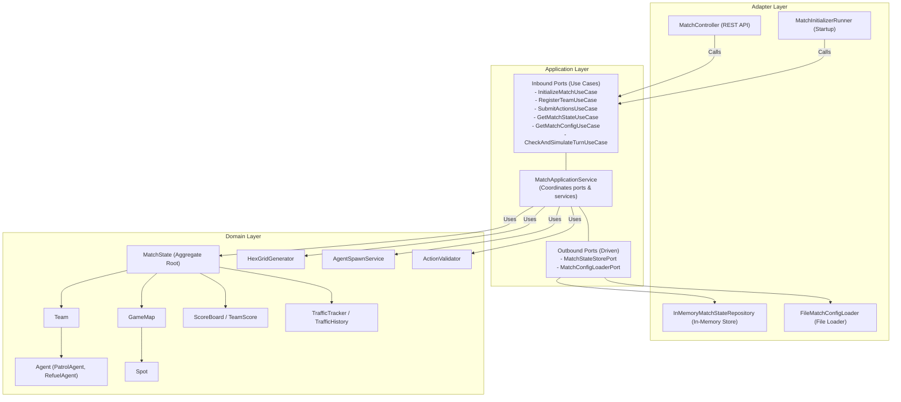

# HEXUDON

[](https://jdk.java.net/21/)
[](https://spring.io/projects/spring-boot)
[](#build--run)

`HEXUDON` is a multi-agent, turn-based simulation tactical game server and monitoring dashboard. The game is played on a hexagonal offset grid map where teams register and submit actions to control autonomous agents. The objective is to harvest different types of Udon noodles, coordinate agent refuelling, and optimize paths to score points while adapting to dynamically updating traffic flow constraints.

The project is strictly designed using **Domain-Driven Design (DDD)** and **Hexagonal Architecture (Ports and Adapters)**, ensuring the core game simulation engine remains completely isolated from external frameworks like Spring Boot or web interfaces.

---

## Table of Contents
- [System Architecture](#system-architecture)
  - [Architectural Layers](#architectural-layers)
  - [Dependency & Flow of Control](#dependency--flow-of-control)
  - [Mermaid System Diagram](#mermaid-system-diagram)
- [Module Structure](#module-structure)
- [Technology Stack](#technology-stack)
- [Project Folder Tree](#project-folder-tree)
- [Build & Run](#build--run)
  - [Prerequisites](#prerequisites)
  - [1. Backend Server (`hexudon-server`)](#1-backend-server-hexudon-server)
  - [2. Frontend Monitor (`hexudon-monitor`)](#2-frontend-monitor-hexudon-monitor)
- [Configuration](#configuration)
- [REST API Endpoints](#rest-api-endpoints)
- [Core Simulation Engine & Domain Model](#core-simulation-engine--domain-model)
  - [Hex Grid Geometry](#hex-grid-geometry)
  - [Terrain & Udon Spot Generation](#terrain--udon-spot-generation)
  - [Turn Lifecycle & Scheduler](#turn-lifecycle--scheduler)
  - [Agent Types & Support Mechanics](#agent-types--support-mechanics)
  - [Traffic & Congestion Mechanics](#traffic--congestion-mechanics)
  - [Scoring System](#scoring-system)
- [Testing](#testing)
- [Known Limitations & Engine Bugs](#known-limitations--engine-bugs)
- [Contribution Guide](#contribution-guide)

---

## System Architecture

The project is structured according to **Hexagonal Architecture** guidelines to decouple core business logic from outer technologies.

### Architectural Layers

1. **Domain Layer (`com.naprock.hexudon.domain`)**:
   - Contains core entities, aggregates, value objects, exceptions, and pure domain services.
   - Independent of external frameworks (no imports of Spring libraries).
2. **Application Layer (`com.naprock.hexudon.application`)**:
   - **Inbound Ports**: Define use cases (e.g., [RegisterTeamUseCase](file:///d:/Documents/GitHub/hexudon/server/src/main/java/com/naprock/hexudon/application/port/in/RegisterTeamUseCase.java)).
   - **Outbound Ports**: Define adapter interfaces (e.g., [MatchStateStorePort](file:///d:/Documents/GitHub/hexudon/server/src/main/java/com/naprock/hexudon/application/port/out/MatchStateStorePort.java)).
   - **Application Services**: [MatchApplicationService](file:///d:/Documents/GitHub/hexudon/server/src/main/java/com/naprock/hexudon/application/service/MatchApplicationService.java) implements use cases and coordinates ports.
   - **DTOs & Mappers**: Translate network payloads to domain objects.
3. **Adapter Layer (`com.naprock.hexudon.adapter`)**:
   - **Inbound (Driving)**: REST controllers ([MatchController](file:///d:/Documents/GitHub/hexudon/server/src/main/java/com/naprock/hexudon/adapter/in/rest/MatchController.java)) and command-line runners ([MatchInitializerRunner](file:///d:/Documents/GitHub/hexudon/server/src/main/java/com/naprock/hexudon/adapter/in/initializer/MatchInitializerRunner.java)).
   - **Outbound (Driven)**: Persistence storage ([InMemoryMatchStateRepository](file:///d:/Documents/GitHub/hexudon/server/src/main/java/com/naprock/hexudon/adapter/out/persistence/InMemoryMatchStateRepository.java)) and configuration loaders ([FileMatchConfigLoader](file:///d:/Documents/GitHub/hexudon/server/src/main/java/com/naprock/hexudon/adapter/out/loader/FileMatchConfigLoader.java)).
4. **Infrastructure Layer (`com.naprock.hexudon.infrastructure`)**:
   - Setup for Spring scheduling ([SchedulerConfig](file:///d:/Documents/GitHub/hexudon/server/src/main/java/com/naprock/hexudon/infrastructure/configuration/SchedulerConfig.java)), CORS configuration ([WebConfig](file:///d:/Documents/GitHub/hexudon/server/src/main/java/com/naprock/hexudon/infrastructure/configuration/WebConfig.java)), and utility classes.

### Dependency & Flow of Control
Dependencies always point inwards. Adapters depend on Application Ports, which interact with Domain Entities. The Domain Layer has no external dependencies.



---

## Module Structure

The codebase is split into two primary components:
- **Parent (`hexudon`)**: Coordinates the multi-module Maven compilation.
- **Server Module (`hexudon-server` / `/server`)**: Standard Spring Boot Maven project containing the domain engine, REST endpoint, configuration loading, and simulation scheduling.
- **Monitor Client (`hexudon-monitor` / `/hexudon-monitor`)**: A React/Vite-based admin dashboard application to visualize match state, maps, scores, and traffic flow in real-time.

---

## Technology Stack

- **Backend (`hexudon-server`)**:
  - **Language**: Java 21
  - **Framework**: Spring Boot 3.5.4 (using `spring-boot-starter-web` & `spring-boot-starter-validation`)
  - **Utilities**: Lombok
  - **Testing**: JUnit 5, Mockito, ArchUnit 1.3.0 (architectural verification)
  - **Build**: Apache Maven 3.9.x
- **Frontend Dashboard (`hexudon-monitor`)**:
  - **Framework**: React 19 + TypeScript
  - **Build Tool**: Vite 8.1.1
  - **Styling**: TailwindCSS v4
  - **State Management**: Zustand
  - **Charts**: Recharts
  - **Icons**: Lucide React
  - **HTTP Client**: Axios

---

## Project Folder Tree

Here are the important paths in the repository layout:

```text
.
├── pom.xml                                   # Parent POM
├── server                                    # Spring Boot Server Module
│   ├── pom.xml
│   └── src
│       ├── main
│       │   ├── java/com/naprock/hexudon
│       │   │   ├── adapter/in/rest               # REST Controllers
│       │   │   ├── adapter/in/initializer        # Startup command run
│       │   │   ├── adapter/out/persistence       # In-memory storage repository
│       │   │   ├── adapter/out/loader            # File config loader
│       │   │   ├── application/port              # Inbound/Outbound Ports
│       │   │   ├── application/service           # MatchApplicationService
│       │   │   ├── domain/model/agent            # PatrolAgent, RefuelAgent, Agent abstract
│       │   │   ├── domain/model/geometry         # Coordinate, Direction
│       │   │   ├── domain/model/map              # GameMap, Cell, Spot
│       │   │   ├── domain/model/match            # MatchState, MatchConfig
│       │   │   ├── domain/model/traffic          # TrafficTracker, TrafficHistory
│       │   │   ├── domain/model/score            # ScoreBoard, TeamScore
│       │   │   └── infrastructure/configuration  # WebConfig, SchedulerConfig
│       │   └── resources
│       │       ├── application.yml           # Spring Boot parameters
│       │       └── match_config.txt          # Match engine rules configuration
│       └── test                              # Test classes (JUnit 5, ArchUnit)
└── hexudon-monitor                           # Frontend Dashboard React App
    ├── index.html
    ├── package.json
    ├── vite.config.ts
    └── src
        ├── components                        # SVG grid, score boards, controls
        ├── pages                             # Route-based dashboard layouts
        ├── stores                            # Zustand global state hooks
        └── main.tsx                          # App Entrypoint
```

---

## Build & Run

### Prerequisites
- **Java Development Kit (JDK) 21** or later
- **Maven 3.9.x** or later
- **Node.js 18+** & **npm**

### 1. Backend Server (`hexudon-server`)

To build the Maven project, navigate to the parent folder and run:
```bash
mvn clean install
```

To run the Spring Boot server (running on `http://localhost:8080` by default):
```bash
# From the project root
mvn spring-boot:run -pl server
```
Or run the built `.jar` file directly:
```bash
java -jar server/target/hexudon-server-1.0.0.jar
```

### 2. Frontend Monitor (`hexudon-monitor`)

To install packages and run the development server locally:
```bash
cd hexudon-monitor
npm install
npm run dev
```
Open [http://localhost:3000](http://localhost:3000) in your web browser. 

The dashboard provides a **Mock vs Live Mode** toggle on the sidebar:
- **Mock Mode** (Default): Visualizes simulated mock data without needing the backend.
- **Live Mode**: Polls the Spring Boot server endpoints at `http://localhost:8080` every 2 seconds.

---

## Configuration

The simulation engine is configured via two files under `server/src/main/resources`:

1. **`application.yml`**:
   - `server.port`: Web server HTTP port (default: `8080`).
   - `match.scheduler.interval`: Frequency (in ms) of turn expiration checks (default: `1000`).

2. **`match_config.txt`**:
   Sets match constraints and game rules. Parsed at startup by `FileMatchConfigLoader`.
   - `mapWidth` / `mapHeight`: Grid dimensions.
   - `maxTurns`: Number of turns before the match automatically finishes.
   - `maxTeams`: Max number of teams allowed to register.
   - `agentsPerTeam`: Mandatory agent count per team.
   - `maxFuel`: Max fuel capacity.
   - `maxStepsPerTurn`: Step count limit assigned to agents at the start of a turn.
   - `turnTimeLimitMs`: Time limit (in milliseconds) for a team to submit actions for a turn.
   - `initialSpotUdonStock`: Quantity of Udon noodles initialized at each Spot.

---

## REST API Endpoints

The [MatchController](file:///d:/Documents/GitHub/hexudon/server/src/main/java/com/naprock/hexudon/adapter/in/rest/MatchController.java) exposes the following API endpoints:

| Method | Path | Required Header | Request Body DTO | Response Body DTO | Status | Description |
| :--- | :--- | :--- | :--- | :--- | :--- | :--- |
| **POST** | `/api/match/register` | None | [TeamRegisterRequest](file:///d:/Documents/GitHub/hexudon/server/src/main/java/com/naprock/hexudon/application/dto/team/TeamRegisterRequest.java) | [TeamResponse](file:///d:/Documents/GitHub/hexudon/server/src/main/java/com/naprock/hexudon/application/dto/team/TeamResponse.java) | `201 Created` | Registers a team. Automatically spawns requested `Patrol` and `Refuel` agents at randomized, walk-accessible, non-colliding cells. |
| **GET** | `/api/match/config` | None | None | [MatchConfigResponse](file:///d:/Documents/GitHub/hexudon/server/src/main/java/com/naprock/hexudon/application/dto/match/MatchConfigResponse.java) | `200 OK` | Retrieves map grid cells, terrain types, spot coordinates, and match rules/constraints. |
| **GET** | `/api/match/state` | `X-Team-Name` | None | [MatchStateResponse](file:///d:/Documents/GitHub/hexudon/server/src/main/java/com/naprock/hexudon/application/dto/match/MatchStateResponse.java) | `200 OK` | Retrieves match status, current turn index, scores, traffic overlays, and details of agents owned by the request's team. |
| **POST** | `/api/match/actions` | `X-Team-Name` | [SubmitActionRequest](file:///d:/Documents/GitHub/hexudon/server/src/main/java/com/naprock/hexudon/application/dto/match/SubmitActionRequest.java) | None | `202 Accepted` | Submits a queue of move/wait actions for the team's agents. It is validated via simulation prior to acceptance. |

---

## Core Simulation Engine & Domain Model

### Hex Grid Geometry
The grid layout uses a horizontal **Odd-R offset hexagonal grid** coordinate representation (represented by [Coordinate](file:///d:/Documents/GitHub/hexudon/server/src/main/java/com/naprock/hexudon/domain/model/geometry/Coordinate.java)).
- Columns correspond to the `x` axis, and Rows correspond to the `y` axis.
- Odd rows are shifted by half a hex width.
- Hex grid distance calculations (in `distanceTo(other)`) convert coordinates into a **3D Cube Coordinate** model `Cube(x, y, z)` before applying the standard distance formula:
  \[\text{Distance} = \max(|dx|, |dy|, |dz|)\]

### Terrain & Udon Spot Generation
The map is dynamically generated by [HexGridGenerator](file:///d:/Documents/GitHub/hexudon/server/src/main/java/com/naprock/hexudon/domain/service/HexGridGenerator.java) at initialization:
- **Terrain Cell Types**: Plain (`PLAIN` - 65%), Mountain (`MOUNTAIN` - 20%), Road (`ROAD` - 5%), and Pond (`POND` - 10%).
- **Udon Spots**: Generated on walkable cells (`PLAIN` or `ROAD`). The number of spots generated equals:
  \[\max(1, \frac{\text{Width} \times \text{Height}}{50})\]
  A minimum spacing distance of **3 hexes** is enforced between spots. Spot types are randomized: `TANUKI`, `KITSUNE`, `TEMPURA`, or `BEEF`.

### Turn Lifecycle & Scheduler
The match states are: `WAITING`, `PLAYING`, and `FINISHED`.
- At startup, the server automatically generates the map and remains in the `WAITING` state.
- When teams are registered and the match starts, the status shifts to `PLAYING`.
- [SchedulerConfig](file:///d:/Documents/GitHub/hexudon/server/src/main/java/com/naprock/hexudon/infrastructure/configuration/SchedulerConfig.java) runs a periodic check (interval defined in `application.yml`). When the time delta since `turnStartTime` exceeds `turnTimeLimitMs`, the use case triggers `finishTurn(config)`:
  1. Iterates from the maximum step count `maxStepsPerTurn` down to step `1`.
  2. Resolves team auto-refueling checks.
  3. Executes queued agent steps (`executeAction`) and records movement paths and udon collections.
  4. Applies collected udon increments to the scoreboard.
  5. Computes traffic flow updates based on agent paths.
  6. Resets agent step allocations, regenerates daily udon spot stocks, updates cell step costs based on traffic levels, and increments the turn count.

### Agent Types & Support Mechanics
- **PatrolAgent**: Tracks a list of spots visited during the current turn. Visited spots are reset at the beginning of each turn. PatrolAgents consume fuel on movement according to terrain cost.
- **RefuelAgent**: Does not consume fuel. Provides refueling support.
- **Auto-Refueling**: At each step iteration of `finishTurn`, if a `RefuelAgent` and a `PatrolAgent` belonging to the same team occupy the exact same coordinate, the `PatrolAgent`'s fuel tank is immediately refilled to `maxFuel`.

### Traffic & Congestion Mechanics
Only cells of type `ROAD` are tracked for traffic updates by [TrafficTracker](file:///d:/Documents/GitHub/hexudon/server/src/main/java/com/naprock/hexudon/domain/model/traffic/TrafficTracker.java):
- Every time an agent moves through or stops at a `ROAD` coordinate, the coordinate's step count is incremented.
- At the end of the turn, the traffic rate is calculated as:
  \[\text{Traffic Rate} = \frac{\text{Previous Steps} + \text{Current Steps}}{\text{Total Registered Teams}}\]
- Traffic status transitions dynamically based on thresholds:
  - $\text{Rate} < 2.0$: `NORMAL`
  - $2.0 \le \text{Rate} < 4.0$: `BUSY`
  - $\text{Rate} \ge 4.0$: `CONGESTED`
- Congestion increases the step movement costs for that road cell on subsequent turns.

### Scoring System
[TeamScore](file:///d:/Documents/GitHub/hexudon/server/src/main/java/com/naprock/hexudon/domain/model/score/TeamScore.java) aggregates team achievements:
- Tracks unique Udon noodle types collected.
- Computes accumulated daily collected udons.
- Tracks servings completed and records response time latency across requests.

---

## Testing

The codebase includes an extensive testing package with **126 automated test cases**:
- **Unit Tests**: Verify domains, coordinate transformations, and state updates (e.g., [AgentTest](file:///d:/Documents/GitHub/hexudon/server/src/test/java/com/naprock/hexudon/domain/model/agent/AgentTest.java), [CoordinateTest](file:///d:/Documents/GitHub/hexudon/server/src/test/java/com/naprock/hexudon/domain/model/geometry/CoordinateTest.java)).
- **Integration Tests**: Verify adapter logic, API serialization, and configuration file parsing.
- **Architectural Tests**: [ArchitectureTest](file:///d:/Documents/GitHub/hexudon/server/src/test/java/com/naprock/hexudon/ArchitectureTest.java) uses **ArchUnit** to enforce separation boundary rules between the domain core, application, and external adapter layers.

To run the full test suite locally:
```bash
mvn test
```

---

## Known Limitations & Engine Bugs

> [!WARNING]
> The simulation engine contains major anomalies and bugs in its core physics and movement logic. These behaviors are verified by unit tests (e.g. `shouldFailDueToProductionFuelBug` and `shouldConsumeStepAndFailDueToProductionLogic`) and define the current engine behavior:

1. **Walkable Cell Movement Inversion**:
   In [Agent.java](file:///d:/Documents/GitHub/hexudon/server/src/main/java/com/naprock/hexudon/domain/model/agent/Agent.java#L188-L193), movement checks fail if a destination cell's `isWalkable()` returns `true` (meaning plain, road, and mountain terrain are inaccessible to move actions). Movements only proceed if the destination cell is **not** walkable (meaning `RefuelAgent` can only successfully move into `POND` coordinates).
2. **PatrolAgent Fuel Consumption Failure**:
   In [Agent.java](file:///d:/Documents/GitHub/hexudon/server/src/main/java/com/naprock/hexudon/domain/model/agent/Agent.java#L160-L169), the `consumeFuel` helper updates fuel values but returns `false` on success. In `PatrolAgent.executeAction`, this causes the agent's movement action to fail immediately whenever it successfully consumes fuel.
3. **Empty Movement Costs Map**:
   The `movementCosts` map on `GameMap` is never initialized or populated with map coordinates at startup. As a result, when an agent attempts to move, calling `movementCosts.get(destination)` returns `null` and triggers a `NullPointerException`. (Unit tests bypass this by manually writing values via reflection).
4. **Action Order Ignored**:
   The `order` field in [ActionRequest](file:///d:/Documents/GitHub/hexudon/server/src/main/java/com/naprock/hexudon/application/dto/match/ActionRequest.java#L15) is ignored by [MatchMapper.toDomainMap](file:///d:/Documents/GitHub/hexudon/server/src/main/java/com/naprock/hexudon/application/mapper/MatchMapper.java#L36). Agent actions are executed strictly in the order they are listed in the JSON array.
5. **Empty Packages**:
   The packages `websocket` (under `adapter/in`) and `publisher` (under `adapter/out`) contain no files. There is no WebSocket connectivity implemented; HTTP polling is used instead.
6. **In-Memory Store Only**:
   The `InMemoryMatchStateRepository` stores match records as a single singleton bean instance without database backing. All game data is reset when the server application restarts.
7. **Action Validation STAY bug**:
   In [Action.java](file:///d:/Documents/GitHub/hexudon/server/src/main/java/com/naprock/hexudon/domain/model/movement/Action.java#L29-L34), `stay(Coordinate)` initializes a `WAIT` action type while passing a non-null target coordinate. However, the constructor validation logic in `Action` throws a `GameRuleViolationException` if a `WAIT` action has a target coordinate that is not `null`.

---

## Contribution Guide

To contribute:
1. Ensure your local environment matches the [Technology Stack](#technology-stack).
2. Code changes to the domain core should not introduce external dependencies.
3. Write matching unit tests and verify layer architecture bounds using `mvn test`.
