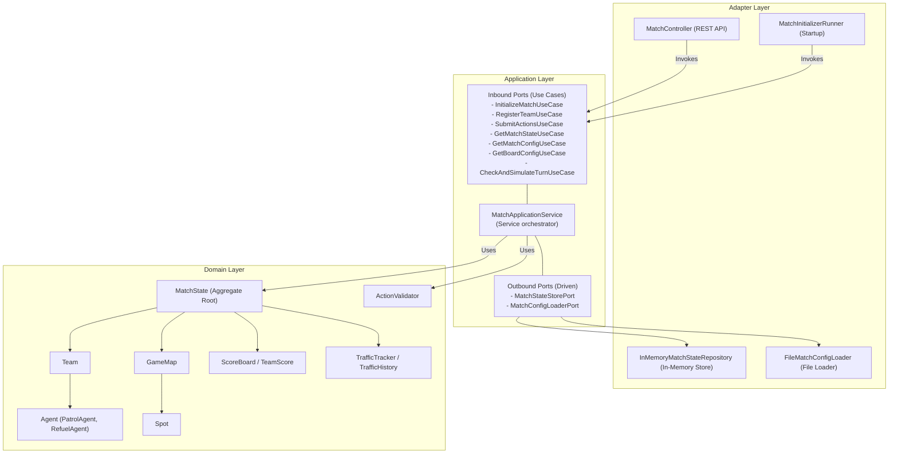
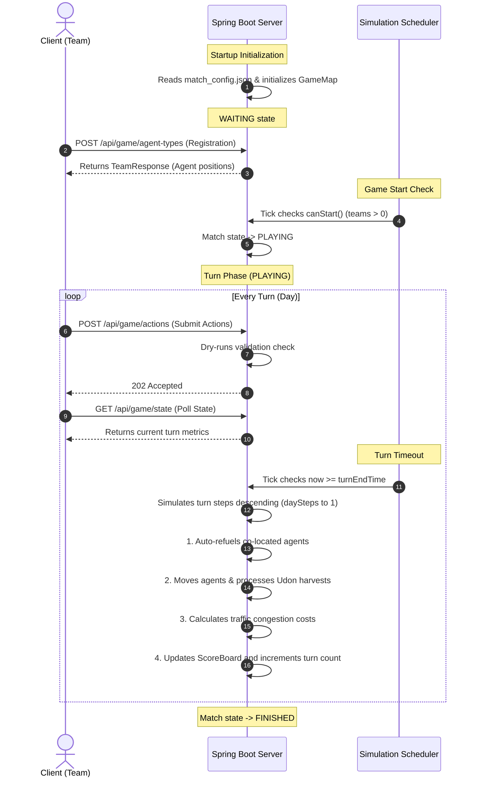

# HEXUDON - Game Simulation Server

`HEXUDON` is a multi-agent, turn-based tactic game simulation server operating on a hexagonal grid (Odd-R offset grid). Teams register their teams and submit action queues to control autonomous agents. The goal of the game is to harvest Udon noodle resources at different spots, coordinate auto-refueling between patrol and refuel agents, optimize path costs under dynamic traffic congestion levels, and score the highest points.

The project is designed following **Domain-Driven Design (DDD)** and **Hexagonal Architecture (Ports and Adapters)** principles. This keeps the core simulation logic completely isolated from web frameworks and external database concerns.

---

## Architecture & System Design

Hexudon is structured into four distinct layers in line with the Hexagonal Architecture:

1. **Domain Layer (`com.naprock.hexudon.domain`)**:
   - Contains core entities, aggregates, value objects, domain exceptions, and validation logic.
   - Completely free of external framework dependencies (contains no Spring Boot imports).
2. **Application Layer (`com.naprock.hexudon.application`)**:
   - **Inbound Ports**: Interfaces representing the driver use cases (e.g., `RegisterTeamUseCase`, `SubmitActionsUseCase`).
   - **Outbound Ports**: Interfaces representing driven actions (e.g., `MatchStateStorePort`, `MatchConfigLoaderPort`).
   - **Application Services**: `MatchApplicationService` coordinates domain actions and implements inbound ports.
   - **DTOs & Mappers**: Standardizes request/response payloads and transforms them into domain structures.
3. **Adapter Layer (`com.naprock.hexudon.adapter`)**:
   - **Inbound (Driving)**: Handles external requests, containing `MatchController` (REST API) and `MatchInitializerRunner` (startup hook).
   - **Outbound (Driven)**: Implements repository interfaces, containing `InMemoryMatchStateRepository` (RAM persistence) and `FileMatchConfigLoader` (reads JSON configs).
4. **Infrastructure Layer (`com.naprock.hexudon.infrastructure`)**:
   - Manages framework-level configurations, such as CORS policies (`WebConfig`) and task scheduling (`SchedulerConfig`).



---

## Directory & Package Structure

```text
server/src/main/java/com/naprock/hexudon
├── HexudonApplication.java                   # Main Spring Boot entry point
├── adapter                                    # Driving & Driven adapters
│   ├── in
│   │   ├── initializer
│   │   │   └── MatchInitializerRunner.java    # Performs startup game state initialization
│   │   └── rest
│   │       ├── MatchController.java           # REST Controller for game endpoints
│   │       └── advice
│   │           ├── ErrorResponse.java         # Standard REST error payload DTO
│   │           ├── GlobalExceptionHandler.java# Central MVC exception translator
│   │           └── ValidationErrorDetail.java # Formats field-level validation errors
│   └── out
│       ├── configuration
│       │   └── DomainBeanConfig.java          # Exposes pure domain service beans
│       ├── loader
│       │   └── FileMatchConfigLoader.java     # Classpath resource JSON configuration loader
│       └── persistence
│           └── InMemoryMatchStateRepository.java# In-memory store for MatchState
├── application                                # Usecases, Ports, DTOs, Mappers
│   ├── dto
│   │   ├── agent
│   │   │   └── AgentResponse.java
│   │   ├── match
│   │   │   ├── BoardConfigResponse.java
│   │   │   ├── CellResponse.java
│   │   │   ├── CoordinateRequest.java
│   │   │   ├── CoordinateResponse.java
│   │   │   ├── MapResponse.java
│   │   │   ├── MatchConfigResponse.java
│   │   │   ├── MatchStateResponse.java
│   │   │   ├── SpotResponse.java
│   │   │   ├── SubmitActionRequest.java
│   │   │   └── TrafficResponse.java
│   │   └── team
│   │       ├── TeamRegisterRequest.java
│   │       ├── TeamResponse.java
│   │       └── TeamScoreResponse.java
│   ├── mapper
│   │   └── MatchMapper.java                   # Domain to DTO mapping utility
│   ├── model
│   │   ├── match
│   │   │   └── SubmitActionsCommand.java
│   │   └── team
│   │       └── TeamRegistrationData.java
│   ├── port                                   # Ports defining app boundaries
│   │   ├── in                                 # Inbound drivers
│   │   └── out                                # Outbound driven repositories/loaders
│   └── service
│       └── MatchApplicationService.java       # Coordinates ports and domain rules
├── domain                                     # Pure business logic core (DDD)
│   ├── exception                              # Domain specific business and system exceptions
│   ├── factory
│   │   └── AgentFactory.java                  # Instantiates Patrol/Refuel agents by ID
│   ├── model
│   │   ├── agent
│   │   │   ├── Agent.java                     # Base abstract Agent class
│   │   │   ├── AgentType.java                 # Enum: PATROL (0), REFUEL (1)
│   │   │   ├── PatrolAgent.java               # Patrol agent gathers Udon and consumes fuel
│   │   │   └── RefuelAgent.java               # Refuel agent replenishes patrol fuel levels
│   │   ├── geometry
│   │   │   ├── Coordinate.java                # Row-major index and hexagonal geometry
│   │   │   └── Direction.java                 # Enum representing hex grid directions
│   │   ├── map
│   │   │   ├── Cell.java                      # Cell representation
│   │   │   ├── GameMap.java                   # Grid width, height, cell registry, movement costs
│   │   │   ├── MapConfig.java
│   │   │   ├── Spot.java                      # Udon harvesting spot
│   │   │   ├── SpotConfig.java
│   │   │   ├── TerrainType.java               # PLAIN (0), ROAD (1), MOUNTAIN (2), POND (3)
│   │   │   └── UdonType.java                  # TANUKI (0), KITSUNE (1), TEMPURA (2), BEEF (3)
│   │   ├── match
│   │   │   ├── MatchConfig.java               # Match immutable configurations
│   │   │   ├── MatchState.java                # Game engine state aggregate root
│   │   │   └── MatchStatus.java               # Enum: WAITING, PLAYING, FINISHED
│   │   ├── movement
│   │   │   ├── Action.java                    # MOVE / WAIT commands
│   │   │   ├── ActionType.java                # MOVE, WAIT enums
│   │   │   ├── MoveResult.java
│   │   │   └── MovementCost.java              # Step cost and fuel cost per cell
│   │   ├── score
│   │   │   ├── ScoreBoard.java                # Accumulates scores of all teams
│   │   │   └── TeamScore.java                 # Specific team score state
│   │   ├── team
│   │   │   ├── CollectResult.java
│   │   │   └── Team.java                      # Manages team info and agent registrations
│   │   └── traffic
│   │       ├── TrafficFlow.java               # Cell coordinates with congestion level
│   │       ├── TrafficHistory.java            # Accumulates historical traffic flows
│   │       ├── TrafficLevel.java              # NORMAL (1x cost), BUSY (2x cost), CONGESTED (4x cost)
│   │       └── TrafficTracker.java            # Calculates traffic congestion coefficients
│   ├── service
│   │   └── ActionValidator.java               # Simulates plans using dummy agents to check rules
│   └── validation
│       └── DomainValidator.java               # Central Domain validation utility
└── infrastructure                             # System & Framework configuration
    ├── configuration
    │   ├── AppConfig.java
    │   ├── SchedulerConfig.java               # Configures Spring scheduler for match loops
    │   └── WebConfig.java                     # Sets CORS policies
    └── util
        └── FileUtils.java
```

---

## Technology Stack

- **Java Version**: Java 21
- **Framework**: Spring Boot 3.5.4
- **Build Tool**: Maven 3.9.x
- **Libraries**:
  - `spring-boot-starter-web` - REST API controllers
  - `spring-boot-starter-validation` - Input object constraint verification
  - `lombok` - Boilerplate generation (optional compilation dependency)
  - `fasterxml-jackson` - JSON serialization and deserialization
- **In-Memory Storage**: State stored in `InMemoryMatchStateRepository` JVM memory.
- **Testing Suite**:
  - `JUnit 5` & `Mockito` - Unit and integration testing
  - `ArchUnit 1.3.0` - Architectural constraint verification

---

## Configuration

The backend is configured in `server/src/main/resources/application.yml`:

```yaml
spring:
  application:
    name: hexudon-server

server:
  port: 8080

match:
  scheduler:
    interval: 1000  # Interval (in milliseconds) of the scheduler check
```

- **Scheduler Interval**: Controls the tick rate at which the server checks if the current turn has expired and triggers simulation transitions.
- **JSON Configuration**: Game parameters, grid dimensions, spots, and starting positions are read from `server/src/main/resources/match_config.json`.

---

## REST API Specification

All endpoints are hosted under the base path `/api/game`.

### 1. Register Team
- **Endpoint**: `POST /api/game/agent-types`
- **Request DTO**: `TeamRegisterRequest`
  ```json
  {
    "teamName": "Alpha",
    "types": [0, 1, 0, 1]
  }
  ```
  *(Array size must exactly match the number of agents specified in `match_config.json` where `0 = PATROL` and `1 = REFUEL`)*
- **Response DTO**: `TeamResponse` (Status: `201 Created`)
  ```json
  {
    "id": 1,
    "agents": [
      { "kind": 0, "pos": 4, "fuel": 20 },
      { "kind": 1, "pos": 12, "fuel": 20 }
    ]
  }
  ```
- **Description**: Registers a team with a list of agent roles. Agents are initialized at the coordinates specified by the game configuration.

### 2. Get Match Config
- **Endpoint**: `GET /api/game/config`
- **Response DTO**: `MatchConfigResponse` (Status: `200 OK`)
  ```json
  {
    "startsAt": 1778227300,
    "daySeconds": [5, 5, 5, 10],
    "daySteps": [50, 100, 150, 200],
    "map": {
      "height": 8,
      "width": 8,
      "cells": [[3, 0, 1, 2, 0, 1, 2, 0], ...]
    },
    "spots": [
      { "brand": 0, "pos": 1, "stocks": 4 }
    ],
    "agents": [4, 12, 20, 28],
    "fuelLimits": 20,
    "players": 8,
    "busyThreshold": 2.0,
    "jammedThreshold": 4.0
  }
  ```
- **Description**: Fetches the layout parameters and match config definitions.

### 3. Get Match State
- **Endpoint**: `GET /api/game/state`
- **Required Header**: `X-Team-Name: <teamName>`
- **Response DTO**: `MatchStateResponse` (Status: `200 OK`)
  ```json
  {
    "endsAt": 1778227305,
    "day": 1,
    "agents": [
      { "kind": 0, "pos": 4, "fuel": 20 }
    ],
    "others": [],
    "traffics": [
      { "pos": 1, "status": 0 }
    ]
  }
  ```
- **Description**: Retrieves the current turn status, agent positions, other teams, and traffic flow levels from the perspective of the requesting team.

### 4. Submit Actions
- **Endpoint**: `POST /api/game/actions`
- **Required Header**: `X-Team-Name: <teamName>`
- **Request DTO**: `SubmitActionRequest`
  ```json
  {
    "day": 1,
    "actions": [
      [2, -1],
      [5, 5]
    ]
  }
  ```
  *(Actions is a list of lists of integers representing movement commands for each agent. Positive integers $0 \dots 5$ represent move direction values; negative values $-N$ represent waiting $N$ steps)*
- **Response**: Status `202 Accepted`
- **Description**: Submits the move plan for the current turn. The server simulates the plans locally using dummy agents to validate step limits and movement validity before accepting them.

---

## Domain Model Core Mechanics

### 1. Hexagonal Geometry (`Coordinate`)
The grid is organized as an **Odd-R offset horizontal hexagonal grid**. 
- Adjacency calculation is offset depending on whether the row index `y` is even or odd.
- Distance calculations convert $(x, y)$ coordinates into 3D Cube Coordinates $(x, y, z)$ where:
  $$\text{Distance} = \max(|dx|, |dy|, |dz|)$$

### 2. Terrain & Movement Costs (`TerrainType`, `MovementCost`)
- **Terrain values**: `PLAIN` (0), `ROAD` (1), `MOUNTAIN` (2), `POND` (3).
- Plain, Road, and Mountain cell types return `true` for `isWalkable()`, whereas `POND` is non-walkable.
- Movement step and fuel consumption are look up based on the destination cell type:
  - `PLAIN`: 1 step cost, 2 fuel cost.
  - `ROAD`: 1 step cost, 1 fuel cost (subject to traffic modifiers).
  - `MOUNTAIN`: 3 step cost, 3 fuel cost.
  - `POND`: Non-walkable.

### 3. Agent Lifecycle (`PatrolAgent`, `RefuelAgent`)
- **PatrolAgent**: Gathers Udon noodles from spots. Consumes fuel when moving.
- **RefuelAgent**: Does not consume fuel and cannot gather Udon. 
- **Auto-Refuel**: If a `RefuelAgent` and `PatrolAgent` of the same team occupy the same coordinate at the same step of a simulation, the `PatrolAgent`'s fuel level is instantly reset to `maxFuel`.

### 4. Traffic Congestion Modifiers (`TrafficTracker`)
- Only `ROAD` cells calculate congestion levels.
- Every time an agent moves through or stays on a `ROAD` cell, the step count increments.
- At the end of the turn, the traffic rate is calculated:
  $$\text{Traffic Rate} = \frac{\text{Previous Turn Steps} + \text{Current Turn Steps}}{\text{Total Registered Teams}}$$
- Congestion status levels:
  - $\text{Rate} < 2.0$: `NORMAL` (1x cost).
  - $2.0 \le \text{Rate} < 4.0$: `BUSY` (2x cost).
  - $\text{Rate} \ge 4.0$: `CONGESTED` (4x cost).

---

## Simulation Match Flow



---

## Build & Execution Instructions

### 1. Build and Package
To build the server and package it as a runnable JAR:
```bash
mvn clean install
```

### 2. Run the Server
Run the Spring Boot application locally:
```bash
mvn spring-boot:run -pl server
```
The server will start listening at `http://localhost:8080` by default.

### 3. Run Automated Tests
To run the JUnit 5 unit, integration, and ArchUnit tests:
```bash
mvn test
```

---

## Current Features & Limitations

### Implemented Features
- Odd-R horizontal hexagonal grid math calculations and coordinate indexing.
- Complete game simulation core covering agent movements, step costs, and auto-refuel logic.
- REST API bindings for team registration, state pulling, configuration loading, and action submissions.
- Multi-step validation checks for action plans via simulator validation.
- Spring-scheduled turn timers processing turn simulation loops.
- Static code structures architecture checking via ArchUnit.

### Planned/Missing Features (Stubs present but not implemented)
- **WebSocket Protocol**: empty packages `websocket` (driving adapter) and `publisher` (driven adapter) are present; all state checks must use REST poll requests.
- **Database Persistence**: State is stored entirely in memory.
- **Serve / Response Time Tracking**: `TeamScore` has stub methods `incrementServings()` and `addResponseTime()`, but they are not hooked up to the simulation run loops.

### Known Limitations
- **Single Match Instance**: The repository holds a single global `MatchState` singleton.
- **Authentication**: Action submissions rely entirely on the trust header `X-Team-Name` without validation tokens, keys, or security filters.
