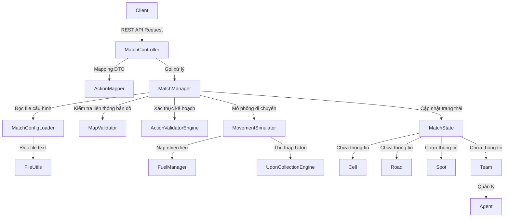

# HEXUDON Game Server

HEXUDON Game Server là một hệ thống backend điều phối các trận đấu game trên lưới bản đồ lục giác (Hexagonal Grid Map). Dự án được thiết kế dưới dạng một game server mô phỏng theo lượt, nơi các đội lập trình client gửi kế hoạch hành động cho các điệp viên (Agents) của mình để di chuyển, tiếp nhiên liệu và thu thập bánh Udon trên bản đồ nhằm đạt điểm số cao nhất.

Hệ thống được phát triển theo phương thức chia nhỏ giai đoạn, đảm bảo cấu trúc sạch sẽ và có thể kiểm thử độc lập ở từng phần logic.

---

## Features

Hệ thống hiện tại cung cấp các tính năng chính sau:
* **Khởi tạo bản đồ lục giác (Hexagonal Grid Map):** Tự động sinh lưới bản đồ ngẫu nhiên dựa trên kích thước cấu hình (mặc định 20x15). Bản đồ bao gồm 4 loại địa hình: `PLAIN` (Đồng bằng - chiếm 65%), `MOUNTAIN` (Núi - chiếm 20%), `ROAD` (Đường đi - chiếm 5%), và `POND` (Ao hồ - chiếm 10%).
* **Kiểm tra tính liên thông bản đồ:** Sử dụng thuật toán Breadth-First Search (BFS) trong `MapValidator` để đảm bảo tất cả các ô đi lại được (không phải ao hồ `POND`) đều liên kết thông suốt với nhau.
* **Đăng ký Đội thi đấu & Agents:** Cho phép tối đa 2 đội đăng ký tham gia. Mỗi đội sau khi đăng ký thành công sẽ tự động được khởi tạo 3 Agents xuất phát từ tọa độ `(0, 0)`:
  * `PATROL` (2 Agents): Có nhiệm vụ di chuyển quanh bản đồ và thu thập bánh Udon từ các Spot.
  * `REFUEL` (1 Agent): Có nhiệm vụ di chuyển đến vị trí của Patrol Agent để nạp đầy nhiên liệu cho họ.
* **Mô phỏng lượt chơi chi tiết (Turn-Based Simulation):** Mỗi lượt chơi (Day) được chia thành tối đa 5 bước di chuyển (`maxStepsPerTurn`). Trong mỗi bước, các Engine thực hiện:
  * Di chuyển Agents theo kế hoạch (`MOVE` hoặc `WAIT`).
  * Trừ nhiên liệu (`fuel`) và bước đi (`remainingSteps`) dựa trên loại địa hình.
  * Tiếp nhiên liệu tự động (`autoRefuel`) khi Refuel Agent và Patrol Agent đứng chung một ô.
  * Thu thập Udon tự động (`collectUdon`) nếu Patrol Agent đứng tại vị trí của một Spot chứa Udon của đội đó và chưa từng thu thập tại Spot đó trong ngày hôm nay.
* **Tự động hóa lượt chơi:** Quản lý chuyển ngày (`nextDay`) tự động thông qua Scheduler chạy mỗi giây, dựa trên thời gian giới hạn của lượt (`turnTimeLimitMs`).
* **Hạn chế tần suất API (Rate Limiting):** Sử dụng interceptor để giám sát số lượng request gửi lên từ các đội nhằm ngăn chặn spam.

---

## Tech Stack

* **Language:** Java 21
* **Framework:** Spring Boot 3.5.4 (các module: Spring Boot Starter Web, Spring Boot Starter Validation)
* **Build System:** Apache Maven 3.x
* **Database:** *Not configured yet* (Toàn bộ trạng thái trận đấu được lưu trữ in-memory trong bộ nhớ RAM qua `MatchState`).
* **ORM:** *Not available*
* **Testing Tools:** JUnit 5, Mockito, Spring Boot Starter Test, ArchUnit (cho kiểm thử kiến trúc tự động).
* **Development Libraries:** Project Lombok.

---

## Architecture

Project được tổ chức theo cấu trúc phân lớp định hướng kiến trúc sạch (Clean / Hexagonal Architecture), tách biệt hoàn toàn phần lõi nghiệp vụ trò chơi khỏi hạ tầng Spring Boot.

### Sơ đồ luồng hoạt động (Activity & Dependency Flow)



### Quy tắc phụ thuộc (Dependency Rules)
Để duy trì tính độc lập của nghiệp vụ core, dự án áp dụng quy tắc phụ thuộc nghiêm ngặt:
* Lớp Domain Core (`model` và `engine`) **không được phép** phụ thuộc vào các gói bên ngoài như `dto`, `controller`, hay `manager`.
* Quy tắc này được ràng buộc tự động thông qua kiểm thử kiến trúc bằng thư viện ArchUnit (`ArchitectureTest.java`).

---

## Project Structure

Chi tiết các thư mục và gói lớp quan trọng trong hệ thống:

```text
hexudon-server/
│
├── docs/
│   └── README.md                # Lộ trình phát triển và mô tả thiết kế ban đầu (Roadmap)
│
├── src/
│   ├── main/
│   │   ├── java/com/naprock/hexudon/
│   │   │   ├── config/          # Cấu hình Spring (CORS, Scheduler, Web MVC, Beans)
│   │   │   ├── controller/      # REST API Controllers và bộ ánh xạ dữ liệu (ActionMapper)
│   │   │   ├── dto/             # Các Java Record đại diện cho dữ liệu Request / Response API
│   │   │   ├── engine/          # Các bộ máy xử lý luật chơi (di chuyển, nhiên liệu, bản đồ, udon)
│   │   │   ├── exception/       # Quản lý ngoại lệ nghiệp vụ và Handler chuyển đổi lỗi HTTP
│   │   │   ├── interceptor/     # Bộ lọc kiểm soát tần suất gửi yêu cầu (RateLimiterInterceptor)
│   │   │   ├── loader/          # Trình tải tệp cấu hình game (MatchConfigLoader)
│   │   │   ├── manager/         # Trình quản lý điều phối vòng đời trận đấu (MatchManager)
│   │   │   ├── model/           # Các đối tượng nghiệp vụ (Agent, Cell, Team, Spot, MatchState...)
│   │   │   ├── util/            # Lớp tiện ích đọc tệp hệ thống (FileUtils)
│   │   │   └── HexudonApplication.java # Class khởi chạy Spring Boot chính
│   │   │
│   │   └── resources/
│   │       ├── application.yml  # File cấu hình cổng chạy server (mặc định 8080)
│   │       ├── match_config.txt # Tệp cấu hình các thông số và luật chơi của Game
│   │       └── sample.txt       # Tệp dữ liệu mẫu
│   │
│   └── test/
│       └── java/com/naprock/hexudon/
│           ├── ArchitectureTest.java # Kiểm thử ràng buộc phụ thuộc kiến trúc (ArchUnit)
│           └── ... (Suite kiểm thử kiểm chứng hoạt động của toàn bộ Controller, Manager, Models)
│
└── pom.xml                      # Cấu hình Maven dependencies và build plugins
```

---

## Getting Started

### Prerequisites
Để chạy dự án, máy phát triển của bạn cần có sẵn:
* **Java Development Kit (JDK):** Phiên bản 21 trở lên.
* **Apache Maven:** Phiên bản 3.6 trở lên.

### Installation
1. Bản sao mã nguồn dự án về máy:
   ```bash
   git clone <repository-url>
   cd hexudon
   ```
2. Thực hiện biên dịch dự án và tải các thư viện phụ thuộc:
   ```bash
   mvn clean install
   ```

### Environment Variables
Ứng dụng không yêu cầu biến môi trường kết nối database bên ngoài do chạy in-memory. Các cấu hình cấu trúc Web được chỉnh sửa qua Spring Property:

| Variable | Description | Required | Default |
|---|---|---|---|
| `server.port` | Cổng HTTP lắng nghe kết nối của Server | No | `8080` |
| `spring.application.name` | Tên của ứng dụng Spring Boot | No | `hexudon-server` |

Mọi thông số cấu hình luật chơi (kích thước map, chi phí di chuyển, số lượng agent, tối đa lượt đấu) được điều chỉnh trực tiếp trong file:  
`src/main/resources/match_config.txt`

---

## Running the Application

### Chạy chế độ Phát triển (Development)
Sử dụng Maven Spring Boot plugin để khởi động ứng dụng trực tiếp:
```bash
mvn spring-boot:run
```
Server sẽ lắng nghe tại cổng `http://localhost:8080`.

### Chạy chế độ Vận hành (Production)
1. Đóng gói mã nguồn thành tệp JAR:
   ```bash
   mvn clean package
   ```
2. Chạy ứng dụng từ tệp JAR đã đóng gói:
   ```bash
   java -jar target/hexudon-server-1.0.0.jar
   ```

---

## Database

* **Database Engine:** *Not configured yet*. Hệ thống chạy in-memory lưu trữ toàn bộ trạng thái trong đối tượng `MatchState` trên bộ nhớ RAM. Dữ liệu sẽ bị reset hoàn toàn mỗi lần khởi động lại server.
* **Migration:** *Not available*.
* **Seed Data:** *Not available*.

---

## API Documentation

Hệ thống cung cấp các endpoint chính dưới tiền tố `/api/match`:

| Method | Endpoint | Description | Request Headers |
|---|---|---|---|
| `POST` | `/api/match/register` | Đăng ký một đội chơi mới vào trận đấu | Không |
| `POST` | `/api/match/start` | Khởi động trận đấu (chuyển trạng thái sang `PLAYING`) | Không |
| `GET` | `/api/match/state` | Lấy thông tin trạng thái đầy đủ hiện tại của trận đấu | Không |
| `POST` | `/api/match/actions` | Nộp kế hoạch hành động ngày tiếp theo cho các Agent | `X-Team-Name` (Bắt buộc) |

### Request & Response Mẫu

#### 1. Đăng ký đội (`POST /api/match/register`)
**Body:**
```json
{
  "teamName": "TeamAlpha"
}
```
**Response (200 OK):**
```json
{
  "teamName": "TeamAlpha",
  "agents": [
    {
      "id": "A1",
      "type": "PATROL",
      "posX": 0,
      "posY": 0,
      "fuel": 0,
      "remainingSteps": 0
    },
    {
      "id": "A2",
      "type": "PATROL",
      "posX": 0,
      "posY": 0,
      "fuel": 0,
      "remainingSteps": 0
    },
    {
      "id": "A3",
      "type": "REFUEL",
      "posX": 0,
      "posY": 0,
      "fuel": 0,
      "remainingSteps": 0
    }
  ]
}
```

#### 2. Gửi kế hoạch hành động (`POST /api/match/actions`)
*Lưu ý: Yêu cầu Header `X-Team-Name: TeamAlpha`.*

**Body:**
```json
{
  "day": 1,
  "agentPlans": [
    {
      "agentId": "A1",
      "actions": [
        {
          "order": 1,
          "actionType": "MOVE",
          "targetX": 1,
          "targetY": 0
        },
        {
          "order": 2,
          "actionType": "WAIT",
          "targetX": null,
          "targetY": null
        }
      ]
    },
    {
      "agentId": "A2",
      "actions": [
        {
          "order": 1,
          "actionType": "WAIT",
          "targetX": null,
          "targetY": null
        }
      ]
    },
    {
      "agentId": "A3",
      "actions": [
        {
          "order": 1,
          "actionType": "WAIT",
          "targetX": null,
          "targetY": null
        }
      ]
    }
  ]
}
```
**Response (200 OK):**
```json
{
  "day": 1,
  "agentPlans": [
    {
      "agentId": "A1",
      "actions": [
        {
          "order": 1,
          "actionType": "MOVE",
          "targetX": 1,
          "targetY": 0,
          "timestamp": 1720516800000
        },
        {
          "order": 2,
          "actionType": "WAIT",
          "targetX": null,
          "targetY": null,
          "timestamp": 1720516800100
        }
      ]
    },
    ...
  ]
}
```

---

## Testing

Hệ thống bao gồm kiểm thử tự động toàn diện, từ unit test, integration test đến kiến trúc.

### Chạy toàn bộ Tests
```bash
mvn test
```

### Chạy một lớp Test cụ thể
```bash
mvn -Dtest=MatchManagerTest test
```

### Chạy kiểm thử kiến trúc (ArchUnit)
```bash
mvn -Dtest=ArchitectureTest test
```

---

## Development Guide

### Quy ước lập trình (Coding Conventions)
* Sử dụng Java Record cho các cấu trúc DTO nhằm tối ưu cú pháp bất biến (immutability) và loại bỏ getter/setter thủ công.
* Sử dụng Project Lombok để sinh code mẫu (Constructor, Builder) trên các lớp domain model.
* Tuân thủ quy tắc phụ thuộc một chiều kiểm soát bởi `ArchitectureTest`: domain core không import/sử dụng các lớp adapter (controller, DTO).

### Cách phát triển tính năng mới
1. **Thay đổi Model:** Cập nhật các trường thông tin hoặc logic kiểm tra trạng thái trong `com.naprock.hexudon.model`.
2. **Triển khai luật chơi mới:** Viết hoặc sửa đổi các logic tính toán luật chơi bên trong gói `com.naprock.hexudon.engine`.
3. **Đăng ký với Manager:** Gọi phương thức từ engine mới phát triển bên trong hàm điều phối của `MatchManager`.
4. **Viết kiểm thử:** Luôn bổ sung unit test tương ứng trong thư mục `src/test/java/com/naprock/hexudon` để kiểm tra độ chính xác trước khi phát hành.

---

## Current Status

### Các tính năng đã hoàn thành
* Khởi sinh lưới lục giác và kiểm tra độ liên thông bản đồ ngẫu nhiên.
* Cơ chế đăng ký đội chơi và tạo Agents tự động theo cấu hình.
* Mô phỏng luật di chuyển chi tiết theo từng bước nhỏ (step-by-step), xử lý chi phí năng lượng/bước đi tương ứng với 3 loại địa hình Plain, Road, Mountain.
* Động cơ tự động nạp nhiên liệu khi Patrol Agent và Refuel Agent đứng cùng tọa độ.
* Tự động thu thập Udon của đội tại các Spot khi Agent đi qua.
* Quản lý tiến trình trò chơi tự động bằng scheduler thời gian thực.
* Suite test 57 trường hợp chạy thành công 100%.

### Các lỗi và hạn chế đã biết (Known Issues)
* **Rate Limiter Interceptor bị bỏ qua:** Trong `WebConfig.java`, interceptor `RateLimiterInterceptor` được đăng ký cho path `/api/match/action` (số ít), trong khi endpoint thực tế của Controller là `/api/match/actions` (số nhiều). Điều này khiến cơ chế chặn spam tần suất gửi hành động không có tác dụng trong thực tế chạy ứng dụng.
* **Tiến trình tự động hóa bị chặn:** Trong `SchedulerConfig.java`, tiến trình chuyển lượt tự động kiểm tra xem tất cả các đội đã gửi bài thông qua cờ `Team::isSubmittedPlan` chưa. Tuy nhiên, cờ này không bao giờ được set thành `true` khi gọi hàm `submitActions` trong `MatchManager`. Do đó, game chỉ có thể qua ngày mới nhờ cơ chế tự động hết giờ (timeout).
* **DTO dư thừa:** Tồn tại `TeamActionRequest` và `TeamActionResponse` trong gói DTO nhưng hoàn toàn không được liên kết hay sử dụng ở bất kỳ controller hoặc service nào.
* **Không lưu trữ bền vững:** Toàn bộ dữ liệu trận đấu biến mất khi tắt hoặc restart server.

---

## Roadmap

*(Được đối chiếu và bổ sung từ lộ trình gốc DEVELOPMENT_ROADMAP.md và các dấu hiệu chưa hoàn thiện trong mã nguồn)*

1. **Sửa lỗi cấu hình và logic:**
   * Điều chỉnh đường dẫn đăng ký interceptor trong `WebConfig.java` thành `/api/match/actions` để kích hoạt bộ giới hạn tần suất API.
   * Bổ sung dòng code gọi `team.setSubmittedPlan(true)` trong hàm `MatchManager.submitActions()` để cho phép Scheduler tự động mô phỏng ngay lập tức khi cả hai đội hoàn thành nộp bài mà không cần đợi hết thời gian timeout.
2. **Phát triển động cơ hoàn thiện (Giai đoạn 4):**
   * Triển khai bộ tính toán lưu lượng giao thông (`TrafficCalculator` - lớp chưa có mã nguồn).
   * Phát triển công cụ chấm điểm hoàn chỉnh (`ScoringEngine` - lớp chưa có mã nguồn).
3. **Hỗ trợ Persistence:**
   * Tích hợp cơ sở dữ liệu (ví dụ: PostgreSQL hoặc H2) kèm ORM Spring Data JPA để lưu trữ lịch sử các trận đấu bền vững thay vì in-memory.

---

## Contributing

1. Tạo một nhánh tính năng mới từ nhánh chính:
   ```bash
   git checkout -b feature/amazing-feature
   ```
2. Thực hiện thay đổi, tuân thủ chặt chẽ quy tắc kiến trúc độc lập của domain core.
3. Chạy kiểm thử tự động để chắc chắn không gây lỗi cũ:
   ```bash
   mvn test
   ```
4. Gửi một Pull Request giải trình các thay đổi thiết kế chi tiết để được kiểm duyệt.

---

## License

*Not configured yet / Not available* (Mã nguồn nội bộ hoặc chưa được cấp giấy phép phân phối công khai).
