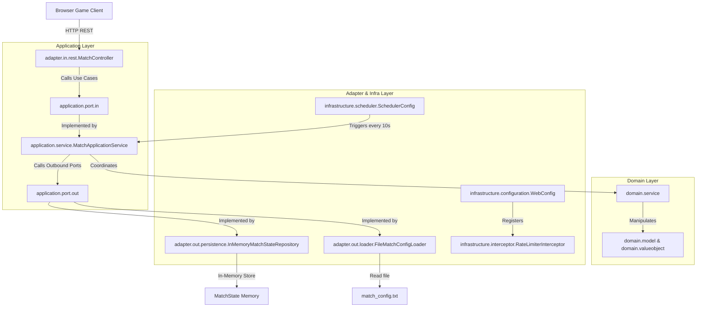

# HEXUDON Game Suite

HEXUDON là một hệ thống trò chơi chiến thuật mô phỏng theo lượt trên lưới bản đồ lục giác (Hexagonal Grid Map). Dự án bao gồm hai thành phần chính:
1. **HEXUDON Game Server** (`hexudon-server`): Một máy chủ backend viết bằng Java & Spring Boot chịu trách nhiệm khởi tạo bản đồ, xác thực và mô phỏng các hành động của điệp viên (Agents) theo từng lượt đấu.
2. **HEXUDON Game Client** (`client`): Một giao diện điều khiển visual dashboard phía client được xây dựng hoàn toàn bằng Vanilla HTML5, CSS, và ES6 Javascript để theo dõi trạng thái trận đấu, lập kế hoạch hành động trực quan trên bản đồ SVG và gửi yêu cầu đến server.

Mục tiêu của dự án là cung cấp một nền tảng giả lập chiến thuật, nơi các đội lập trình client gửi kế hoạch hành động cho các điệp viên của mình để tối ưu hóa việc di chuyển, tiếp nhiên liệu và thu hoạch Udon từ các điểm tài nguyên nhằm đạt điểm số cao nhất.

---

## Features

### 1. Bản Đồ Lưới Lục Giác & Quản Lý Địa Hình
* **Tự động sinh lưới bản đồ:** Bản đồ mặc định được cấu hình với kích thước 20x15.
* **4 Loại địa hình:** 
  * `PLAIN` (Đồng bằng - chiếm 65% tổng số ô, chi phí di chuyển: 2 steps, tiêu thụ: 1 fuel)
  * `MOUNTAIN` (Núi - chiếm 20% tổng số ô, chi phí di chuyển: 3 steps, tiêu thụ: 2 fuel)
  * `ROAD` (Đường đi - chiếm 5% tổng số ô, chi phí di chuyển: 1 step, tiêu thụ: 2 fuel)
  * `POND` (Ao hồ - chiếm 10% tổng số ô, không thể đi vào)
* **Kiểm tra tính liên thông bản đồ:** Sử dụng thuật toán Breadth-First Search (BFS) trong `MapValidator` để đảm bảo tất cả các ô không phải `POND` đều liên kết thông suốt với nhau.

### 2. Quản Lý Đội Chơi & Agents (Điệp Viên)
* **Đăng ký Đội:** Hỗ trợ tối đa 2 đội đăng ký tham gia thông qua API.
* **Hai Loại Agent:** Mỗi đội khi đăng ký sẽ tự động được cấp các Agent xuất phát tại vị trí `(0, 0)`:
  * `PATROL` Agent (Số lượng mặc định: 1): Nhiệm vụ chính là di chuyển trên bản đồ và thu thập Udon từ các Spot.
  * `REFUEL` Agent (Số lượng mặc định: 1): Nhiệm vụ chính là di chuyển đến các vị trí có Patrol Agent của đội mình để nạp đầy nhiên liệu cho họ.
* **Quản lý nhiên liệu (Fuel) và số bước (Steps):** Mỗi Agent được khởi tạo với cờ giới hạn nhiên liệu tối đa (`maxFuel = 100`) và giới hạn số bước đi mỗi lượt (`maxStepsPerTurn = 5`).

### 3. Công Cụ Mô Phỏng Lượt Chơi (Turn-Based Simulation)
* **Quy trình mô phỏng:** Mỗi lượt chơi (Day) được chia thành tối đa 5 bước di chuyển. Trong mỗi bước:
  1. **Tự động Refuel:** Khi Refuel Agent đứng chung ô với Patrol Agent của đội mình, Patrol Agent sẽ tự động được nạp đầy nhiên liệu (`maxFuel`).
  2. **Di chuyển Agent:** Xử lý và dịch chuyển Agent sang ô kế tiếp theo kế hoạch đã nộp (`MOVE` hoặc `WAIT`), trừ nhiên liệu và số bước đi tương ứng.
  3. **Tự động thu thập Udon:** Khi Patrol Agent đứng tại vị trí của một Spot chứa bánh Udon của đội đó, Patrol Agent sẽ tự động thu hoạch 1 bánh Udon và tăng điểm cho đội, đồng thời đánh dấu Spot đó đã được ghé thăm trong ngày.

### 4. Hệ Thống Client Visual Dashboard
* Giao diện Dashboard cao cấp với chế độ Dark Theme và Glassmorphism.
* Bản đồ SVG tương tác cao: Hỗ trợ kéo thả (drag panning), cuộn chuột phóng to/thu nhỏ (zoom), hiển thị chi tiết thông tin ô khi di chuột (hover tooltip) và vẽ đường đi dự kiến của các Agent.
* Bảng điều khiển lập kế hoạch hành động: Thêm hành động `MOVE` bằng cách click trực tiếp lên các ô kề cạnh trên bản đồ, thêm hành động `WAIT`, điều chỉnh thứ tự hành động, nhân bản hoặc xóa. Tích hợp tính năng Undo/Redo.
* Trình mô phỏng kiểm tra hành động tại local (Pre-flight Validation) nhằm phát hiện sớm các lỗi đi vào hồ, thiếu nhiên liệu hoặc không kề ô trước khi gửi lên Server.

### 5. Hạn Chế Tần Suất API & Tự Động Hóa Lượt Chơi
* **Rate Limiting:** Giới hạn tần suất nộp bài của mỗi đội tối đa 5 requests mỗi giây. Nếu vượt quá sẽ tăng số lần vi phạm (`spamViolationCount`). Đội chơi đạt quá 3 lần vi phạm sẽ bị truất quyền thi đấu (`disqualified = true`).
* **Scheduler Tự Động Chuyển Lượt:** Scheduler chạy ngầm mỗi 10 giây sẽ tự động kích hoạt tính năng chuyển lượt mới (`nextDay`) nếu tất cả các đội đã hoàn thành gửi kế hoạch (`submittedPlan = true`) hoặc khi hết thời gian giới hạn lượt đấu (`turnTimeLimitMs`).

---

## Tech Stack

### Backend (hexudon-server)
* **Language:** Java 21
* **Framework:** Spring Boot 3.5.4 (Spring Boot Starter Web, Spring Boot Starter Validation)
* **Database:** *Not configured yet*. Trạng thái được lưu trữ in-memory qua `MatchState`.
* **ORM:** *Not available*.
* **Testing Tools:** JUnit 5, Mockito, Spring Boot Starter Test, ArchUnit 1.3.0 (Tự động kiểm tra kiến trúc).
* **Libraries:** Project Lombok (optional).
* **Build tool:** Apache Maven.

### Frontend Client
* **Core:** Vanilla HTML5, Vanilla ES6 Javascript (ES Modules).
* **Styling:** CSS3 (Dark space theme, Glassmorphism, Google Fonts Outfit/Inter).
* **Libraries/API:** Fetch API, SVG.
* **Server Tools:** Node.js (`http-server`) hoặc Python 3 (`http.server`).

---

## Architecture

Dự án sử dụng mô hình **Hexagonal Architecture** (còn gọi là **Ports & Adapters**) để phân tách rõ ràng lõi nghiệp vụ trò chơi khỏi cơ sở hạ tầng framework.

### Sơ Đồ Kiến Trúc (Mermaid Diagram)



### Luồng Phụ Thuộc (Dependency Rules)
Để giữ cho lõi nghiệp vụ luôn sạch, quy tắc phụ thuộc một chiều được áp đặt nghiêm ngặt:
* Gói `domain` là trung tâm, không được phụ thuộc vào bất kỳ gói ngoài nào (`application`, `adapter`, `infrastructure`).
* Gói `application` phụ thuộc vào `domain` nhưng không được phụ thuộc vào `adapter` và `infrastructure`.
* Quy tắc phụ thuộc này được tự động hóa kiểm tra thông qua kiểm thử kiến trúc bằng ArchUnit (`ArchitectureTest.java`).

---

## Project Structure

```text
hexudon/
├── client/                      # Mã nguồn Frontend Client Dashboard
│   ├── assets/                  # Icons SVG
│   ├── config/                  # Cấu hình client (Base URL, polling rate)
│   ├── logger/                  # Bộ ghi log phía Client
│   ├── network/                 # API Client (Gửi request HTTP fetch)
│   ├── renderer/                # Trình vẽ bản đồ SVG lục giác, pan & zoom
│   ├── state/                   # Quản lý trạng thái Client (Undo/Redo)
│   ├── ui/                      # Giao diện Dashboards & Action Editor
│   ├── utils/                   # Tiện ích tính toán tọa độ lưới lục giác
│   ├── validation/              # Trình giả lập kiểm tra kế hoạch trước khi gửi
│   ├── index.html               # Trang HTML chính của Client
│   └── index.css                # Tệp styling CSS của Client
│
├── docs/                        # Tài liệu hướng dẫn thiết kế
│   └── README.md                # Tài liệu lộ trình phát triển gốc (Development Roadmap)
│
├── src/
│   ├── main/
│   │   ├── java/com/naprock/hexudon/
│   │   │   ├── adapter/         # Lớp Adapter kết nối ngoài (REST, Persistence, File Loader)
│   │   │   │   ├── in/rest/     # MatchController nhận yêu cầu từ client
│   │   │   │   └── out/         # Adapters ngoại vi (InMemory repository, config loader)
│   │   │   │
│   │   │   ├── application/     # Lớp Ứng dụng điều phối
│   │   │   │   ├── dto/         # Đối tượng DTO trao đổi dữ liệu qua API
│   │   │   │   ├── mapper/      # Chuyển đổi dữ liệu DTO sang Domain Model
│   │   │   │   ├── port/        # Các cổng Inbound (Use Cases) & Outbound
│   │   │   │   └── service/     # MatchApplicationService quản lý nghiệp vụ chung
│   │   │   │
│   │   │   ├── domain/          # Lõi Nghiệp vụ độc lập (Domain Core)
│   │   │   │   ├── exception/   # Định nghĩa ngoại lệ và mã lỗi nghiệp vụ
│   │   │   │   ├── model/       # Thực thể cốt lõi (Agent, Team)
│   │   │   │   ├── repository/  # Interface lưu trữ dữ liệu
│   │   │   │   ├── service/     # Động cơ nghiệp vụ (Movement, Fuel, Udon, Map)
│   │   │   │   └── valueobject/ # Các Value Objects (Cell, Road, Spot, MatchState...)
│   │   │   │
│   │   │   ├── infrastructure/  # Cấu hình Spring Boot và Tiện ích
│   │   │   │   ├── configuration/ # Cấu hình CORS, Interceptors, Web MVC
│   │   │   │   ├── interceptor/ # RateLimiterInterceptor
│   │   │   │   ├── scheduler/   # Cấu hình chạy ngầm tự động chuyển lượt
│   │   │   │   └── util/        # Tiện ích File (FileUtils)
│   │   │   │
│   │   │   └── HexudonApplication.java # Lớp khởi chạy ứng dụng chính
│   │   │
│   │   └── resources/
│   │       ├── application.yml  # Cấu hình Spring Boot (Port: 8080)
│   │       ├── match_config.txt # File cấu hình thông số và luật chơi
│   │       └── sample.txt       # Dữ liệu mẫu
│   │
│   └── test/                    # Các kịch bản kiểm thử (91 kịch bản thành công)
│       └── java/com/naprock/hexudon/
│           ├── ArchitectureTest.java # Kiểm thử kiến trúc tự động (ArchUnit)
│           └── ... (Unit/Integration tests cho domain, application, adapter, infrastructure)
│
└── pom.xml                      # Cấu hình Maven build
```

---

## Getting Started

### Prerequisites
* **Java Development Kit (JDK):** Phiên bản 21 trở lên.
* **Apache Maven:** Phiên bản 3.6 trở lên.
* **Node.js** hoặc **Python 3** (Dùng để khởi chạy Server cục bộ cho Client).

### Installation
1. Sao chép mã nguồn về máy:
   ```bash
   git clone <repository-url>
   cd hexudon
   ```
2. Build dự án và cài đặt dependencies bằng Maven:
   ```bash
   mvn clean install
   ```

### Environment Variables

Ứng dụng chạy hoàn toàn In-memory nên không yêu cầu biến môi trường cho database. Các cấu hình cấu trúc Web được chỉnh sửa qua Spring Property:

| Variable | Description | Required | Default |
|---|---|---|---|
| `server.port` | Cổng HTTP của Server | No | `8080` |
| `spring.application.name` | Tên ứng dụng Spring | No | `hexudon-server` |

Mọi cấu hình liên quan đến luật chơi như chiều dài bản đồ, lượng nhiên liệu, chi phí bước đi của từng địa hình, số lượng Agent được cấu hình trực tiếp trong tệp:  
[match_config.txt](file:///d:/Documents/GitHub/hexudon/src/main/resources/match_config.txt)

---

## Running the Application

### 1. Khởi Chạy Server (hexudon-server)
* **Chế độ phát triển (Development):**
  ```bash
   mvn spring-boot:run
  ```
  Backend Server sẽ được khởi chạy tại địa chỉ `http://localhost:8080`.

* **Chế độ vận hành (Production):**
  1. Đóng gói mã nguồn thành tệp JAR:
     ```bash
     mvn clean package
     ```
  2. Chạy ứng dụng từ tệp JAR đã build:
     ```bash
     java -jar target/hexudon-server-1.0.0.jar
     ```

### 2. Khởi Chạy Client Dashboard
Do Client sử dụng ES6 modules nên các file javascript cần được phục vụ từ một HTTP origin để tránh lỗi CORS.

* **Cách A: Khởi chạy bằng Node.js (http-server)**
  ```bash
  npx http-server ./client -p 3000
  ```
  Sau đó mở địa chỉ `http://localhost:3000` trên trình duyệt.

* **Cách B: Khởi chạy bằng Python**
  ```bash
  python -m http.server 3000 --directory ./client
  ```
  Sau đó mở địa chỉ `http://localhost:3000` trên trình duyệt.

---

## Database

* **Database Engine:** *Not configured yet*. Toàn bộ dữ liệu được quản lý in-memory trên RAM thông qua lớp `MatchState`.
* **Migration:** *Not available*.
* **Seed Data:** *Not available* (Bản đồ và tài nguyên được tự động sinh ngẫu nhiên trên RAM tại thời điểm ứng dụng khởi chạy).

---

## API Documentation

Hệ thống cung cấp các REST API cho Client giao tiếp qua tiền tố `/api/match`:

| Method | Endpoint | Description | Headers |
|---|---|---|---|
| `POST` | `/api/match/register` | Đăng ký đội chơi mới tham gia trận đấu | None |
| `POST` | `/api/match/start` | Bắt đầu trận đấu (chuyển trạng thái sang `PLAYING`) | None |
| `GET` | `/api/match/state` | Lấy toàn bộ thông tin trạng thái trận đấu hiện tại | None |
| `POST` | `/api/match/actions` | Gửi kế hoạch hành động tiếp theo cho các Agent | `X-Team-Name` (Bắt buộc) |

### Request & Response Mẫu

#### 1. Đăng ký đội (`POST /api/match/register`)
* **Request Body:**
  ```json
  {
    "teamName": "TeamAlpha"
  }
  ```
* **Response Body (200 OK):**
  ```json
  {
    "teamName": "TeamAlpha",
    "agents": [
      {
        "id": "A1",
        "type": "PATROL",
        "coordinate": {
          "x": 0,
          "y": 0
        },
        "fuel": 0,
        "remainingSteps": 0
      },
      {
        "id": "A2",
        "type": "REFUEL",
        "coordinate": {
          "x": 0,
          "y": 0
        },
        "fuel": 0,
        "remainingSteps": 0
      }
    ]
  }
  ```

#### 2. Gửi kế hoạch hành động (`POST /api/match/actions`)
* **Request Headers:** `X-Team-Name: TeamAlpha`
* **Request Body:**
  ```json
  {
    "day": 1,
    "agentPlans": [
      {
        "agentId": "A1",
        "actions": [
          {
            "order": 1,
            "actionType": "MOVE",
            "targetX": 1,
            "targetY": 0
          },
          {
            "order": 2,
            "actionType": "WAIT",
            "targetX": null,
            "targetY": null
          }
        ]
      },
      {
        "agentId": "A2",
        "actions": [
          {
            "order": 1,
            "actionType": "WAIT",
            "targetX": null,
            "targetY": null
          }
        ]
      }
    ]
  }
  ```
* **Response Body (200 OK):**
  ```json
  {
    "day": 1,
    "agentPlans": [
      {
        "agentId": "A1",
        "actions": [
          {
            "order": 1,
            "actionType": "MOVE",
            "coordinate": {
              "x": 1,
              "y": 0
            },
            "timestamp": 1720516800000
          },
          {
            "order": 2,
            "actionType": "WAIT",
            "coordinate": null,
            "timestamp": 1720516800100
          }
        ]
      },
      {
        "agentId": "A2",
        "actions": [
          {
            "order": 1,
            "actionType": "WAIT",
            "coordinate": null,
            "timestamp": 1720516800050
          }
        ]
      }
    ]
  }
  ```

---

## Testing

Hệ thống bao gồm bộ kiểm thử tự động toàn diện kiểm chứng cả logic tính toán lẫn cấu trúc kiến trúc.

* **Chạy toàn bộ kiểm thử:**
  ```bash
  mvn test
  ```
* **Chạy một lớp kiểm thử cụ thể:**
  ```bash
  mvn -Dtest=AgentTest test
  ```
* **Chạy kiểm thử ràng buộc kiến trúc (ArchUnit):**
  ```bash
  mvn -Dtest=ArchitectureTest test
  ```

---

## Development Guide

### 1. Quy ước Lập trình (Coding Conventions)
* **Bất biến (Immutability):** Sử dụng các Java Record cho toàn bộ các DTO (`application/dto`) trao đổi dữ liệu qua API.
* **Tách biệt Kiến trúc:** Tuyệt đối không được import hay sử dụng bất kỳ lớp hạ tầng Spring hoặc DTO nào bên trong lõi nghiệp vụ `domain` (được đảm bảo bằng `ArchitectureTest`).
* **Lombok:** Có thể sử dụng Project Lombok ở các lớp Domain Model để tự động sinh constructor hoặc getter/setter nhằm giảm thiểu mã nguồn trùng lặp.

### 2. Cách thêm Module hoặc Luật chơi Mới
1. **Domain Core:** Cập nhật hoặc định nghĩa thêm cấu trúc dữ liệu mới trong `domain/model` hoặc `domain/valueobject`.
2. **Domain Service (Engine):** Triển khai hoặc tinh chỉnh các quy tắc tính toán của luật chơi mới trong các gói thuộc gói `domain/service` (ví dụ: viết logic tính toán mới trong `HexGridUtils`).
3. **Application Port:** Định nghĩa Use Case mới trong `application/port/in` hoặc outbound port trong `application/port/out` nếu có giao tiếp bên ngoài.
4. **Application Service:** Triển khai Use Case và điều phối logic của luật chơi mới trong `MatchApplicationService`.
5. **Adapter Layer:** Cập nhật controller `MatchController` (đối với cổng vào REST API) hoặc repository (đối với cổng lưu trữ).
6. **Viết test kiểm chứng:** Viết unit test cho lớp mới tạo trong gói tương ứng của `src/test/java/com/naprock/hexudon/` và kiểm tra lại toàn bộ hệ thống bằng `mvn test`.

---

## Current Status

### Features Đã Hoàn Thành
* Khởi sinh lưới bản đồ lục giác offset ngẫu nhiên và kiểm tra tính liên thông bằng thuật toán BFS.
* Giao diện Client Dashboard đầy đủ chức năng: xem trạng thái, theo dõi hành trình điệp viên, thiết kế kế hoạch đường đi trực quan trên SVG và hiển thị lịch sử network log.
* Mô phỏng di chuyển step-by-step xử lý các chi phí bước đi/nhiên liệu tương ứng từng loại địa hình.
* Cơ chế tự động tiếp nhiên liệu (`autoRefuel`) khi Patrol Agent và Refuel Agent đứng chung vị trí.
* Cơ chế tự động thu thập Udon của đội tại các Spot khi Agent đi qua.
* Quản lý tiến trình trận đấu tự động thông qua Scheduler chạy ngầm dựa trên thời gian thực.
* Bộ kiểm thử tự động gồm 91 kịch bản unit & integration tests đều chạy thành công 100%.

### Known Issues
* **DTO dư thừa:** Gói `application/dto` chứa `TeamActionRequest.java` và `TeamActionResponse.java` được khai báo nhưng chưa được liên kết hay sử dụng ở bất kỳ controller hoặc service nào.
* **Trạng thái In-memory:** Chưa có database vật lý nên mọi dữ liệu, điểm số, và trạng thái trận đấu sẽ bị mất hoàn toàn mỗi khi ứng dụng khởi chạy lại.

---

## Roadmap
1. **Database Integration:** Tích hợp hệ quản trị cơ sở dữ liệu (ví dụ: H2 cho development/testing, PostgreSQL cho production) và Spring Data JPA để lưu trữ bền vững trạng thái trận đấu.
2. **Triển khai Traffic Engine:** Phát triển module `TrafficCalculator` để mô phỏng sự tắc nghẽn khi nhiều Agent cùng tập trung di chuyển qua một ô hoặc tuyến đường.
3. **Triển khai Scoring Engine:** Phát triển module `ScoringEngine` để tính toán bảng xếp hạng điểm số cuối cùng chi tiết của các đội sau khi kết thúc lượt đấu tối đa (`maxTurns`).

---

## Contributing

1. Nhánh làm việc mặc định là `main`. Tạo nhánh tính năng mới từ `main`:
   ```bash
   git checkout -b feature/amazing-feature
   ```
2. Thực hiện các chỉnh sửa mã nguồn và viết thêm test tương ứng.
3. Chạy kiểm thử tự động để chắc chắn mã nguồn sạch:
   ```bash
   mvn test
   ```
4. Gửi Pull Request và chờ kiểm duyệt.

---

## License
*Not configured yet / Internal Project* (Mã nguồn dự án nội bộ hoặc chưa được cấp giấy phép phân phối công khai).
