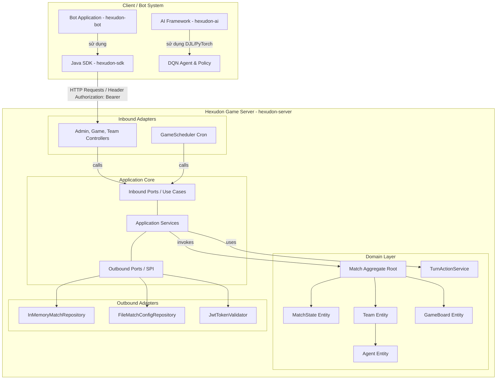

# Hexudon

Hexudon là một hệ thống mô phỏng game chiến thuật theo lượt (turn-based), đa tác tử (multi-agent) hoạt động trên lưới ô lục giác nằm ngang dạng **Odd-R offset**. Trong trò chơi này, các đội tham gia sẽ lập trình các Bot tự động để đăng ký, theo dõi trạng thái trận đấu và gửi danh sách hành động hàng ngày. Mục tiêu chính của trò chơi là tối ưu hóa việc thu thập mì Udon tại các địa điểm cung cấp (`Spot`), phối hợp nhiên liệu di chuyển thông qua cơ chế sạc xăng của xe tiếp tế (`RefuelAgent`) cho xe tuần tra (`PatrolAgent`), và cạnh tranh điểm số trong điều kiện chi phí di chuyển thay đổi động theo mức độ ùn tắc giao thông (`TrafficLevel`).

Dự án được xây dựng và tổ chức theo phương pháp **Thiết kế hướng tên miền (DDD - Domain-Driven Design)** và **Kiến trúc Lục giác (Hexagonal Architecture / Ports & Adapters)** trên nền tảng **Java 21** và **Maven Multi-Module**, giúp tách biệt hoàn toàn lõi nghiệp vụ mô phỏng với các thành phần công nghệ bên ngoài như Web Framework, cơ chế lưu trữ hay thuật toán AI.

---

## Overview (Tổng quan dự án)

Hệ thống Hexudon được chia thành 4 module thành phần hợp nhất trong cùng một Maven Reactor Project:

* **Game Server (`hexudon-server`)**: Bộ lõi động cơ game (Game Engine) chạy trên Spring Boot 3.5.4 chịu trách nhiệm duy trì luật chơi, tự động cập nhật lượt đấu (turn) bằng Scheduler, tính toán điểm số và mật độ ùn tắc giao thông trên đường bộ (`ROAD`).
* **Java SDK (`hexudon-sdk`)**: Thư viện client Java chính thức đóng gói sẵn HTTP Client (OkHttp), Jackson Databind, cơ chế tự động gửi lại (Retry) với thuật toán Exponential Backoff và các mô hình dữ liệu lưới lục giác giúp bot dễ dàng giao tiếp với máy chủ.
* **Bot Application (`hexudon-bot`)**: Ứng dụng bot mẫu hoàn chỉnh phát triển dựa trên Java SDK, tích hợp bộ não AI (`BotBrain`) với các chiến thuật tìm đường thu hoạch Udon và nạp xăng bằng thuật toán BFS (`GreedyStrategy` và `WaitStrategy`).
* **AI Framework (`hexudon-ai`)**: Framework học sâu củng cố (Reinforcement Learning - Deep Q-Network) tích hợp thư viện Deep Java Library (DJL) và PyTorch Engine, hỗ trợ huấn luyện học máy đa tác tử (MARL) trên môi trường lưới lục giác.

---

## Architecture (Kiến trúc hệ thống)

Hệ thống tuân thủ nghiêm ngặt mô hình Kiến trúc Lục giác (Ports & Adapters), đảm bảo sự độc lập giữa lõi nghiệp vụ và các công nghệ hạ tầng:



### Luồng tương tác chính:
1. **Giao tiếp HTTP REST**: Client Bot sử dụng `Hexudon Java SDK` gửi các request HTTP (chứa Header xác thực `Authorization: Bearer <token>`) tới endpoint REST của `Hexudon Game Server`.
2. **Đăng ký và Khởi tạo**: Bot thực hiện đăng ký danh sách Agent (`POST /api/game/agent-types`) trong giai đoạn trận đấu mở đăng ký (`REGISTERING`).
3. **Mô phỏng lượt đấu (Game Loop)**: Bộ lập lịch nền (`GameScheduler`) trên Server liên tục kiểm tra thời gian lượt đấu. Khi đến hạn, Scheduler kích hoạt tiến trình mô phỏng: di chuyển Agent, trừ nhiên liệu, nạp xăng tự động (`RefuelAgent`), thu hoạch mì Udon tại `Spot`, cập nhật điểm số và tính toán mật độ giao thông `ROAD` cho lượt tiếp theo.

---

## Maven Multi-Module Architecture

Hệ thống Hexudon được tổ chức theo mô hình **Maven Multi-Module Project**. File `pom.xml` tại thư mục gốc đóng vai trò là **Root POM** và **Reactor POM**, quản lý thống nhất tất cả các module con.

```text
hexudon/ (Root POM: com.naprock:hexudon:1.0.0)
├── pom.xml
├── server/      (Artifact: com.naprock:hexudon-server)
│   └── pom.xml
├── sdk/         (Artifact: com.naprock:hexudon-sdk)
│   └── pom.xml
├── bot/         (Artifact: com.naprock:hexudon-bot)
│   └── pom.xml
└── ai/          (Artifact: com.naprock:hexudon-ai)
    └── pom.xml
```

### Đặc điểm cấu trúc Maven Multi-Module:
* **Root POM / Reactor POM**: File `pom.xml` ở gốc khai báo `<packaging>pom</packaging>` và danh sách các sub-module (`server`, `sdk`, `bot`, `ai`).
* **Kế thừa cấu hình (Inheritance)**: Tất cả module con đều kế thừa từ Parent POM `com.naprock:hexudon:1.0.0`, tự động kế thừa `groupId`, `version`, phiên bản Java 21 và cấu hình plugin chung.
* **Quản lý Dependency tập trung (`<dependencyManagement>`)**: Quản lý tập trung phiên bản các thư viện bên thứ ba (OkHttp 4.12.0, Okio 3.6.0, JJWT 0.12.7, DJL 0.28.0, Logback 1.5.19) và sự phụ thuộc giữa các module nội bộ (`hexudon-sdk`, `hexudon-ai`).
* **Quản lý Plugin tập trung (`<pluginManagement>`)**: Thống nhất phiên bản các Maven Plugin (`maven-compiler-plugin` 3.14.1, `maven-surefire-plugin` 3.5.3, `exec-maven-plugin` 3.5.0, `jacoco-maven-plugin` 0.8.12).
* **Module `ai` là một phần của Hexudon Reactor**: Module `ai` đã được chuẩn hóa với Maven coordinates `com.naprock:hexudon-ai:1.0.0` thuộc dự án Hexudon, không còn là một dự án độc lập riêng biệt (`dqn-framework`).

---

## Modules Matrix

Dưới đây là bảng tổng hợp chi tiết các module trong hệ thống Maven Reactor Hexudon:

| Module | Group ID | Artifact ID | Version | Vai trò & Mô tả |
| :--- | :--- | :--- | :--- | :--- |
| **`server`** | `com.naprock` | `hexudon-server` | `1.0.0` | **Game Server Engine**: Máy chủ mô phỏng trò chơi Spring Boot, quản lý luật chơi, REST API và Scheduler lượt đấu. |
| **`sdk`** | `com.naprock` | `hexudon-sdk` | `1.0.0` | **Client SDK**: Thư viện Java đóng gói HTTP Client, cơ chế Retry Exponential Backoff và mô hình hình học lưới hex. |
| **`bot`** | `com.naprock` | `hexudon-bot` | `1.0.0` | **Bot Application**: Ứng dụng bot mẫu kết nối qua SDK, tích hợp thuật toán tìm đường BFS và chiến thuật thu hoạch mì Udon. |
| **`ai`** | `com.naprock` | `hexudon-ai` | `1.0.0` | **AI Framework**: Framework học máy củng cố (Cooperative Multi-Agent DQN) trên nền DJL và PyTorch Engine. |

---

## Technology Stack

Các công nghệ thực tế đang được sử dụng trong codebase của dự án:

| Thành phần | Công nghệ / Thư viện | Chi tiết triển khai |
| :--- | :--- | :--- |
| **Ngôn ngữ** | **Java 21** | Tận dụng Record, Pattern Matching, Sealed Interfaces |
| **Build Tool** | **Apache Maven 3.9+** | Quản lý dự án dạng Multi-Module / Reactor Build |
| **Server Framework** | **Spring Boot 3.5.4** | Triển khai REST Controller, Service Layer, Scheduler (`server`) |
| **Deep Learning Engine** | **DJL (Deep Java Library) 0.28.0** | Tích hợp **PyTorch Engine** phục vụ mô hình Neural Network DQN (`ai`) |
| **HTTP Client** | **OkHttp 4.12.0 & Okio 3.6.0** | Thực thi HTTP Request với cơ chế Retry & Backoff (`sdk`) |
| **JSON Serialization** | **Jackson Databind** | Mapping JSON dữ liệu trận đấu và tọa độ hex |
| **Xác thực & Bảo mật** | **JJWT 0.12.7** | Xác thực JWT Bearer Token giữa Client và Server |
| **Logging** | **SLF4J / Logback 1.5.19 / JUL** | Ghi log hệ thống và bot execution |
| **Testing & Coverage** | **JUnit 5 (Jupiter), Mockito, AssertJ, JaCoCo** | Kiểm thử đơn vị, kiểm thử tích hợp và đo độ bao phủ mã nguồn |
| **Lưu trữ dữ liệu** | **In-Memory & File JSON** | Lưu trữ RAM cho trận đấu (`InMemoryMatchRepository`) & File cấu hình |

---

## Hướng dẫn Build và Chạy dự án

### Yêu cầu môi trường
* **JDK**: Java 21 hoặc mới hơn.
* **Build Tool**: Apache Maven 3.9+ hoặc mới hơn.

### 1. Kiểm thử toàn bộ dự án (Compile & Test)
Biên dịch tất cả 4 module trong Reactor và chạy toàn bộ bộ kiểm thử tự động:
```bash
mvn clean test
```

### 2. Đóng gói dự án (Package)
Xóa các artifacts cũ và đóng gói JAR cho toàn bộ các module:
```bash
mvn clean package
```

### 3. Kiểm tra Dependency Tree
Kiểm tra cây phụ thuộc dependency của toàn bộ dự án để phát hiện xung đột phiên bản:
```bash
mvn dependency:tree
```

---

## Hướng dẫn chi tiết cho từng Module

### 1. Module `server` (`hexudon-server`)

* **Mục đích**: Máy chủ trung tâm điều hành trò chơi Hexudon, quản lý bàn cờ, theo dõi lượt chơi, chấm điểm và tính toán mật độ ùn tắc đường bộ.
* **Main Application Class**: `com.naprock.hexudon.HexudonApplication`
* **Cách khởi chạy Server**:
  ```bash
  mvn spring-boot:run -pl server
  ```
  Mặc định Server sẽ lắng nghe tại cổng HTTP `http://localhost:8080`.

* **Danh sách REST API chính (`/api/game`)**:
  * `GET /api/game/config`: Lấy cấu hình tham số bản đồ và thời gian các lượt chơi.
  * `POST /api/game/agent-types`: Đăng ký loại Agent cho đội chơi trong giai đoạn `REGISTERING` (Yêu cầu Header `Authorization: Bearer <token>`).
  * `GET /api/game/competitive/state`: Tra cứu thông tin trạng thái trận đấu hiện tại.
  * `GET /api/game/day`: Lấy trạng thái ngày chơi dưới góc nhìn của đội (Yêu cầu Header `Authorization: Bearer <token>`).
  * `GET /api/game/result`: Tra cứu bảng xếp hạng kết quả và điểm số trận đấu.

> [!NOTE]
> **Lưu ý về Endpoint nộp Action**:
> Endpoint `POST /api/game/actions` hiện chưa có REST Controller trực tiếp trong module Server. Việc kiểm thử tính toán lượt và hành động hiện được thực hiện thông qua các Integration Tests nội bộ của Server.

---

### 2. Module `sdk` (`hexudon-sdk`)

* **Mục đích**: Thư viện Java Client SDK chính thức giúp lập trình viên nhanh chóng xây dựng bot mà không cần tự viết mã giao tiếp HTTP thô.
* **Public APIs chính**:
  * `HexudonClient`: Interface làm điểm truy cập trung tâm (Entry point).
  * `HexudonClientBuilder`: Builder hỗ trợ tạo và cấu hình instance `HexudonClient`.
  * `GameApi`: Giao diện gọi các chức năng như đăng ký agent, lấy config, tra cứu trạng thái.
  * `PracticeApi`: Giao diện phác thảo cho chế độ luyện tập.
* **Tính năng chính**:
  * Tích hợp tự động Retry với thuật toán Exponential Backoff khi gặp sự cố mạng hoặc lỗi phía Server (5xx).
  * Đóng gói mô hình hình học lưới ô lục giác (`Coordinate`, `Direction`, `Cell`, `Board`).
  * Tùy chỉnh Jackson Custom Serializer/Deserializer cho tọa độ Hex.
* **Cách tích hợp vào dự án Bot riêng**:
  ```xml
  <dependency>
      <groupId>com.naprock</groupId>
      <artifactId>hexudon-sdk</artifactId>
      <version>1.0.0</version>
  </dependency>
  ```

---

### 3. Module `bot` (`hexudon-bot`)

* **Mục đích**: Ứng dụng Bot mẫu hoàn chỉnh kết nối tới Game Server thông qua `hexudon-sdk` để tham gia thi đấu tự động.
* **Main Application Class**: `com.naprock.hexudon.bot.BotApplication`
* **Cách khởi chạy Bot**:
  ```bash
  mvn exec:java -pl bot
  ```

* **Cơ chế cấu hình linh hoạt**:
  Bot nạp tham số cấu hình theo thứ tự ưu tiên: **JVM System Properties** -> **Environment Variables** -> **File `bot.properties`** -> **Giá trị mặc định**.
  Các biến chính:
  * `HEXUDON_BASE_URL`: URL Game Server (Mặc định: `http://localhost:8080`).
  * `HEXUDON_TOKEN`: Bearer token xác thực của đội (Bắt buộc).
  * `HEXUDON_TEAM_ID`: ID định danh đội chơi (Bắt buộc).
  * `HEXUDON_GAME_ID`: ID trận đấu (Bắt buộc).
  * `BOT_POLL_DELAY_MS`: Chu kỳ polling theo dõi trạng thái trận đấu (Mặc định: `1000` ms).

* **Chiến thuật AI tích hợp (`BotBrain`)**:
  * `GreedyStrategy` (Mặc định): Sử dụng giải thuật BFS tìm đường ngắn nhất trên lưới Hex Odd-R offset.
    * **PatrolAgent**: Tìm ô `Spot` còn mì Udon gần nhất để di chuyển đến và thu hoạch.
    * **RefuelAgent**: Tìm `PatrolAgent` có lượng xăng thấp nhất để tiếp cận và kích hoạt nạp xăng tự động.
  * `WaitStrategy` (Fallback): Cho tất cả tác tử đứng yên khi xảy ra sự cố ngoại lệ.

---

### 4. Module `ai` (`hexudon-ai`)

* **Mục đích**: Framework học máy củng cố (Multi-Agent Deep Q-Network - MARL) được thiết kế riêng cho việc nghiên cứu và huấn luyện mô hình Trí tuệ Nhân tạo trong môi trường lưới lục giác.
* **Artifact Maven**: `com.naprock:hexudon-ai:1.0.0`
* **Main Application Class / Entry Point**: `com.example.dqn.DqnApplication` (sử dụng giao diện dòng lệnh `DqnCli`).
* **Tính năng chính**:
  * Sử dụng **Deep Java Library (DJL)** và **PyTorch Engine** để xây dựng và huấn luyện mạng Neural Network Q-Network (`DjlQNetwork`).
  * Triển khai thuật toán Cooperative Multi-Agent DQN quản lý đồng thời nhiều loại tác tử (`PatrolAgent`, `RefuelAgent`).
  * Tích hợp bộ nhớ phát lại kinh nghiệm `InMemoryReplayBuffer`.
  * Hỗ trợ cơ chế tiến hóa chiến lược và phần thưởng thông qua `RewardEvolutionEngine` và `EpsilonEvolutionEngine`.
* **Cách khởi chạy ứng dụng AI Demo**:
  ```bash
  mvn exec:java -pl ai -Dexec.mainClass="com.example.dqn.DqnApplication"
  ```
  Hoặc chạy các bài kiểm thử tích hợp huấn luyện AI:
  ```bash
  mvn clean test -pl ai
  ```

---

## Project Structure (Cấu trúc dự án)

Cấu trúc cây thư mục thực tế của repository Hexudon:

```text
hexudon/
├── pom.xml                                 # Root POM & Reactor POM (Java 21, Dependency & Plugin Management)
├── README.md                               # Tài liệu tổng quan dự án (tệp tin này)
├── server/                                 # Module Game Server Engine (Spring Boot)
│   ├── pom.xml
│   ├── docs/
│   │   └── api/API.md                      # Tài liệu đặc tả OpenAPI
│   └── src/
│       ├── main/java/com/naprock/hexudon/ # Nguồn mã Java Server (Hexagonal / DDD)
│       └── resources/                      # File application.yml và match_config.json
├── sdk/                                    # Module Hexudon Java SDK
│   ├── pom.xml
│   └── src/
│       └── main/java/com/naprock/hexudon/sdk/ # Client API, Models, DTOs, HTTP Executor
├── bot/                                    # Module Bot Application mẫu
│   ├── pom.xml
│   └── src/
│       ├── main/java/com/naprock/hexudon/bot/ # BotRunner, BotBrain, BFS Strategies
│       └── resources/                      # File bot.properties.example
└── ai/                                     # Module Hexudon AI Framework (DQN / DJL)
    ├── pom.xml
    └── src/
        ├── main/java/com/example/dqn/      # Clean Architecture: core, algorithm, application, adapter
        └── test/java/com/example/dqn/      # Các unit test & integration test huấn luyện AI
```

---

## Maven Inheritance (Cơ chế kế thừa Maven)

Dự án Hexudon tận dụng triệt để cơ chế kế thừa POM của Maven để đảm bảo tính nhất quán và dễ bảo trì:

```text
Root POM (com.naprock:hexudon:1.0.0)
│
├── Cấu hình Java 21 Compiler (release = 21)
├── Dependency Management (Spring Boot, OkHttp, JJWT, DJL, internal modules)
├── Plugin Management (compiler, surefire, exec, jacoco)
│
├── server (com.naprock:hexudon-server)
├── sdk    (com.naprock:hexudon-sdk)
├── bot    (com.naprock:hexudon-bot)
└── ai     (com.naprock:hexudon-ai)
```

### Lợi ích của cơ chế kế thừa:
1. **Tránh trùng lặp cấu hình**: Các module con không cần khai báo lại `<groupId>`, `<version>`, hoặc cấu hình Java 21 compiler.
2. **Đồng nhất phiên bản Dependency**: Tất cả các thư viện thứ ba (OkHttp, Jackson, JJWT, DJL) được định nghĩa phiên bản duy nhất tại Root POM.
3. **Quản lý plugin tập trung**: Các plugin như `maven-surefire-plugin` hay `jacoco-maven-plugin` được cấu hình chung cho toàn bộ dự án.
4. **Xây dựng hệ thống dễ dàng**: Chỉ cần một lệnh `mvn clean package` tại thư mục gốc để biên dịch và xây dựng toàn bộ dự án theo đúng thứ tự phụ thuộc (Reactor Build Order).

---

## Domain Overview (Quy tắc và Nghiệp vụ Trò chơi)

Nghiệp vụ cốt lõi của Hexudon xoay quanh các khái niệm sau:

1. **Lưới ô lục giác Odd-R offset**: Bản đồ trò chơi được biểu diễn trên lưới ô lục giác nằm ngang. Các ô gồm 4 loại địa hình: `PLAIN` (đồng bằng), `ROAD` (đường bộ), `MOUNTAIN` (núi) và `POND` (ao hồ - ô cấm di chuyển).
2. **Loại Agent (Tác tử)**:
   * **`PatrolAgent` (Tuần tra)**: Di chuyển tiêu tốn bước đi và nhiên liệu. Nhiệm vụ chính là di chuyển tới ô `Spot` để thu hoạch mì Udon.
   * **`RefuelAgent` (Tiếp tế)**: Di chuyển chỉ tốn bước đi, không tốn nhiên liệu. Tự động sạc đầy xăng cho `PatrolAgent` cùng đội khi đứng kề cạnh hoặc cùng tọa độ.
3. **Ùn tắc giao thông (`TrafficLevel`)**: Mật độ Agent của các đội di chuyển trên ô đường bộ (`ROAD`) sẽ làm tăng mức ùn tắc. Cuối mỗi lượt, máy chủ tính toán tỷ lệ ùn tắc và quy đổi thành các mức tiêu thụ xăng cho lượt kế tiếp: `NORMAL` (1 xăng), `BUSY` (2 xăng), hoặc `CONGESTED` (4 xăng).
4. **Điểm Spot & Tài nguyên Udon**: Mỗi `Spot` chứa lượng mì Udon hữu hạn dành riêng cho từng đội. Tồn kho của các `Spot` được phục hồi lại ở đầu mỗi lượt chơi mới.
