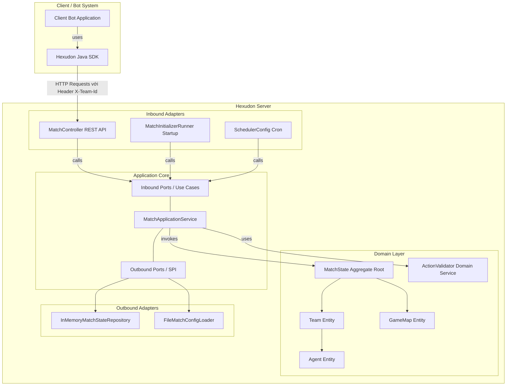

# Hexudon

Hexudon là một hệ thống mô phỏng game chiến thuật theo lượt (turn-based), đa tác tử (multi-agent) hoạt động trên lưới ô lục giác nằm ngang dạng **Odd-R offset**. Trong trò chơi này, các đội tham gia sẽ lập trình các Bot tự động để đăng ký, theo dõi trạng thái trận đấu và gửi danh sách hành động hàng ngày. Mục tiêu chính của trò chơi là tối ưu hóa việc thu thập các loại mì Udon tại các địa điểm cung cấp (`Spot`), phối hợp nhiên liệu di chuyển thông qua cơ chế sạc xăng của xe tiếp tế (`RefuelAgent`) cho xe tuần tra (`PatrolAgent`), và cạnh tranh điểm số trong điều kiện chi phí di chuyển thay đổi động theo mức độ ùn tắc giao thông (`TrafficLevel`).

Dự án được xây dựng và tổ chức theo phương pháp **Thiết kế hướng tên miền (DDD - Domain-Driven Design)** và **Kiến trúc Lục giác (Hexagonal Architecture / Ports & Adapters)**, giúp tách biệt hoàn toàn lõi nghiệp vụ mô phỏng với các thành phần công nghệ bên ngoài như Web Framework và Cơ sở dữ liệu.

---

## Overview

Dự án Hexudon cung cấp một nền tảng chạy game cục bộ (Game Server Engine) và một bộ công cụ phát triển phần mềm (Java SDK) hỗ trợ lập trình viên xây dựng bot thông minh:

*   **Game Server**: Bộ lõi động cơ game chịu trách nhiệm duy trì luật chơi, xác thực và chạy thử các danh sách bước đi gửi lên, tự động cập nhật ngày đấu (turn) bằng Scheduler, tính toán điểm số và mật độ giao thông trên đường bộ.
*   **Java SDK**: Thư viện kết nối đóng gói sẵn HTTP Client, JSON Mapper, cơ chế tự động gửi lại (Retry) với thuật toán Exponential Backoff và các mô hình dữ liệu lưới lục giác giúp các bot dễ dàng giao tiếp với server mà không cần tự xây dựng các kết nối HTTP thô.
*   **Đối tượng sử dụng**: Các lập trình viên hoặc đội chơi lập trình bot trí tuệ nhân tạo (AI) / chiến thuật tham gia đấu giải hoặc chạy thử thuật toán tìm đường trên lưới hex.

---

## Architecture

Hệ thống được thiết kế để tách biệt rõ ràng các thành phần thông qua các cổng giao tiếp (Ports) và bộ điều hợp (Adapters):



### Chi tiết các luồng tương tác:
1.  **Tương tác Client-Server**: Client Bot sử dụng thư viện `Hexudon Java SDK` gửi các gói tin HTTP (chứa Header xác thực định danh `X-Team-Id`) tới endpoint REST của `Hexudon Server`.
2.  **Xác thực và Giả lập tại Server**: Khi nhận danh sách hành động của bot, server thực hiện giải mã và đưa qua `ActionValidator` để chạy thử (Dry-run) trên bản đồ tĩnh, nếu tất cả bước đi hợp lệ (không đi vào ô nước cấm, không vượt quá giới hạn số bước đi của lượt) thì server mới chấp nhận lưu trữ.
3.  **Tự động thúc lượt (Game Loop)**: Một bộ lập lịch nền (Scheduler) trên Server sẽ liên tục theo dõi thời gian. Khi đến hạn kết thúc lượt, Scheduler sẽ kích hoạt tiến trình chạy mô phỏng chính thức: tính toán di chuyển, trừ xăng, thực hiện sạc xăng chéo, thu hoạch mì Udon, chấm điểm và tính toán lưu lượng giao thông ROAD để áp dụng chi phí xăng mới cho lượt sau.

---

## Project Structure

Thư mục gốc của repository được tổ chức thành hai module chính chạy trên nền cấu hình Maven đa module (Multi-module):

```text
hexudon (Root)
├── server              # Module chứa mã nguồn Game Simulation Engine (Spring Boot)
│   ├── src
│   │   ├── main/java   # Phân chia package theo layer: adapter, application, domain, infrastructure
│   │   └── resources   # Cấu hình application.yml, match_config.json mặc định
│   └── pom.xml
├── sdk                 # Module thư viện phát triển bot dành cho lập trình viên Java
│   ├── src
│   │   └── main/java   # Giao tiếp HTTP, Retry Backoff, cấu hình kết nối, mô hình map
│   └── pom.xml
├── docs                # Thư mục chứa tài liệu bổ sung (hiện tại trống)
├── API.md              # Tài liệu tham chiếu OpenAPI đầy đủ của hệ thống
├── pom.xml             # File Maven parent cấu hình dependency và Java 21 toàn dự án
└── README.md           # Tài liệu giới thiệu tổng quan hệ thống (tệp tin này)
```

---

## Modules

### 1. [Server](file:///d:/Documents/GitHub/hexudon/server)
*   **Vai trò**: Game Engine trung tâm quản lý toàn bộ vòng đời trận đấu, bản đồ lưới lục giác, chấm điểm và mô phỏng các hành động của Agent.
*   **Tech Stack**: Java 21, Spring Boot 3.5.4, Maven.
*   **Chức năng chính**: 
    *   Tự động nạp cấu hình bản đồ từ file JSON khi khởi động.
    *   Cung cấp REST API cho các bot đăng ký và nộp chuỗi bước đi.
    *   Bộ Scheduler tự động mô phỏng bước đi và chuyển ngày chơi khi đến hạn.
    *   Tính toán ùn tắc giao thông trên đường bộ (`ROAD`) để thay đổi chi phí xăng di chuyển động.
*   **Tài liệu chi tiết**: Xem thêm tại [server/README.md](file:///d:/Documents/GitHub/hexudon/server/README.md).

### 2. [SDK](file:///d:/Documents/GitHub/hexudon/sdk)
*   **Vai trò**: Thư viện Java Client chính thức giúp viết mã nguồn Bot nhanh chóng, che giấu các kết nối HTTP thô.
*   **Tech Stack**: Java 21, OkHttp 4.12.0, Jackson Databind 2.20.0.
*   **Chức năng chính**:
    *   Cung cấp giao diện `HexudonClient` làm entry point chính.
    *   Triển khai `GameApi` để gọi các hàm đăng ký, lấy config và nộp hành động.
    *   Tích hợp sẵn bộ Retry tự động với thuật toán Exponential Backoff khi gặp sự cố mạng hoặc lỗi tạm thời từ server (5xx).
    *   Định nghĩa sẵn các lớp hình học lưới như tọa độ ô và hướng di chuyển để hỗ trợ bot tính toán tìm đường.
*   **Tài liệu chi tiết**: Xem thêm tại [sdk/README.md](file:///d:/Documents/GitHub/hexudon/sdk/README.md).

---

## Tech Stack

Dưới đây là bảng tổng hợp công nghệ được sử dụng trên toàn bộ repository:

| Component | Technology |
| :--- | :--- |
| **Backend Language** | Java 21 (Sử dụng các cấu trúc hiện đại như Record, Pattern Matching) |
| **Backend Framework** | Spring Boot 3.5.4 |
| **Build Tool** | Apache Maven 3.9+ |
| **Database / Storage** | In-Memory (Bộ nhớ RAM JVM thông qua thực thi Repository tĩnh) |
| **JSON Serialization** | FasterXML Jackson Databind |
| **Client SDK HTTP** | OkHttp 4.12.0 |
| **Testing Framework** | JUnit 5, Mockito, AssertJ, ArchUnit 1.3.0 (kiểm thử kiến trúc) |
| **Monitor / Dashboard** | *Chưa được implement hoặc chưa có tài liệu* |
| **Frontend / Web UI** | *Chưa được implement hoặc chưa có tài liệu* |

---

## Getting Started

### Yêu cầu cài đặt (Requirements)
*   **Java**: JDK 21 hoặc cao hơn.
*   **Build Tool**: Maven 3.9 hoặc cao hơn.

### 1. Biên dịch toàn bộ dự án
Chạy lệnh sau tại thư mục gốc để biên dịch cả `server` và `sdk`:
```bash
mvn clean install
```

### 2. Khởi chạy Game Server
Để khởi chạy máy chủ mô phỏng cục bộ:
```bash
mvn spring-boot:run -pl server
```
Mặc định server sẽ chạy tại địa chỉ `http://localhost:8080`.

### 3. Tích hợp SDK vào Bot của bạn
Thêm dependency của SDK vào file `pom.xml` của ứng dụng bot của bạn:
```xml
<dependency>
    <groupId>com.naprock</groupId>
    <artifactId>hexudon-sdk</artifactId>
    <version>1.0.0</version>
</dependency>
```

> [!NOTE]
> **Run SDK Example & Monitor**:
> *   *Chưa được implement*: Hiện tại repository không đi kèm ứng dụng monitor UI hay bot chạy ví dụ (`bot-example`). Module SDK thuần túy cung cấp thư viện để lập trình viên tự phát triển bot độc lập.

---

## Configuration

### Cấu hình phía Server
Cấu hình Spring Boot và Scheduler được đặt tại [server/src/main/resources/application.yml](file:///d:/Documents/GitHub/hexudon/server/src/main/resources/application.yml):
*   `server.port`: Cổng lắng nghe mặc định (`8080`).
*   `match.scheduler.interval`: Chu kỳ quét thời gian của scheduler tính bằng mili-giây (Mặc định `1000`).

Tham số trò chơi và bản đồ được nạp từ file JSON [server/src/main/resources/match_config.json](file:///d:/Documents/GitHub/hexudon/server/src/main/resources/match_config.json):
*   `daySeconds`: Mảng quy định thời gian tối đa mỗi lượt chơi (ví dụ: `[5, 5, 5, 10]` giây).
*   `daySteps`: Mảng giới hạn số bước đi của Agent trong lượt tương ứng.
*   `fuelLimits`: Dung tích bình xăng của PatrolAgent (ví dụ: `20`).
*   `players`: Số lượng đội tối đa tham gia.

### Cấu hình phía SDK Client
Khi khởi tạo `HexudonClient`, các tham số cấu hình chính bao gồm:
*   `baseUrl`: URL của Hexudon Server (Mặc định `http://localhost:8080`).
*   `teamId`: Định danh bắt buộc của đội chơi (Gửi qua header `X-Team-Id`).
*   `token`: Bearer Token xác thực bắt buộc.

---

## API Overview

Ứng dụng Hexudon Server cung cấp các API thông qua HTTP REST. Toàn bộ các API chính thức nằm dưới tiền tố đường dẫn `/api/game`:

1.  **Cấu hình**:
    *   `GET /api/game/config`: Lấy cấu hình tham số bản đồ và ngày đấu.
2.  **Đăng ký**:
    *   `POST /api/game/agent-types`: Đăng ký tên đội (truyền qua Header `X-Team-Id`) và lựa chọn danh sách loại Agent ban đầu.
3.  **Hành động**:
    *   `POST /api/game/actions`: Nộp danh sách kế hoạch di chuyển/chờ đợi cho các Agent của lượt chơi hiện tại.
4.  **Trạng thái**:
    *   `GET /api/game/state`: Lấy thông tin trạng thái trận đấu hiện tại từ góc nhìn của đội chơi (Header `X-Team-Id`).

> [!IMPORTANT]
> **Lưu ý về Header xác thực**:
> *   Các request từ client lên server bắt buộc phải truyền mã định danh đội chơi qua HTTP Header có tên **`X-Team-Id`** (Không phải `X-Team-Name` như một số tài liệu cũ ghi nhận).

*Tài liệu OpenAPI chi tiết mô tả cấu trúc JSON yêu cầu và phản hồi được lưu tại tệp tin:* [API.md](file:///d:/Documents/GitHub/hexudon/API.md).

---

## Domain Overview

Nghiệp vụ của trò chơi xoay quanh các khái niệm và quy tắc lõi sau:

1.  **Lưới lục giác (Map)**: Sử dụng hệ lưới lục giác ngang Odd-R offset. Địa hình ô bản đồ có 4 loại: PLAIN (đồng bằng), ROAD (đường bộ), MOUNTAIN (núi cao), và POND (ao hồ). Ô địa hình POND là ô bị cấm không thể di chuyển qua.
2.  **Agent (Tác tử)**: Mỗi đội sở hữu một nhóm Agent tự hành ban đầu được sinh ra tại vị trí cố định. Có hai loại Agent:
    *   `PatrolAgent` (Tuần tra): Di chuyển qua các ô sẽ tiêu tốn nhiên liệu và bước hành động. Nhiệm vụ duy nhất là đứng tại các ô có Spot để thu hoạch mì Udon.
    *   `RefuelAgent` (Tiếp tế): Di chuyển chỉ tốn bước đi, không tốn nhiên liệu. Khi đứng cùng ô tọa độ với PatrolAgent cùng đội ở bất kỳ bước mô phỏng nào, nó sẽ tự động nạp đầy nhiên liệu cho PatrolAgent.
3.  **Ùn tắc giao thông (Traffic)**: Khi nhiều Agent của các đội cùng di chuyển qua hoặc đứng lại ở các ô đường bộ (`ROAD`), mức độ ùn tắc của ô đó tăng lên. Cuối lượt chơi, hệ thống tính toán tỷ lệ ùn tắc và quy đổi thành mức độ `NORMAL` (xăng tiêu thụ = 1), `BUSY` (xăng tiêu thụ = 2), hoặc `CONGESTED` (xăng tiêu thụ = 4) áp dụng cho lượt chơi tiếp theo.
4.  **Điểm Spot và Điểm số**: Mỗi ô Spot chứa một lượng mì Udon hữu hạn cho từng đội chơi (kho hàng độc lập giữa các đội). Agent tuần tra đứng tại Spot thu hoạch sẽ nhận được Udon và ghi điểm vào bảng xếp hạng. Tồn kho của các Spot sẽ được làm đầy lại vào đầu mỗi lượt chơi mới.

---

## Documentation

Dưới đây là danh sách các tài liệu tham khảo chính trong kho mã nguồn:

*   [API.md](file:///d:/Documents/GitHub/hexudon/API.md): Tài liệu đặc tả OpenAPI đầy đủ của hệ thống bao gồm cả các endpoint quản trị (Admin) và chế độ luyện tập (Practice).
*   [server/README.md](file:///d:/Documents/GitHub/hexudon/server/README.md): Hướng dẫn chi tiết mã nguồn, kiến trúc lục giác, luồng xử lý và cách chạy module Server.
*   [sdk/README.md](file:///d:/Documents/GitHub/hexudon/sdk/README.md): Hướng dẫn cài đặt, cấu hình retry và cách lập trình tích hợp SDK vào mã nguồn bot của bạn.
*   *ARCHITECTURE.md, GAME_RULES.md, DATA_MODEL.md, DEVELOPMENT_ROADMAP.md*: **Chưa được tạo lập** hoặc chưa có sẵn trong thư mục `docs` (thư mục `docs` hiện tại đang trống).

---

## Development Guide

### Ràng buộc kiến trúc (Architecture Enforcement)
Khi đóng góp mã nguồn cho dự án, các lập trình viên phải tuân thủ nghiêm ngặt các quy tắc kiến trúc lục giác được tự động kiểm tra bằng ArchUnit trong lớp [ArchitectureTest.java](file:///d:/Documents/GitHub/hexudon/server/src/test/java/com/naprock/hexudon/ArchitectureTest.java):
*   Các class nằm trong package `domain` **không được phép** import hoặc tham chiếu tới các class ở các package `application`, `adapter`, hoặc `infrastructure`.
*   Các class trong package `application` chỉ được phép tương tác với `domain` và các interfaces định nghĩa cổng (Ports), không được tham chiếu trực tiếp đến các adapters bên ngoài.

### Quy tắc đặt tên và Thiết kế bất biến
*   Sử dụng Java `record` cho tất cả các đối tượng dữ liệu truyền tải (DTOs, Commands) và các Value Object đơn giản trong Domain để bảo đảm tính bất biến (Immutability).
*   Các danh sách (Collections) trả về từ các đối tượng nghiệp vụ phải được bọc bằng `Collections.unmodifiableList` hoặc `List.copyOf` để tránh rò rỉ trạng thái.

---

## Testing

Hệ thống cung cấp các bộ kiểm thử tự động phong phú ở cả hai module:

*   **Server Tests**: Kiểm thử luật chơi của Agent, nạp xăng tự động, tính toán ùn tắc, kiểm tra ánh xạ dữ liệu, và kiểm thử kiến trúc tĩnh ArchUnit.
*   **SDK Tests**: Kiểm thử tuần tự hóa JSON coordinate, cơ chế tự động gửi lại (Retry) khi gặp lỗi mạng, và xác thực cấu hình kết nối.

Cách chạy toàn bộ kiểm thử trên repository:
```bash
mvn test
```

---

## Roadmap

### Các tính năng đã hoàn thành
*   Xây dựng hoàn chỉnh lõi tính toán hình học lưới lục giác ngang Odd-R và khoảng cách hex.
*   Cơ chế mô phỏng di chuyển bước, auto-refuel, và thu hoạch tài nguyên theo luật chơi.
*   Tự động cập nhật ùn tắc giao thông ROAD động theo lượt.
*   Thiết lập REST API cơ bản cho cấu hình, trạng thái trận đấu và gửi hành động.
*   Bộ Java SDK tích hợp Retry Exponential Backoff kết nối ổn định.

### Các tính năng chưa hoàn thành / Đang lên kế hoạch (Có cấu trúc khung nhưng chưa triển khai)
*   **WebSocket Protocol**: Các package `websocket` (Inbound adapter) và `publisher` (Outbound adapter) trên server hiện tại mới chỉ là thư mục trống. Toàn bộ tương tác hiện tại phải thực hiện qua REST API dạng thăm dò (polling).
*   **Chế độ luyện tập (Practice Mode)**: Bộ Java SDK đã xây dựng xong cấu trúc gọi API luyện tập (`PracticeApi` gọi các đường dẫn `/api/game/practice/*`), tuy nhiên trên Server **chưa triển khai** bất kỳ endpoint hay nghiệp vụ nào tương ứng cho tính năng này.
*   **Cơ sở dữ liệu lưu trữ (Database Persistence)**: Chưa có adapter kết nối tới các cơ sở dữ liệu vật lý (như PostgreSQL, MySQL). Trạng thái game hiện tại được lưu trữ hoàn toàn tạm thời trên bộ nhớ RAM.

---

## License

Mã nguồn dự án Hexudon thuộc quyền sở hữu của naprock. Mọi hành vi phân phối, thay đổi hoặc sử dụng cho mục đích thương mại phải được sự cho phép bằng văn bản từ chủ sở hữu dự án.
