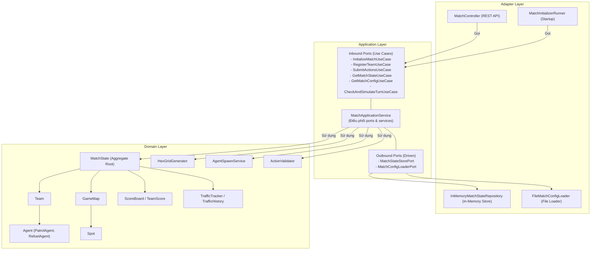

# HEXUDON

[](https://jdk.java.net/21/)
[](https://spring.io/projects/spring-boot)
[](#biên-dịch--chạy-dự-án)

`HEXUDON` là một máy chủ mô phỏng trò chơi chiến thuật đa tác tử (multi-agent), chơi theo lượt (turn-based), hoạt động trên lưới lục giác lệch (hexagonal offset grid). Các đội chơi đăng ký tham gia và gửi danh sách hành động để điều khiển các Agent (tác tử) tự trị của mình. Mục tiêu của trò chơi là thu hoạch các loại mì Udon, phối hợp tiếp nhiên liệu giữa các Agent, tối ưu hóa đường đi để ghi điểm cao nhất, đồng thời thích ứng với các ràng buộc về mật độ giao thông được cập nhật liên tục qua mỗi lượt chơi.

Dự án được thiết kế chặt chẽ theo nguyên lý **Domain-Driven Design (DDD)** và **Kiến trúc Lục giác (Hexagonal Architecture / Ports and Adapters)**, đảm bảo nhân mô phỏng cốt lõi (game simulation engine) hoàn toàn độc lập với các framework bên ngoài như Spring Boot hay giao diện Web.

---

## Mục lục
- [Kiến trúc hệ thống](#kiến-trúc-hệ-thống)
  - [Các lớp kiến trúc](#các-lớp-kiến-trúc)
  - [Sự phụ thuộc & Luồng điều khiển](#sự-phụ-thuộc--luồng-điều-khiển)
  - [Biểu đồ Mermaid](#biểu-đồ-mermaid)
- [Cấu trúc Module](#cấu-trúc-module)
- [Công nghệ sử dụng](#công-nghệ-sử-dụng)
- [Cây thư mục dự án](#cây-thư-mục-dự-án)
- [Biên dịch & Chạy dự án](#biên-dịch--chạy-dự-án)
  - [Điều kiện tiên quyết](#điều-kiện-tiên-quyết)
  - [1. Backend Server (`hexudon-server`)](#1-backend-server-hexudon-server)
  - [2. Frontend Monitor (`hexudon-monitor`)](#2-frontend-monitor-hexudon-monitor)
- [Cấu hình](#cấu-hình)
- [Tài liệu REST API (Chi tiết)](#tài-liệu-rest-api-chi-tiết)
  - [1. Đăng ký đội chơi (POST /api/match/register)](#1-đăng-ký-đội-chơi-post-apimatchregister)
  - [2. Lấy cấu hình trận đấu (GET /api/match/config)](#2-lấy-cấu-hình-trận-đấu-get-apimatchconfig)
  - [3. Lấy trạng thái trận đấu (GET /api/match/state)](#3-lấy-trạng-thái-trận-đấu-get-apimatchstate)
  - [4. Gửi kế hoạch hành động (POST /api/match/actions)](#4-gửi-kế-hoạch-hành-động-post-apimatchactions)
  - [Xử lý lỗi hệ thống & Mã lỗi (Error Handlers)](#xử-lý-lỗi-hệ-thống--mã-lỗi-error-handlers)
- [Cơ chế mô phỏng cốt lõi & Domain Model](#cơ-chế-mô-phỏng-cốt-lõi--domain-model)
  - [Hình học lưới lục giác (Hex Grid Geometry)](#hình-học-lưới-lục-giác-hex-grid-geometry)
  - [Địa hình & Tạo điểm thu hoạch Udon (Spots)](#địa-hình--tạo-điểm-thu-hoạch-udon-spots)
  - [Vòng đời lượt chơi & Bộ lập lịch (Scheduler)](#vòng-đời-lượt-chơi--bộ-lập-lịch-scheduler)
  - [Các loại Agent & Cơ chế hỗ trợ tiếp nhiên liệu](#các-loại-agent--cơ-chế-hỗ-trợ-tiếp-nhiên-liệu)
  - [Cơ chế ùn tắc giao thông (Traffic & Congestion)](#cơ-chế-ùn-tắc-giao-thông-traffic--congestion)
  - [Hệ thống tính điểm (Scoring System)](#hệ-thống-tính-điểm-scoring-system)
- [Kiểm thử (Testing)](#kiểm-thử-testing)
- [Các lỗi logic và hạn chế đã biết trong Game Engine](#các-lỗi-logic-và-hạn-chế-đã-biết-trong-game-engine)
- [Hướng dẫn đóng góp (Contribution Guide)](#hướng-dẫn-đóng-góp-contribution-guide)

---

## Kiến trúc hệ thống

Dự án được xây dựng theo cấu trúc **Kiến trúc Lục giác (Ports and Adapters)** nhằm tách biệt logic nghiệp vụ lõi khỏi các công nghệ và cơ sở hạ tầng bên ngoài.

### Các lớp kiến trúc

1. **Lớp Domain (`com.naprock.hexudon.domain`)**:
   - Chứa các thực thể cốt lõi (entities), tổng hợp (aggregates), giá trị đối tượng (value objects), ngoại lệ domain và các dịch vụ thuần nghiệp vụ.
   - Hoàn toàn độc lập với các thư viện bên ngoài (không chứa bất kỳ import nào từ framework Spring).
2. **Lớp Application (`com.naprock.hexudon.application`)**:
   - **Inbound Ports**: Định nghĩa các ca sử dụng (use cases), ví dụ như [RegisterTeamUseCase](file:///d:/Documents/GitHub/hexudon/server/src/main/java/com/naprock/hexudon/application/port/in/RegisterTeamUseCase.java).
   - **Outbound Ports**: Định nghĩa các giao diện bộ chuyển đổi đầu ra (adapter interfaces), ví dụ như [MatchStateStorePort](file:///d:/Documents/GitHub/hexudon/server/src/main/java/com/naprock/hexudon/application/port/out/MatchStateStorePort.java).
   - **Application Services**: [MatchApplicationService](file:///d:/Documents/GitHub/hexudon/server/src/main/java/com/naprock/hexudon/application/service/MatchApplicationService.java) hiện thực các cổng vào (inbound ports) và điều phối các cổng ra (outbound ports).
   - **DTOs & Mappers**: Thực hiện chuyển đổi cấu trúc dữ liệu truyền nhận (payload) thành đối tượng domain và ngược lại.
3. **Lớp Adapter (`com.naprock.hexudon.adapter`)**:
   - **Inbound (Driving)**: Nhận các yêu cầu từ bên ngoài, bao gồm các REST Controller ([MatchController](file:///d:/Documents/GitHub/hexudon/server/src/main/java/com/naprock/hexudon/adapter/in/rest/MatchController.java)) và trình khởi chạy startup ([MatchInitializerRunner](file:///d:/Documents/GitHub/hexudon/server/src/main/java/com/naprock/hexudon/adapter/in/initializer/MatchInitializerRunner.java)).
   - **Outbound (Driven)**: Hiện thực cổng ra của ứng dụng, bao gồm lưu trữ dữ liệu tạm thời ([InMemoryMatchStateRepository](file:///d:/Documents/GitHub/hexudon/server/src/main/java/com/naprock/hexudon/adapter/out/persistence/InMemoryMatchStateRepository.java)) và trình tải tệp cấu hình ([FileMatchConfigLoader](file:///d:/Documents/GitHub/hexudon/server/src/main/java/com/naprock/hexudon/adapter/out/loader/FileMatchConfigLoader.java)).
4. **Lớp Infrastructure (`com.naprock.hexudon.infrastructure`)**:
   - Thiết lập cấu hình hệ thống như lập lịch định kỳ cho Spring ([SchedulerConfig](file:///d:/Documents/GitHub/hexudon/server/src/main/java/com/naprock/hexudon/infrastructure/configuration/SchedulerConfig.java)), cấu hình chia sẻ tài nguyên CORS ([WebConfig](file:///d:/Documents/GitHub/hexudon/server/src/main/java/com/naprock/hexudon/infrastructure/configuration/WebConfig.java)) và các tiện ích dùng chung khác.

### Sự phụ thuộc & Luồng điều khiển

Các phụ thuộc luôn hướng vào bên trong lớp nhân. Các Adapters phụ thuộc vào Application Ports để tương tác với Domain Entities. Lớp Domain không phụ thuộc vào bất kỳ thành phần nào khác.

### Biểu đồ Mermaid



---

## Cấu trúc Module

Dự án được cấu trúc thành các thành phần chính sau:
- **Parent (`hexudon`)**: Cấu hình biên dịch đa module bằng Maven.
- **Server Module (`hexudon-server` / `/server`)**: Dự án Spring Boot Maven chứa nhân mô phỏng game, các REST endpoints, trình nạp cấu hình và lập lịch lượt chơi định kỳ.
- **Monitor Client (`hexudon-monitor` / `/hexudon-monitor`)**: Ứng dụng client viết bằng React/Vite/TypeScript để trực quan hóa lưới bản đồ, điểm số các đội, vị trí các Agent và lưu lượng giao thông theo thời gian thực.

---

## Công nghệ sử dụng

- **Backend (`hexudon-server`)**:
  - **Ngôn ngữ**: Java 21
  - **Framework**: Spring Boot 3.5.4 (sử dụng `spring-boot-starter-web` & `spring-boot-starter-validation` cho DTO validation)
  - **Thư viện tiện ích**: Lombok
  - **Kiểm thử**: JUnit 5, Mockito, ArchUnit 1.3.0 (xác thực cấu trúc kiến trúc)
  - **Công cụ build**: Apache Maven 3.9.x
- **Frontend Dashboard (`hexudon-monitor`)**:
  - **Framework**: React 19 + TypeScript
  - **Công cụ build**: Vite 8.1.1
  - **Styling**: TailwindCSS v4
  - **Quản lý trạng thái**: Zustand
  - **Biểu đồ**: Recharts
  - **Bộ icon**: Lucide React
  - **HTTP Client**: Axios

---

## Cây thư mục dự án

Dưới đây là các đường dẫn chính trong cấu trúc dự án:

```text
.
├── pom.xml                                   # Parent POM
├── server                                    # Module Spring Boot Server
│   ├── pom.xml
│   └── src
│       ├── main
│       │   ├── java/com/naprock/hexudon
│       │   │   ├── adapter/in/rest               # Các REST Controller
│       │   │   ├── adapter/in/initializer        # Trình khởi chạy lúc bắt đầu ứng dụng
│       │   │   ├── adapter/out/persistence       # Bộ nhớ tạm in-memory lưu trữ trận đấu
│       │   │   ├── adapter/out/loader            # Bộ nạp cấu hình từ tệp tin
│       │   │   ├── application/port              # Định nghĩa Inbound và Outbound Ports
│       │   │   ├── application/service           # Hiện thực MatchApplicationService
│       │   │   ├── domain/model/agent            # Domain Agent (PatrolAgent, RefuelAgent,...)
│       │   │   ├── domain/model/geometry         # Hình học bản đồ (Coordinate, Direction)
│       │   │   ├── domain/model/map              # Cấu trúc bản đồ (GameMap, Cell, Spot)
│       │   │   ├── domain/model/match            # Trạng thái trận đấu (MatchState, MatchConfig)
│       │   │   ├── domain/model/traffic          # Xử lý giao thông (TrafficTracker, TrafficHistory)
│       │   │   ├── domain/model/score            # Tính điểm (ScoreBoard, TeamScore)
│       │   │   └── infrastructure/configuration  # Cấu hình WebConfig, SchedulerConfig
│       │   └── resources
│       │       ├── application.yml           # Tham số cấu hình Spring Boot
│       │       └── match_config.txt          # Tệp luật chơi và thông số trận đấu
│       └── test                              # Thư mục kiểm thử (JUnit 5, ArchUnit)
└── hexudon-monitor                           # Dự án React Frontend Dashboard
    ├── index.html
    ├── package.json
    ├── vite.config.ts
    └── src
        ├── components                        # Giao diện vẽ lưới lục giác, bảng điểm, điều khiển
        ├── pages                             # Bố cục màn hình dashboard
        ├── stores                            # Zustand store quản lý dữ liệu bản đồ và trạng thái
        └── main.tsx                          # Điểm chạy chính của frontend
```

---

## Biên dịch & Chạy dự án

### Điều kiện tiên quyết
- **Java Development Kit (JDK) 21** trở lên
- **Maven 3.9.x** trở lên
- **Node.js 18+** & **npm**

### 1. Backend Server (`hexudon-server`)

Để biên dịch toàn bộ dự án Maven, di chuyển tới thư mục gốc và chạy:
```bash
mvn clean install
```

Để chạy server Spring Boot (mặc định khởi chạy tại `http://localhost:8080`):
```bash
# Từ thư mục gốc dự án
mvn spring-boot:run -pl server
```
Hoặc có thể chạy trực tiếp file JAR đã đóng gói:
```bash
java -jar server/target/hexudon-server-1.0.0.jar
```

### 2. Frontend Monitor (`hexudon-monitor`)

Cài đặt thư viện dependencies và khởi chạy dev server cục bộ:
```bash
cd hexudon-monitor
npm install
npm run dev
```
Truy cập [http://localhost:3000](http://localhost:3000) trên trình duyệt web của bạn.

Bảng điều khiển cung cấp chế độ chuyển đổi **Mock vs Live Mode** trên thanh bên:
- **Mock Mode** (Mặc định): Sử dụng dữ liệu giả lập được sinh ngẫu nhiên trực tiếp ở frontend mà không cần chạy backend.
- **Live Mode**: Định kỳ gọi các API endpoints của server Spring Boot tại `http://localhost:8080` mỗi 2 giây để cập nhật trạng thái thực tế của trận đấu.

---

## Cấu hình

Hệ thống mô phỏng được cấu hình thông qua hai tệp tin nằm trong thư mục `server/src/main/resources`:

1. **`application.yml`**:
   - `server.port`: Cổng HTTP của Web server (Mặc định: `8080`).
   - `match.scheduler.interval`: Tần suất (tính bằng ms) của bộ lập lịch kiểm tra xem lượt đi đã hết thời gian chưa (Mặc định: `1000`).

2. **`match_config.txt`**:
   Chứa các quy tắc chơi và giới hạn trận đấu. Được phân tích ở thời điểm startup bởi [FileMatchConfigLoader](file:///d:/Documents/GitHub/hexudon/server/src/main/java/com/naprock/hexudon/adapter/out/loader/FileMatchConfigLoader.java):
   - `mapWidth` / `mapHeight`: Kích thước bản đồ (rộng x cao).
   - `maxTurns`: Số lượng lượt chơi tối đa trước khi trận đấu tự động kết thúc.
   - `maxTeams`: Số lượng đội chơi tối đa được phép đăng ký tham gia.
   - `agentsPerTeam`: Số lượng Agent quy định cho mỗi đội chơi (bắt buộc tổng Agent khi đăng ký phải bằng số này).
   - `maxFuel`: Giới hạn dung lượng nhiên liệu tối đa của Agent.
   - `maxStepsPerTurn`: Số bước di chuyển (action steps) tối đa được cấp cho Agent ở đầu mỗi lượt chơi.
   - `turnTimeLimitMs`: Giới hạn thời gian (mili giây) của một lượt chơi để các đội nộp hành động.
   - `initialSpotUdonStock`: Số lượng mì Udon ban đầu được khởi tạo tại mỗi điểm thu hoạch (Spot).

---

## Tài liệu REST API (Chi tiết)

Địa chỉ máy chủ mặc định: `http://localhost:8080`

### 1. Đăng ký đội chơi (POST `/api/match/register`)

*   **URL đầy đủ**: `http://localhost:8080/api/match/register`
*   **HTTP Method**: `POST`
*   **Mục đích**: Đăng ký một đội chơi tham gia trận đấu. Khi đăng ký thành công, server sẽ tự động sinh vị trí ngẫu nhiên không trùng lặp cho các tác tử của đội đó.
*   **Request Header**: Không có.
*   **Path/Query Parameters**: Không có.
*   **Request Body** (`application/json`):
    Bản đồ JSON tương ứng với DTO [TeamRegisterRequest](file:///d:/Documents/GitHub/hexudon/server/src/main/java/com/naprock/hexudon/application/dto/team/TeamRegisterRequest.java) chứa các trường sau:

    | Tên trường | Kiểu dữ liệu | Kiểm hợp lệ (Validation) | Mô tả |
    | :--- | :--- | :--- | :--- |
    | `teamName` | String | `@NotBlank(message = "Team name must not be blank")` | Tên của đội chơi muốn đăng ký. |
    | `amountPatrol` | int | `@Min(value = 0, message = "amountPatrol must not be negative")` | Số lượng tác tử tuần tra (`PatrolAgent`). |
    | `amountRefuel` | int | `@Min(value = 0, message = "amountRefuel must not be negative")` | Số lượng tác tử tiếp nhiên liệu (`RefuelAgent`). |

    > [!IMPORTANT]
    > **Ràng buộc nghiệp vụ**: Tổng số lượng tác tử `amountPatrol + amountRefuel` bắt buộc phải bằng tham số cấu hình `agentsPerTeam` của trận đấu.

*   **Response Body** (`application/json`):
    Trả về thông tin đội chơi đã đăng ký dựa trên [TeamResponse](file:///d:/Documents/GitHub/hexudon/server/src/main/java/com/naprock/hexudon/application/dto/team/TeamResponse.java):

    | Tên trường | Kiểu dữ liệu | Mô tả |
    | :--- | :--- | :--- |
    | `teamName` | String | Tên đội chơi đã đăng ký thành công. |
    | `agents` | List<[AgentResponse](file:///d:/Documents/GitHub/hexudon/server/src/main/java/com/naprock/hexudon/application/dto/agent/AgentResponse.java)> | Danh sách các tác tử được phân bố cho đội chơi này. |

    Mỗi phần tử **AgentResponse** bao gồm:
    - `agentId` (String): Định danh tác tử (VD: `A1`, `A2`).
    - `coordinate` (Object): Tọa độ của tác tử trên bản đồ lục giác.
      - `x` (int): Tọa độ x (cột).
      - `y` (int): Tọa độ y (hàng).
    - `agentType` (String/Enum): Loại tác tử (`PATROL` hoặc `REFUEL`).
    - `fuel` (int): Mức nhiên liệu hiện tại (ban đầu khởi tạo là `0`).
    - `step` (int): Số bước di chuyển còn lại trong lượt (ban đầu khởi tạo là `0`).

*   **HTTP Status Codes**:
    - `201 Created`: Đăng ký thành công.
    - `400 Bad Request`: Lỗi dữ liệu không hợp lệ (ví dụ: tên đội bị bỏ trống, số lượng agent âm, hoặc tổng số lượng không khớp cấu hình).
    - `400 Bad Request` (Conflict): Tên đội đã tồn tại hoặc trận đấu đã bắt đầu/kết thúc (không còn ở trạng thái `WAITING`).
    - `400 Bad Request` (Max Teams Limit): Đã đạt đến giới hạn số lượng đội chơi tối đa (`maxTeams`).

*   **Ví dụ Request**:
    ```http
    POST /api/match/register HTTP/1.1
    Host: localhost:8080
    Content-Type: application/json

    {
      "teamName": "TeamUdon",
      "amountPatrol": 2,
      "amountRefuel": 1
    }
    ```

*   **Ví dụ Response**:
    ```json
    {
      "teamName": "TeamUdon",
      "agents": [
        {
          "agentId": "A1",
          "coordinate": {
            "x": 3,
            "y": 4
          },
          "agentType": "PATROL",
          "fuel": 0,
          "step": 0
        },
        {
          "agentId": "A2",
          "coordinate": {
            "x": 8,
            "y": 2
          },
          "agentType": "PATROL",
          "fuel": 0,
          "step": 0
        },
        {
          "agentId": "A3",
          "coordinate": {
            "x": 5,
            "y": 7
          },
          "agentType": "REFUEL",
          "fuel": 0,
          "step": 0
        }
      ]
    }
    ```

---

### 2. Lấy cấu hình trận đấu (GET `/api/match/config`)

*   **URL đầy đủ**: `http://localhost:8080/api/match/config`
*   **HTTP Method**: `GET`
*   **Mục đích**: Lấy thông tin cấu hình tĩnh của trận đấu hiện tại (thông số bản đồ, ô địa hình, vị trí các điểm chứa Udon và các giới hạn về lượt/nhiên liệu).
*   **Request Header**: Không có.
*   **Path/Query Parameters**: Không có.
*   **Request Body**: Không có.
*   **Response Body** (`application/json`):
    Trả về thông tin cấu hình trận đấu dựa trên [MatchConfigResponse](file:///d:/Documents/GitHub/hexudon/server/src/main/java/com/naprock/hexudon/application/dto/match/MatchConfigResponse.java):

    | Tên trường | Kiểu dữ liệu | Mô tả |
    | :--- | :--- | :--- |
    | `mapWidth` | int | Chiều rộng của bản đồ lưới lục giác. |
    | `mapHeight` | int | Chiều cao của bản đồ lưới lục giác. |
    | `cells` | List<[CellResponse](file:///d:/Documents/GitHub/hexudon/server/src/main/java/com/naprock/hexudon/application/dto/match/CellResponse.java)> | Danh sách cấu trúc địa hình của tất cả các ô trên bản đồ. |
    | `spots` | List<[SpotResponse](file:///d:/Documents/GitHub/hexudon/server/src/main/java/com/naprock/hexudon/application/dto/match/SpotResponse.java)> | Danh sách các ô chứa tài nguyên mì Udon trên lưới. |
    | `agentsPerTeam` | int | Số lượng tác tử bắt buộc cho mỗi đội. |
    | `maxFuel` | int | Lượng nhiên liệu tối đa mà một tác tử Patrol có thể chứa. |
    | `maxStepsPerTurn` | int | Số bước di chuyển tối đa của tác tử trong một lượt. |
    | `maxTurn` | int | Tổng số lượt chơi tối đa của trận đấu này. |

    Mỗi **CellResponse** bao gồm:
    - `coordinate` (CoordinateResponse): Tọa độ x, y của ô.
    - `terrainType` (String/Enum): Địa hình ô (`PLAIN`, `MOUNTAIN`, `ROAD`, `POND`).

    Mỗi **SpotResponse** bao gồm:
    - `coordinate` (CoordinateResponse): Tọa độ x, y của điểm Udon.
    - `udonType` (String/Enum): Loại Udon tại điểm đó (`TANUKI`, `KITSUNE`, `TEMPURA`, `BEEF`).
    - `amount` (int): Số lượng mì Udon hiện tại đang có ở Spot này.

*   **HTTP Status Codes**:
    - `200 OK`: Thành công.
    - `500 Internal Server Error`: Lỗi tải tập tin cấu hình hoặc lỗi xử lý hệ thống.

*   **Ví dụ Request**:
    ```http
    GET /api/match/config HTTP/1.1
    Host: localhost:8080
    ```

*   **Ví dụ Response**:
    ```json
    {
      "mapWidth": 20,
      "mapHeight": 15,
      "cells": [
        {
          "coordinate": { "x": 0, "y": 0 },
          "terrainType": "PLAIN"
        },
        {
          "coordinate": { "x": 1, "y": 0 },
          "terrainType": "ROAD"
        },
        {
          "coordinate": { "x": 2, "y": 0 },
          "terrainType": "POND"
        }
      ],
      "spots": [
        {
          "coordinate": { "x": 5, "y": 2 },
          "udonType": "TANUKI",
          "amount": 5
        }
      ],
      "agentsPerTeam": 3,
      "maxFuel": 100,
      "maxStepsPerTurn": 5,
      "maxTurn": 15
    }
    ```

---

### 3. Lấy trạng thái trận đấu (GET `/api/match/state`)

*   **URL đầy đủ**: `http://localhost:8080/api/match/state`
*   **HTTP Method**: `GET`
*   **Mục đích**: Lấy thông tin trạng thái thời gian thực của trận đấu phục vụ cho các thuật toán ra quyết định của tác tử.
*   **Request Header**:
    - `X-Team-Name` (String): Bắt buộc, không được để trống (`@NotBlank`). Xác định đội chơi muốn truy vấn để chỉ hiển thị thông tin Agent thuộc về đội này.
*   **Path/Query Parameters**: Không có.
*   **Request Body**: Không có.
*   **Response Body** (`application/json`):
    Trả về thông tin trạng thái trận đấu dựa trên [MatchStateResponse](file:///d:/Documents/GitHub/hexudon/server/src/main/java/com/naprock/hexudon/application/dto/match/MatchStateResponse.java):

    | Tên trường | Kiểu dữ liệu | Mô tả |
    | :--- | :--- | :--- |
    | `status` | String/Enum | Trạng thái vòng đời trận đấu (`WAITING`, `PLAYING`, `FINISHED`). |
    | `turn` | int | Lượt chơi hiện tại. |
    | `agents` | List<[AgentResponse](file:///d:/Documents/GitHub/hexudon/server/src/main/java/com/naprock/hexudon/application/dto/agent/AgentResponse.java)> | Danh sách Agent thuộc sở hữu của đội chơi gửi yêu cầu (thông tin Agent đội khác bị ẩn). |
    | `traffic` | List<[TrafficResponse](file:///d:/Documents/GitHub/hexudon/server/src/main/java/com/naprock/hexudon/application/dto/match/TrafficResponse.java)> | Trạng thái lưu lượng giao thông trên các ô đường bộ (`ROAD`). |
    | `spots` | List<SpotResponse> | Danh sách và số lượng mì Udon còn lại tại các ô Spot tài nguyên. |
    | `teamScores` | List<[TeamScoreResponse](file:///d:/Documents/GitHub/hexudon/server/src/main/java/com/naprock/hexudon/application/dto/team/TeamScoreResponse.java)> | Bảng điểm thống kê của toàn bộ các đội chơi. |

    Mỗi **TrafficResponse** bao gồm:
    - `coordinate` (CoordinateResponse): Tọa độ ô đường bộ.
    - `trafficLevel` (String/Enum): Mức độ tắc nghẽn giao thông (`NORMAL`, `BUSY`, `CONGESTED`).

    Mỗi **TeamScoreResponse** bao gồm:
    - `teamName` (String): Tên đội chơi.
    - `uniqueUdonTypeCount` (int): Số loại Udon độc nhất đã thu thập được.
    - `totalDailyUdon` (int): Tổng số lượng bát Udon đã thu thập.
    - `totalUdonServings` (int): Tổng số lượt phục vụ thành công.
    - `totalResponseTimeMillis` (long): Tổng lượng thời gian trễ phản hồi (latency) của đội qua các API.

*   **HTTP Status Codes**:
    - `200 OK`: Thành công.
    - `400 Bad Request`: Header `X-Team-Name` bị trống hoặc thiếu.
    - `404 Not Found`: Đội chơi tương ứng với tên truyền lên không tồn tại trong hệ thống.

*   **Ví dụ Request**:
    ```http
    GET /api/match/state HTTP/1.1
    Host: localhost:8080
    X-Team-Name: TeamUdon
    ```

*   **Ví dụ Response**:
    ```json
    {
      "status": "PLAYING",
      "turn": 1,
      "agents": [
        {
          "agentId": "A1",
          "coordinate": { "x": 3, "y": 4 },
          "agentType": "PATROL",
          "fuel": 100,
          "step": 5
        },
        {
          "agentId": "A3",
          "coordinate": { "x": 5, "y": 7 },
          "agentType": "REFUEL",
          "fuel": 0,
          "step": 5
        }
      ],
      "traffic": [
        {
          "coordinate": { "x": 1, "y": 0 },
          "trafficLevel": "NORMAL"
        }
      ],
      "spots": [
        {
          "coordinate": { "x": 5, "y": 2 },
          "udonType": "TANUKI",
          "amount": 4
        }
      ],
      "teamScores": [
        {
          "teamName": "TeamUdon",
          "uniqueUdonTypeCount": 1,
          "totalDailyUdon": 1,
          "totalUdonServings": 0,
          "totalResponseTimeMillis": 150
        }
      ]
    }
    ```

---

### 4. Gửi kế hoạch hành động (POST `/api/match/actions`)

*   **URL đầy đủ**: `http://localhost:8080/api/match/actions`
*   **HTTP Method**: `POST`
*   **Mục đích**: Gửi danh sách hành động cho các Agent thuộc quyền kiểm soát của đội chơi trong lượt hiện tại. Server sẽ giả lập chạy thử danh sách này để kiểm tra tính hợp lệ trước khi chính thức chấp nhận.
*   **Request Header**:
    - `X-Team-Name` (String): Bắt buộc, không được để trống (`@NotBlank`). Tên của đội chơi đăng ký hành động.
*   **Path/Query Parameters**: Không có.
*   **Request Body** (`application/json`):
    Bản đồ JSON tương ứng với DTO [SubmitActionRequest](file:///d:/Documents/GitHub/hexudon/server/src/main/java/com/naprock/hexudon/application/dto/match/SubmitActionRequest.java):

    | Tên trường | Kiểu dữ liệu | Kiểm hợp lệ (Validation) | Mô tả |
    | :--- | :--- | :--- | :--- |
    | `actions` | List<[ActionRequest](file:///d:/Documents/GitHub/hexudon/server/src/main/java/com/naprock/hexudon/application/dto/match/ActionRequest.java)> | `@NotEmpty(message = "Action list must not be empty")` | Danh sách các hành động muốn đăng ký cho các tác tử của đội. |

    Mỗi **ActionRequest** bao gồm các trường sau:

    | Tên trường | Kiểu dữ liệu | Kiểm hợp lệ (Validation) | Mô tả |
    | :--- | :--- | :--- | :--- |
    | `agentId` | String | `@NotBlank(message = "Agent ID must not be blank")` | Định danh tác tử thực hiện hành động này. |
    | `order` | int | `@Min(value = 1, message = "Order must be greater than or equal to 1")` | Thứ tự bước thực thi của hành động (phải tuần tự từ 1). |
    | `actionType` | String/Enum | `@NotNull(message = "Action type must not be null")` | Loại hành động, có giá trị là `MOVE` hoặc `WAIT`. |
    | `coordinate` | Object/Null | `@Valid` | Tọa độ đích đến (bắt buộc nếu hành động là `MOVE`, nên truyền `null` nếu hành động là `WAIT` để tránh lỗi logic của engine). |

    Nếu truyền ô tọa độ `coordinate` ([CoordinateRequest](file:///d:/Documents/GitHub/hexudon/server/src/main/java/com/naprock/hexudon/application/dto/match/CoordinateRequest.java)), hai trường x và y phải thỏa mãn:
    - `x` (int): `@Min(value = 0, message = "Coordinate x must not be negative")`
    - `y` (int): `@Min(value = 0, message = "Coordinate y must not be negative")`

*   **Response Body**: Không có nội dung trả về (Empty Body).
*   **HTTP Status Codes**:
    - `202 Accepted`: Kế hoạch hành động được xác thực thành công và lưu trữ chờ chạy khi kết thúc lượt.
    - `400 Bad Request`: Lỗi định dạng Request Body hoặc vi phạm kiểm tra validation tĩnh (ví dụ: danh sách rỗng, ID trống).
    - `400 Bad Request` (Business Violation): Mô phỏng hành động không hợp lệ (ví dụ: Agent di chuyển chéo không liền kề, di chuyển vượt quá số bước tối đa, hoặc bị cản trở bởi lỗi di chuyển Walkable của game engine).
    - `404 Not Found`: Đội chơi tương ứng với header không tồn tại, hoặc một Agent trong danh sách hành động không được tìm thấy / không thuộc sở hữu của đội này.

*   **Ví dụ Request**:
    ```http
    POST /api/match/actions HTTP/1.1
    Host: localhost:8080
    X-Team-Name: TeamUdon
    Content-Type: application/json

    {
      "actions": [
        {
          "agentId": "A1",
          "order": 1,
          "actionType": "MOVE",
          "coordinate": {
            "x": 3,
            "y": 5
          }
        },
        {
          "agentId": "A1",
          "order": 2,
          "actionType": "WAIT",
          "coordinate": null
        }
      ]
    }
    ```

*   **Ví dụ Response**: (Không có phản hồi body - Trạng thái HTTP 202)

---

### Xử lý lỗi hệ thống & Mã lỗi (Error Handlers)

Bộ xử lý lỗi tập trung [GlobalExceptionHandler.java](file:///d:/Documents/GitHub/hexudon/server/src/main/java/com/naprock/hexudon/adapter/in/rest/advice/GlobalExceptionHandler.java) định cấu hình trả về các lỗi HTTP thích hợp cùng cấu trúc JSON đồng nhất [ErrorResponse.java](file:///d:/Documents/GitHub/hexudon/server/src/main/java/com/naprock/hexudon/adapter/in/rest/advice/ErrorResponse.java):

```json
{
  "errorCode": "MÃ_LỖI",
  "message": "Chi tiết thông điệp lỗi tiếng Anh.",
  "timestamp": 1715678901234,
  "errors": [
    {
      "field": "tên_trường_lỗi",
      "rejectedValue": "giá_trị_bị_từ_chối",
      "message": "thông_điệp_lỗi_ràng_buộc"
    }
  ]
}
```

Các mã lỗi `errorCode` được định nghĩa trong [ErrorCode.java](file:///d:/Documents/GitHub/hexudon/server/src/main/java/com/naprock/hexudon/domain/exception/code/ErrorCode.java) bao gồm:

| Mã lỗi (ErrorCode) | Trạng thái HTTP | Nguyên nhân |
| :--- | :--- | :--- |
| `VALIDATION_ERROR` | `400 Bad Request` | Lỗi xác thực dữ liệu tĩnh (RequestBody) hoặc mô phỏng lỗi di chuyển. |
| `INVALID_JSON_PAYLOAD` | `400 Bad Request` | Payload JSON gửi lên bị lỗi cú pháp hoặc không hợp lệ. |
| `MISSING_REQUIRED_HEADER`| `400 Bad Request` | Thiếu Header bắt buộc như `X-Team-Name`. |
| `TEAM_NAME_BLANK` | `400 Bad Request` | Tên đội chơi bị trống. |
| `TEAM_ALREADY_EXISTS` | `400 Bad Request` | Tên đội chơi đã được một đội khác sử dụng trước đó. |
| `MAX_TEAMS_REACHED` | `400 Bad Request` | Đã hết chỗ đăng ký cho đội mới trong trận đấu này. |
| `MATCH_NOT_WAITING` | `400 Bad Request` | Cố gắng thực hiện các thao tác chỉ dành cho trạng thái chờ (VD: đăng ký đội) khi trận đấu đang chơi. |
| `MATCH_NOT_PLAYING` | `400 Bad Request` | Gửi hành động khi trận đấu chưa bắt đầu hoặc đã kết thúc. |
| `MATCH_FINISHED` | `400 Bad Request` | Trận đấu đã kết thúc, các thao tác thay đổi trạng thái bị khóa. |
| `MATCH_ALREADY_STARTED` | `400 Bad Request` | Cố khởi động trận đấu đã được chạy trước đó. |
| `TEAM_NOT_FOUND` | `404 Not Found` | Không tìm thấy thông tin đội chơi được yêu cầu. |
| `AGENT_NOT_FOUND` | `404 Not Found` | Mã tác tử trong danh sách hành động không tồn tại hoặc không thuộc đội này. |
| `CELL_OUT_OF_BOUNDS` | `400 Bad Request` | Tọa độ đích di chuyển vượt ra ngoài kích thước bản đồ. |
| `DUPLICATE_RESOURCE` | `400 Bad Request` | Tạo trùng lặp thực thể (ô hoặc spot) trên bản đồ. |
| `RATE_LIMIT_EXCEEDED` | `429 Too Many Requests`| Đội chơi vượt quá tần suất gọi API cho phép. |
| `INTERNAL_SERVER_ERROR` | `500 Server Error` | Lỗi xảy ra bất ngờ phía máy chủ. |

---

## Cơ chế mô phỏng cốt lõi & Domain Model

### Hình học lưới lục giác (Hex Grid Geometry)

Bản đồ trò chơi được tổ chức theo mô hình **Odd-R offset hexagonal grid** biểu diễn bởi thực thể [Coordinate](file:///d:/Documents/GitHub/hexudon/server/src/main/java/com/naprock/hexudon/domain/model/geometry/Coordinate.java).
- Trục $x$ biểu diễn cột, trục $y$ biểu diễn dòng.
- Các dòng lẻ (odd rows) bị dịch sang bên phải một nửa độ rộng của ô lục giác.
- Khoảng cách di chuyển giữa hai ô bất kỳ (tính trong hàm `distanceTo(other)`) được thực hiện bằng cách quy đổi tọa độ $2D$ hiện tại thành hệ tọa độ **lục giác 3D Cube Coordinate** `Cube(x, y, z)` và tính toán khoảng cách theo công thức:
  $$\text{Distance} = \max(|dx|, |dy|, |dz|)$$

### Địa hình & Tạo điểm thu hoạch Udon (Spots)

Bản đồ được sinh động bởi bộ sinh [HexGridGenerator](file:///d:/Documents/GitHub/hexudon/server/src/main/java/com/naprock/hexudon/domain/service/HexGridGenerator.java) khi bắt đầu hệ thống:
- **Tỉ lệ sinh địa hình**: Đồng bằng (`PLAIN` - $65\%$), Núi cao (`MOUNTAIN` - $20\%$), Đường bộ (`ROAD` - $5\%$), và Ao hồ (`POND` - $10\%$).
- **Vị trí điểm Udon**: Các điểm tài nguyên chỉ được tạo tại các ô đi lại được (`PLAIN` hoặc `ROAD`). Số lượng điểm sinh được định nghĩa bởi công thức:
  $$\text{Số lượng Spot} = \max\left(1, \frac{\text{Width} \times \text{Height}}{50}\right)$$
  Khoảng cách tối thiểu giữa hai điểm Spot được đảm bảo luôn **từ 3 ô trở lên**. Loại mì Udon tại mỗi điểm sẽ ngẫu nhiên thuộc các loại: `TANUKI`, `KITSUNE`, `TEMPURA` hoặc `BEEF`.

### Vòng đời lượt chơi & Bộ lập lịch (Scheduler)

Trận đấu chuyển đổi trạng thái tuần tự: `WAITING` $\rightarrow$ `PLAYING` $\rightarrow$ `FINISHED`.
- Ban đầu sau khi khởi động, server tạo bản đồ và đứng ở trạng thái `WAITING` để các đội tuyển đăng ký.
- Sau khi trận đấu bắt đầu, trạng thái chuyển sang `PLAYING`.
- [SchedulerConfig](file:///d:/Documents/GitHub/hexudon/server/src/main/java/com/naprock/hexudon/infrastructure/configuration/SchedulerConfig.java) kiểm tra định kỳ mỗi giây (hoặc theo cấu hình `match.scheduler.interval`). Nếu thời gian trôi qua kể từ khi lượt bắt đầu (`turnStartTime`) lớn hơn `turnTimeLimitMs`, hệ thống sẽ kích hoạt kết thúc lượt `finishTurn(config)` của [MatchState](file:///d:/Documents/GitHub/hexudon/server/src/main/java/com/naprock/hexudon/domain/model/match/MatchState.java):
  1. Duyệt số bước từ bước di chuyển tối đa `maxStepsPerTurn` xuống $1$.
  2. Thực hiện kiểm tra cơ chế tiếp nhiên liệu tự động của các đội tuyển.
  3. Di chuyển Agent của từng đội (`executeAction`) và ghi nhận dữ liệu thu hoạch Udon, đường đi thực tế.
  4. Cộng điểm Udon thu thập được vào bảng điểm `scoreBoard`.
  5. Tính toán cập nhật lưu lượng giao thông đường bộ dựa trên các bước di chuyển.
  6. Khôi phục số lượng bước di chuyển còn lại cho Agent, phục hồi lượng mì Udon ngày mới tại các Spot, cập nhật giá trị bước đi tăng thêm (movement costs) của các ô theo lưu lượng giao thông và tăng biến đếm lượt đi thêm $1$.

### Các loại Agent & Cơ chế hỗ trợ tiếp nhiên liệu

- **PatrolAgent**: Thực hiện nhiệm vụ thu thập Udon. Agent lưu trữ danh sách các Spot đã ghé thăm trong ngày để tránh thu hoạch trùng lặp trong cùng một lượt (danh sách này được xóa sạch ở đầu mỗi lượt đi mới). Khi di chuyển, PatrolAgent tiêu hao nhiên liệu dựa trên giá trị địa hình đích.
- **RefuelAgent**: Không tiêu hao nhiên liệu và không thể thu hoạch Udon. RefuelAgent đóng vai trò hỗ trợ tiếp nhiên liệu cho các PatrolAgent cùng đội.
- **Cơ chế tiếp nhiên liệu tự động (Auto-Refueling)**: Tại mỗi bước mô phỏng lượt đi (`executeStep` trong `finishTurn`), nếu một `RefuelAgent` và một `PatrolAgent` của cùng một đội chơi đứng tại **cùng một tọa độ ô lục giác**, PatrolAgent đó sẽ được nạp đầy bình nhiên liệu tới mức `maxFuel` ngay lập tức.

### Cơ chế ùn tắc giao thông (Traffic & Congestion)

Chỉ có các ô địa hình loại `ROAD` mới bị ảnh hưởng bởi cơ chế giao thông theo dõi bởi [TrafficTracker](file:///d:/Documents/GitHub/hexudon/server/src/main/java/com/naprock/hexudon/domain/model/traffic/TrafficTracker.java):
- Mỗi lần có một tác tử di chuyển qua hoặc đứng lại ở ô `ROAD`, biến đếm bước dừng của ô này sẽ tăng lên $1$.
- Kết thúc lượt đi, tỉ lệ giao thông của ô được xác định bằng công thức:
  $$\text{Traffic Rate} = \frac{\text{Số bước lượt trước} + \text{Số bước lượt này}}{\text{Tổng số đội chơi đăng ký}}$$
- Mức độ tắc nghẽn giao thông được chuyển đổi dựa trên ngưỡng:
  - $\text{Rate} < 2.0$: Trạng thái bình thường `NORMAL`.
  - $2.0 \le \text{Rate} < 4.0$: Trạng thái bận rộn `BUSY`.
  - $\text{Rate} \ge 4.0$: Trạng thái tắc nghẽn nghiêm trọng `CONGESTED`.
- Hiện trạng tắc nghẽn sẽ làm gia tăng giá trị tiêu hao bước đi (movement costs) của ô đường bộ này trong các lượt di chuyển tiếp theo.

### Hệ thống tính điểm (Scoring System)

Thực thể [TeamScore](file:///d:/Documents/GitHub/hexudon/server/src/main/java/com/naprock/hexudon/domain/model/score/TeamScore.java) quản lý điểm số của từng đội chơi:
- Đếm số lượng loại mì Udon độc nhất thu hoạch được.
- Tích lũy lượng mì Udon thu hoạch hàng ngày.
- Theo dõi số lượng suất phục vụ hoàn thành và thời gian trễ của đội để làm tiêu chí xếp hạng.

---

## Kiểm thử (Testing)

Dự án bao gồm một hệ thống kiểm thử toàn diện với **126 test cases tự động**:
- **Unit Tests**: Kiểm tra các logic lõi của domain, chuyển đổi hình học tọa độ, và kiểm tra tính toán trạng thái (VD: [AgentTest](file:///d:/Documents/GitHub/hexudon/server/src/test/java/com/naprock/hexudon/domain/model/agent/AgentTest.java), [CoordinateTest](file:///d:/Documents/GitHub/hexudon/server/src/test/java/com/naprock/hexudon/domain/model/geometry/CoordinateTest.java)).
- **Integration Tests**: Kiểm tra khả năng hoạt động của các adapters, định dạng API tuần tự hóa JSON và trình nạp cấu hình hệ thống từ file.
- **Architectural Tests**: Sử dụng thư viện **ArchUnit** tại [ArchitectureTest.java](file:///d:/Documents/GitHub/hexudon/server/src/test/java/com/naprock/hexudon/ArchitectureTest.java) nhằm bảo vệ tính toàn vẹn của Kiến trúc Lục giác, cấm tuyệt đối các mã nguồn ở Domain hay Application import các thư viện hạ tầng và adapter bên ngoài.

Để khởi chạy bộ kiểm thử tự động trên máy cục bộ:
```bash
mvn test
```

---

## Các lỗi logic và hạn chế đã biết trong Game Engine

> [!WARNING]
> Nhân mô phỏng game hiện tại tồn tại một số điểm bất thường lớn về logic di chuyển và tiêu hao nhiên liệu (các hành vi này đã được xác nhận bằng kiểm thử tự động, ví dụ như `shouldFailDueToProductionFuelBug` và `shouldConsumeStepAndFailDueToProductionLogic` trong dự án server):

1. **Lỗi Đảo ngược ô di chuyển được (Walkable Cell Inversion)**:
   Tại [Agent.java](file:///d:/Documents/GitHub/hexudon/server/src/main/java/com/naprock/hexudon/domain/model/agent/Agent.java) (dòng 188-193), hàm kiểm tra di chuyển sẽ **thất bại** nếu ô đích có thuộc tính `isWalkable()` trả về `true` (nghĩa là tác tử không thể di chuyển vào ô Plains, Roads, Mountains). Tác tử chỉ di chuyển thành công nếu ô đích **không** đi lại được (nghĩa là `RefuelAgent` chỉ có thể di chuyển vào ô hồ nước `POND`).
2. **Lỗi Trả về của Hàm Trừ Nhiên Liệu ở PatrolAgent**:
   Trong [Agent.java](file:///d:/Documents/GitHub/hexudon/server/src/main/java/com/naprock/hexudon/domain/model/agent/Agent.java) (dòng 160-169), phương thức trừ nhiên liệu `consumeFuel` khi trừ thành công sẽ trả về giá trị `false`. Điều này dẫn tới việc trong `PatrolAgent.executeAction`, hành động di chuyển của tác tử bị báo **thất bại ngay lập tức** mỗi khi tiêu hao nhiên liệu thành công.
3. **Bản đồ chi phí di chuyển bị trống (Empty Movement Costs Map)**:
   Bản đồ `movementCosts` trong lớp `GameMap` không được khởi tạo giá trị hay nạp dữ liệu tọa độ khi khởi động ứng dụng. Vì thế, khi tác tử cố di chuyển và gọi hàm `movementCosts.get(destination)`, hàm này sẽ trả về giá trị `null` và ném ra lỗi `NullPointerException` trong quá trình thực thi (Trong các tệp test, lỗi này bị bỏ qua do sử dụng cơ chế phản chiếu Java Reflection để tiêm giá trị trực tiếp).
4. **Bỏ qua thứ tự các hành động (Action Order Ignored)**:
   Trường thứ tự hành động `order` trong DTO gửi lên bị bỏ qua hoàn toàn trong bộ ánh xạ [MatchMapper.java](file:///d:/Documents/GitHub/hexudon/server/src/main/java/com/naprock/hexudon/application/mapper/MatchMapper.java) (dòng 36). Danh sách hành động của tác tử sẽ thực hiện tuần tự đúng theo thứ tự xuất hiện của chúng trong mảng JSON truyền lên từ Client.
5. **Các thư mục package trống**:
   Hai package `websocket` (ở `adapter/in`) và `publisher` (ở `adapter/out`) hiện tại không chứa mã nguồn nào. Hệ thống chưa hỗ trợ giao thức kết nối WebSocket, việc giám sát trực tiếp hiện trạng game được thực hiện bằng cách kéo dữ liệu liên tục (polling) qua HTTP.
6. **Lưu trữ in-memory thuần túy**:
   Lớp `InMemoryMatchStateRepository` lưu trữ dữ liệu trận đấu hoàn toàn trên bộ nhớ RAM thông qua một biến Singleton duy nhất mà không có cơ sở dữ liệu lưu trữ vật lý. Tất cả dữ liệu game sẽ bị mất sạch khi tiến trình ứng dụng server bị tắt hoặc khởi động lại.
7. **Lỗi Ràng buộc của Hành Động Đứng Yên (Action Validation STAY bug)**:
   Trong [Action.java](file:///d:/Documents/GitHub/hexudon/server/src/main/java/com/naprock/hexudon/domain/model/movement/Action.java) (dòng 29-34), hàm `stay(Coordinate)` khởi tạo một hành động dạng `WAIT` nhưng lại truyền vào một ô tọa độ đích khác `null`. Tuy nhiên, logic kiểm tra tại phương thức khởi tạo của `Action` sẽ ném ra ngoại lệ `GameRuleViolationException` nếu hành động dạng `WAIT` có tọa độ đích khác `null`, dẫn đến việc không thể tạo hành động đứng yên theo cách này.

---

## Hướng dẫn đóng góp (Contribution Guide)

Để tham gia phát triển dự án:
1. Thiết lập cấu hình máy trạm tương thích với các thông số tại mục [Công nghệ sử dụng](#công-nghệ-sử-dụng).
2. Các thay đổi đối với lõi nghiệp vụ (domain core) tuyệt đối không được thêm các phụ thuộc thư viện từ bên ngoài.
3. Luôn viết bổ sung kiểm thử tương ứng cho các phần cập nhật và xác thực cấu trúc phân lớp bằng cách chạy lệnh `mvn test`.
