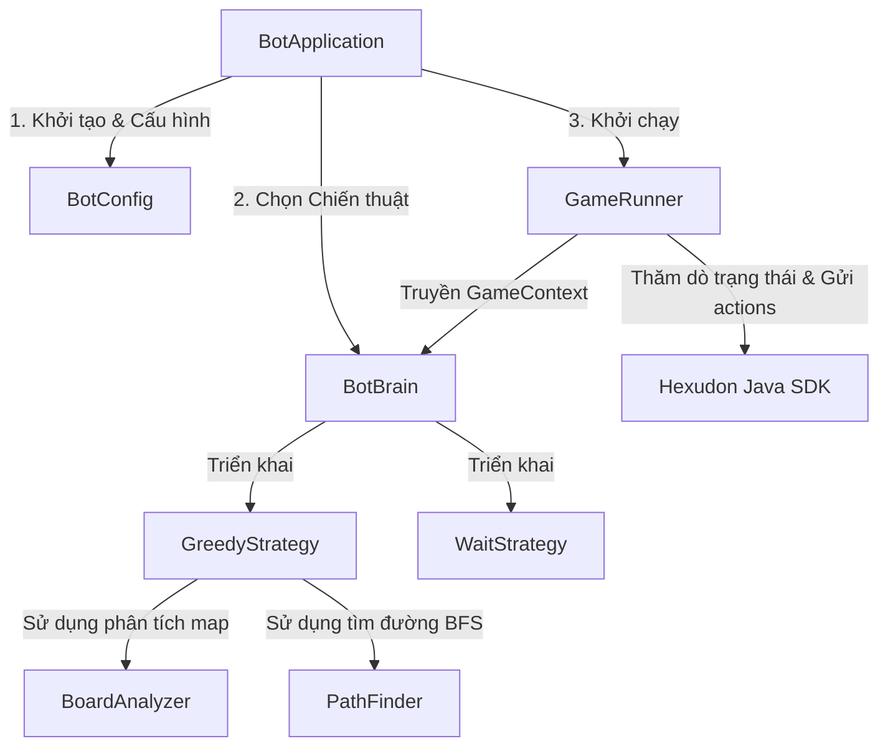

# Hexudon Bot Application

Module `bot` là một ứng dụng tác tử mẫu hoàn chỉnh được thiết kế để tự động tham gia, theo dõi trạng thái trận đấu và gửi danh sách hành động tới **Hexudon Game Server**. Module này sử dụng thư viện **Hexudon Java SDK** để che giấu các kết nối HTTP thô, giúp lập trình viên tập trung phát triển các chiến thuật AI (`BotBrain`).

---

## 1. Yêu cầu hệ thống & Cài đặt

### Yêu cầu môi trường
* **Java Version**: JDK 21 hoặc cao hơn.
* **Build Tool**: Maven 3.9.x hoặc cao hơn.

### Cấu hình Dependency
Module `bot` kế thừa cấu hình từ dự án Maven parent và phụ thuộc trực tiếp vào module SDK:
```xml
<dependency>
    <groupId>com.naprock</groupId>
    <artifactId>hexudon-sdk</artifactId>
</dependency>
```

---

## 2. Kiến trúc & Cấu trúc Package

Ứng dụng bot được thiết kế với sự phân tách rõ ràng giữa lớp mạng/giao tiếp (OkHttp thông qua Java SDK) và lớp logic AI quyết định hành động.



### Cấu trúc thư mục mã nguồn
```text
com.naprock
├── Main.java              # Điểm khởi chạy cũ (Legacy entry point) để tương thích IDE
└── hexudon.bot
    ├── BotApplication.java # Điểm khởi chạy chính của ứng dụng bot
    ├── ai
    │   ├── BotBrain.java   # Interface định nghĩa hành vi quyết định của bot
    │   ├── GameContext.java# Snapshot trạng thái bất biến truyền cho BotBrain
    │   └── strategy
    │       ├── GreedyStrategy.java # Chiến thuật BFS tối ưu hóa Udon và Refuel
    │       └── WaitStrategy.java   # Chiến thuật fallback yêu cầu đứng yên
    ├── config
    │   └── BotConfig.java  # Đọc cấu hình từ Properties, biến môi trường hoặc JVM System
    ├── exception
    │   └── BotException.java# Ngoại lệ cơ sở của ứng dụng bot
    ├── runner
    │   └── GameRunner.java # Điều phối vòng đời trận đấu, quản lý kết nối & polling
    └── util
        ├── BoardAnalyzer.java # Các hàm thuần túy phân tích bản đồ và tác tử
        └── PathFinder.java # Giải thuật BFS tìm đường đi trên lưới lục giác Odd-R offset
```

---

## 3. Luồng hoạt động chính (Activity Flow)

`GameRunner` quản lý toàn bộ chu trình sống của bot trong trận đấu theo các bước sau:

1. **Khởi tạo kết nối**: Tạo instance `HexudonClient` thông qua SDK.
2. **Đăng ký Tác tử (Agent Registration)**:
   - Thăm dò số lượng slot tác tử của trận đấu dựa trên `agentsStartPos` trong cấu hình trận đấu.
   - Gửi đăng ký danh sách loại tác tử (`TeamRegistration`) lên server. Mặc định sử dụng tỷ lệ **2 PATROL + 1 REFUEL** (lặp lại tuần hoàn nếu số tác tử nhiều hơn).
3. **Tải cấu hình tĩnh**: Lấy thông tin bản đồ, danh sách ô Spot tài nguyên.
4. **Vòng lặp ngày đấu (Game Loop)**:
   - Polling trạng thái trận đấu liên tục sau mỗi khoảng thời gian `BOT_POLL_DELAY_MS`.
   - Nếu trạng thái là `WAITING`: Chờ trận đấu bắt đầu.
   - Nếu trạng thái là `FINISHED`: In kết quả bảng xếp hạng chung cuộc và thoát.
   - Nếu trạng thái là `PLAYING` và bắt đầu ngày mới (lượt mới):
     - Tạo `GameContext` chứa dữ liệu cấu hình bản đồ tĩnh và trạng thái động hiện tại.
     - Gọi `BotBrain.decide(context)` để tính toán chuỗi hành động tối ưu cho tất cả Agent của đội.
     - Gửi danh sách hành động vừa tính toán (`SubmitActions`) lên server.
     - Đợi lượt tiếp theo.

---

## 4. Cách Bot sử dụng SDK

Bot tương tác với Game Server thông qua các API được đóng gói sẵn của SDK:
* **Khởi tạo**: Sử dụng `HexudonClient.builder()` để cấu hình URL, token và teamId.
* **Đăng ký Agent**: `GameApi.registerAgentTypes(gameId, registration)`.
* **Lấy cấu hình bản đồ**: `GameApi.getMatchConfig(gameId)`.
* **Lấy trạng thái**: `GameApi.getMatchState(gameId)`.
* **Nộp hành động**: `GameApi.submitActions(gameId, submission)`.
* **Nhận kết quả chung cuộc**: `GameApi.getGameResult(gameId)`.

---

## 5. Chiến thuật AI (`BotBrain`)

Mỗi chiến thuật implement interface `BotBrain` nhận `GameContext` bất biến và trả về danh sách chuỗi hành động `List<List<GameAction>>` tương ứng với từng tác tử trong đội (được sắp xếp theo chỉ số tác tử của đội).

### 5.1. Chiến thuật Greedy (`GreedyStrategy` - Mặc định)
Sử dụng tìm đường BFS để tối ưu hóa nhiệm vụ thu thập và sạc xăng:
* **Tác tử tuần tra (PATROL)**:
  - Nếu đứng sẵn trên một ô `Spot` còn mì Udon: Chọn hành động chờ (`WaitAction(1)`) để thu hoạch mì.
  - Ngược lại: Tìm ô `Spot` còn mì gần nhất (khoảng cách lục giác ngắn nhất). Tính đường đi ngắn nhất bằng `PathFinder` (BFS) để đi đến đó, chuyển đổi thành danh sách `MoveAction` và giới hạn tối đa theo bước đi cho phép của ngày (`daySteps`).
  - Nếu tất cả các ô Spot đã hết mì: Tìm ô Spot bất kỳ gần nhất để di chuyển đến và chờ đợi mì hồi lại.
* **Tác tử tiếp tế (REFUEL)**:
  - Xác định tác tử tuần tra (`PATROL`) đồng đội có lượng xăng thấp nhất.
  - Tính toán đường đi ngắn nhất bằng BFS để đi đến vị trí hiện tại của tác tử tuần tra đó.
  - Nếu đã đến cùng ô hoặc ô cạnh bên, thực hiện hành động chờ (`WaitAction(1)`) để kích hoạt cơ chế sạc xăng tự động của Server khi tác tử tiếp tế đứng cùng ô với tác tử tuần tra.

### 5.2. Chiến thuật Chờ đợi (`WaitStrategy` - Fallback)
* Yêu cầu tất cả các tác tử thực hiện hành động đứng yên 1 bước (`WaitAction(1)`).
* Được sử dụng như một giải pháp an toàn tự động kích hoạt khi chiến thuật chính xảy ra ngoại lệ không mong muốn để tránh việc bot bị đứng im hoàn toàn hoặc bị loại do không gửi hành động.

---

## 6. Hướng dẫn cấu hình

Ứng dụng bot cho phép cấu hình động tại thời điểm chạy mà không cần biên dịch lại mã nguồn.

### Thứ tự ưu tiên cấu hình
Khi lấy giá trị cho một tham số cấu hình, hệ thống sẽ kiểm tra theo thứ tự ưu tiên giảm dần:
1. **JVM System Property** (Ví dụ: `-DHEXUDON_TOKEN=...`)
2. **Biến môi trường (Environment Variable)** (Ví dụ: `HEXUDON_TOKEN`)
3. **Tệp cấu hình `bot.properties`** trong tài nguyên classpath.
4. **Giá trị mặc định** (nếu có).

### Danh sách các biến cấu hình

| Biến cấu hình / Thuộc tính | Kiểu dữ liệu | Bắt buộc | Giá trị mặc định | Mô tả |
| :--- | :--- | :---: | :--- | :--- |
| `HEXUDON_BASE_URL` | `String` | Không | `http://localhost:8080` | URL gốc của Hexudon Game Server. |
| `HEXUDON_TOKEN` | `String` | **Có** | *Không* | Token Bearer dùng để xác thực đội chơi. |
| `HEXUDON_TEAM_ID` | `String` | **Có** | *Không* | ID định danh của đội chơi (gửi qua Header `X-Team-Id`). |
| `HEXUDON_GAME_ID` | `String` | **Có** | *Không* | ID định danh của trận đấu mà bot sẽ tham gia. |
| `HEXUDON_PRACTICE` | `boolean` | Không | `false` | Bật/tắt chế độ luyện tập (Practice Mode). |
| `BOT_POLL_DELAY_MS` | `long` | Không | `1000` | Thời gian trễ giữa các lần thăm dò trạng thái trận đấu (mili-giây). |
| `BOT_DEBUG` | `String` | Không | *Không* | Nếu đặt là `true`, logger của bot sẽ ghi lại log chi tiết ở mức `FINE`. |

### Ví dụ file cấu hình `bot.properties`
Tạo file `bot/src/main/resources/bot.properties` dựa trên file mẫu `bot.properties.example`:
```properties
# Hexudon Server Configuration
HEXUDON_BASE_URL=http://localhost:8080
HEXUDON_TOKEN=YOUR_API_TOKEN

# Team Information
HEXUDON_TEAM_ID=YOUR_TEAM_ID
HEXUDON_GAME_ID=YOUR_GAME_ID

# Bot Parameters
HEXUDON_PRACTICE=false
BOT_POLL_DELAY_MS=1000
```

---

## 7. Biên dịch & Khởi chạy

### Biên dịch dự án
Từ thư mục gốc của repository, chạy lệnh Maven sau để build toàn bộ các module bao gồm cả `bot`:
```bash
mvn clean install
```

### Khởi chạy Bot
Để khởi chạy bot bằng Maven:
```bash
mvn exec:java -pl bot
```

Bạn cũng có thể truyền đè cấu hình thông qua tham số JVM:
```bash
mvn exec:java -pl bot -DHEXUDON_GAME_ID=another-game-uuid -DBOT_POLL_DELAY_MS=500
```
