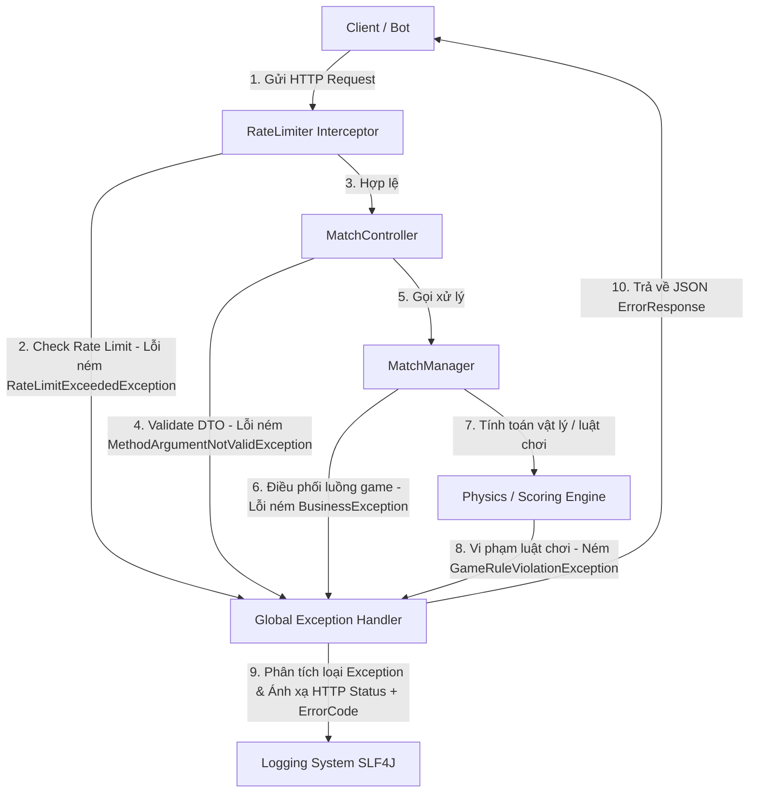

# Tài liệu Thiết kế Exception Handling - 01_PROJECT_OVERVIEW

## 1. Purpose (Mục đích)
Tài liệu này cung cấp cái nhìn tổng quan về kiến trúc xử lý ngoại lệ (Exception Handling) và quản lý lỗi (Error Management) trong dự án **HEXUDON Server**. Mục tiêu chính là thiết lập một cơ chế nhất quán, an toàn, dễ bảo trì và mở rộng để bắt các lỗi phát sinh trong hệ thống, chuyển đổi chúng thành các phản hồi HTTP chuẩn (HTTP Error Responses) nhằm hỗ trợ các Client (Bots, Web, Mobile) xử lý lỗi một cách rõ ràng và hiệu quả.

---

## 2. Scope (Phạm vi áp dụng)
Hệ thống xử lý ngoại lệ áp dụng cho toàn bộ các layer và module trong **HEXUDON Server**:
*   **REST API Layer (Controller & Interceptors)**: Bắt các lỗi định dạng request, lỗi ràng buộc dữ liệu (Validation), lỗi giới hạn tần suất (Rate Limiting).
*   **Business Orchestration Layer (Manager)**: Bắt các lỗi về trạng thái trận đấu (Match Lifecycle), lỗi điều phối luồng đi của game.
*   **Domain & Physics Engine Layer (Engine)**: Bắt các lỗi về luật chơi, mô phỏng di chuyển (Movement), năng lượng (Fuel), tính toán giao thông (Traffic) và điểm số (Scoring).
*   **Data Loader Layer (Loader)**: Bắt các lỗi trong quá trình khởi tạo cấu hình bản đồ và trận đấu từ file cấu hình.
*   **System Infrastructure Layer (Config, Utils)**: Các lỗi kết nối cơ sở dữ liệu (nếu có), lỗi phân tích cú pháp JSON, và các lỗi hệ thống không xác định khác.

---

## 3. Responsibilities (Trách nhiệm của Module Exception)
*   **Phân loại lỗi rõ ràng**: Tách biệt hoàn toàn lỗi do nghiệp vụ (Business Errors - do Client vi phạm luật chơi hoặc gửi yêu cầu sai) và lỗi do hệ thống (System Errors - lỗi server, lỗi IO, NullPointer, cơ sở dữ liệu).
*   **Chuẩn hóa dữ liệu lỗi trả về**: Định dạng mọi lỗi về một cấu trúc JSON duy nhất (`ErrorResponse`) để Client dễ dàng bóc tách thông tin.
*   **Ánh xạ mã trạng thái HTTP thích hợp**: Đảm bảo lỗi nghiệp vụ trả đúng mã `4xx`, lỗi hệ thống trả mã `5xx`.
*   **Bảo mật thông tin hệ thống**: Ngăn chặn rò rỉ stacktrace, tên package, cấu trúc bảng dữ liệu hoặc các thông báo lỗi nhạy cảm ra ngoài môi trường Production.
*   **Ghi nhận nhật ký (Logging) tập trung**: Log đầy đủ các thông tin cần thiết phục vụ debug tại server mà không làm rác file log hoặc gây suy giảm hiệu năng do in stacktrace bừa bãi.

---

## 4. Design Goals (Mục tiêu thiết kế)
*   **Uniformity (Tính thống nhất)**: Toàn bộ hệ thống chỉ sử dụng một Global Exception Handler duy nhất để xử lý lỗi REST API.
*   **Extensibility (Tính mở rộng)**: Việc thêm một lỗi nghiệp vụ mới chỉ cần định nghĩa một Exception con và thêm mã ErrorCode mới mà không làm ảnh hưởng đến code xử lý chung.
*   **Clean Architecture Compliance (Tuân thủ Clean Architecture)**: Lớp Core Logic/Engine không bị phụ thuộc vào các thư viện Web hay HTTP Status của Spring MVC. Nó chỉ ném ra các Business Exceptions thuần Java.
*   **REST Compliance (Tuân thủ chuẩn REST)**: Sử dụng chính xác HTTP Status Codes (400, 403, 404, 429, 500) kết hợp với Custom Error Code trong Response Body.

---

## 5. Dependencies (Các thành phần phụ thuộc)
Hệ thống xử lý lỗi phụ thuộc vào các thư viện và module sau:
*   **Java Development Kit (JDK) 21**: Sử dụng các tính năng hiện đại như Records, Pattern Matching.
*   **Spring Boot Web Starter (3.x)**: Sử dụng các annotation `@RestControllerAdvice`, `@ExceptionHandler` để bắt lỗi tập trung.
*   **Spring Boot Validation Starter**: Sử dụng Hibernate Validator để bắt các ràng buộc dữ liệu đầu vào (`@NotNull`, `@Min`, `@NotBlank`).
*   **SLF4J & Logback**: Thư viện logging mặc định của Spring Boot phục vụ ghi vết lỗi.

---

## 6. Related Modules & Relationship (Mối quan hệ với các tài liệu khác)
*   Liên quan đến **[ARCHITECTURE.md](file:///d:/Documents/GitHub/hexudon/docs/ARCHITECTURE.md)** (nếu có): Định rõ kiến trúc phân lớp, nơi mà các exception được ném từ Domain layer và bắt ở Controller/Web layer.
*   Liên quan đến **[API_REFERENCE.md](file:///d:/Documents/GitHub/hexudon/docs/API_REFERENCE.md)**: Định nghĩa cấu trúc lỗi mà client nhận được khi gọi các API `/register`, `/start`, `/actions`.
*   Mối quan hệ với các tài liệu Exception Handling khác:
    *   **[02_PACKAGE_STRUCTURE.md](file:///d:/Documents/GitHub/hexudon/docs/02_PACKAGE_STRUCTURE.md)**: Xác định vị trí lưu trữ các file class exception.
    *   **[05_EXCEPTION_HIERARCHY.md](file:///d:/Documents/GitHub/hexudon/docs/05_EXCEPTION_HIERARCHY.md)**: Xác định sơ đồ kế thừa các lớp lỗi.
    *   **[06_ERROR_CODE_DESIGN.md](file:///d:/Documents/GitHub/hexudon/docs/06_ERROR_CODE_DESIGN.md)**: Bảng mã lỗi chi tiết.
    *   **[07_ERROR_RESPONSE_DESIGN.md](file:///d:/Documents/GitHub/hexudon/docs/07_ERROR_RESPONSE_DESIGN.md)**: Thiết kế chi tiết cấu trúc JSON trả về.

---

## 7. Terminology (Thuật ngữ)
*   **Global Exception Handler**: Bộ xử lý ngoại lệ tập trung, tự động bắt tất cả các Exception được ném từ bất kỳ Controller nào trong hệ thống.
*   **Business Exception (Ngoại lệ nghiệp vụ)**: Lỗi xảy ra do vi phạm quy tắc logic hoặc luật chơi của hệ thống (ví dụ: Agent di chuyển vào ô Hồ Nước, Agent hết nhiên liệu).
*   **System Exception (Ngoại lệ hệ thống)**: Lỗi phát sinh từ hạ tầng vật lý hoặc lỗi lập trình không mong muốn (ví dụ: mất kết nối Database, NullPointerException).
*   **Error Code**: Một chuỗi ký tự duy nhất (như `MATCH_ALREADY_STARTED`) giúp Client xác định chính xác nguyên nhân lỗi mà không phụ thuộc vào thông báo bằng ngôn ngữ tự nhiên.

---

## 8. Design Principles (Nguyên tắc thiết kế)
1.  **Fail-Fast (Thất bại sớm)**: Kiểm tra tính hợp lệ của dữ liệu đầu vào ngay tại Controller bằng Bean Validation. Nếu lỗi, từ chối xử lý ngay lập tức để tiết kiệm tài nguyên hệ thống.
2.  **Clean Separation (Tách biệt sạch sẽ)**: Engine và Model không được import các class liên quan đến HTTP (như `HttpStatus`, `ResponseEntity`). Chúng chỉ được ném các Business Exception kế thừa từ `RuntimeException`. Việc ánh xạ sang HTTP Status thuộc trách nhiệm của lớp Global Exception Handler.
3.  **Encapsulation (Đóng gói)**: Giấu kín các lỗi chi tiết của hệ thống (như SQL Syntax, stacktrace) trong log nội bộ và chỉ trả về mã lỗi chung `INTERNAL_SERVER_ERROR` cho người dùng cuối.

---

## 9. Architecture Overview & Sơ đồ tổng quan
Khi một request được gửi tới hệ thống, chu kỳ xử lý lỗi diễn ra như sau:



---

## 10. Core Workflow (Quy trình xử lý lỗi chuẩn)
1.  **Giai đoạn Phát sinh (Detection)**: Một lớp nghiệp vụ phát hiện trạng thái không hợp lệ. Ví dụ: `MovementSimulator` kiểm tra thấy Agent `A1` muốn di chuyển vào cell loại `POND`. Nó lập tức khởi tạo và ném `GameRuleViolationException("INVALID_TARGET_TERRAIN", "Cannot move agent onto pond cell.")`.
2.  **Giai đoạn Lan truyền (Bubbling)**: Exception truyền ngược từ Engine -> Manager -> Controller. Do không có block `try-catch` cục bộ nào bắt nó, Spring MVC chuyển quyền kiểm soát tới bộ xử lý ngoại lệ tập trung.
3.  **Giai đoạn Đón bắt (Handling)**: `GlobalExceptionHandler` bắt được `GameRuleViolationException`. Nó:
    *   Trích xuất mã lỗi `INVALID_TARGET_TERRAIN`.
    *   Tạo đối tượng `ErrorResponse` chứa mã lỗi, thông báo lỗi nghiệp vụ và thời gian hiện tại.
    *   Ghi một dòng log ở level `WARN` (không ghi stacktrace vì đây là lỗi nghiệp vụ bình thường).
4.  **Giai đoạn Phản hồi (Responding)**: Trả về client response với HTTP Status `400 Bad Request` và JSON body chứa thông tin chi tiết lỗi nghiệp vụ.

---

## 11. Example (Ví dụ thực tế)
### Kịch bản: Client cố đăng ký một đội chơi mới khi trận đấu đã bắt đầu.
1.  `MatchManager` nhận request đăng ký đội "TeamBeta".
2.  `MatchManager` kiểm tra thấy trạng thái trận đấu hiện tại là `PLAYING` thay vì `WAITING`.
3.  `MatchManager` ném lỗi:
    ```java
    throw new GameRuleViolationException("MATCH_ALREADY_STARTED", "Cannot register a new team while the match is in PLAYING state.");
    ```
4.  `GlobalExceptionHandler` bắt được lỗi, log thông tin và trả về client:
    *   **HTTP Status**: `400 Bad Request`
    *   **Response Body**:
        ```json
        {
          "errorCode": "MATCH_ALREADY_STARTED",
          "message": "Cannot register a new team while the match is in PLAYING state.",
          "timestamp": 1720516800000
        }
        ```

---

## 12. Best Practices (Thực hành tốt nhất)
*   Luôn kế thừa các ngoại lệ tự định nghĩa từ `RuntimeException` (Unchecked Exception).
*   Không bao giờ nuốt ngoại lệ (empty catch block) mà không log hoặc xử lý lại.
*   Đặt tên Exception kết thúc bằng hậu tố `Exception` (ví dụ: `ConfigLoadException`).
*   Nhất quán trong cách đặt tên mã lỗi ErrorCode (sử dụng SNAKE_CASE, chữ hoa, ví dụ: `RATE_LIMIT_EXCEEDED`).

---

## 13. Common Mistakes (Sai lầm thường gặp)
*   **Log and Throw**: Vừa ghi log lỗi chi tiết tại Engine rồi lại ném tiếp Exception lên Controller để Global Exception Handler ghi log thêm lần nữa. Điều này làm log file phình to và trùng lặp thông tin.
*   **Exposing System Internals**: Trả về trực tiếp thông báo lỗi SQL của JDBC cho client. Điều này để lộ tên cột, tên bảng và thông tin cấu trúc cơ sở dữ liệu cho kẻ tấn công tận dụng khai thác.
*   **Http Status 200 with Error Response**: Luôn trả về HTTP 200 OK và chứa trạng thái thành công/thất bại bên trong JSON body. Cách thiết kế này vi phạm nghiêm trọng tiêu chuẩn REST API.

---

## 14. Future Extension (Khả năng mở rộng trong tương lai)
*   **Hỗ trợ đa ngôn ngữ (Localization - i18n)**: Sử dụng Spring `MessageSource` để chuyển dịch thông điệp `message` trong `ErrorResponse` dựa trên Header `Accept-Language` gửi lên từ Client.
*   **Hỗ trợ WebSockets**: Thiết kế lớp xử lý lỗi riêng cho các kết nối thời gian thực khi dự án chuyển dịch từ REST API sang giao tiếp qua WebSocket Protocol, ánh xạ các exception thành các frame WebSocket Error dạng JSON gửi về Client.
