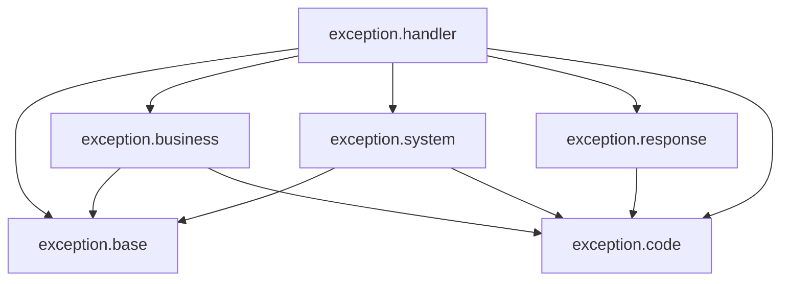

# Tài liệu Thiết kế Exception Handling - 02_PACKAGE_STRUCTURE

## 1. Purpose (Mục đích)
Tài liệu này định nghĩa cấu trúc gói (Package Structure) cho phân hệ Exception Handling của dự án **HEXUDON Server**. Thiết kế này nhằm đảm bảo tính phân tách trách nhiệm (Separation of Concerns), tuân thủ nguyên tắc Clean Architecture (nơi các exception nghiệp vụ không bị phụ thuộc vào Web Framework) và tối ưu hóa việc quản lý mã nguồn.

---

## 2. Scope (Phạm vi)
Áp dụng đối với toàn bộ các class ngoại lệ, các lớp xử lý lỗi tập trung, cấu trúc phản hồi lỗi, và các enum mã lỗi nằm trong gói cơ sở `com.naprock.hexudon.exception`.

---

## 3. Design Goals (Mục tiêu thiết kế)
*   **Decoupling (Khử liên kết)**: Các exception nghiệp vụ thuộc tầng Core/Domain phải tách biệt khỏi Spring Framework (như HTTP Status hay Controller annotations).
*   **Cohesion (Tính đồng kết)**: Gom nhóm các lớp có cùng mục đích sử dụng (như các exception nghiệp vụ của game, các exception liên quan cấu hình hệ thống, bộ bắt lỗi tập trung).
*   **Strict Dependency Rules (Quy tắc phụ thuộc nghiêm ngặt)**: Xác định rõ ràng chiều phụ thuộc giữa các package để tránh hiện tượng vòng lặp phụ thuộc (circular dependency).

---

## 4. Package Tree (Cơ cấu thư mục gói)
Phân hệ Exception được tổ chức như sau:

```text
com.naprock.hexudon.exception/
│
├── base/
│   ├── BusinessException.java
│   └── SystemException.java
│
├── business/
│   ├── GameRuleViolationException.java
│   ├── MatchStateConflictException.java
│   ├── RateLimitExceededException.java
│   └── ResourceNotFoundException.java
│
├── system/
│   └── ConfigLoadException.java
│
├── handler/
│   └── GlobalExceptionHandler.java
│
├── response/
│   ├── ErrorResponse.java
│   └── ValidationErrorDetail.java
│
└── code/
    └── ErrorCode.java
```

---

## 5. Responsibilities of Sub-packages (Trách nhiệm của từng Package con)

| Package | Trách nhiệm chính |
| :--- | :--- |
| `base` | Chứa các exception gốc (Base Class Exceptions) làm nền tảng cho toàn bộ hệ thống. |
| `business` | Chứa các exception liên quan trực tiếp đến nghiệp vụ logic trò chơi và tương tác của người chơi. |
| `system` | Chứa các exception liên quan đến hạ tầng kỹ thuật, đọc file cấu hình, kết nối mạng. |
| `handler` | Chứa bộ xử lý trung tâm (Global Exception Handler) chịu trách nhiệm bắt ngoại lệ và định dạng response. |
| `response` | Chứa cấu trúc DTO đại diện cho dữ liệu lỗi được trả ra cho Client. |
| `code` | Chứa Enum định nghĩa tất cả mã lỗi nghiệp vụ của hệ thống. |

---

## 6. Dependency Rules (Quy tắc phụ thuộc)
Để tuân thủ Clean Architecture, chiều phụ thuộc của các gói phải tuân theo quy tắc: **Tầng ngoài phụ thuộc vào tầng trong, không có chiều ngược lại.**

*   `base` không phụ thuộc vào bất kỳ package con nào khác của `exception`.
*   `business` và `system` chỉ được phép kế thừa từ `base` và sử dụng `code`. Tuyệt đối không được import bất kỳ lớp nào từ `handler` hay `response`.
*   `code` là độc lập, không import bất cứ package nào khác trong gói exception.
*   `handler` là package ở lớp ngoài cùng (Web Layer). Nó được phép import tất cả các package khác (`base`, `business`, `system`, `response`, `code`) cùng các thư viện của Spring Framework.



---

## 7. Import & Visibility Rules (Quy tắc import và Tầm vực)
*   **Visibility**:
    *   Tất cả các exception cụ thể (`GameRuleViolationException`, `ConfigLoadException`, v.v.) phải để ở phạm vi `public` để các package khác như `engine`, `manager`, `loader` có thể ném được chúng.
    *   Các class trong `response` (`ErrorResponse`, `ValidationErrorDetail`) phải để ở phạm vi `public` để Jackson Object Mapper có thể serialize thành JSON.
*   **Import Restrictions**:
    *   Các package `base`, `business`, `system` **không được phép** import các thư viện của Spring MVC (như `org.springframework.web.bind.annotation.*` hoặc `org.springframework.http.HttpStatus`).
    *   Không viết logic xử lý HTTP bên trong các Business Exceptions.

---

## 8. Examples & Guideline (Hướng dẫn viết code mẫu)
Khi một nhà phát triển tạo một ngoại lệ mới liên quan đến việc không tìm thấy tài nguyên (ví dụ: Match ID không tồn tại):
1.  Tạo class `ResourceNotFoundException.java` nằm trong package `com.naprock.hexudon.exception.business`.
2.  Lớp này kế thừa từ `BusinessException` (nằm trong `base`).
3.  Khai báo thêm mã lỗi tương ứng `RESOURCE_NOT_FOUND` trong enum `ErrorCode` (nằm trong `code`).
4.  Cập nhật phương thức xử lý thích hợp trong `GlobalExceptionHandler` (nằm trong `handler`).

---

## 9. Common Mistakes (Sai lầm thường gặp)
*   Đặt trực tiếp tất cả các class ngoại lệ vào chung một thư mục `com.naprock.hexudon.exception` mà không phân chia thư mục con. Điều này khiến package bị phình to khi số lượng ngoại lệ tăng lên.
*   Để các class thuộc `business` import `ErrorResponse` hoặc `HttpStatus`. Lỗi này phá vỡ tính độc lập của tầng nghiệp vụ.
*   Import chéo vòng (ví dụ: một class trong `base` import ngược lại class trong `business`).

---

## 10. Future Extension (Mở rộng tương lai)
Nếu hệ thống tích hợp thêm cơ chế cơ sở dữ liệu (Database Layer), một package con mới tên là `com.naprock.hexudon.exception.database` hoặc `com.naprock.hexudon.exception.data` sẽ được tạo ra, kế thừa từ `SystemException` để gom nhóm các lỗi kết nối, lỗi ràng buộc khóa ngoại của DB độc lập với các lỗi logic game.
