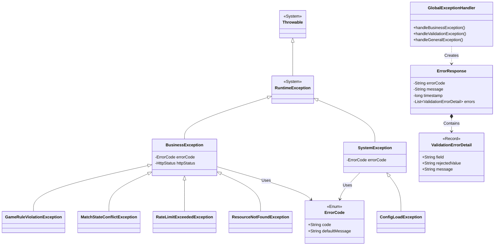

# Tài liệu Thiết kế Exception Handling - 03_CLASS_LIST

## 1. Purpose (Mục đích)
Tài liệu này cung cấp danh sách đầy đủ tất cả các Class, Record và Enum cần triển khai trong phân hệ Exception Handling của **HEXUDON Server**. Đây là bản danh mục tham chiếu nhanh giúp các lập trình viên biết được hệ thống có những cấu phần nào, vai trò và phạm vi hoạt động của từng cấu phần.

---

## 2. Scope (Phạm vi)
Bao gồm tất cả các Java files thuộc package `com.naprock.hexudon.exception` và các sub-packages của nó.

---

## 3. Related Modules (Các module liên quan)
Tất cả các package khác của hệ thống (`controller`, `manager`, `engine`, `loader`, `interceptor`) đều phụ thuộc vào danh sách class này để ném hoặc xử lý lỗi.

---

## 4. Class Catalog (Danh mục Class chi tiết)

Dưới đây là bảng thống kê toàn bộ các lớp trong module Exception:

| STT | Tên Class / Enum / Record | Thư mục Package | Trách nhiệm chính | Dependencies chính | Đối tượng sử dụng |
| :--- | :--- | :--- | :--- | :--- | :--- |
| 1 | `BusinessException` | `exception.base` | Class cha của mọi ngoại lệ nghiệp vụ. Chứa `ErrorCode` và `HttpStatus`. | `RuntimeException`, `ErrorCode` | Toàn bộ server (ngoại trừ Loader) |
| 2 | `SystemException` | `exception.base` | Class cha của mọi ngoại lệ kỹ thuật/hệ thống. | `RuntimeException`, `ErrorCode` | Infrastructure layers |
| 3 | `ErrorCode` | `exception.code` | Enum chứa danh sách tất cả mã lỗi và mô tả lỗi mặc định. | Không có | Mọi class trong hệ thống |
| 4 | `ErrorResponse` | `exception.response` | DTO định dạng JSON trả về cho Client khi có lỗi. | `ValidationErrorDetail` | `GlobalExceptionHandler` |
| 5 | `ValidationErrorDetail` | `exception.response` | Record mô tả chi tiết lỗi validation trên từng trường dữ liệu. | Không có | `ErrorResponse`, `GlobalExceptionHandler` |
| 6 | `GameRuleViolationException`| `exception.business`| Ném ra khi Agent gửi hành động trái luật (đi vào Pond, đi chéo, thiếu fuel...). | `BusinessException` | `engine`, `manager` |
| 7 | `MatchStateConflictException`| `exception.business`| Ném ra khi thao tác không khớp trạng thái trận đấu (ví dụ: gửi action khi match WAITING). | `BusinessException` | `manager`, `controller` |
| 8 | `RateLimitExceededException`| `exception.business`| Ném ra khi một Team vượt quá tần suất request cho phép. | `BusinessException` | `interceptor` |
| 9 | `ResourceNotFoundException` | `exception.business`| Ném ra khi tìm Team, Agent, Cell hoặc Match không tồn tại. | `BusinessException` | `manager`, `controller` |
| 10| `ConfigLoadException` | `exception.system` | Ném ra khi load file cấu hình bản đồ `match_config.txt` bị lỗi cú pháp/không tìm thấy. | `SystemException` | `loader` |
| 11| `GlobalExceptionHandler` | `exception.handler`| Class gom bắt mọi exception toàn cục, ánh xạ sang HTTP Status và trả về JSON. | Spring Web, `ErrorResponse`, các exception cụ thể | Spring Container |

---

## 5. Class Relationships (Sơ đồ quan hệ lớp)

Sơ đồ Mermaid dưới đây biểu diễn mối quan hệ giữa các lớp trong hệ thống:

---

## 6. Usage Guidelines (Nguyên tắc sử dụng)
*   **Khi kiểm tra luật chơi (Ví dụ: `MovementSimulator`)**:
    *   Nếu hành động di chuyển không hợp lệ -> Ném `GameRuleViolationException`.
*   **Khi tìm kiếm thực thể (Ví dụ: `MatchManager.getAgentById`)**:
    *   Nếu không tìm thấy ID -> Ném `ResourceNotFoundException`.
*   **Khi chặn Spam (Ví dụ: `RateLimiterInterceptor`)**:
    *   Nếu vượt rate limit -> Ném `RateLimitExceededException`.
*   **Khi tải file cấu hình (Ví dụ: `MatchConfigLoader`)**:
    *   Nếu file cấu hình lỗi -> Ném `ConfigLoadException`.
*   **Spring Boot Framework**:
    *   Tự động phát hiện `GlobalExceptionHandler` và chuyển hướng tất cả các exception chưa bắt (uncaught exceptions) về đây.

---

## 7. Common Mistakes (Sai lầm thường gặp)
*   **Sử dụng sai Class lỗi**: Ném `GameRuleViolationException` cho một lỗi không tìm thấy Team (lẽ ra phải dùng `ResourceNotFoundException`).
*   **Bỏ qua lớp base**: Định nghĩa một exception mới nhưng lại kế thừa trực tiếp từ `RuntimeException` thay vì `BusinessException` hoặc `SystemException`, dẫn đến việc `GlobalExceptionHandler` phải xử lý nó như một ngoại lệ hệ thống không xác định.
*   **Tạo class trùng lặp**: Tạo ra các Exception quá vụn vặt (như `AgentNotFoundException`, `TeamNotFoundException`) trong khi có thể gộp chung vào `ResourceNotFoundException` bằng cách truyền thông điệp thích hợp.

---

## 8. Future Extension (Khả năng mở rộng)
Khi bổ sung các tính năng nâng cao (như Authentication/Authorization cho Admin), ta chỉ cần định nghĩa thêm `UnauthorizedException` hoặc `ForbiddenException` kế thừa từ `BusinessException` trong package `business` mà không cần cấu trúc lại toàn bộ hệ thống lớp hiện tại.
