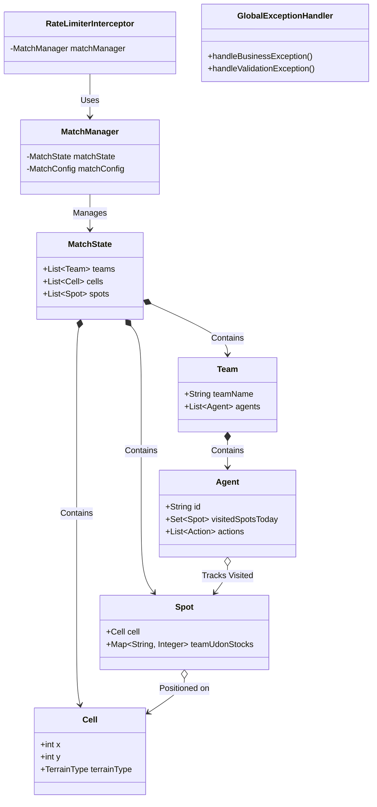

# Tài liệu Thiết kế Exception Handling - 04_CLASS_SPECIFICATIONS (Cập nhật)

Tài liệu này đặc tả chi tiết thiết kế kỹ thuật của tất cả các lớp (classes, records, enums) tham gia vào hệ thống xử lý ngoại lệ và quản lý lỗi của **HEXUDON Server**, được cập nhật để phản ánh chính xác kế hoạch triển khai tại **BUILD_ORDER.md**.

---

# Danh sách Class Đặc tả
1. [com.naprock.hexudon.exception.code.ErrorCode](#1-comnaprockhexudonexceptioncodeerrorcode-enum)
2. [com.naprock.hexudon.exception.base.BusinessException](#2-comnaprockhexudonexceptionbasebusinessexception)
3. [com.naprock.hexudon.exception.base.SystemException](#3-comnaprockhexudonexceptionbasesystemexception)
4. [com.naprock.hexudon.exception.business.ResourceNotFoundException](#4-comnaprockhexudonexceptionbusinessresourcenotfoundexception)
5. [com.naprock.hexudon.exception.business.MatchStateConflictException](#5-comnaprockhexudonexceptionbusinessmatchstateconflictexception)
6. [com.naprock.hexudon.exception.business.GameRuleViolationException](#6-comnaprockhexudonexceptionbusinessgameruleviolationexception)
7. [com.naprock.hexudon.exception.business.RateLimitExceededException](#7-comnaprockhexudonexceptionbusinessratelimitexceededexception)
8. [com.naprock.hexudon.exception.system.ConfigLoadException](#8-comnaprockhexudonexceptionsystemconfigloadexception)
9. [com.naprock.hexudon.exception.response.ErrorResponse](#9-comnaprockhexudonexceptionresponseerrorresponse)
10. [com.naprock.hexudon.exception.response.ValidationErrorDetail](#10-comnaprockhexudonexceptionresponsevalidationerrordetail-record)
11. [com.naprock.hexudon.exception.handler.GlobalExceptionHandler](#11-comnaprockhexudonexceptionhandlerglobalexceptionhandler)
12. [com.naprock.hexudon.model.Spot](#12-comnaprockhexudonmodelspot)
13. [com.naprock.hexudon.model.Agent](#13-comnaprockhexudonmodelagent)
14. [com.naprock.hexudon.model.Team](#14-comnaprockhexudonmodelteam)
15. [com.naprock.hexudon.model.MatchState](#15-comnaprockhexudonmodelmatchstate)
16. [com.naprock.hexudon.engine.ActionValidatorEngine](#16-comnaprockhexudonengineactionvalidatorengine)
17. [com.naprock.hexudon.engine.MovementSimulator](#17-comnaprockhexudonenginemovementsimulator)
18. [com.naprock.hexudon.engine.UdonCollectionEngine](#18-comnaprockhexudonengineudoncollectionengine)
19. [com.naprock.hexudon.manager.MatchManager](#19-comnaprockhexudonmanagermatchmanager)
20. [com.naprock.hexudon.interceptor.RateLimiterInterceptor](#20-comnaprockhexudoninterceptorratelimiterinterceptor)

---

## 1. com.naprock.hexudon.exception.code.ErrorCode (Enum)

### 1.1. Tổng quan
*   **Package**: `com.naprock.hexudon.exception.code`
*   **Vai trò**: Enum định nghĩa tập trung tất cả mã lỗi nghiệp vụ và hệ thống.
*   **Trách nhiệm**: Lưu trữ mã định danh dạng chuỗi và thông điệp tiếng Anh mặc định cho từng loại lỗi.
*   **Phạm vi sử dụng**: Sử dụng toàn hệ thống bởi các Exception, DTO Response, và GlobalExceptionHandler.
*   **Quan hệ với các class khác**: Được tham chiếu bởi `BusinessException`, `SystemException`, `ErrorResponse`, và `GlobalExceptionHandler`.

### 1.2. Thuộc tính
| Tên | Kiểu | Mô tả | Giá trị mặc định | Bắt buộc |
| :--- | :--- | :--- | :--- | :--- |
| `code` | String | Mã định danh lỗi dạng chuỗi (UPPER_SNAKE_CASE) | null | Có |
| `defaultMessage` | String | Thông điệp mô tả lỗi tiếng Anh mặc định | null | Có |

### 1.3. Constructor
*   `private ErrorCode(String code, String defaultMessage)`: Hàm khởi tạo nội bộ để gán mã lỗi và thông điệp mặc định cho từng phần tử enum.

### 1.4. Getter / Setter
*   `public String getCode()`: Lấy mã lỗi.
*   `public String getDefaultMessage()`: Lấy thông điệp mặc định.
*   *(Không có Setter vì Enum là bất biến - immutable)*

### 1.5. Phương thức
Không có phương thức logic phức tạp.

### 1.6. Quan hệ
*   `ErrorCode` là kiểu dữ liệu thuộc tính của `BusinessException` và `SystemException`.

### 1.7. Ghi chú triển khai
*   Đảm bảo toàn bộ 20 mã lỗi được khai báo chính xác theo cấu hình tại `BUILD_ORDER.md`.

---

## 2. com.naprock.hexudon.exception.base.BusinessException

### 2.1. Tổng quan
*   **Package**: `com.naprock.hexudon.exception.base`
*   **Vai trò**: Lớp ngoại lệ cơ sở (Base Class) cho các lỗi nghiệp vụ.
*   **Trách nhiệm**: Đóng gói mã lỗi `ErrorCode` và HTTP status tương ứng cho các lỗi nghiệp vụ.
*   **Phạm vi sử dụng**: Được kế thừa bởi các exception nghiệp vụ cụ thể.
*   **Quan hệ với các class khác**: Kế thừa `RuntimeException`, chứa `ErrorCode`.

### 2.2. Thuộc tính
| Tên | Kiểu | Mô tả | Giá trị mặc định | Bắt buộc |
| :--- | :--- | :--- | :--- | :--- |
| `errorCode` | ErrorCode | Enum mã lỗi nghiệp vụ | null | Có |
| `status` | int | Mã trạng thái HTTP (ví dụ: 400, 404) | 400 | Có |

### 2.3. Constructor
*   `public BusinessException(ErrorCode errorCode, int status, String message)`: Khởi tạo ngoại lệ với mã lỗi, HTTP status và thông điệp.
*   `public BusinessException(ErrorCode errorCode, int status, String message, Throwable cause)`: Khởi tạo ngoại lệ kèm nguyên nhân gốc.

### 2.4. Getter / Setter
*   `public ErrorCode getErrorCode()`: Getter cho errorCode.
*   `public int getStatus()`: Getter cho HTTP status.
*   *(Không có Setter để đảm bảo trạng thái Exception không bị thay đổi sau khi ném)*

### 2.5. Phương thức
Không có phương thức nghiệp vụ.

### 2.6. Quan hệ
*   Kế thừa `RuntimeException`.
*   Là cha của các exception trong package `com.naprock.hexudon.exception.business`.

### 2.7. Ghi chú triển khai
*   Không được import các thư viện của Spring Web (như `HttpStatus`) để giữ sự tách biệt cho tầng core.

---

## 3. com.naprock.hexudon.exception.base.SystemException

### 3.1. Tổng quan
*   **Package**: `com.naprock.hexudon.exception.base`
*   **Vai trò**: Lớp ngoại lệ cơ sở cho các lỗi hệ thống kỹ thuật.
*   **Trách nhiệm**: Đóng gói mã lỗi hệ thống (mặc định `INTERNAL_SERVER_ERROR`).
*   **Phạm vi sử dụng**: Được kế thừa bởi các exception hệ thống cụ thể.
*   **Quan hệ với các class khác**: Kế thừa `RuntimeException`, chứa `ErrorCode`.

### 3.2. Thuộc tính
| Tên | Kiểu | Mô tả | Giá trị mặc định | Bắt buộc |
| :--- | :--- | :--- | :--- | :--- |
| `errorCode` | ErrorCode | Enum mã lỗi hệ thống | `ErrorCode.INTERNAL_SERVER_ERROR` | Có |

### 3.3. Constructor
*   `public SystemException(ErrorCode errorCode, String message)`: Khởi tạo lỗi hệ thống.
*   `public SystemException(ErrorCode errorCode, String message, Throwable cause)`: Khởi tạo lỗi kèm nguyên nhân gốc.

### 3.4. Getter / Setter
*   `public ErrorCode getErrorCode()`: Getter cho errorCode.

### 3.5. Phương thức
Không có phương thức nghiệp vụ.

### 3.6. Quan hệ
*   Là cha của các exception trong package `com.naprock.hexudon.exception.system`.

### 3.7. Ghi chú triển khai
*   Được sử dụng cho các lỗi không thể tự phục hồi do hạ tầng gây ra.

---

## 4. com.naprock.hexudon.exception.business.ResourceNotFoundException

### 4.1. Tổng quan
*   **Package**: `com.naprock.hexudon.exception.business`
*   **Vai trò**: Ngoại lệ khi không tìm thấy tài nguyên.
*   **Trách nhiệm**: Báo lỗi khi thực thể (Team, Agent, Cell) không tồn tại.
*   **Phạm vi sử dụng**: Sử dụng ở Model, Manager, Interceptor khi truy vấn thực thể null.
*   **Quan hệ với các class khác**: Kế thừa `BusinessException`.

### 4.2. Thuộc tính
*   Kế thừa toàn bộ thuộc tính từ `BusinessException`.

### 4.3. Constructor
*   `public ResourceNotFoundException(ErrorCode errorCode, String message)`: Thiết lập status mặc định là `404`.
*   `public ResourceNotFoundException(ErrorCode errorCode, String message, Throwable cause)`: Thiết lập status mặc định là `404`.

### 4.4. Getter / Setter
*   Kế thừa từ `BusinessException`.

### 4.5. Phương thức
Không có.

### 4.6. Quan hệ
*   Kế thừa `BusinessException`.

### 4.7. Ghi chú triển khai
*   Luôn ném lỗi này kèm mã lỗi cụ thể (như `TEAM_NOT_FOUND` hoặc `AGENT_NOT_FOUND`).

---

## 5. com.naprock.hexudon.exception.business.MatchStateConflictException

### 5.1. Tổng quan
*   **Package**: `com.naprock.hexudon.exception.business`
*   **Vai trò**: Ngoại lệ xung đột trạng thái trận đấu.
*   **Trách nhiệm**: Báo lỗi khi thao tác sai thời điểm vòng đời trận đấu (Match Lifecycle).
*   **Phạm vi sử dụng**: Sử dụng bởi `MatchState` và `MatchManager`.
*   **Quan hệ với các class khác**: Kế thừa `BusinessException`.

### 5.2. Thuộc tính
*   Kế thừa thuộc tính từ `BusinessException`.

### 5.3. Constructor
*   `public MatchStateConflictException(ErrorCode errorCode, String message)`: Thiết lập status mặc định là `400`.
*   `public MatchStateConflictException(ErrorCode errorCode, String message, Throwable cause)`: Thiết lập status mặc định là `400`.

### 5.4. Getter / Setter
*   Kế thừa từ `BusinessException`.

### 5.5. Phương thức
Không có.

### 5.6. Quan hệ
*   Kế thừa `BusinessException`.

---

## 6. com.naprock.hexudon.exception.business.GameRuleViolationException

### 6.1. Tổng quan
*   **Package**: `com.naprock.hexudon.exception.business`
*   **Vai trò**: Ngoại lệ vi phạm luật chơi.
*   **Trách nhiệm**: Báo lỗi khi Agent hoặc Team gửi kế hoạch hành động trái quy tắc game.
*   **Phạm vi sử dụng**: Sử dụng bởi các Engine tính toán vật lý và luật chơi.
*   **Quan hệ với các class khác**: Kế thừa `BusinessException`.

### 6.2. Thuộc tính
*   Kế thừa thuộc tính từ `BusinessException`.

### 6.3. Constructor
*   `public GameRuleViolationException(ErrorCode errorCode, String message)`: Thiết lập status mặc định là `400`.
*   `public GameRuleViolationException(ErrorCode errorCode, String message, Throwable cause)`: Thiết lập status mặc định là `400`.

### 6.4. Getter / Setter
*   Kế thừa từ `BusinessException`.

### 6.5. Phương thức
Không có.

### 6.6. Quan hệ
*   Kế thừa `BusinessException`.

---

## 7. com.naprock.hexudon.exception.business.RateLimitExceededException

### 7.1. Tổng quan
*   **Package**: `com.naprock.hexudon.exception.business`
*   **Vai trò**: Ngoại lệ vượt quá giới hạn tần suất gửi yêu cầu.
*   **Trách nhiệm**: Báo lỗi chặn spam từ client.
*   **Phạm vi sử dụng**: Sử dụng trong `RateLimiterInterceptor`.
*   **Quan hệ với các class khác**: Kế thừa `BusinessException`.

### 7.2. Thuộc tính
*   Kế thừa thuộc tính từ `BusinessException`.

### 7.3. Constructor
*   `public RateLimitExceededException(String message)`: Thiết lập mã lỗi mặc định là `ErrorCode.RATE_LIMIT_EXCEEDED` và status `429`.
*   `public RateLimitExceededException(String message, Throwable cause)`: Thiết lập mã lỗi mặc định là `ErrorCode.RATE_LIMIT_EXCEEDED` và status `429`.

### 7.4. Getter / Setter
*   Kế thừa từ `BusinessException`.

### 7.5. Phương thức
Không có.

### 7.6. Quan hệ
*   Kế thừa `BusinessException`.

---

## 8. com.naprock.hexudon.exception.system.ConfigLoadException

### 8.1. Tổng quan
*   **Package**: `com.naprock.hexudon.exception.system`
*   **Vai trò**: Ngoại lệ lỗi nạp cấu hình hệ thống.
*   **Trách nhiệm**: Báo lỗi khi cấu hình game bị lỗi cú pháp hoặc không tìm thấy file cấu hình.
*   **Phạm vi sử dụng**: Sử dụng bởi `MatchConfigLoader` và `FileUtils`.
*   **Quan hệ với các class khác**: Kế thừa `SystemException`.

### 8.2. Thuộc tính
*   Kế thừa thuộc tính từ `SystemException`.

### 8.3. Constructor
*   `public ConfigLoadException(String message)`: Thiết lập mã lỗi mặc định là `ErrorCode.CONFIG_ERROR`.
*   `public ConfigLoadException(String message, Throwable cause)`: Thiết lập mã lỗi mặc định là `ErrorCode.CONFIG_ERROR`.

### 8.4. Getter / Setter
*   Kế thừa từ `SystemException`.

### 8.5. Phương thức
Không có.

### 8.6. Quan hệ
*   Kế thừa `SystemException`.

---

## 9. com.naprock.hexudon.exception.response.ErrorResponse

### 9.1. Tổng quan
*   **Package**: `com.naprock.hexudon.exception.response`
*   **Vai trò**: Đối tượng truyền dữ liệu (DTO) lỗi trả ra REST API.
*   **Trách nhiệm**: Chuẩn hóa cấu trúc JSON lỗi trả về cho client.
*   **Phạm vi sử dụng**: Được khởi tạo bởi `GlobalExceptionHandler`.
*   **Quan hệ với các class khác**: Chứa danh sách `ValidationErrorDetail`.

### 9.2. Thuộc tính
| Tên | Kiểu | Mô tả | Giá trị mặc định | Bắt buộc |
| :--- | :--- | :--- | :--- | :--- |
| `errorCode` | String | Chuỗi định danh mã lỗi | null | Có |
| `message` | String | Mô tả chi tiết lỗi | null | Có |
| `timestamp` | long | Thời gian xảy ra lỗi (Epoch ms) | `System.currentTimeMillis()` | Có |
| `errors` | List<ValidationErrorDetail> | Danh sách lỗi validation từng trường | null | Không |

### 9.3. Constructor
*   `public ErrorResponse()`: Constructor mặc định không tham số phục vụ Jackson.
*   `public ErrorResponse(String errorCode, String message, long timestamp)`: Constructor cho lỗi thông thường.
*   `public ErrorResponse(String errorCode, String message, long timestamp, List<ValidationErrorDetail> errors)`: Constructor đầy đủ hỗ trợ chứa danh sách lỗi Validation.

### 9.4. Getter / Setter
*   Cung cấp đầy đủ Getter và Setter cho các trường `errorCode`, `message`, `timestamp`, `errors`.

### 9.5. Phương thức
Không có phương thức logic nghiệp vụ.

### 9.6. Quan hệ
*   Chứa tập hợp (Composition) các `ValidationErrorDetail`.

### 9.7. Ghi chú triển khai
*   Cấu hình annotation `@JsonInclude(JsonInclude.Include.NON_NULL)` để Jackson tự động bỏ qua trường `errors` nếu giá trị của nó là null.

---

## 10. com.naprock.hexudon.exception.response.ValidationErrorDetail (Record)

### 10.1. Tổng quan
*   **Package**: `com.naprock.hexudon.exception.response`
*   **Vai trò**: DTO chi tiết lỗi validation từng trường dữ liệu.
*   **Trách nhiệm**: Biểu diễn thông tin về thuộc tính bị lỗi, giá trị bị từ chối và thông điệp lỗi.
*   **Phạm vi sử dụng**: Chứa trong `ErrorResponse` khi xảy ra lỗi validation DTO.
*   **Quan hệ với các class khác**: Được chứa trong mảng lỗi của `ErrorResponse`.

### 10.2. Thuộc tính (Record components)
| Tên | Kiểu | Mô tả | Giá trị mặc định | Bắt buộc |
| :--- | :--- | :--- | :--- | :--- |
| `field` | String | Đường dẫn thuộc tính bị lỗi | null | Có |
| `rejectedValue` | String | Giá trị sai bị client gửi lên | null | Không |
| `message` | String | Lý do vi phạm ràng buộc | null | Có |

### 10.3. Constructor
*   Sử dụng Constructor chuẩn mặc định (Canonical Constructor) của Java Record.

### 10.4. Getter / Setter
*   Sử dụng các getter tự động sinh của Java Record (`field()`, `rejectedValue()`, `message()`).
*   *(Không có Setter vì Record là bất biến - immutable)*

### 10.5. Phương thức
Không có.

### 10.6. Quan hệ
*   Được gom nhóm thành danh sách trong `ErrorResponse`.

---

## 11. com.naprock.hexudon.exception.handler.GlobalExceptionHandler

### 11.1. Tổng quan
*   **Package**: `com.naprock.hexudon.exception.handler`
*   **Vai trò**: Bộ điều phối lỗi tập trung toàn cục (Controller Advice).
*   **Trách nhiệm**: Bắt mọi exception ném ra từ tầng Controller, chuyển đổi thành `ErrorResponse` và trả về HTTP status thích hợp.
*   **Phạm vi sử dụng**: Chạy ngầm trong Spring Container để giám sát toàn bộ REST API.
*   **Quan hệ với các class khác**: Bắt các exception tùy biến và trả về `ErrorResponse`.

### 11.2. Thuộc tính
Không có thuộc tính trạng thái.

### 11.3. Constructor
*   `public GlobalExceptionHandler()`: Constructor mặc định công khai.

### 11.4. Getter / Setter
Không có.

### 11.5. Phương thức

#### handleBusinessException
*   **Mục đích**: Bắt và định dạng lỗi nghiệp vụ.
*   **Kiểu trả về**: `ResponseEntity<ErrorResponse>`
*   **Tham số**: `BusinessException ex`
*   **Business Logic**:
    1. Trích xuất mã lỗi nghiệp vụ dạng chuỗi và message từ exception.
    2. Tạo đối tượng `ErrorResponse` chứa thông tin lỗi nghiệp vụ và thời gian hiện tại.
    3. Ghi log cảnh báo ở level `WARN` dạng: `[Business Error] Code: {code}, Message: {msg}` (Không in stacktrace).
    4. Trả về ResponseEntity với mã HTTP status lấy động từ exception.
*   **Validation**: Không có.
*   **Ngoại lệ**: Không có.
*   **Side Effects**: Không có.
*   **Được gọi bởi**: Spring MVC DispatcherServlet.
*   **Gọi tới**: `BusinessException`, `ErrorResponse`, SLF4J Logger.

#### handleValidationException
*   **Mục đích**: Bắt lỗi Bean Validation đầu vào của DTO requests.
*   **Kiểu trả về**: `ResponseEntity<ErrorResponse>`
*   **Tham số**: `MethodArgumentNotValidException ex`
*   **Business Logic**:
    1. Lấy toàn bộ danh sách `FieldError` từ `ex.getBindingResult()`.
    2. Ánh xạ từng lỗi thành đối tượng `ValidationErrorDetail`.
    3. Tạo `ErrorResponse` chứa mã lỗi `"VALIDATION_ERROR"`, message `"Request body validation failed."` và danh sách chi tiết lỗi vừa tạo.
    4. Ghi log ở level `INFO` liệt kê các trường bị lỗi.
    5. Trả về ResponseEntity với HTTP Status `400 Bad Request`.
*   **Validation**: Không.
*   **Ngoại lệ**: Không.
*   **Side Effects**: Không.
*   **Được gọi bởi**: Spring MVC.
*   **Gọi tới**: `ValidationErrorDetail`, `ErrorResponse`, SLF4J Logger.

#### handleJsonParseError
*   **Mục đích**: Bắt lỗi khi cú pháp JSON gửi lên bị lỗi.
*   **Kiểu trả về**: `ResponseEntity<ErrorResponse>`
*   **Tham số**: `HttpMessageNotReadableException ex`
*   **Business Logic**:
    1. Tạo `ErrorResponse` với mã lỗi `"INVALID_JSON_PAYLOAD"` và message `"Malformed or invalid JSON request body."`.
    2. Ghi log level `WARN`.
    3. Trả về ResponseEntity với HTTP Status `400 Bad Request`.
*   **Side Effects**: Không.
*   **Được gọi bởi**: Spring MVC.
*   **Gọi tới**: `ErrorResponse`, SLF4J Logger.

#### handleGeneralException
*   **Mục đích**: Chặn và ẩn lỗi hệ thống không xác định vì bảo mật.
*   **Kiểu trả về**: `ResponseEntity<ErrorResponse>`
*   **Tham số**: `Exception ex`
*   **Business Logic**:
    1. Ghi log level `ERROR` kèm theo đầy đủ stacktrace (`ex`) phục vụ điều tra debug.
    2. Khởi tạo `ErrorResponse` với mã lỗi `"INTERNAL_SERVER_ERROR"` và thông điệp chung `"An unexpected error occurred. Please contact the administrator."`. (Tuyệt đối che giấu lỗi hệ thống thật).
    3. Trả về ResponseEntity với HTTP Status `500 Internal Server Error`.
*   **Side Effects**: Không.
*   **Được gọi bởi**: Spring MVC.
*   **Gọi tới**: `ErrorResponse`, SLF4J Logger.

### 11.6. Quan hệ
*   Điều phối lỗi cho toàn bộ REST Controllers.

### 11.7. Ghi chú triển khai
*   Được cấu hình bằng annotation `@RestControllerAdvice`.

---

## 12. com.naprock.hexudon.model.Spot

### 12.1. Tổng quan
*   **Package**: `com.naprock.hexudon.model`
*   **Vai trò**: Lớp thực thể (Domain Model) đại diện cho một ô tài nguyên (Spot) trên bản đồ.
*   **Trách nhiệm**: Quản lý vị trí, loại Spot (ví dụ: trạm xăng, mỏ udon) và số lượng kho Udon còn lại phân chia theo từng đội chơi.
*   **Phạm vi sử dụng**: Sử dụng trong Engine mô phỏng và Manager.
*   **Quan hệ với các class khác**: Có thuộc tính `Cell`, được chứa trong `MatchState`.

### 12.2. Thuộc tính
| Tên | Kiểu | Mô tả | Giá trị mặc định | Bắt buộc |
| :--- | :--- | :--- | :--- | :--- |
| `cell` | Cell | Ô bản đồ chứa Spot | null | Có |
| `spotType` | String | Loại Spot (ví dụ: FUEL_STATION) | null | Có |
| `teamUdonStocks` | Map<String, Integer> | Bản đồ lưu số Udon còn lại theo tên Team | `new HashMap<>()` | Có |

### 12.3. Constructor
*   `public Spot(Cell cell, String spotType)`: Khởi tạo Spot mới.

### 12.4. Getter / Setter
*   Getter và Setter cho `cell`, `spotType`, `teamUdonStocks`.

### 12.5. Phương thức

#### getUdonStock
*   **Mục đích**: Lấy số lượng Udon hiện tại của một đội chơi tại Spot này.
*   **Kiểu trả về**: `int`
*   **Tham số**: `String teamName`
*   **Business Logic**: Trả về giá trị udon stock ứng với khóa `teamName` trong map `teamUdonStocks`.
*   **Validation**: Kiểm tra `teamName` không được null.
*   **Ngoại lệ**: Ném `GameRuleViolationException(ErrorCode.VALIDATION_ERROR, ...)` nếu `teamName` null.
*   **Side Effects**: Không.
*   **Được gọi bởi**: `UdonCollectionEngine`.

#### setUdonStock
*   **Mục đích**: Thiết lập số Udon cho một đội tại Spot.
*   **Kiểu trả về**: `void`
*   **Tham số**: `String teamName`, `int amount`
*   **Validation**: 
    *   `teamName` không được trống hoặc null.
    *   `amount` không được âm.
*   **Ngoại lệ**: Ném `GameRuleViolationException(ErrorCode.VALIDATION_ERROR, ...)` nếu vi phạm.
*   **Side Effects**: Cập nhật giá trị trong map `teamUdonStocks`.

#### decrementUdonStock
*   **Mục đích**: Trừ đi 1 Udon của một đội tại Spot khi bị Agent thu thập.
*   **Kiểu trả về**: `void`
*   **Tham số**: `String teamName`
*   **Business Logic**: Giảm giá trị udon trong map đi 1 đơn vị.
*   **Validation**:
    *   `teamName` không được trống.
    *   Đội phải có khai báo udon tại đây.
    *   Số lượng udon hiện tại phải lớn hơn 0.
*   **Ngoại lệ**:
    *   Ném `GameRuleViolationException(ErrorCode.VALIDATION_ERROR, ...)` nếu tên trống.
    *   Ném `GameRuleViolationException(ErrorCode.CELL_OUT_OF_BOUNDS, ...)` nếu đội không có stock ở đây.
    *   Ném `GameRuleViolationException(ErrorCode.INVALID_TARGET_TERRAIN, ...)` nếu số lượng udon đã cạn (<= 0).
*   **Side Effects**: Giảm udon của đội trong `teamUdonStocks` đi 1.

#### resetUdonStocks
*   **Mục đích**: Thiết lập lại kho Udon ban đầu cho tất cả các đội.
*   **Kiểu trả về**: `void`
*   **Tham số**: `int initialAmount`, `List<String> teamNames`
*   **Validation**:
    *   `initialAmount` >= 0.
    *   `teamNames` không được null.
    *   Từng `teamName` trong list không được trống.
*   **Ngoại lệ**: Ném `GameRuleViolationException(ErrorCode.VALIDATION_ERROR, ...)` nếu vi phạm ràng buộc validation tĩnh.
*   **Side Effects**: Xóa sạch map cũ và put giá trị `initialAmount` cho toàn bộ teamNames mới.

### 12.6. Quan hệ
*   `Spot` chứa 1 `Cell`.
*   Nằm trong danh sách `spots` của `MatchState`.

### 12.7. Ghi chú triển khai
*   Đảm bảo `teamUdonStocks` được khởi tạo rỗng để tránh NPE.

---

## 13. com.naprock.hexudon.model.Agent

### 13.1. Tổng quan
*   **Package**: `com.naprock.hexudon.model`
*   **Vai trò**: Đại diện cho một nhân vật (Agent) của đội chơi trên bản đồ.
*   **Trách nhiệm**: Quản lý tọa độ di chuyển, nhiên liệu, số bước đi còn lại trong ngày, các địa điểm đã đi qua và danh sách lệnh hành động được lập kế hoạch.
*   **Phạm vi sử dụng**: Sử dụng trong Engine di chuyển và Manager.
*   **Quan hệ với các class khác**: Thuộc sở hữu của `Team`, lưu vết danh sách `Spot` đã ghé qua.

### 13.2. Thuộc tính
| Tên | Kiểu | Mô tả | Giá trị mặc định | Bắt buộc |
| :--- | :--- | :--- | :--- | :--- |
| `id` | String | Định danh duy nhất của Agent | null | Có |
| `type` | AgentType | Loại Agent (PATROL hoặc REFUEL) | null | Có |
| `posX` | int | Tọa độ cột X hiện tại | 0 | Có |
| `posY` | int | Tọa độ dòng Y hiện tại | 0 | Có |
| `fuel` | int | Nhiên liệu còn lại | 100 | Có |
| `remainingSteps` | int | Số bước đi tối đa còn lại trong turn | 0 | Có |
| `visitedSpotsToday` | Set<Spot> | Danh sách các Spot đã lấy udon trong ngày | `new HashSet<>()` | Có |
| `actions` | List<Action> | Danh sách kế hoạch hành động nhận từ client | `new ArrayList<>()` | Có |

### 13.3. Constructor
*   `public Agent(String id, AgentType type, int posX, int posY, int fuel, int remainingSteps)`: Khởi tạo Agent đầy đủ.

### 13.4. Getter / Setter
*   Đầy đủ Getter và Setter cho mọi thuộc tính.

### 13.5. Phương thức

#### consumeStep
*   **Mục đích**: Trừ đi số bước đi sau khi thực hiện hành động.
*   **Kiểu trả về**: `void`
*   **Tham số**: `int cost`
*   **Validation**: `cost` không được vượt quá `remainingSteps` hiện tại.
*   **Ngoại lệ**: Ném `GameRuleViolationException(ErrorCode.STEPS_LIMIT_EXCEEDED, ...)` nếu không đủ bước đi.
*   **Side Effects**: Giảm `remainingSteps` đi `cost`.

#### consumeFuel
*   **Mục đích**: Trừ đi nhiên liệu sau khi di chuyển.
*   **Kiểu trả về**: `void`
*   **Tham số**: `int cost`
*   **Validation**: `cost` không được vượt quá `fuel` hiện tại.
*   **Ngoại lệ**: Ném `GameRuleViolationException(ErrorCode.AGENT_OUT_OF_FUEL, ...)` nếu không đủ nhiên liệu.
*   **Side Effects**: Giảm `fuel` đi `cost`.

#### addVisitedSpotToday
*   **Mục đích**: Lưu vết đã thu hoạch tại Spot này.
*   **Kiểu trả về**: `void`
*   **Tham số**: `Spot spot`
*   **Validation**: `spot` không được null.
*   **Ngoại lệ**: Ném `GameRuleViolationException(ErrorCode.VALIDATION_ERROR, ...)` nếu spot null.
*   **Side Effects**: Thêm `spot` vào tập hợp `visitedSpotsToday`.

#### hasVisitedSpotToday
*   **Mục đích**: Kiểm tra xem Agent đã ghé qua Spot này trong ngày chưa.
*   **Kiểu trả về**: `boolean`
*   **Tham số**: `Spot spot`
*   **Validation**: `spot` không được null.
*   **Ngoại lệ**: Ném `GameRuleViolationException(ErrorCode.VALIDATION_ERROR, ...)` nếu spot null.

#### clearVisitedSpotsToday
*   **Mục đích**: Xóa vết các Spot đã ghé qua khi bắt đầu một ngày mới.
*   **Side Effects**: Xóa sạch tập hợp `visitedSpotsToday`.

### 13.6. Quan hệ
*   `Agent` thuộc sở hữu của `Team`.
*   Tham chiếu tới nhiều `Spot`.

---

## 14. com.naprock.hexudon.model.Team

### 14.1. Tổng quan
*   **Package**: `com.naprock.hexudon.model`
*   **Vai trò**: Đại diện cho một đội chơi đăng ký trong trận đấu.
*   **Trách nhiệm**: Quản lý danh sách Agent thuộc đội, điểm số Udon đã thu thập, cờ bị loại và số lần vi phạm rate limit.
*   **Phạm vi sử dụng**: Sử dụng bởi `MatchState`, `MatchManager`, và Interceptor.

### 14.2. Thuộc tính
| Tên | Kiểu | Mô tả | Giá trị mặc định | Bắt buộc |
| :--- | :--- | :--- | :--- | :--- |
| `teamName` | String | Tên định danh của đội chơi | null | Có |
| `agents` | List<Agent> | Danh sách Agent thuộc sở hữu của đội | `new ArrayList<>()` | Có |
| `collectedUdon` | int | Tổng điểm Udon thu thập được | 0 | Có |
| `disqualified` | boolean | Cờ đánh dấu đội bị truất quyền thi đấu | false | Có |
| `spamViolationCount` | int | Số lần vi phạm rate limit | 0 | Có |
| `submittedPlan` | boolean | Cờ đánh dấu đã gửi plan cho turn hiện tại | false | Có |

### 14.3. Constructor
*   `public Team(String teamName)`: Khởi tạo đội chơi mới với tên đội cụ thể.

### 14.4. Getter / Setter
*   Đầy đủ Getter và Setter cho các trường.

### 14.5. Phương thức

#### findAgentById
*   **Mục đích**: Tìm kiếm Agent thuộc đội theo ID.
*   **Kiểu trả về**: `Agent` (trả về null nếu không tìm thấy)
*   **Tham số**: `String id`
*   **Business Logic**: Duyệt list `agents` lọc theo ID.
*   **Side Effects**: Không.

#### requireAgent
*   **Mục đích**: Lấy Agent thuộc đội và bắt buộc phải tồn tại.
*   **Kiểu trả về**: `Agent`
*   **Tham số**: `String id`
*   **Business Logic**: Gọi `findAgentById(id)`. Nếu trả về null thì lập tức ném exception.
*   **Ngoại lệ**: Ném `ResourceNotFoundException(ErrorCode.AGENT_NOT_FOUND, ...)` nếu không tìm thấy Agent.

#### resetTurnResources
*   **Mục đích**: Thiết lập lại các chỉ số nhiên liệu và bước đi cho toàn bộ Agent khi sang turn mới.
*   **Kiểu trả về**: `void`
*   **Tham số**: `int maxFuel`, `int maxSteps`
*   **Business Logic**: Duyệt danh sách `agents`, gọi hàm reset của từng Agent.

#### ensureEligible
*   **Mục đích**: Đảm bảo đội chơi chưa bị truất quyền thi đấu (Disqualified).
*   **Kiểu trả về**: `void`
*   **Validation**: Kiểm tra cờ `disqualified`.
*   **Ngoại lệ**: Ném `GameRuleViolationException(ErrorCode.TEAM_DISABLED, ...)` nếu đội đã bị loại do spam.

#### incrementSpamViolation
*   **Mục đích**: Tăng số lần vi phạm rate limit của đội lên 1.
*   **Side Effects**: Tăng `spamViolationCount` lên 1.

#### addCollectedUdon
*   **Mục đích**: Cộng điểm Udon thu hoạch được cho đội.
*   **Kiểu trả về**: `void`
*   **Tham số**: `int amount`
*   **Validation**: `amount` không được âm.
*   **Ngoại lệ**: Ném `GameRuleViolationException(ErrorCode.VALIDATION_ERROR, ...)` nếu truyền điểm âm.
*   **Side Effects**: Cộng dồn vào `collectedUdon`.

### 14.6. Quan hệ
*   `Team` chứa danh sách 3 `Agent`.
*   Được chứa trong `teams` của `MatchState`.

---

## 15. com.naprock.hexudon.model.MatchState

### 15.1. Tổng quan
*   **Package**: `com.naprock.hexudon.model`
*   **Vai trò**: Quản lý toàn bộ trạng thái thời gian thực của một trận đấu.
*   **Trách nhiệm**: Lưu trữ danh sách cell bản đồ, danh sách spot, các đội đã đăng ký, lượt đi hiện tại, trạng thái vòng đời trận đấu.
*   **Phạm vi sử dụng**: Sử dụng bởi `MatchManager`, `MovementSimulator`, và Controllers.

### 15.2. Thuộc tính
| Tên | Kiểu | Mô tả | Giá trị mặc định | Bắt buộc |
| :--- | :--- | :--- | :--- | :--- |
| `status` | MatchStatus | Trạng thái vòng đời trận đấu (WAITING, PLAYING, FINISHED) | `MatchStatus.WAITING` | Có |
| `currentTurn` | int | Ngày thi đấu hiện tại | 0 | Có |
| `teams` | List<Team> | Danh sách đội tham gia | `new ArrayList<>()` | Có |
| `cells` | List<Cell> | Danh sách ô bản đồ | `new ArrayList<>()` | Có |
| `spots` | List<Spot> | Danh sách ô tài nguyên Spot | `new ArrayList<>()` | Có |
| `cellIndex` | Map<String, Cell> | Bản đồ băm hỗ trợ tìm nhanh Cell theo tọa độ "x,y" | `new HashMap<>()` | Có |
| `turnStartTime` | long | Thời điểm bắt đầu turn hiện tại | 0 | Có |

### 15.3. Constructor
*   `public MatchState()`: Khởi tạo trạng thái ban đầu, gán status = `WAITING`, currentTurn = `0`.

### 15.4. Getter / Setter
*   Đầy đủ Getter và Setter cho các trường.

### 15.5. Phương thức

#### registerTeam
*   **Mục đích**: Đăng ký một đội chơi mới vào trận đấu.
*   **Kiểu trả về**: `void`
*   **Tham số**: `Team team`, `int maxTeams`
*   **Validation**:
    *   Trận đấu phải đang ở trạng thái `WAITING`.
    *   Tên đội không được trùng với đội đã đăng ký.
    *   Số lượng đội đăng ký chưa vượt quá `maxTeams`.
*   **Ngoại lệ**:
    *   Ném `MatchStateConflictException(ErrorCode.MATCH_NOT_WAITING, ...)` nếu game đã chạy.
    *   Ném `MatchStateConflictException(ErrorCode.TEAM_ALREADY_EXISTS, ...)` nếu trùng tên.
    *   Ném `MatchStateConflictException(ErrorCode.MAX_TEAMS_REACHED, ...)` nếu đủ slot.
*   **Side Effects**: Thêm `team` vào danh sách `teams`.

#### addCell
*   **Mục đích**: Thêm một ô địa hình vào bản đồ trong giai đoạn khởi tạo.
*   **Kiểu trả về**: `void`
*   **Tham số**: `Cell cell`
*   **Side Effects**: Thêm cell vào list `cells` và put vào map `cellIndex`.

#### requireTeam
*   **Mục đích**: Lấy thông tin đội chơi và bắt buộc phải tồn tại.
*   **Kiểu trả về**: `Team`
*   **Tham số**: `String teamName`
*   **Business Logic**: Tìm đội trong list. Nếu không thấy -> ném lỗi.
*   **Ngoại lệ**: Ném `ResourceNotFoundException(ErrorCode.TEAM_NOT_FOUND, ...)` nếu không thấy.

#### getCell
*   **Mục đích**: Lấy thông tin ô bản đồ theo tọa độ.
*   **Kiểu trả về**: `Cell`
*   **Tham số**: `int x`, `int y`
*   **Business Logic**: Truy vấn map `cellIndex` bằng khóa `"x,y"`.

#### getTeam
*   **Mục đích**: Tìm kiếm đội chơi theo tên (trả về null nếu không thấy).
*   **Kiểu trả về**: `Team`
*   **Tham số**: `String teamName`

#### start
*   **Mục đích**: Kích hoạt bắt đầu trận đấu.
*   **Kiểu trả về**: `void`
*   **Tham số**: `int maxFuel`, `int maxSteps`, `int initialUdonStock`
*   **Validation**:
    *   Match đang ở trạng thái `WAITING`.
    *   Đã có tối thiểu 1 đội đăng ký chơi.
*   **Ngoại lệ**:
    *   Ném `MatchStateConflictException(ErrorCode.MATCH_ALREADY_STARTED, ...)` nếu đã chạy.
    *   Ném `MatchStateConflictException(ErrorCode.MATCH_NOT_WAITING, ...)` nếu không khớp trạng thái WAITING.
*   **Side Effects**: Chuyển status = `PLAYING`, gán currentTurn = `1`, thiết lập lại chỉ số Agent và Udon stock trên Spot.

#### ensurePlaying
*   **Mục đích**: Đảm bảo trận đấu đang trong trạng thái thi đấu hoạt động.
*   **Kiểu trả về**: `void`
*   **Validation**: Kiểm tra `status == MatchStatus.PLAYING`.
*   **Ngoại lệ**: Ném `MatchStateConflictException(ErrorCode.MATCH_NOT_PLAYING, ...)` nếu game chưa chạy hoặc đã kết thúc.

### 15.6. Quan hệ
*   Chứa danh sách `Team`, `Cell`, `Spot`.

---

## 16. com.naprock.hexudon.engine.ActionValidatorEngine

### 16.1. Tổng quan
*   **Package**: `com.naprock.hexudon.engine`
*   **Vai trò**: Engine kiểm tra tính hợp lệ của gói hành động do người chơi gửi lên.
*   **Trách nhiệm**: Thực hiện các kiểm tra nghiệp vụ động: trùng lặp agent, số lượng agent, và tính liên tục của thứ tự hành động.
*   **Phạm vi sử dụng**: Gọi bởi `MatchManager` trước khi đưa kế hoạch hành động vào mô phỏng.

### 16.2. Thuộc tính
Không có.

### 16.3. Constructor
*   `public ActionValidatorEngine()`: Constructor mặc định.

### 16.4. Getter / Setter
Không có.

### 16.5. Phương thức

#### validate
*   **Mục đích**: Thực hiện toàn bộ quy trình kiểm định hành động của đội.
*   **Kiểu trả về**: `void`
*   **Tham số**: `Map<String, List<Action>> agentActions`, `MatchConfig matchConfig`
*   **Business Logic**: Gọi tuần tự `validateDuplicateAgent`, `validateAgentCount`, và `validateActionOrder`.

#### validateDuplicateAgent
*   **Mục đích**: Đảm bảo mỗi Agent chỉ có tối đa một kế hoạch hành động trong ngày.
*   **Kiểu trả về**: `void`
*   **Tham số**: `Map<String, List<Action>> agentActions`
*   **Validation**: Kiểm tra trùng lặp khóa trong map.
*   **Ngoại lệ**: Ném `GameRuleViolationException(ErrorCode.DUPLICATE_AGENT_PLAN, ...)` nếu phát hiện trùng lặp plan cho cùng Agent.

#### validateAgentCount
*   **Mục đích**: Đảm bảo kế hoạch gửi lên chứa đầy đủ hành động cho tất cả các Agent của đội.
*   **Kiểu trả về**: `void`
*   **Tham số**: `Map<String, List<Action>> agentActions`, `MatchConfig matchConfig`
*   **Validation**: So sánh size của map với số lượng Agent quy định của mỗi Team trong cấu hình.
*   **Ngoại lệ**: Ném `GameRuleViolationException(ErrorCode.INCOMPLETE_AGENT_PLANS, ...)` nếu thiếu hoặc thừa plan.

#### validateActionOrder
*   **Mục đích**: Kiểm tra tính liên tục của thứ tự thực thi hành động của từng Agent.
*   **Kiểu trả về**: `void`
*   **Tham số**: `Map<String, List<Action>> agentActions`
*   **Business Logic**:
    1. Duyệt qua danh sách action của từng Agent.
    2. Sắp xếp danh sách action theo trường `order` tăng dần.
    3. Kiểm tra xem Action đầu tiên có `order = 1` và các action tiếp theo có thứ tự tăng liên tục 1 đơn vị hay không (`1, 2, 3...`).
*   **Validation**: Thứ tự hành động phải liên tục từ 1.
*   **Ngoại lệ**: Ném `GameRuleViolationException(ErrorCode.NON_CONSECUTIVE_ORDER, ...)` nếu phát hiện thứ tự nhảy cóc.

---

## 17. com.naprock.hexudon.engine.MovementSimulator

### 17.1. Tổng quan
*   **Package**: `com.naprock.hexudon.engine`
*   **Vai trò**: Engine mô phỏng di chuyển vật lý của Agent trên lưới lục giác (Hexagonal Grid).
*   **Trách nhiệm**: Tính toán đường đi, trừ năng lượng, trừ bước đi, kiểm tra tính hợp lệ của ô mục tiêu.
*   **Phạm vi sử dụng**: Gọi bởi `MatchManager`.

### 17.2. Thuộc tính
Không có.

### 17.3. Constructor
*   `public MovementSimulator()`: Constructor mặc định.

### 17.4. Getter / Setter
Không có.

### 17.5. Phương thức

#### simulateTeamTurn
*   **Mục đích**: Mô phỏng toàn bộ chu kỳ di chuyển của một đội trong một turn.
*   **Kiểu trả về**: `List<AgentExecutionResult>`
*   **Tham số**: `Team team`, `MatchState matchState`, `MatchConfig matchConfig`, `FuelManager fuelManager`, `UdonCollectionEngine udonCollectionEngine`
*   **Business Logic**:
    1. Vòng lặp chạy lùi từ `maxStepsPerTurn` về `1` để giả lập từng bước đồng thời của các Agent.
    2. Tại mỗi bước, gọi `fuelManager.autoRefuel` để nạp xăng tự động.
    3. Duyệt danh sách Agent, gọi `simulateStep` để thực hiện hành động bước đó.
    4. Gọi `udonCollectionEngine.collectUdon` kiểm tra thu hoạch Udon tại chỗ đứng mới.

#### simulateStep
*   **Mục đích**: Mô phỏng một bước hành động đơn lẻ của Agent.
*   **Kiểu trả về**: `Optional<Action>`
*   **Tham số**: `int step`, `Agent agent`, `MatchState matchState`, `MatchConfig matchConfig`
*   **Business Logic**:
    1. Nếu `agent.getRemainingSteps() != step` (chưa đến lượt hoặc đã đi hết bước) -> Trả về `Optional.empty()`.
    2. Lấy hành động tiếp theo trong hàng đợi của Agent.
    3. Nếu là lệnh `WAIT` -> tiêu thụ 1 bước đi và trả về `Optional.of(action)`.
    4. Nếu là lệnh `MOVE` -> gọi `executeMove` để cập nhật tọa độ và tiêu thụ tài nguyên. Trả về `Optional.of(action)`.

#### executeMove
*   **Mục đích**: Thực thi hành động di chuyển vật lý.
*   **Kiểu trả về**: `void`
*   **Tham số**: `Agent agent`, `Action action`, `MatchState matchState`, `MatchConfig matchConfig`
*   **Business Logic**:
    1. Lấy Cell mục tiêu từ `matchState`.
    2. Kiểm tra địa hình của Cell.
    3. Tính toán chi phí bước đi (`stepCost`) và chi phí xăng (`fuelCost`).
    4. Cập nhật tọa độ Agent và tiêu thụ tài nguyên.
*   **Validation**:
    *   Địa hình không phải là Hồ nước (`POND`).
    *   Agent còn đủ số bước đi tối thiểu (`remainingSteps >= stepCost`).
    *   Agent còn đủ xăng tối thiểu (`fuel >= fuelCost`).
*   **Ngoại lệ**:
    *   Ném `GameRuleViolationException(ErrorCode.INVALID_TARGET_TERRAIN, ...)` nếu đi vào Hồ.
    *   Ném `GameRuleViolationException(ErrorCode.STEPS_LIMIT_EXCEEDED, ...)` nếu thiếu bước đi.
    *   Ném `GameRuleViolationException(ErrorCode.AGENT_OUT_OF_FUEL, ...)` nếu thiếu xăng.

---

## 18. com.naprock.hexudon.engine.UdonCollectionEngine

### 18.1. Tổng quan
*   **Package**: `com.naprock.hexudon.engine`
*   **Vai trò**: Engine xử lý việc thu hoạch tài nguyên Udon tại các ô Spot.
*   **Trách nhiệm**: Kiểm tra và cập nhật điểm số Udon cho đội chơi khi Agent đứng trên Spot.
*   **Phạm vi sử dụng**: Gọi bởi `MovementSimulator`.

### 18.2. Thuộc tính
Không có.

### 18.3. Constructor
*   `public UdonCollectionEngine()`: Constructor mặc định.

### 18.4. Getter / Setter
Không có.

### 18.5. Phương thức

#### collectUdon
*   **Mục đích**: Thực hiện thu hoạch Udon.
*   **Kiểu trả về**: `void`
*   **Tham số**: `Team team`, `Agent agent`, `MatchState matchState`
*   **Business Logic**:
    1. Chỉ xử lý nếu Agent là loại `PATROL` (Agent REFUEL không được thu thập Udon).
    2. Tìm kiếm Spot tại tọa độ hiện tại của Agent bằng cách gọi `findSpotAt`.
    3. Nếu không tìm thấy Spot, hoặc Agent đã ghé qua Spot này trong ngày hôm nay (`agent.hasVisitedSpotToday`) -> Dừng xử lý.
    4. Kiểm tra số lượng Udon còn lại của đội chơi tại Spot (`spot.getUdonStock`). Nếu hết (<= 0) -> Dừng xử lý.
    5. Cộng 1 điểm Udon cho Team, trừ 1 Udon trong kho của Spot, và lưu vết Spot đã ghé qua vào Agent (`agent.addVisitedSpotToday`).

#### findSpotAt
*   **Mục đích**: Tìm kiếm ô Spot theo tọa độ.
*   **Kiểu trả về**: `Optional<Spot>`
*   **Tham số**: `int x`, `int y`, `MatchState matchState`
*   **Business Logic**: Duyệt danh sách `spots` trong `matchState`. Nếu trùng tọa độ `x` và `y` -> Trả về `Optional.of(spot)`, nếu không tìm thấy -> Trả về `Optional.empty()`.

---

## 19. com.naprock.hexudon.manager.MatchManager

### 19.1. Tổng quan
*   **Package**: `com.naprock.hexudon.manager`
*   **Vai trò**: Bộ điều phối (Orchestrator) toàn bộ chu kỳ hoạt động và dữ liệu của trận đấu.
*   **Trách nhiệm**: Điều phối khởi tạo map, đăng ký đội chơi, bắt đầu trận đấu, tiếp nhận kế hoạch hành động ngày và chuyển turn mới.
*   **Phạm vi sử dụng**: Được gọi trực tiếp bởi các REST Controllers và Scheduler.

### 19.2. Thuộc tính
| Tên | Kiểu | Mô tả | Giá trị mặc định | Bắt buộc |
| :--- | :--- | :--- | :--- | :--- |
| `matchConfig` | MatchConfig | Cấu hình trận đấu nạp từ file | null | Có |
| `matchState` | MatchState | Trạng thái hiện tại của trận đấu | null | Có |
| `actionValidatorEngine` | ActionValidatorEngine | Engine kiểm tra hành động | `new ActionValidatorEngine()` | Có |
| `movementSimulator` | MovementSimulator | Engine mô phỏng di chuyển | `new MovementSimulator()` | Có |
| `fuelManager` | FuelManager | Bộ quản lý xăng | `new FuelManager()` | Có |
| `udonCollectionEngine` | UdonCollectionEngine | Engine thu thập Udon | `new UdonCollectionEngine()` | Có |

### 19.3. Constructor
*   `public MatchManager(MatchConfigLoader configLoader)`: Khởi tạo MatchManager, nạp cấu hình bản đồ, sinh lưới tọa độ, và sử dụng `org.slf4j.Logger` để log trạng thái khởi tạo thành công thay vì System.out.println.

### 19.4. Getter / Setter
*   Getter cho `matchState` và `matchConfig`.

### 19.5. Phương thức

#### registerTeam
*   **Mục đích**: Tiếp nhận đăng ký đội chơi mới.
*   **Kiểu trả về**: `Team`
*   **Tham số**: `String teamName`
*   **Business Logic**: Tạo thực thể `Team` mới, gọi `matchState.registerTeam`, khởi tạo 3 Agent xuất phát ở ô (0,0) và gán cho đội.

#### startMatch
*   **Mục đích**: Bắt đầu trận đấu.
*   **Kiểu trả về**: `void`
*   **Business Logic**: Gọi `matchState.start`. Ghi nhận log INFO.

#### submitActions
*   **Mục đích**: Tiếp nhận kế hoạch hành động ngày từ đội chơi và chạy mô phỏng lập tức.
*   **Kiểu trả về**: `TurnSimulationResult`
*   **Tham số**: `String teamName`, `int day`, `Map<String, List<Action>> agentPlans`
*   **Business Logic**:
    1. Gọi `matchState.ensurePlaying` kiểm tra trạng thái game.
    2. Gọi `matchState.requireTeam(teamName)` lấy đội chơi.
    3. Gọi `team.ensureEligible` kiểm tra tư cách thi đấu.
    4. Kiểm tra ngày gửi lên có trùng khớp với turn hiện tại của server (`day == matchState.getCurrentTurn()`).
    5. Gọi `actionValidatorEngine.validate` để kiểm định tính hợp lệ của plans.
    6. Gán danh sách hành động cho từng Agent tương ứng.
    7. Gọi `movementSimulator.simulateTeamTurn` để chạy mô phỏng và trả về kết quả.
*   **Validation**: Kiểm tra khớp ngày.
*   **Ngoại lệ**: Ném `GameRuleViolationException(ErrorCode.DAY_MISMATCH, ...)` nếu sai ngày thi đấu.

#### nextDay
*   **Mục đích**: Chuyển giao sang ngày thi đấu tiếp theo.
*   **Kiểu trả về**: `void`
*   **Business Logic**:
    1. Tăng `currentTurn` lên 1.
    2. Nếu vượt quá `maxTurns` -> chuyển status sang `FINISHED` và dừng.
    3. Duyệt danh sách các Agent của các đội, xóa danh sách hành động cũ và xóa lịch sử Spot đã ghé qua trong ngày.

---

## 20. com.naprock.hexudon.interceptor.RateLimiterInterceptor

### 20.1. Tổng quan
*   **Package**: `com.naprock.hexudon.interceptor`
*   **Vai trò**: Bộ chặn kiểm soát tần suất request (Interceptor).
*   **Trách nhiệm**: Giới hạn số lượng request gửi lên API gửi lệnh `/api/match/actions` để ngăn chặn bot spam.
*   **Phạm vi sử dụng**: Đăng ký chạy trước khi request đi vào Controller.

### 20.2. Thuộc tính
| Tên | Kiểu | Mô tả | Giá trị mặc định | Bắt buộc |
| :--- | :--- | :--- | :--- | :--- |
| `matchManager` | MatchManager | Bộ quản lý trận đấu | null | Có |
| `requestLog` | Map<String, List<Long>> | Bản đồ lưu vết thời gian các request của từng Team | `new ConcurrentHashMap<>()` | Có |

### 20.3. Constructor
*   `public RateLimiterInterceptor(MatchManager matchManager)`: Khởi tạo Interceptor, yêu cầu MatchManager không được null.

### 20.4. Getter / Setter
Không có.

### 20.5. Phương thức

#### preHandle
*   **Mục đích**: Kiểm tra và chặn request trước khi vào Controller.
*   **Kiểu trả về**: `boolean` (true nếu hợp lệ, ném exception nếu vi phạm)
*   **Tham số**: `HttpServletRequest request`, `HttpServletResponse response`, `Object handler`
*   **Business Logic**:
    1. Chỉ lọc các request có URI là `/api/match/actions`.
    2. Đọc Header `X-Team-Name`.
    3. Lấy thực thể `Team` từ MatchState, kiểm tra đội tồn tại và chưa bị truất quyền.
    4. Quét danh sách lịch sử thời gian request của Team trong 1 giây qua.
    5. Nếu vượt quá giới hạn cấu hình `maxRequestsPerSecond` -> Tăng cờ vi phạm spam của đội.
    6. Nếu số lần vi phạm vượt ngưỡng -> Truất quyền thi đấu của đội (`team.setDisqualified(true)`).
    7. Lưu vết thời gian request hiện tại và cho phép đi qua.
*   **Validation**:
    *   Header `X-Team-Name` không được rỗng.
    *   Team phải tồn tại.
    *   Team chưa bị loại.
    *   Chưa vượt giới hạn request/s.
*   **Ngoại lệ**:
    *   Ném `GameRuleViolationException(ErrorCode.MISSING_REQUIRED_HEADER, ...)` nếu thiếu header.
    *   Ném `ResourceNotFoundException(ErrorCode.TEAM_NOT_FOUND, ...)` nếu sai tên đội.
    *   Ném `GameRuleViolationException(ErrorCode.TEAM_DISABLED, ...)` nếu đội đã bị loại.
    *   Ném `RateLimitExceededException("Too many requests.")` nếu bị rate limit.

#### cleanExpiredRequests
*   **Mục đích**: Dọn dẹp các mốc thời gian request đã quá 1 giây để giải phóng bộ nhớ.
*   **Kiểu trả về**: `void`
*   **Tham số**: `List<Long> timestamps`, `long now`
*   **Side Effects**: Loại bỏ các phần tử trong danh sách thỏa mãn điều kiện cách thời điểm hiện tại >= 1000ms.

---

# Mối quan hệ tổng quát giữa các Class

---

# Ghi chú Triển khai Hệ thống Lỗi
1.  **Tính đóng gói dữ liệu**: Không trả về trực tiếp các ArrayList có thể chỉnh sửa bên ngoài các Model. Sử dụng `List.copyOf()` hoặc `Collections.unmodifiableList()` để bảo vệ tính toàn vẹn dữ liệu.
2.  **Sử dụng Optional**: Tuyệt đối không trả về giá trị `null` đối với các hàm tìm kiếm thực thể có thể rỗng (như `findSpotAt` hay `simulateStep`). Sử dụng `Optional` để bắt buộc lập trình viên phía gọi hàm phải xử lý trường hợp rỗng, triệt tiêu lỗi `NullPointerException`.
3.  **An toàn đa luồng**: Bộ nhớ đệm request log `requestLog` của `RateLimiterInterceptor` phải sử dụng `ConcurrentHashMap` và danh sách thời gian phải được đồng bộ hóa (`Collections.synchronizedList`) để tránh lỗi tranh chấp tài nguyên (race condition) khi nhiều thread bot của cùng một đội gửi lệnh song song.
