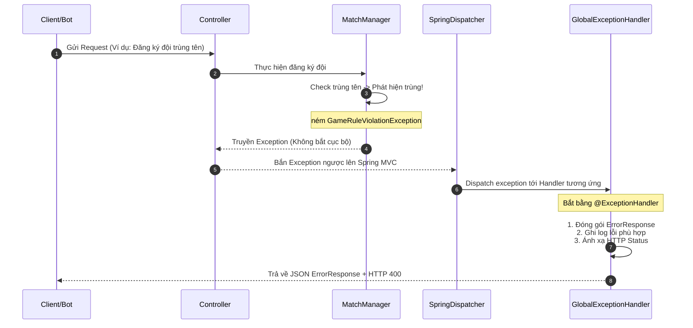

# Tài liệu Thiết kế Exception Handling - 08_GLOBAL_EXCEPTION_HANDLER

## 1. Purpose (Mục đích)
Tài liệu này đặc tả cơ chế hoạt động của **GlobalExceptionHandler** – trung tâm đón bắt và xử lý ngoại lệ tập trung trong ứng dụng **HEXUDON Server**. Sử dụng giải pháp `@RestControllerAdvice` của Spring MVC, bộ xử lý này đảm bảo mọi exception phát sinh ngoài ý muốn đều được lọc và chuyển đổi thành phản hồi HTTP chuẩn.

---

## 2. Scope (Phạm vi)
Áp dụng đối với mọi exception ném ra từ tầng Controller, Interceptor hoặc các tầng sâu hơn như Manager, Engine, Loader mà không bị bắt bởi các block `try-catch` cục bộ.

---

## 3. Architecture & Error Interception Flow (Luồng chặn bắt lỗi)

Sơ đồ Mermaid biểu diễn luồng điều khiển khi xảy ra Exception:

---

## 4. Exception Mapping Matrix (Bảng cấu hình mapping cụ thể)

Bộ xử lý trung tâm sẽ định nghĩa các phương thức xử lý lỗi tương ứng với các nhóm ngoại lệ như sau:

### 4.1. Nhánh BusinessException (`@ExceptionHandler(BusinessException.class)`)
*   **Trách nhiệm**: Xử lý các lỗi nghiệp vụ trò chơi và vi phạm luật chơi của Client.
*   **Hành vi**:
    1.  Trích xuất mã lỗi `errorCode` từ exception.
    2.  Lấy thông điệp lỗi `message` tùy biến truyền kèm.
    3.  Lấy HTTP status nguyên bản (`int status`) được khai báo trong exception.
    4.  Khởi tạo `ErrorResponse(errorCode.getCode(), message, System.currentTimeMillis())`.
    5.  Ghi log lỗi ở level `WARN` chứa thông tin: `[Business Error] Code: {code}, Message: {msg}` (Không ghi stacktrace).
    6.  Trả về `ResponseEntity` chứa `ErrorResponse` kèm HTTP status code tương ứng.

### 4.2. Nhánh Validation đầu vào (`@ExceptionHandler(MethodArgumentNotValidException.class)`)
*   **Trách nhiệm**: Xử lý các lỗi DTO gửi lên không thỏa mãn các `@NotNull`, `@NotBlank`, `@Min`,...
*   **Hành vi**:
    1.  Duyệt qua danh sách `FieldError` trong `ex.getBindingResult()`.
    2.  Với mỗi error, tạo một `ValidationErrorDetail(field, rejectedValue, defaultMessage)`.
    3.  Tạo `ErrorResponse` với `errorCode = "VALIDATION_ERROR"`, thông điệp `"Request body validation failed."` và danh sách lỗi chi tiết vừa tạo.
    4.  Ghi log level `INFO` liệt kê các trường bị lỗi.
    5.  Trả về `ResponseEntity` kèm HTTP Status `400 Bad Request`.

### 4.3. Nhánh Đọc JSON lỗi (`@ExceptionHandler(HttpMessageNotReadableException.class)`)
*   **Trách nhiệm**: Xử lý khi Client gửi JSON sai cú pháp, thiếu dấu ngoặc, sai kiểu dữ liệu trường (như truyền chuỗi vào trường kiểu số).
*   **Hành vi**:
    1.  Khởi tạo `ErrorResponse("INVALID_JSON_PAYLOAD", "Malformed or invalid JSON request body.", System.currentTimeMillis())`.
    2.  Ghi log level `WARN` cảnh báo JSON payload không hợp lệ.
    3.  Trả về `ResponseEntity` kèm HTTP Status `400 Bad Request`.

### 4.4. Nhánh Lỗi Hệ thống Fallback (`@ExceptionHandler(Exception.class)`)
*   **Trách nhiệm**: Chặn tất cả các lỗi hệ thống không xác định (NullPointerException, lỗi mạng JDBC, sập ổ đĩa...).
*   **Hành vi (Bảo mật)**:
    1.  **Tuyệt đối che giấu lỗi thật**: Khởi tạo `ErrorResponse("INTERNAL_SERVER_ERROR", "An unexpected error occurred. Please contact the administrator.", System.currentTimeMillis())`. Không truyền `ex.getMessage()` ra ngoài Client.
    2.  **Ghi log khẩn cấp (Emergency Logging)**: Ghi log ở level `ERROR` kèm theo stacktrace đầy đủ (`ex`) để phục vụ debug: `[System Error] Critical error: {message}`, `ex`.
    3.  Trả về `ResponseEntity` kèm HTTP Status `500 Internal Server Error`.

---

## 5. Fallback Mechanism (Cơ chế dự phòng)
Nếu trong quá trình xử lý lỗi tại `GlobalExceptionHandler` phát sinh lỗi mới (ví dụ: lỗi parse JSON do lỗi thư viện Jackson hoặc lỗi ghi đĩa log):
*   Spring MVC sẽ kích hoạt cơ chế xử lý lỗi mặc định (Default Error Controller) của Spring Boot.
*   Trình xử lý mặc định này sẽ trả về trang lỗi Spring tiêu chuẩn với mã HTTP 500 để đảm bảo server không bị sập hoàn toàn (Crash).

---

## 6. Common Mistakes (Sai lầm thường gặp)
*   **Thiếu annotation `@RestControllerAdvice`**: Khiến Spring Boot không nhận diện được class handler và tiếp tục ném lỗi thô ra ngoài client.
*   **Quên ghi log stacktrace cho Exception.class**: Khi xảy ra NullPointerException ở môi trường production, lỗi bị nuốt thông tin và developer không thể biết lỗi nằm ở dòng code nào để sửa.
*   **Log trùng lặp**: Vừa log ở `@ExceptionHandler` vừa log ở Controller trước khi ném ra. Gây nhiễu file log.
