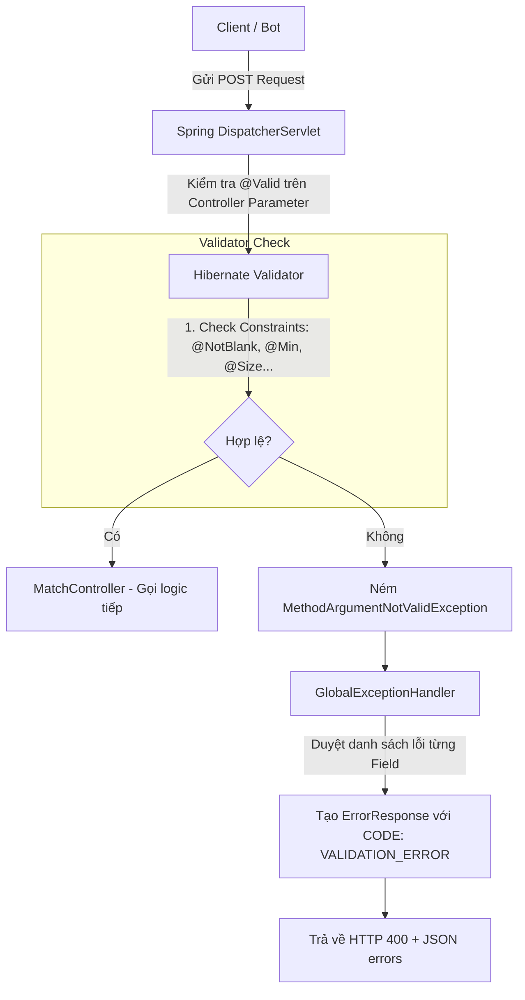

# Tài liệu Thiết kế Exception Handling - 10_VALIDATION_DESIGN

## 1. Purpose (Mục đích)
Tài liệu này đặc tả cơ chế kiểm định dữ liệu đầu vào (Validation Design) sử dụng công nghệ Bean Validation (JSR-380) và Hibernate Validator trong **HEXUDON Server**. Mục tiêu là phát hiện sớm các dữ liệu gửi lên không đúng cấu trúc/định dạng (Fail-Fast) ngay tại lớp Controller trước khi chuyển dữ liệu xuống tầng nghiệp vụ.

---

## 2. Scope (Phạm vi)
Áp dụng đối với tất cả các đối tượng truyền nhận dữ liệu (DTO Requests) được gửi từ Client lên Server qua giao thức REST API.

---

## 3. Architecture Flow (Luồng kiểm định dữ liệu)



---

## 4. DTO Validation Annotations (Các quy tắc ràng buộc trên DTO)

Hệ thống áp dụng các annotation tiêu chuẩn trên các lớp DTO như sau:

### 4.1. Lớp `RegisterTeamRequest`
*   `teamName`:
    *   `@NotBlank(message = "Team name must not be blank.")`
    *   `@Size(min = 3, max = 30, message = "Team name must be between 3 and 30 characters.")`
    *   `@Pattern(regexp = "^[a-zA-Z0-9_]+$", message = "Team name must contain only alphanumeric characters and underscores.")`

### 4.2. Lớp `SubmitActionRequest` (Gửi danh sách lệnh ngày)
*   `day`:
    *   `@NotNull(message = "Day must not be null.")`
    *   `@Min(value = 1, message = "Day must be greater than or equal to 1.")`
*   `agentPlans`:
    *   `@NotEmpty(message = "Agent plans list must not be empty.")`
    *   `@Valid`: Kích hoạt kiểm định đệ quy (nested validation) xuống các phần tử `AgentPlanDto` bên trong danh sách.

### 4.3. Lớp `AgentPlanDto`
*   `agentId`:
    *   `@NotBlank(message = "Agent ID must not be blank.")`
*   `actions`:
    *   `@NotEmpty(message = "Actions list must not be empty.")`
    *   `@Valid`: Kích hoạt kiểm định đệ quy xuống từng `ActionDto` trong danh sách.

### 4.4. Lớp `ActionDto`
*   `order`:
    *   `@NotNull(message = "Action order must not be null.")`
    *   `@Min(value = 1, message = "Action order must be at least 1.")`
*   `actionType`:
    *   `@NotNull(message = "Action type must not be null.")` (Giá trị phải thuộc Enum: `MOVE`, `WAIT`).

---

## 5. Mapped Response Schema (Định dạng lỗi Validation)
Khi phát hiện lỗi ràng buộc đầu vào, `GlobalExceptionHandler` sẽ bóc tách `BindingResult` và phản hồi về client cấu trúc JSON như sau:

*   **HTTP Status**: `400 Bad Request`
*   **Response Body**:
```json
{
  "errorCode": "VALIDATION_ERROR",
  "message": "Request body validation failed. Please correct the fields in 'errors' list.",
  "timestamp": 1720516800000,
  "errors": [
    {
      "field": "teamName",
      "rejectedValue": "T",
      "message": "Team name must be between 3 and 30 characters."
    },
    {
      "field": "agentPlans[0].actions[0].order",
      "rejectedValue": "0",
      "message": "Action order must be at least 1."
    }
  ]
}
```

---

## 6. Custom Constraints (Kiểm định tùy biến)
Đối với các kiểm định phức tạp hơn (ví dụ: danh sách gửi lên không được chứa trùng lặp `agentId` giữa các plan), ta có thể xây dựng Custom Validator bằng cách sử dụng annotation tự định nghĩa (ví dụ: `@UniqueAgentPlans`).

### Cơ chế hoạt động của Custom Validator:
1.  Định nghĩa annotation `@UniqueAgentPlans` áp dụng trên class level hoặc field level của `SubmitActionRequest`.
2.  Tạo class `UniqueAgentPlansValidator` thực thi interface `ConstraintValidator<UniqueAgentPlans, List<AgentPlanDto>>`.
3.  Trong phương thức `isValid`, thực hiện kiểm tra:
    ```java
    // Ý tưởng logic (Không viết code implementation)
    // Duyệt qua list plans, đếm các Agent ID trùng lặp.
    // Nếu có trùng lặp -> return false.
    ```
4.  Nếu trả về `false`, Hibernate Validator sẽ tự động ném ra `MethodArgumentNotValidException` và đưa thông điệp tùy biến vào danh sách lỗi của `ValidationErrorDetail`.

---

## 7. Common Mistakes (Sai lầm thường gặp)
*   **Quên annotation `@Valid` trên Controller Parameter**: Ví dụ viết `public ResponseEntity register(@RequestBody RegisterTeamRequest req)` mà thiếu `@Valid`. Điều này khiến Spring bỏ qua tất cả các ràng buộc khai báo trong DTO và chuyển dữ liệu lỗi thẳng vào tầng nghiệp vụ.
*   **Quên annotation `@Valid` trên danh sách con (Nested collection)**: Khai báo `@Valid` ở ngoài nhưng thiếu ở danh sách `agentPlans` bên trong. Khi đó, các trường lỗi của `AgentPlanDto` hay `ActionDto` sẽ không được phát hiện.
*   **Thông báo lỗi không rõ ràng**: Viết các message chung chung như `"Invalid team name"` thay vì chỉ rõ nguyên nhân như `"Team name must be between 3 and 30 characters."`.
