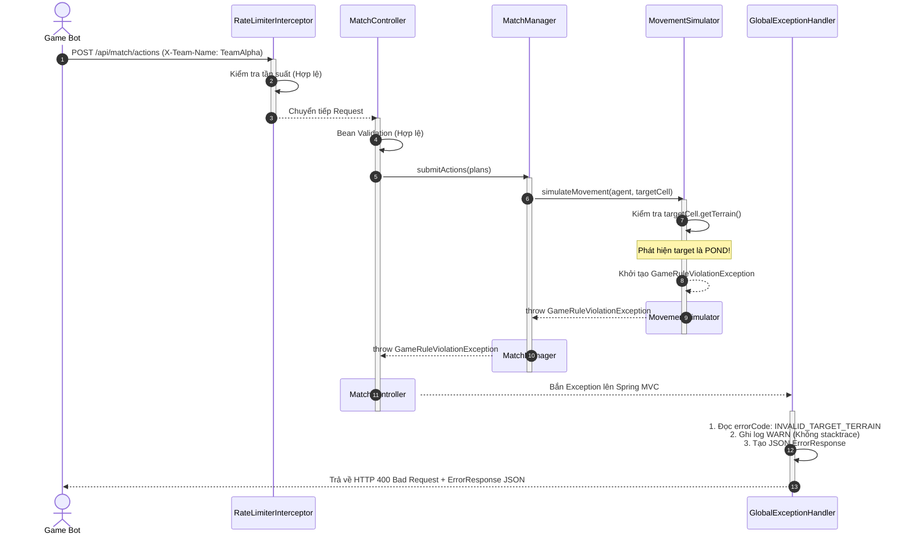
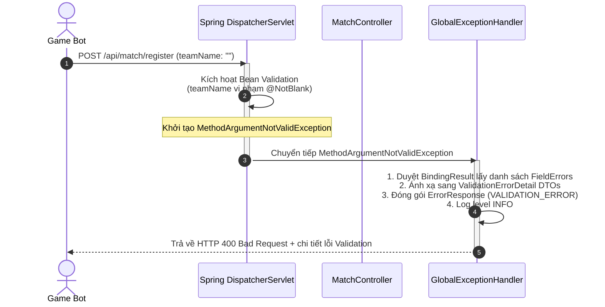
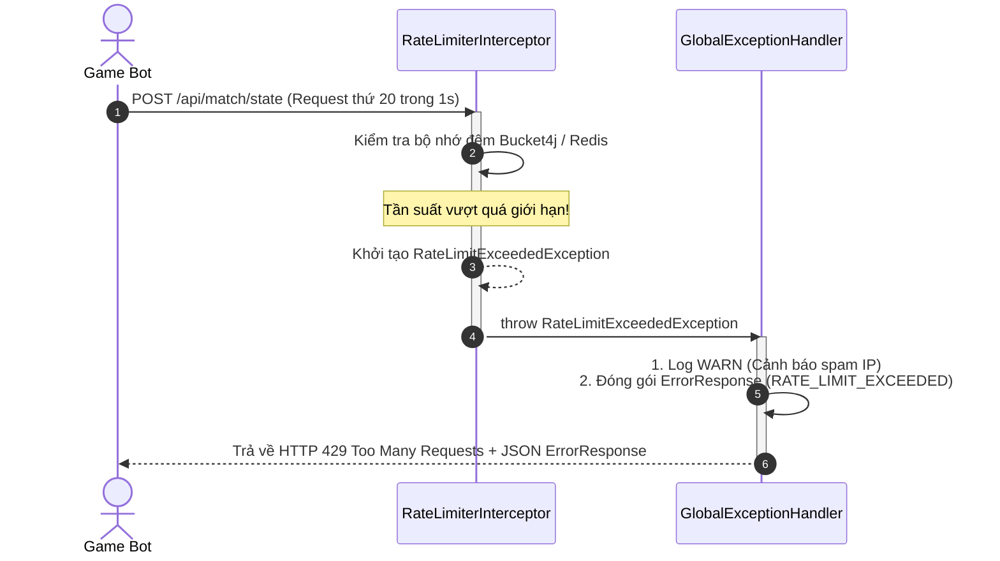
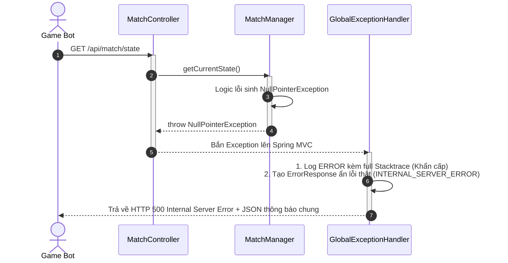

# Tài liệu Thiết kế Exception Handling - 14_SEQUENCE_DIAGRAM

## 1. Purpose (Mục đích)
Tài liệu này mô tả trực quan luồng đi của dữ liệu và thứ tự thực thi (Sequence Workflow) giữa các thành phần trong hệ thống khi xảy ra ngoại lệ. Sử dụng sơ đồ Mermaid, tài liệu giúp lập trình viên hình dung rõ cách các Exception được kích hoạt, lan truyền ngược qua các lớp kiến trúc và được bắt gọn tại Global Exception Handler.

---

## 2. Scope (Phạm vi)
Áp dụng đối với các kịch bản lỗi phổ biến trên REST API của **HEXUDON Server**.

---

## 3. Scenarios (Các kịch bản lỗi chi tiết)

### Kịch bản 1: Vi phạm luật chơi tại Physics Engine
Khi Client gửi kế hoạch di chuyển Agent đi vào ô Hồ nước (`POND`). Lỗi được phát hiện sâu trong Engine tính toán vật lý.

---

### Kịch bản 2: Lỗi Validation DTO tại Controller
Khi Client gửi request đăng ký đội với tên rỗng (`""`). Lỗi được chặn ngay tại cửa ngõ Controller.

---

### Kịch bản 3: Bị chặn Spam bởi RateLimiterInterceptor
Khi Client gửi quá nhiều request trong 1 giây. Lỗi được xử lý ở tầng Interceptor trước khi vào Controller.

---

### Kịch bản 4: Lỗi hệ thống phát sinh đột xuất (NullPointerException)
Khi xảy ra lỗi lập trình nội bộ tại MatchManager (ví dụ: truy cập thuộc tính của Object null).

