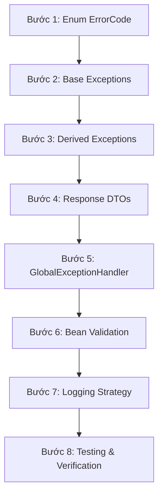

# Tài liệu Thiết kế Exception Handling - 15_IMPLEMENTATION_ORDER

## 1. Purpose (Mục đích)
Tài liệu này đóng vai trò như một bản hướng dẫn lộ trình triển khai (Implementation Roadmap) chi tiết theo từng bước cho lập trình viên. Thiết kế thứ tự này đảm bảo quá trình viết code diễn ra trơn tru, giảm thiểu xung đột biên dịch (compile errors) và giúp tích hợp hệ thống xử lý lỗi vào HEXUDON Server một cách an toàn nhất.

---

## 2. Scope (Phạm vi)
Áp dụng đối với quá trình phát triển phân hệ Exception Handling & Error Management từ đầu.

---

## 3. Implementation Steps (Các bước triển khai tuần tự)

Dưới đây là sơ đồ và mô tả chi tiết thứ tự thực hiện:

### Bước 1: Khởi tạo Enum `ErrorCode`
*   **Mục tiêu**: Tạo cấu trúc lưu trữ mã lỗi hệ thống.
*   **Công việc**:
    *   Tạo file `ErrorCode.java` tại package `com.naprock.hexudon.exception.code`.
    *   Khai báo toàn bộ danh sách mã lỗi và thông điệp mặc định như đặc tả trong tài liệu **06_ERROR_CODE_DESIGN.md**.

### Bước 2: Tạo các Exception gốc (Base Classes)
*   **Mục tiêu**: Tạo các lớp Exception nền tảng.
*   **Công việc**:
    *   Tạo `BusinessException.java` kế thừa `RuntimeException`. Khai báo thuộc tính `errorCode` và `status`.
    *   Tạo `SystemException.java` kế thừa `RuntimeException`. Khai báo thuộc tính `errorCode`.

### Bước 3: Tạo các Exception cụ thể (Derived Classes)
*   **Mục tiêu**: Triển khai các lớp ngoại lệ nghiệp vụ cụ thể.
*   **Công việc**:
    *   Tạo các lớp `GameRuleViolationException`, `MatchStateConflictException`, `ResourceNotFoundException`, `RateLimitExceededException` kế thừa từ `BusinessException`.
    *   Tạo `ConfigLoadException` kế thừa từ `SystemException`.

### Bước 4: Tạo các DTO Response
*   **Mục tiêu**: Thiết lập cấu trúc JSON trả về.
*   **Công việc**:
    *   Tạo Java Record `ValidationErrorDetail.java` chứa các trường `field`, `rejectedValue`, `message`.
    *   Tạo class `ErrorResponse.java` chứa `errorCode`, `message`, `timestamp`, và danh sách `ValidationErrorDetail`. Thêm annotation `@JsonInclude(JsonInclude.Include.NON_NULL)`.

### Bước 5: Viết bộ xử lý tập trung `GlobalExceptionHandler`
*   **Mục tiêu**: Bắt các ngoại lệ và trả về DTO.
*   **Công việc**:
    *   Tạo class `GlobalExceptionHandler` chú thích bằng `@RestControllerAdvice` tại package `exception.handler`.
    *   Viết các phương thức `@ExceptionHandler` bắt `BusinessException`, `MethodArgumentNotValidException` và `Exception` (fallback).

### Bước 6: Tích hợp Validation vào các Request DTOs
*   **Mục tiêu**: Chặn dữ liệu lỗi tại Controller.
*   **Công việc**:
    *   Thêm các annotation validation (`@NotBlank`, `@Min`, `@Size`) vào các trường trong `RegisterTeamRequest` và `SubmitActionRequest`.
    *   Thêm annotation `@Valid` trước `@RequestBody` trong các phương thức ở `MatchController`.

### Bước 7: Cấu hình và chuẩn hóa Logging
*   **Mục tiêu**: Ghi log đúng cấp độ và bảo mật.
*   **Công việc**:
    *   Tích hợp ghi log lỗi tại `GlobalExceptionHandler` (sử dụng SLF4J `LoggerFactory.getLogger`).
    *   Định cấu hình ghi log level `WARN` cho lỗi nghiệp vụ (không stacktrace) và `ERROR` cho lỗi hệ thống (có stacktrace).

### Bước 8: Kiểm thử và Xác minh (Testing & Verification)
*   **Mục tiêu**: Đảm bảo hệ thống hoạt động đúng như thiết kế.
*   **Công việc**: Viết Unit Test và Integration Test kiểm tra các trường hợp lỗi xem có trả về đúng mã HTTP Status và JSON body hay không.

---

## 4. Compile-Time Dependency Check (Kiểm tra phụ thuộc compile)
Để tránh lỗi không tìm thấy class khi build dự án, lập trình viên tuyệt đối không được viết `GlobalExceptionHandler` trước khi định nghĩa `ErrorResponse` hoặc các Exception con. Quy trình trên đã được sắp xếp để đảm bảo class viết trước làm dependency cho class viết sau.
