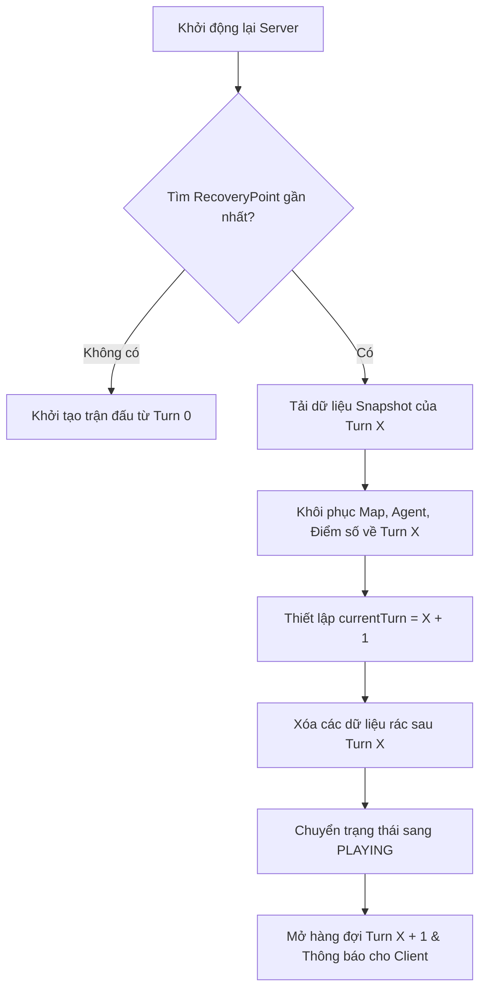

# QUẢN LÝ TRẠNG THÁI TRẬN ĐẤU, PHỤC HỒI VÀ TÁI ĐẤU

Tài liệu này mô tả chi tiết cơ chế chụp trạng thái trận đấu (Snapshotting), quy trình tự động rollback phục hồi dữ liệu khi sập nguồn (Match Recovery) và tính năng đấu lại từ một lượt bất kỳ do trọng tài chỉ định (Rematch).

---

## 1. Chiến lược Chụp Trạng thái (Snapshotting Strategy)

### A. Thời điểm chụp Snapshot
Để đảm bảo khôi phục hệ thống một cách nhất quán và chính xác, Snapshot được thực hiện tự động tại hai thời điểm:
1.  **Đầu Turn (Post-transition)**: Ngay sau khi hàm `nextDay()` kết thúc (hệ thống tăng số lượt `currentTurn = currentTurn + 1`, reset tài nguyên nhiên liệu tối đa, reset số bước đi của Agent, nạp lại kho Udon tại các Spot). Snapshot này đại diện cho trạng thái ban đầu sạch sẽ của lượt chơi mới.
2.  **Cuối Turn (Post-simulation)**: Ngay sau khi kết thúc mô phỏng các bước đi (`simulateTurn`) và cập nhật trạng thái giao thông (`updateTrafficForNextTurn`), điểm số đã được tính toán xong nhưng trước khi chuyển sang Turn kế tiếp.

### B. Cấu trúc dữ liệu bên trong MatchSnapshot

Dữ liệu lưu trữ trong một `MatchSnapshot` được tổ chức dưới dạng danh sách các cấu phần sau (tuyệt đối không chứa tham chiếu động của Java, được deep copy hoàn toàn hoặc serialization thành chuỗi JSON bất biến):

| Cấu phần dữ liệu | Kiểu dữ liệu mô tả | Ý nghĩa chi tiết |
| :--- | :--- | :--- |
| `matchId` | String | Mã định danh duy nhất của trận đấu đang diễn ra. |
| `snapshotTurn` | Integer | Số lượt chơi tại thời điểm chụp snapshot. |
| `status` | MatchStatus (Enum) | Trạng thái của trận đấu (`PLAYING`, `FINISHED`, v.v.). |
| `teamsData` | List (Mô tả cấu trúc Team) | Bản sao danh sách các đội chơi kèm thông tin: tên đội, lượng nhiên liệu của từng Agent, số bước còn lại của Agent, vị trí tọa độ của Agent. |
| `mapStateData` | List (Mô tả ô bản đồ) | Bản sao danh sách ô bản đồ gồm tọa độ, loại địa hình và trạng thái giao thông động (`RoadTrafficState`) hiện thời. |
| `spotsData` | List (Mô tả Spot) | Bản sao danh sách các Spot gồm tọa độ và số lượng Udon còn lại trong kho cấp phát. |
| `scoresData` | List (Mô tả điểm số) | Chi tiết điểm số của từng đội chơi: danh sách các loại Udon độc nhất thu được, tích lũy ngày, số servings, tổng response time. |
| `trafficHistoryData`| List (Mô tả giao thông) | Nhật ký stay steps của các lượt trước phục vụ tính toán giao thông lượt tiếp theo. |
| `timestamp` | Long | Thời gian ghi nhận snapshot trên server (mili-giây). |

---

## 2. Quy trình Tự phục hồi sau Sự cố (Rollback Flow)

Khi hệ thống máy chủ gặp sự cố đột ngột (sập nguồn, lỗi phần cứng) và khởi động lại, hệ thống sẽ thực hiện khôi phục tự động theo thuật toán từng bước sau:

### Thuật toán phục hồi từng bước (Text-based Algorithm):
1.  **Bước 1**: Tầng Adapter Persistence khi khởi động sẽ gọi Outbound Port `MatchSnapshotRepository.findLatestRecoveryPoint()`.
2.  **Bước 2**: Hệ thống kiểm tra dữ liệu trả về:
    *   Nếu không có `RecoveryPoint` nào tồn tại: Hệ thống kích hoạt quy trình tạo mới trận đấu từ đầu (Turn 0) và đưa trạng thái về `WAITING`. Kết thúc.
    *   Nếu có `RecoveryPoint` tại Turn $X$: Tiến hành giải nén chuỗi dữ liệu trạng thái.
3.  **Bước 3**: Khôi phục trạng thái bộ nhớ đệm:
    *   Gán trạng thái bản đồ, danh sách các ô đường nhựa và trạng thái kẹt xe về đúng Snapshot của Turn $X$.
    *   Gán danh sách Agent về tọa độ và mức nhiên liệu tương ứng ở cuối Turn $X$.
    *   Khôi phục điểm số của các đội chơi, bao gồm lịch sử các loại Udon thu thập và số servings.
4.  **Bước 4**: Dọn dẹp dữ liệu thừa:
    *   Truy vấn cơ sở dữ liệu lịch sử sự kiện game và nhật ký mạng, thực hiện xóa bỏ toàn bộ các bản ghi `GameEvent` và `ApiCommunicationLog` có chỉ số lượt lớn hơn $X$. Điều này nhằm loại bỏ các dữ liệu rác được ghi nhận dở dang trong lượt bị sập nguồn.
5.  **Bước 5**: Thiết lập lượt chơi mới:
    *   Thiết lập `currentTurn = X + 1`.
    *   Đặt trạng thái trận đấu là `PLAYING`.
    *   Đặt `turnStartTime = System.currentTimeMillis()`.
6.  **Bước 6**: Kích hoạt hệ thống giao tiếp:
    *   Mở hàng đợi `TurnExecutionQueue` cho lượt $X + 1$.
    *   Gửi bản tin đồng bộ hóa trạng thái qua WebSocket/API đến tất cả các Client của các đội chơi để họ biết trận đấu đã được khôi phục tại Turn $X + 1$ và bắt đầu gửi lệnh hành động.

---

## 3. Quy trình Tái đấu (Rematch Flow)

Tính năng Rematch cho phép Trọng tài (Admin) đưa trận đấu quay ngược thời gian về một lượt chơi chỉ định để thực hiện đấu lại (ví dụ do sự cố mạng diện rộng của một đội chơi).

### Thuật toán thực thi Rematch từng bước (Text-based Algorithm):
1.  **Bước 1**: Nhận yêu cầu Rematch từ API của trọng tài với tham số `targetTurn` (lượt chơi mong muốn chạy lại, ví dụ Turn $Y$).
2.  **Bước 2**: Kiểm tra tính hợp lệ của yêu cầu:
    *   Nếu $Y$ nhỏ hơn hoặc bằng 1, hoặc lớn hơn `currentTurn` hiện tại: Trả về lỗi `400 Bad Request`.
    *   Truy vấn Outbound Port để lấy Snapshot tại Turn $Y - 1$ (trạng thái ngay trước khi Turn $Y$ bắt đầu). Nếu không tìm thấy Snapshot của Turn $Y - 1$: Trả về lỗi hệ thống không thể tái đấu do thiếu điểm phục hồi.
3.  **Bước 3**: Tạm dừng hệ thống:
    *   Khóa hàng đợi tiếp nhận hành động `TurnExecutionQueue`.
    *   Tạm dừng bộ định trình tự `RequestOrderingService`.
4.  **Bước 4**: Khôi phục trạng thái:
    *   Ghi đè trạng thái bộ nhớ trực tiếp (Memory State) của trận đấu bằng dữ liệu từ Snapshot của Turn $Y - 1$.
    *   Đặt lại biến `currentTurn = Y`.
    *   Thiết lập trạng thái trận đấu về `PLAYING`.
5.  **Bước 5**: Dọn dẹp cơ sở dữ liệu lịch sử:
    *   Xóa toàn bộ các `GameEvent` có `turn >= Y`.
    *   Xóa toàn bộ các `ApiCommunicationLog` có `requestTime` lớn hơn hoặc bằng thời điểm ghi nhận đầu Turn $Y$ gốc.
    *   Xóa toàn bộ các `RecoveryPoint` có `snapshotTurn >= Y`.
6.  **Bước 6**: Tái thiết lập và phát sóng:
    *   Cập nhật thời gian bắt đầu lượt: `turnStartTime = System.currentTimeMillis()`.
    *   Giải phóng hàng đợi hành động, cho phép các đội gửi lại request cho Turn $Y$.
    *   Gửi thông báo quảng bá (Broadcast) qua WebSocket tới tất cả các Client để thông báo sự kiện Rematch về Turn $Y$, yêu cầu các bot/client gửi lại hành động của lượt này.
