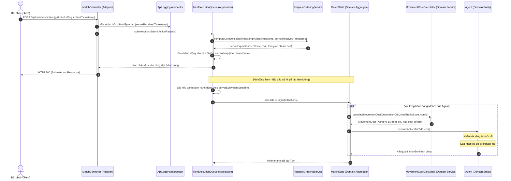
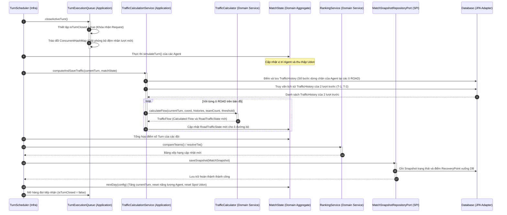
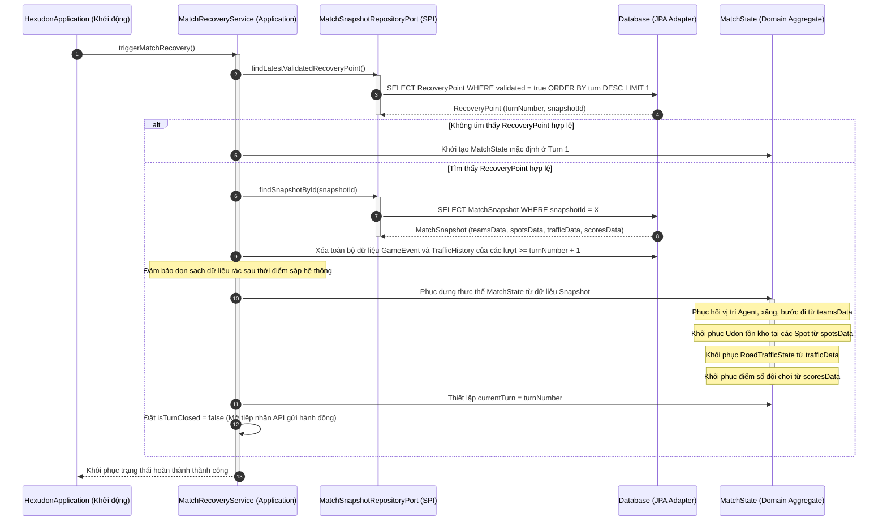

# KỊCH BẢN LUỒNG XỬ LÝ (SEQUENCE DIAGRAMS) - GIAI ĐOẠN 4

Tài liệu này trình bày kịch bản luồng xử lý chi tiết cho 3 quy trình cốt lõi của hệ thống Giai đoạn 4 bằng mã sơ đồ Mermaid và diễn giải thuật toán từng bước bằng văn bản tiếng Việt.

---

## 1. Luồng Gửi Request -> Xếp hàng -> Di chuyển Agent

Quy trình mô tả từ lúc Client gửi yêu cầu hành động, đi qua hàng đợi đồng thời, tính toán chi phí di chuyển động và cập nhật vị trí của Agent.

### Diễn giải thuật toán từng bước:
1.  **Client** gửi API Request chứa hành động và `clientTimestamp` đến máy chủ.
2.  **ApiLoggingInterceptor** chặn request, ghi nhận thời điểm tiếp nhận thực tế tại server (`serverReceivedTimestamp`) để tính độ trễ mạng.
3.  **MatchController** gọi `TurnExecutionQueue` để tiếp nhận yêu cầu.
4.  `TurnExecutionQueue` gọi `RequestOrderingService` để thực hiện thuật toán bù trừ độ trễ mạng, tính ra `serverEquivalentSentTime` (Dấu thời gian gửi chuẩn hóa).
5.  `TurnExecutionQueue` lưu trữ hành động vào bản đồ an toàn luồng `ConcurrentMap` của lượt hiện tại và phản hồi ngay lập tức cho Client với mã HTTP 200.
6.  Khi kết thúc thời gian chờ lượt, luồng Worker khóa hàng đợi tiếp nhận, sắp xếp các hành động đã nhận theo `serverEquivalentSentTime` tăng dần.
7.  Luồng Worker gọi hàm giả lập `MatchState.simulateTurn()`.
8.  Với mỗi hành động di chuyển (`MOVE`), `MatchState` gọi Domain Service `MovementCostCalculator` để xác định chi phí năng lượng dựa trên địa hình và trạng thái giao thông hiện tại của ô đích.
9.  Sau khi kiểm tra tài nguyên của Agent đủ đáp ứng, thực thể `Agent` tiến hành khấu trừ xăng, bước đi và cập nhật tọa độ mới trong bộ nhớ.

---

## 2. Luồng Đóng lượt đấu (Turn Execution Loop)

Quy trình đóng lượt chơi, tính toán mật độ giao thông dựa trên lịch sử dừng chân, cập nhật điểm số và bảng xếp hạng.

### Diễn giải thuật toán từng bước:
1.  **TurnScheduler** kích hoạt sự kiện đóng lượt chơi.
2.  `TurnExecutionQueue` thiết lập `isTurnClosed = true` để khóa nhận request và tráo đổi bộ đệm ConcurrentMap.
3.  Hệ thống thực hiện giả lập di chuyển của các Agent.
4.  `TrafficCalculationService` ghi nhận số bước dừng chân của các Agent tại các ô đường trong lượt này, lưu xuống database làm thực thể `TrafficHistory`.
5.  `TrafficCalculationService` truy vấn lịch sử dừng chân của 2 lượt trước từ database, sau đó duyệt qua từng tọa độ đường để gọi Domain Service `TrafficCalculator`.
6.  `TrafficCalculator` tính toán Calculated Flow và cập nhật trạng thái `RoadTrafficState` mới cho từng ô đường vào thực thể `MatchState` để áp dụng cho lượt di chuyển kế tiếp.
7.  Hệ thống cập nhật điểm số và gọi `RankingService` để phân hạng các đội chơi.
8.  `TurnScheduler` khởi tạo đối tượng `MatchSnapshot` và lưu trữ xuống database thông qua `MatchSnapshotRepositoryPort`.
9.  Thiết lập điểm phục hồi `RecoveryPoint` an toàn và cập nhật trạng thái của nó thành `validated = true`.
10. Gọi `MatchState.nextDay()` để bước sang lượt chơi mới và đặt `isTurnClosed = false` mở lại cổng nhận request.

---

## 3. Luồng Xử lý lỗi và Khôi phục hệ thống (Match Recovery Flow)

Quy trình phục hồi hệ thống về lượt chơi an toàn gần nhất khi máy chủ bị dừng đột ngột hoặc gặp sự cố.

### Diễn giải thuật toán từng bước:
1.  Khi máy chủ khởi động lại, `HexudonApplication` kích hoạt dịch vụ `MatchRecoveryService`.
2.  `MatchRecoveryService` gọi Outbound Port `MatchSnapshotRepositoryPort` để truy vấn điểm phục hồi hợp lệ mới nhất (`RecoveryPoint`) trong Database.
3.  Nếu không có điểm khôi phục, hệ thống thiết lập trạng thái `MatchState` mặc định tại lượt 1.
4.  Nếu tìm thấy `RecoveryPoint`, hệ thống lấy dữ liệu ảnh chụp `MatchSnapshot` tương ứng bằng mã định danh `snapshotId`.
5.  Hệ thống thực hiện xóa bỏ toàn bộ dữ liệu lịch sử sự kiện `GameEvent` và dữ liệu giao thông `TrafficHistory` của các lượt đấu lớn hơn lượt khôi phục (`>= turnNumber + 1`) để dọn sạch dữ liệu không đồng bộ của lượt bị lỗi.
6.  `MatchRecoveryService` tiến hành ánh xạ dữ liệu từ Snapshot để tái cấu trúc thực thể `MatchState` trong bộ nhớ đệm: Phục hồi tọa độ Agent, mức xăng, số lượng Udon tại các điểm Spot, trạng thái giao thông các ô đường và điểm số tích lũy của các đội chơi.
7.  Gán `currentTurn = RecoveryPoint.turnNumber`, mở khóa tiếp nhận yêu cầu (`isTurnClosed = false`) và khởi động lại vòng lập lịch lượt chơi.
