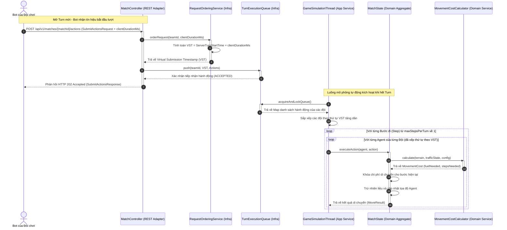
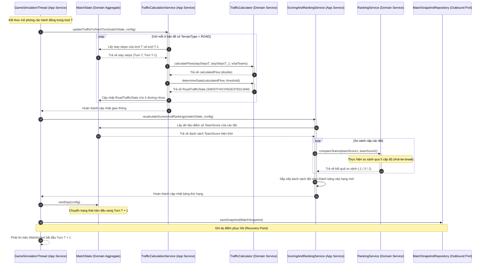
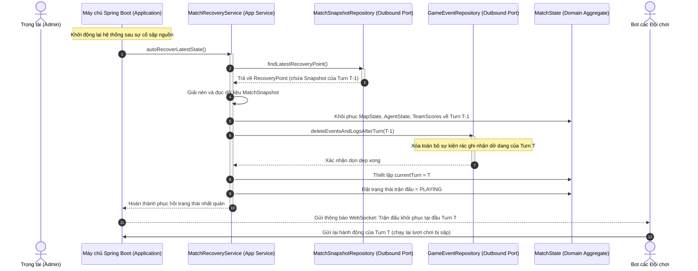

# KỊCH BẢN LUỒNG XỬ LÝ HỆ THỐNG (SEQUENCE DIAGRAMS)

Tài liệu này mô tả kịch bản luồng xử lý chi tiết của 3 nghiệp vụ quan trọng nhất trong Giai đoạn 4 bằng ngôn ngữ biểu đồ tuần tự Mermaid.

---

## 1. Luồng Gửi hành động và Xử lý Di chuyển của Agent

Luồng này mô tả từ lúc Bot gửi request hành động, qua hệ thống bù trễ và xếp hàng, cho tới khi luồng mô phỏng chạy tính toán chi phí di chuyển và cập nhật tọa độ mới của Agent.

---

## 2. Luồng Đóng Turn và Tính toán Giao thông - Điểm số - Xếp hạng

Kịch bản vòng lặp đóng Turn (Turn Execution Loop) được thực thi bởi luồng mô phỏng để tính toán giao thông dựa trên lịch sử dừng chân, cập nhật trạng thái đường đi, tính điểm số và thiết lập bảng thứ tự xếp hạng mới.

---

## 3. Luồng Xử lý Lỗi và Khôi phục Hệ thống (Match Recovery Flow)

Kịch bản diễn ra khi máy chủ bị sập đột ngột giữa lượt chơi $T$ và tự động khôi phục lại trạng thái nhất quán của lượt trước đó ($T-1$) khi khởi động lại.

