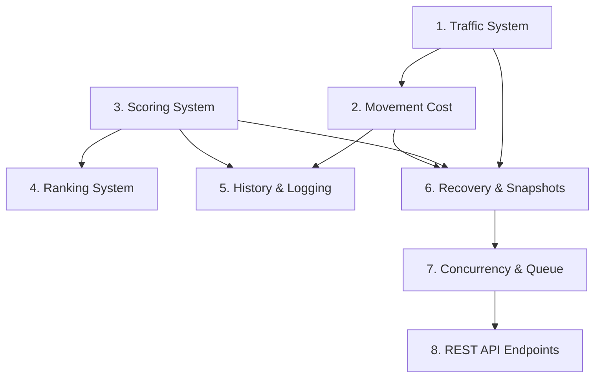

# BẢN ĐỒ CHỈ DẪN KỸ THUẬT GIAI ĐOẠN 4 (NAPROCK 18th HEXUDON)

Chào mừng bạn đến với bộ tài liệu thiết kế kỹ thuật hoàn chỉnh cho Giai đoạn 4 của giải đấu NAPROCK 18th HEXUDON cho dự án Hexudon. Tài liệu này đóng vai trò là bản đồ hướng dẫn tích hợp và triển khai hệ thống dành cho lập trình viên và kỹ sư kiểm thử.

---

## 1. Mục tiêu Cốt lõi của Giai đoạn 4

Đưa hệ thống Hexudon từ một công cụ mô phỏng offline đơn luồng, tĩnh lặng trở thành một **hệ thống thi đấu thời gian thực hoàn chỉnh**, chịu tải đồng thời cao, vận hành an toàn đa luồng, có tính năng tính toán giao thông động, xếp hạng chống hòa tuyệt đối, nhật ký trực quan chi tiết và có khả năng tự phục hồi (Recovery/Rematch) mạnh mẽ khi gặp sự cố.

---

## 2. Bản đồ Danh mục Tài liệu Thiết kế

Bộ tài liệu thiết kế chi tiết bao gồm chính xác 11 tập tin Markdown kết nối chặt chẽ với nhau:

1.  **[01_PROJECT_OVERVIEW.md](file:///d:/Documents/GitHub/hexudon/docs/phase-4-completion/01_PROJECT_OVERVIEW.md)**: Tổng quan chiến lược, mục tiêu nghiệp vụ mới, phân tích rủi ro kỹ thuật và các ràng buộc kiến trúc.
2.  **[02_PACKAGE_STRUCTURE.md](file:///d:/Documents/GitHub/hexudon/docs/phase-4-completion/02_PACKAGE_STRUCTURE.md)**: Bản đồ package chi tiết theo cấu trúc Hexagonal & DDD giúp cô lập hoàn toàn lõi nghiệp vụ.
3.  **[03_CLASS_LIST.md](file:///d:/Documents/GitHub/hexudon/docs/phase-4-completion/03_CLASS_LIST.md)**: Danh mục toàn bộ các Class, Interface, Enum, Value Object và Entity được thêm mới/chỉnh sửa.
4.  **[04_CLASS_SPECIFICATIONS.md](file:///d:/Documents/GitHub/hexudon/docs/phase-4-completion/04_CLASS_SPECIFICATIONS.md)**: Đặc tả kỹ thuật chi tiết nhất (fields, methods, algorithms) cho từng cấu phần nghiệp vụ cốt lõi (Giao thông, Chi phí di chuyển, Tính điểm, Xếp hạng, Lịch sử, Nhật ký API).
5.  **[05_MATCH_CONFIG_FORMAT.md](file:///d:/Documents/GitHub/hexudon/docs/phase-4-completion/05_MATCH_CONFIG_FORMAT.md)**: Đặc tả cấu trúc và bảng tham số cấu hình trận đấu (hệ số kẹt xe, trọng số điểm, timeout).
6.  **[06_MATCH_STATE_DESIGN.md](file:///d:/Documents/GitHub/hexudon/docs/phase-4-completion/06_MATCH_STATE_DESIGN.md)**: Thiết kế cơ chế Snapshotting lưu giữ trạng thái, quy trình tự khôi phục khi sập nguồn (Rollback) và tái đấu (Rematch).
7.  **[07_API_DESIGN.md](file:///d:/Documents/GitHub/hexudon/docs/phase-4-completion/07_API_DESIGN.md)**: Kiến trúc thiết kế RESTful API (Endpoints, bảng trường dữ liệu DTO, validation).
8.  **[08_OBJECT_LIFECYCLE.md](file:///d:/Documents/GitHub/hexudon/docs/phase-4-completion/08_OBJECT_LIFECYCLE.md)**: Vòng đời xử lý lượt chơi, quản lý hàng đợi đa luồng và cơ chế bù trừ trễ mạng (Latency Compensation).
9.  **[09_SEQUENCE_DIAGRAM.md](file:///d:/Documents/GitHub/hexudon/docs/phase-4-completion/09_SEQUENCE_DIAGRAM.md)**: Kịch bản luồng xử lý chi tiết (Sequence Diagrams) cho 3 quy trình xương sống của hệ thống.
10. **[10_BUILD_ORDER.md](file:///d:/Documents/GitHub/hexudon/docs/phase-4-completion/10_BUILD_ORDER.md)**: Lộ trình và thứ tự triển khai tích hợp mã nguồn từ Phase 4.1 đến Phase 4.8 kèm chiến lược kiểm thử.
11. **[11_CHECKLIST.md](file:///d:/Documents/GitHub/hexudon/docs/phase-4-completion/11_CHECKLIST.md)**: Danh sách kiểm tra nghiệm thu chất lượng (Definition of Done) và xử lý các trường hợp biên nguy hiểm nhất.

---

## 3. Ma trận Phụ thuộc giữa các Module (Dependency Matrix)

Để đảm bảo việc lập trình diễn ra suôn sẻ, các module cần được xây dựng theo đúng thứ tự phụ thuộc kỹ thuật dưới đây:

*   **Module Giao thông động (Traffic System)** là nền tảng đầu tiên, cung cấp thông tin trạng thái đường kẹt xe.
*   **Module Chi phí di chuyển (Movement Cost)** phụ thuộc trực tiếp vào trạng thái kẹt xe của Module Giao thông để tính toán lượng nhiên liệu và số bước đi tiêu hao động.
*   **Module Tính điểm (Scoring System)** là một phần độc lập nhưng cần có trước để làm căn cứ đầu vào cho Module Xếp hạng.
*   **Module Xếp hạng (Ranking System)** phụ thuộc vào dữ liệu điểm số của Module Tính điểm để so sánh thứ hạng chống hòa.
*   **Module Giám sát và Phục hồi (Logging & Recovery)** phụ thuộc vào toàn bộ trạng thái dữ liệu (Map, Agent, Score) để ghi sự kiện và chụp snapshot khôi phục.
*   **Module Đồng thời và API (Concurrency & REST API)** nằm ngoài cùng, phụ thuộc và kết nối toàn bộ các Inbound Ports của các module nghiệp vụ nội bộ phía trên.

---

## 4. Thứ tự Đọc tài liệu Tối ưu

### Dành cho Lập trình viên cao cấp (Senior Developer)
1.  Đọc `01_PROJECT_OVERVIEW.md` để hiểu bối cảnh và mục tiêu nghiệp vụ.
2.  Đọc `02_PACKAGE_STRUCTURE.md` để nắm rõ giới hạn kiến trúc package và thư mục.
3.  Xem nhanh danh sách lớp tại `03_CLASS_LIST.md`.
4.  Nghiên cứu sâu `04_CLASS_SPECIFICATIONS.md` và `05_MATCH_CONFIG_FORMAT.md` để nắm vững thuật toán nghiệp vụ.
5.  Đọc `08_OBJECT_LIFECYCLE.md` và `09_SEQUENCE_DIAGRAM.md` để hiểu kiến trúc đa luồng và thứ tự gọi hàm.
6.  Triển khai code theo đúng thứ tự chỉ dẫn tại `10_BUILD_ORDER.md`.

### Dành cho Kỹ sư Đảm bảo chất lượng (QC / Test Engineer)
1.  Đọc `01_PROJECT_OVERVIEW.md` để hiểu yêu cầu của đấu trường trực tuyến.
2.  Xem `05_MATCH_CONFIG_FORMAT.md` để hiểu các hệ số và ngưỡng cấu hình.
3.  Nghiên cứu kỹ `07_API_DESIGN.md` để lập kế hoạch viết test case tích hợp cho các API RESTful.
4.  Đọc `09_SEQUENCE_DIAGRAM.md` để lập kịch bản kiểm thử luồng chạy chính, kịch bản sập nguồn đột ngột.
5.  Thực hiện đối chiếu kiểm thử thủ công và tự động dựa theo bộ check cực đoan tại `11_CHECKLIST.md`.

---

## 5. Tiêu chí Hoàn thành Toàn bộ Giai đoạn 4 (Criteria for Completion)

Hệ thống Giai đoạn 4 chỉ được coi là hoàn thành khi đáp ứng đầy đủ các tiêu chuẩn định lượng sau:
1.  **Chất lượng mã nguồn**: Vượt qua bài kiểm tra tự động ArchUnit Test, đảm bảo 100% cấu trúc thư mục tuân thủ nghiêm ngặt mô hình Hexagonal, không rò rỉ Spring annotations vào Domain.
2.  **Độ bao phủ test**: Tổng độ phủ Unit Test dòng lệnh đạt tối thiểu `90%` cho toàn bộ các lớp thiết kế mới.
3.  **Khả năng chịu tải**: Chạy giả lập 100 luồng nộp bài đồng thời của 2 đội, kiểm chứng hàng đợi xử lý đúng thứ tự Virtual Submission Timestamp mà không gây deadlock hoặc sai lệch dữ liệu.
4.  **Tính toàn vẹn phục hồi**: Thực hiện tắt nóng (kill process) máy chủ tại Turn $T$, khi khởi động lại, trận đấu phải tự động tiếp tục tại đầu Turn $T$ với dữ liệu map và điểm số chính xác của Turn $T-1$.
