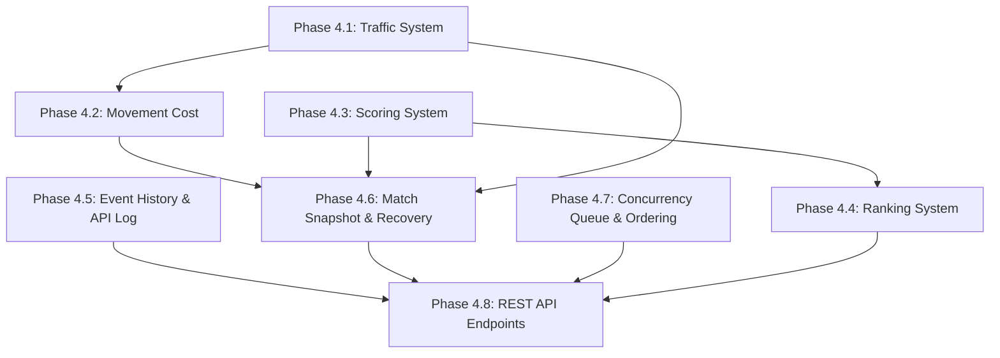

# BẢN ĐỒ CHỈ DẪN KỸ THUẬT (PHASE 4 ARCHITECTURE MAP)

Chào mừng Senior Developer và QC Engineer đến với tài liệu thiết kế kỹ thuật chi tiết cho **Giai đoạn 4** của giải đấu NAPROCK 18th HEXUDON. Thư mục này chứa đầy đủ thông tin thiết kế hệ thống theo mô hình DDD và Kiến trúc Lục giác (Hexagonal Architecture).

---

## 1. Mục tiêu cốt lõi của Giai đoạn 4

Đưa hệ thống **hexudon** từ một ứng dụng giả lập offline đơn giản lên mức độ sẵn sàng vận hành giải đấu thời gian thực với các tính năng:
*   Mật độ giao thông động tác động trực tiếp lên chi phí di chuyển.
*   Xử lý đồng thời không xung đột và bù trừ độ trễ mạng cho các đội chơi.
*   Tính điểm phức hợp và xếp hạng chống hòa điểm (Anti-tie-break) qua 5 cấp độ.
*   Sao lưu trạng thái (Snapshot) sau mỗi lượt chơi để tự phục hồi lỗi và hỗ trợ tái đấu từ lượt bất kỳ.
*   Nhật ký sự kiện chi tiết và giám sát mạng phục vụ trực quan hóa (Visualizer).

---

## 2. Bản đồ danh sách tài liệu thiết kế

Dưới đây là liên kết nội bộ trực tiếp tới 11 tài liệu đặc tả kỹ thuật chi tiết:

1.  **[01_PROJECT_OVERVIEW.md](file:///d:/Documents/GitHub/hexudon/docs/phase-4-completion/01_PROJECT_OVERVIEW.md):** Tổng quan chiến lược, phân tích bối cảnh, rủi ro kỹ thuật và ràng buộc phụ thuộc kiến trúc.
2.  **[02_PACKAGE_STRUCTURE.md](file:///d:/Documents/GitHub/hexudon/docs/phase-4-completion/02_PACKAGE_STRUCTURE.md):** Sơ đồ phân bổ thư mục gói mã nguồn chi tiết cho các lớp thiết kế mới.
3.  **[03_CLASS_LIST.md](file:///d:/Documents/GitHub/hexudon/docs/phase-4-completion/03_CLASS_LIST.md):** Danh mục phân loại toàn bộ Class, Interface, Enum, Value Object được thêm mới hoặc chỉnh sửa.
4.  **[04_CLASS_SPECIFICATIONS.md](file:///d:/Documents/GitHub/hexudon/docs/phase-4-completion/04_CLASS_SPECIFICATIONS.md):** Đặc tả kỹ thuật chi tiết (fields, methods) và thuật toán từng bước cho tất cả các lớp cốt lõi.
5.  **[05_MATCH_CONFIG_FORMAT.md](file:///d:/Documents/GitHub/hexudon/docs/phase-4-completion/05_MATCH_CONFIG_FORMAT.md):** Bảng thông số cấu hình trận đấu (hệ số phạt, ngưỡng kẹt xe, trọng số điểm, timeout).
6.  **[06_MATCH_STATE_DESIGN.md](file:///d:/Documents/GitHub/hexudon/docs/phase-4-completion/06_MATCH_STATE_DESIGN.md):** Thiết kế cấu trúc Snapshot, quy trình khôi phục tự động và quy trình tái đấu.
7.  **[07_API_DESIGN.md](file:///d:/Documents/GitHub/hexudon/docs/phase-4-completion/07_API_DESIGN.md):** Thiết kế API RESTful, đặc tả chi tiết các Inbound Controller và cấu trúc DTOs.
8.  **[08_OBJECT_LIFECYCLE.md](file:///d:/Documents/GitHub/hexudon/docs/phase-4-completion/08_OBJECT_LIFECYCLE.md):** Vòng đời đối tượng, kiến trúc hàng đợi an toàn luồng và thuật toán bù trừ trễ mạng.
9.  **[09_SEQUENCE_DIAGRAM.md](file:///d:/Documents/GitHub/hexudon/docs/phase-4-completion/09_SEQUENCE_DIAGRAM.md):** Sơ đồ trình tự xử lý (Mermaid syntax) mô tả các luồng tương tác thời gian thực.
10. **[10_BUILD_ORDER.md](file:///d:/Documents/GitHub/hexudon/docs/phase-4-completion/10_BUILD_ORDER.md):** Lộ trình triển khai và tích hợp mã nguồn gồm 8 phân đoạn chiến lược kèm định hướng viết Test.
11. **[11_CHECKLIST.md](file:///d:/Documents/GitHub/hexudon/docs/phase-4-completion/11_CHECKLIST.md):** Tiêu chuẩn hoàn thành (DoD) và danh sách kịch bản kiểm tra biên cực đoan.

---

## 3. Ma trận phụ thuộc giữa các Modules (Dependency Matrix)

Sơ đồ thể hiện thứ tự phát triển kỹ thuật và mối quan hệ phụ thuộc giữa các cấu phần nghiệp vụ:

*   **Module độc lập làm nền móng:** Hệ thống Giao thông (`Traffic System`) và Hệ thống Điểm số (`Scoring System`) cần được xây dựng đầu tiên.
*   **Module phụ thuộc tầng giữa:** Chi phí di chuyển (`Movement Cost`) phụ thuộc vào trạng thái giao thông. Xếp hạng (`Ranking`) phụ thuộc vào điểm số. Khôi phục (`Recovery`) cần dữ liệu trạng thái của cả giao thông và điểm số để thực hiện Snapshot.
*   **Giao diện APIs:** Được triển khai cuối cùng sau khi tất cả các Use Cases nền tảng đã chạy ổn định.

---

## 4. Thứ tự đọc tài liệu tối ưu đề xuất

### Dành cho Senior Developer:
1.  Đọc `01_PROJECT_OVERVIEW.md` để nắm mục tiêu chiến lược và các ràng buộc kiến trúc Hexagonal.
2.  Đọc `02_PACKAGE_STRUCTURE.md` và `03_CLASS_LIST.md` để biết vị trí lưu trữ và cấu trúc file cần viết.
3.  Đọc kỹ `04_CLASS_SPECIFICATIONS.md` và `08_OBJECT_LIFECYCLE.md` để hiểu sâu về thuộc tính, phương thức, và thuật toán xử lý đa luồng/bù trừ trễ mạng.
4.  Tham chiếu `09_SEQUENCE_DIAGRAM.md` để hình dung luồng chạy runtime.
5.  Triển khai theo đúng thứ tự trong `10_BUILD_ORDER.md`.

### Dành cho QC / Tester Engineer:
1.  Đọc `01_PROJECT_OVERVIEW.md` để hiểu bối cảnh nghiệp vụ.
2.  Đọc `05_MATCH_CONFIG_FORMAT.md` để chuẩn bị các thông số cấu hình kiểm thử biên.
3.  Đọc `07_API_DESIGN.md` để nắm cấu trúc API, dữ liệu đầu vào/ra và các ràng buộc Validation.
4.  Nghiên cứu `11_CHECKLIST.md` và `06_MATCH_STATE_DESIGN.md` để xây dựng Test Cases cho các kịch bản cực đoan (va chạm Agent, sập nguồn khôi phục, tái đấu, gửi request trễ mạng).

---

## 5. Tiêu chí hoàn thành toàn bộ giai đoạn (Criteria for Completion)

Trận đấu Phase 4 được coi là nghiệm thu thành công khi vượt qua các tiêu chí sau:
1.  **Tính bất biến (Immutability):** 100% Value Object vượt qua kiểm tra tính bất biến (không setter, class final).
2.  **Đơn luồng giả lập (Single-thread Simulation):** Mọi tính toán logic bước đi và điểm số được thực hiện tuần tự sau khi đóng Turn, không xảy ra tranh chấp tài nguyên (Race Conditions).
3.  **Tỷ lệ bù trễ mạng chính xác:** Thứ tự thực thi hành động của các đội chơi khớp đúng với thời gian Client thực tế gửi đi (đã qua hiệu chỉnh offset), sai số lệch thời gian chấp nhận nhỏ hơn 1 mili-giây.
4.  **Bảo toàn dữ liệu 100% khi khôi phục:** Trạng thái MatchState khôi phục từ snapshot phải khớp hoàn toàn với trạng thái trước khi sập nguồn (kiểm tra qua phương thức `equals`).
