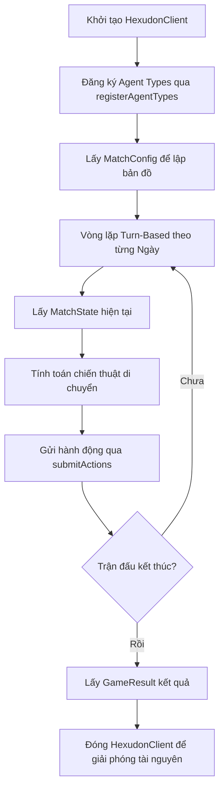

# Hexudon Java SDK

Thư viện Java SDK chính thức hỗ trợ kết nối, tương tác và điều khiển các Agent trong hệ thống **Hexudon Game Server**. SDK này được module hóa hoàn toàn (Java Platform Module System - JPMS), giúp các đội chơi lập trình Bot dễ dàng tích hợp, gửi hành động và nhận thông tin trận đấu theo thời gian thực với tính đóng gói cao.

---

## 1. Yêu cầu hệ thống & Cài đặt

### Yêu cầu môi trường
* **Java Version**: JDK 21 hoặc cao hơn.
* **Build Tool**: Maven (3.9.x+) hoặc Gradle.

### Maven Dependency
Thêm dependency sau vào file `pom.xml` của dự án của bạn:

```xml
<dependency>
    <groupId>com.naprock</groupId>
    <artifactId>hexudon-sdk</artifactId>
    <version>1.0.0</version>
</dependency>
```

### Công nghệ sử dụng & Dependencies chính
SDK sử dụng các thư viện hiệu năng cao, hiện đại và ổn định sau:
* **Jackson Databind** (`2.20.0`) - Cho việc serialize/deserialize dữ liệu JSON.
* **OkHttp** (`4.12.0`) - Client HTTP hỗ trợ kết nối hiệu năng cao và tự động thử lại.
* **Okio JVM** (`3.6.0`) - Hỗ trợ I/O hiệu năng cao và giải quyết xung đột module trong JPMS.
* **Kotlin Stdlib** (`1.9.25`) - Dependency cần thiết cho OkHttp chạy trên Module Path.

---

## 2. Kiến trúc & Cấu trúc Package

Dự án sử dụng cơ chế đóng gói chặt chẽ của **Java Platform Module System (JPMS)**. Tất cả các implementation chi tiết nằm trong package `com.naprock.hexudon.sdk.internal.*` đều được ẩn hoàn toàn (encapsulated) đối với ứng dụng bên ngoài. 

Ứng dụng của bạn chỉ có thể truy cập các package được export chính thức được khai báo trong `module-info.java`:

```java
module com.naprock.hexudon.sdk {
    exports com.naprock.hexudon.sdk.api;
    exports com.naprock.hexudon.sdk.config;
    exports com.naprock.hexudon.sdk.model;
    exports com.naprock.hexudon.sdk.exception;
}
```

### Sơ đồ cấu trúc package:

```text
com.naprock.hexudon.sdk
├── api            # Các Interface API chính và Builder tạo Client (HexudonClient, GameApi, PracticeApi)
├── config         # Cấu hình kết nối, timeout và cơ chế Retry (HexudonConfig, HttpClientConfig, RetryConfig)
├── exception      # Hệ thống ngoại lệ xử lý lỗi mạng, xác thực, validate dữ liệu (HexudonException, v.v.)
├── model          # Các Domain Model, Enum dùng chung (Coordinate, Agent, Team, TerrainType, v.v.)
└── internal       # [Kín] Các DTO request/response, HTTP Engine (OkHttp), Mapper, Custom Serializers
```

### Trách nhiệm của các package công khai (Public Packages):
* **`api`**: Cung cấp các điểm truy cập chính (`HexudonClient`). Người dùng tương tác với hệ thống qua các API đã định nghĩa tại đây.
* **`config`**: Quản lý cấu hình tĩnh như URL server, credentials, cũng như hành vi HTTP (Timeout, Retry).
* **`exception`**: Định nghĩa cây ngoại lệ giúp ứng dụng bắt lỗi chuẩn xác (xác thực sai, lỗi server, lỗi kết nối mạng, lỗi validate dữ liệu từ server).
* **`model`**: Đóng gói các kiểu dữ liệu nghiệp vụ, bản đồ, thông tin Agent và hình học lưới lục giác để Bot tính toán di chuyển.

---

## 3. Cấu hình SDK (`HexudonConfig`)

Lớp `HexudonConfig` (dạng `record` bất biến) quản lý cấu hình hoạt động của SDK. Bạn nên tạo cấu hình này thông qua `HexudonConfigBuilder` hoặc cấu hình trực tiếp từ `HexudonClientBuilder`.

### Các thuộc tính cấu hình

| Thuộc tính | Kiểu dữ liệu | Bắt buộc | Giá trị mặc định | Mô tả |
| :--- | :--- | :---: | :--- | :--- |
| `baseUrl` | `String` | Không | `http://localhost:8080` | URL của Hexudon Server. Phải bắt đầu bằng `http://` hoặc `https://`. Tự động phân giải từ biến môi trường `HEXUDON_BASE_URL` nếu có. |
| `teamId` | `String` | **Có** | *Không* | Mã định danh duy nhất của đội chơi. |
| `token` | `String` | **Có** | *Không* | Token xác thực (Bearer Token). |
| `practice` | `boolean` | Không | `false` | Bật/tắt chế độ luyện tập (Practice Mode). |
| `enableLogging`| `boolean` | Không | `true` | Bật/tắt HTTP logging để theo dõi các request/response thô từ SDK. |
| `httpClientConfig`| `HttpClientConfig` | Không | `HttpClientConfig.DEFAULT` | Cấu hình thời gian timeout cho HTTP Client. |
| `retryConfig` | `RetryConfig` | Không | `RetryConfig.DEFAULT` | Cấu hình tự động gửi lại yêu cầu khi gặp lỗi server 5xx hoặc lỗi mạng tạm thời. |

### Cấu hình HTTP Timeout (`HttpClientConfig`)
Cũng là một `record` bất biến gồm các thuộc tính:
* `connectTimeoutMs` (Mặc định `5,000` ms): Thời gian chờ kết nối tối đa.
* `readTimeoutMs` (Mặc định `10,000` ms): Thời gian chờ đọc phản hồi tối đa.
* `writeTimeoutMs` (Mặc định `10,000` ms): Thời gian chờ ghi dữ liệu tối đa.

### Cấu hình Retry (`RetryConfig`)
Khi server gặp sự cố hoặc kết nối mạng bị gián đoạn, SDK sẽ tự động thử lại dựa trên thuật toán Exponential Backoff:
* `maxRetries` (Mặc định `3` lần): Số lần thử lại tối đa.
* `retryDelayMs` (Mặc định `1,000` ms): Thời gian trễ ban đầu giữa các lần thử lại.
* `retryMultiplier` (Mặc định `2.0`): Hệ số nhân thời gian trễ tăng dần qua mỗi lần thất bại (ví dụ: trễ 1s -> 2s -> 4s).

---

## 4. Chi tiết Public API

### 4.1. Khởi tạo Client: `HexudonClient`
Quản lý vòng đời kết nối và cung cấp các API tương tác.

```java
public interface HexudonClient extends AutoCloseable {
    // Khởi tạo Builder thiết lập client
    static HexudonClientBuilder builder() { ... }
    
    // Lấy API tương tác trận đấu chính thức
    GameApi game();
    
    // Lấy API tương tác phòng luyện tập
    PracticeApi practice();
    
    // Giải phóng tài nguyên HTTP client khi đóng ứng dụng
    @Override
    void close() throws Exception;
}
```

---

### 4.2. Trận đấu chính thức: `GameApi`
Sử dụng các phương thức này trong các ngày thi đấu chính thức.

#### `void registerAgentTypes(String gameId, TeamRegistration registration)`
Đăng ký các loại Agent cho đội chơi trước khi trận đấu bắt đầu.
* **Tham số**: 
  - `gameId`: ID trận đấu.
  - `registration`: Đối tượng `TeamRegistration` chứa mã đội chơi (`teamId`) và danh sách các vai trò Agent (`types` nhận giá trị từ `AgentType` enum).
* **Ngoại lệ**: `HexudonValidationException`, `HexudonAuthenticationException`, `HexudonNetworkException`, `HexudonServerException`.

#### `MatchConfig getMatchConfig(String gameId)`
Lấy cấu hình tĩnh của trận đấu (bản đồ, danh sách điểm thu hoạch Udon, giới hạn nhiên liệu, v.v.).
* **Tham số**: `gameId` - ID trận đấu.
* **Trả về**: Đối tượng `MatchConfig`.

#### `MatchState getMatchState(String gameId)`
Lấy trạng thái động hiện tại của trận đấu (vị trí các Agent của ta, đối thủ nhìn thấy được, tình trạng giao thông trên các ô đường bộ, ngày đấu hiện tại).
* **Tham số**: `gameId` - ID trận đấu.
* **Trả về**: Đối tượng `MatchState`.

#### `void submitActions(String gameId, SubmitActions actions)`
Gửi danh sách các bước hành động kế tiếp của các Agent cho ngày đấu hiện tại.
* **Tham số**: 
  - `gameId`: ID trận đấu.
  - `actions`: Đối tượng `SubmitActions` gồm ngày hiện tại (`day`) và danh sách các chuỗi hành động di chuyển (`List<List<GameAction>>`).
* **Ngoại lệ**: Ném ra `HexudonValidationException` nếu hành động không hợp lệ hoặc vượt quá giới hạn bước di chuyển cho phép của ngày đấu đó.

#### `DayInfo getDayInfo(String gameId)`
Lấy thông tin đồng bộ hóa ngày thi đấu hiện tại từ server.
* **Tham số**: `gameId` - ID trận đấu.
* **Trả về**: Đối tượng `DayInfo`.

#### `GameResult getGameResult(String gameId)`
Lấy kết quả chung cuộc khi trận đấu kết thúc.
* **Tham số**: `gameId` - ID trận đấu.
* **Trả về**: Đối tượng `GameResult` chứa ID đội thắng cuộc và bảng điểm của các đội chơi.

---

### 4.3. Phòng luyện tập: `PracticeApi`
Dành riêng cho việc kiểm thử chiến thuật, sao chép tiến trình hoặc reset trạng thái game luyện tập.

#### `void submitPracticeActions(String gameId, SubmitActions actions)`
Gửi danh sách hành động lập lịch cho các Agent trong phòng tập.
* **Tham số**: 
  - `gameId`: ID trận đấu luyện tập.
  - `actions`: Đối tượng `SubmitActions` chứa thông tin ngày và các hành động của Agent.

#### `String getPracticePeerState(String gameId)`
Lấy dữ liệu thô (chuỗi JSON) chứa lịch sử thi đấu (replay) của các đội đối thủ trong phòng luyện tập để phân tích chiến thuật.
* **Tham số**: `gameId` - ID trận đấu.
* **Trả về**: Chuỗi JSON thô chứa dữ liệu replay.

#### `void copyPracticeState(String gameId, String fromGameId, String fromTeamId, int uptoDay)`
Sao chép tiến trình thi đấu từ một trận đấu luyện tập của đội khác để tiến hành chạy thử nghiệm.
* **Tham số**:
  - `gameId`: ID trận đấu hiện tại của bạn.
  - `fromGameId`: ID trận đấu nguồn muốn sao chép.
  - `fromTeamId`: ID đội chơi muốn sao chép.
  - `uptoDay`: Ngày thi đấu giới hạn muốn sao chép đến (ví dụ: sao chép đến hết Ngày 5).

#### `void resetPractice(String gameId)`
Khởi động lại toàn bộ trận đấu luyện tập về ngày đầu tiên (Day 0) với trạng thái ban đầu để kiểm thử lại từ đầu.
* **Tham số**: `gameId` - ID trận đấu luyện tập.

---

## 5. Quy trình sử dụng SDK & Vòng đời Client

Quy trình vận hành chuẩn của Bot khi tích hợp SDK như sau:



### Ví dụ Code Java 21 Hoàn Chỉnh

Dưới đây là mã nguồn một chương trình Java hoàn chỉnh mô tả vòng lặp chơi game tự động sử dụng chính xác các public API và domain models của SDK:

```java
import com.naprock.hexudon.sdk.api.HexudonClient;
import com.naprock.hexudon.sdk.api.GameApi;
import com.naprock.hexudon.sdk.exception.HexudonException;
import com.naprock.hexudon.sdk.exception.HexudonValidationException;
import com.naprock.hexudon.sdk.model.*;

import java.util.List;

public class HexudonBotApp {

    public static void main(String[] args) {
        String baseUrl = "http://localhost:8080";
        String token = "your-team-secret-token";
        String teamId = "team-alpha-id";
        String gameId = "match-101";

        // 1. Khởi tạo Client bằng Try-With-Resources để tự động close giải phóng tài nguyên
        try (HexudonClient client = HexudonClient.builder()
                .baseUrl(baseUrl)
                .token(token)
                .teamId(teamId)
                .practice(false) // Đặt true nếu chạy phòng luyện tập
                .enableLogging(true)
                .build()) {

            GameApi gameApi = client.game();

            // 2. Đăng ký loại Agent (ví dụ đội hình có 2 Patrol và 2 Refuel)
            System.out.println("Đang đăng ký đội chơi...");
            TeamRegistration registration = new TeamRegistration(
                    teamId,
                    List.of(
                            AgentType.PATROL,
                            AgentType.REFUEL,
                            AgentType.PATROL,
                            AgentType.REFUEL
                    )
            );
            gameApi.registerAgentTypes(gameId, registration);
            System.out.println("Đăng ký đội chơi thành công!");

            // 3. Lấy cấu hình trận đấu
            MatchConfig config = gameApi.getMatchConfig(gameId);
            System.out.printf("Bản đồ kích thước: %d x %d%n", config.mapWidth(), config.mapHeight());

            // 4. Vòng lặp chính của Game
            boolean isRunning = true;
            int lastSubmittedDay = -1;

            while (isRunning) {
                try {
                    MatchState state = gameApi.getMatchState(gameId);

                    // Kiểm tra trạng thái trận đấu
                    if (state.status() == MatchStatus.FINISHED) {
                        System.out.println("Trận đấu đã kết thúc!");
                        
                        // Lấy kết quả trận đấu chung cuộc
                        GameResult result = gameApi.getGameResult(gameId);
                        System.out.printf("Đội chiến thắng: %s%n", result.winner());
                        System.out.println("Bảng điểm chung cuộc:");
                        result.scores().forEach((team, score) -> 
                            System.out.printf("- %s: %d điểm%n", team, score)
                        );
                        
                        isRunning = false;
                        break;
                    }

                    int currentDay = state.day();

                    if (state.status() == MatchStatus.PLAYING && currentDay > lastSubmittedDay) {
                        System.out.printf("--- BẮT ĐẦU NGÀY %d ---%n", currentDay);

                        // Lấy thông tin đồng bộ ngày hiện tại
                        DayInfo dayInfo = gameApi.getDayInfo(gameId);
                        System.out.printf("Trạng thái ngày đấu: %s%n", dayInfo.status());

                        // Lập kế hoạch hành động di chuyển cho các Agent của đội ta
                        // Sử dụng MoveAction (di chuyển theo hướng Direction) hoặc WaitAction (đứng yên N bước)
                        // Ví dụ: Agent 0 di chuyển RIGHT sau đó UP_RIGHT
                        //        Agent 1 đứng yên 1 lượt
                        //        Agent 2 di chuyển LEFT
                        //        Agent 3 đứng yên 2 lượt
                        List<List<GameAction>> agentActions = List.of(
                                List.of(new MoveAction(Direction.RIGHT), new MoveAction(Direction.UP_RIGHT)),
                                List.of(new WaitAction(1)),
                                List.of(new MoveAction(Direction.LEFT)),
                                List.of(new WaitAction(2))
                        );

                        SubmitActions submitActions = new SubmitActions(currentDay, agentActions);

                        System.out.println("Đang gửi hành động của các Agent...");
                        gameApi.submitActions(gameId, submitActions);

                        lastSubmittedDay = currentDay;
                        System.out.printf("Gửi hành động thành công cho ngày %d!%n", currentDay);
                    }

                    // Tạm dừng 1 giây trước khi truy vấn lượt mới (Polling)
                    Thread.sleep(1000);

                } catch (HexudonValidationException e) {
                    System.err.println("Dữ liệu gửi lên không hợp lệ: " + e.getMessage());
                    System.err.println("Chi tiết lỗi validation từ Server:");
                    for (HexudonValidationException.ValidationErrorDetail detail : e.getErrorResponse().detail()) {
                        System.err.printf("- Vị trí: %s | Lỗi: %s | Kiểu: %s%n", 
                                detail.loc(), detail.msg(), detail.type());
                    }
                    isRunning = false;
                } catch (HexudonException e) {
                    System.err.println("Lỗi nghiệp vụ SDK: " + e.getMessage());
                    isRunning = false;
                } catch (InterruptedException e) {
                    Thread.currentThread().interrupt();
                    isRunning = false;
                }
            }

        } catch (Exception e) {
            System.err.println("Lỗi hệ thống hoặc kết nối: " + e.getMessage());
            e.printStackTrace();
        }
    }
}
```

---

## 6. Mô hình Lưới Lục Giác & Thuật toán Hình học

Hệ thống lưới bản đồ trong Hexudon sử dụng kiểu lưới lục giác xếp gạch ngang hàng lẻ bị lệch (**Odd-R Offset Horizontal Hexagonal Grid**).

### Tọa độ (`Coordinate`)
Lớp `Coordinate` (dạng `record`) đóng gói các tọa độ lưới:
* `pos`: Chỉ số tuyến tính 1D của ô trên bản đồ (tính bằng `y * width + x`).
* `x`: Tọa độ cột (0-indexed).
* `y`: Tọa độ hàng (0-indexed).

#### Các phương thức tiện ích trong `Coordinate`:
* **`distanceTo(Coordinate other)`**: Tính khoảng cách ngắn nhất (số bước đi tối thiểu) giữa hai ô lục giác. Hệ thống tự động chuyển đổi tọa độ Odd-R sang hệ tọa độ 3 chiều (Cube Coordinates) để tính toán chính xác tuyệt đối:
  $$\text{Khoảng cách} = \frac{|dx| + |dy| + |dz|}{2}$$
* **`getNeighbor(Direction direction, int width)`**: Tìm tọa độ ô lân cận dựa vào hướng di chuyển. Tự động xử lý độ lệch hàng chẵn/lẻ đặc trưng của lưới Odd-R.

### Hướng di chuyển (`Direction`)
Bao gồm 6 hướng tương thích trực tiếp với giao thức server:
* `UP_LEFT` (0)
* `UP_RIGHT` (1)
* `RIGHT` (2)
* `DOWN_RIGHT` (3)
* `DOWN_LEFT` (4)
* `LEFT` (5)

---

## 7. Các Đối Tượng Dữ Liệu Phản Hồi từ Server

### Địa hình (`TerrainType`)
Mỗi ô trên bản đồ có một loại địa hình quyết định khả năng di chuyển và lượng tiêu thụ nhiên liệu cơ bản:

| Địa hình | ID | Đi qua được? | Chi phí bước đi cơ bản (Base Step Cost) | Nhiên liệu tiêu hao cơ bản (Base Fuel Cost) |
| :--- | :---: | :---: | :---: | :---: |
| **`PLAIN`** | 0 | Có | 2 | 1 |
| **`ROAD`** | 1 | Có | 1 | 2 |
| **`MOUNTAIN`**| 2 | Có | 3 | 2 |
| **`POND`** | 3 | **Không** | Vô hạn | Vô hạn |

### Trạng thái giao thông (`TrafficLevel`)
Trạng thái ùn tắc giao thông trên các ô địa hình **`ROAD`** sẽ thay đổi động qua từng ngày đấu dựa vào tần suất di chuyển của các đội chơi. Trạng thái giao thông sẽ nhân hệ số lên chi phí bước đi của ô đó:
* **`SMOOTH`** (0): Hệ số nhân chi phí bước đi x1 (không đổi).
* **`CONGESTED`** (1): Hệ số nhân chi phí bước đi x2.
* **`JAM`** (2): Hệ số nhân chi phí bước đi x4.

Các loại địa hình khác ngoài `ROAD` luôn giữ nguyên chi phí bước đi cơ bản bất kể mức độ giao thông.

---

## 8. Xử lý Ngoại lệ (Exception Handling)

Tất cả các ngoại lệ do SDK ném ra đều kế thừa từ lớp `HexudonException` (RuntimeException).

```text
HexudonException (Ngoại lệ cơ sở)
├── HexudonAuthenticationException (Lỗi 401/403: Token sai, hết hạn hoặc không đủ quyền)
├── HexudonNetworkException        (Lỗi kết nối mạng, Timeout, Đứt socket TCP)
├── HexudonSerializationException  (Lỗi khi Jackson parse/build JSON)
├── HexudonServerException         (Lỗi 5xx hoặc máy chủ gặp sự cố sau khi đã thử lại tối đa)
└── HexudonValidationException     (Lỗi 400/422: Dữ liệu gửi lên không đúng định dạng hoặc vi phạm luật chơi)
```

### Mẹo xử lý lỗi Validation:
Khi bắt được `HexudonValidationException`, bạn có thể lấy danh sách chi tiết các lỗi cụ thể bằng cách gọi `e.getErrorResponse()`. Đối tượng `ErrorResponse` này chứa danh sách các `ValidationErrorDetail` chứa:
* `loc()`: Danh sách các trường bị lỗi định vị (ví dụ: `["body", "actions", "0", "1"]`).
* `msg()`: Nội dung thông báo lỗi chi tiết từ server (ví dụ: *"Invalid direction"*).
* `type()`: Kiểu lỗi validate.

---

## 9. Hướng dẫn Build dự án

### Build thư viện
Để biên dịch dự án và đóng gói thành file JAR:
```bash
mvn clean package
```

### Chạy Unit Test
SDK đi kèm với bộ kiểm thử 234 test cases bao phủ toàn bộ các module. Chạy lệnh sau để kiểm tra:
```bash
mvn test
```

