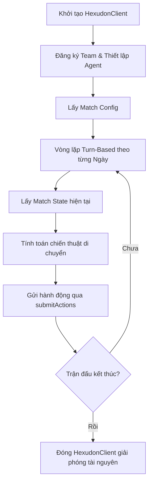

# Hexudon Java SDK

Thư viện Java SDK chính thức hỗ trợ kết nối, tương tác và điều khiển các Agent trong hệ thống **Hexudon Game Server**. SDK này giúp các đội chơi lập trình Bot dễ dàng tích hợp, gửi hành động và nhận thông tin trận đấu theo thời gian thực.

---

## 1. Yêu cầu hệ thống & Cài đặt

### Yêu cầu
* **Java Version**: Java 21 hoặc cao hơn.
* **Build Tool**: Maven (3.9.x+) hoặc Gradle.

### Maven Dependency
Thêm dependency sau vào file `pom.xml` của dự án của bạn:

```xml
<dependency>
    <groupId>com.naprock</groupId>
    <artifactId>hexudon-sdk</artifactId>
    <version>1.0.0</version>
</dependency>
```

### Dependencies chính của SDK
SDK sử dụng các thư viện phổ biến và ổn định sau:
* **Jackson Databind** (`2.20.0`) - Cho việc serialize/deserialize dữ liệu JSON.
* **OkHttp** (`4.12.0`) - Client HTTP hiệu năng cao hỗ trợ kết nối và tự động thử lại.

---

## 2. Kiến trúc & Cấu trúc Package

Dự án SDK được chia thành các package chuyên biệt để cô lập trách nhiệm rõ ràng:

```text
com.naprock.hexudon.sdk
├── api            # Các Interface API chính và Builder tạo Client (HexudonClient, GameApi, PracticeApi)
├── config         # Cấu hình kết nối, timeout và cơ chế Retry
├── exception      # Hệ thống ngoại lệ (Exceptions) xử lý lỗi mạng, xác thực, validate dữ liệu
├── model          # Các Domain Model, Enum dùng chung (Coordinate, Direction, TerrainType, v.v.)
│   ├── request    # DTO chứa dữ liệu gửi lên Game Server
│   └── response   # DTO chứa dữ liệu trả về từ Game Server
├── serialization  # Xử lý JSON Mapper nội bộ
└── http           # Triển khai tầng giao tiếp HTTP (OkHttp) ẩn dưới API
```

### Trách nhiệm của các package chính:
* **`api`**: Cung cấp entry point chính (`HexudonClient`). Người dùng chỉ tương tác với các Interface trong package này để gửi nhận dữ liệu.
* **`config`**: Quản lý cấu hình tĩnh như URL server, credentials, cũng như hành vi HTTP (Timeout, Retry).
* **`exception`**: Định nghĩa rõ ràng các lỗi xảy ra trong quá trình gọi API giúp ứng dụng bắt lỗi chuẩn xác (xác thực sai, lỗi server, lỗi kết nối mạng...).
* **`model`**: Đóng gói các kiểu dữ liệu và hình học lưới lục giác giúp Bot tính toán khoảng cách và di chuyển.

---

## 3. Cấu hình SDK (`HexudonConfig`)

Lớp `HexudonConfig` (dạng `record` bất biến) đóng vai trò cấu hình toàn bộ hành vi của SDK client. Bạn nên tạo nó thông qua `HexudonConfigBuilder` hoặc cấu hình trực tiếp từ `HexudonClientBuilder`.

### Các thuộc tính cấu hình

| Thuộc tính | Kiểu dữ liệu | Bắt buộc | Giá trị mặc định | Mô tả |
| :--- | :--- | :---: | :--- | :--- |
| `baseUrl` | `String` | Không | `http://localhost:8080` | URL của Hexudon Server. Phải bắt đầu bằng `http://` hoặc `https://`. Có thể cấu hình qua biến môi trường `HEXUDON_BASE_URL`. |
| `teamId` | `String` | **Có** | *Không* | Mã định danh duy nhất của đội chơi. Gửi qua HTTP Header `X-Team-Id`. |
| `token` | `String` | **Có** | *Không* | Bearer Token dùng để xác thực. Gửi qua HTTP Header `Authorization`. |
| `practice` | `boolean` | Không | `false` | Bật/tắt chế độ luyện tập (Practice Mode). |
| `enableLogging`| `boolean` | Không | `true` | Bật/tắt HTTP logging để theo dõi các request/response thô. |
| `httpClientConfig`| `HttpClientConfig` | Không | `HttpClientConfig.DEFAULT` | Cấu hình thời gian timeout cho HTTP Client. |
| `retryConfig` | `RetryConfig` | Không | `RetryConfig.DEFAULT` | Cấu hình tự động gửi lại yêu cầu khi gặp lỗi server 5xx. |

### Cấu hình HTTP Timeout (`HttpClientConfig`)
* `connectTimeoutMs` (Mặc định `5,000` ms): Thời gian chờ kết nối tối đa.
* `readTimeoutMs` (Mặc định `10,000` ms): Thời gian chờ đọc phản hồi tối đa.
* `writeTimeoutMs` (Mặc định `10,000` ms): Thời gian chờ ghi dữ liệu tối đa.

### Cấu hình Retry (`RetryConfig`)
Khi server gặp sự cố tạm thời (lỗi HTTP 5xx như 500, 502, 503, 504), SDK sẽ tự động thử lại dựa trên cấu hình:
* `maxRetries` (Mặc định `3` lần): Số lần thử lại tối đa.
* `retryDelayMs` (Mặc định `1,000` ms): Thời gian trễ ban đầu giữa các lần thử lại.
* `retryMultiplier` (Mặc định `2.0`): Hệ số nhân thời gian trễ theo thuật toán Exponential Backoff (ví dụ: trễ 1s -> 2s -> 4s).

---

## 4. Chi tiết Public API

### 4.1. Entry Point: `HexudonClient`
Quản lý vòng đời kết nối và cung cấp các API để giao tiếp với Server.

```java
public interface HexudonClient extends AutoCloseable {
    // Khởi tạo Builder thiết lập client
    static HexudonClientBuilder builder() { ... }
    
    // Lấy API tương tác trận đấu chính thức
    GameApi game();
    
    // Lấy API tương tác phòng luyện tập
    PracticeApi practice();
    
    // Giải phóng tài nguyên HTTP client khi đóng ứng dụng
    @Override
    void close();
}
```

---

### 4.2. Trận đấu chính thức: `GameApi`
Sử dụng các phương thức này trong các ngày thi đấu chính thức.

#### `void registerTeam(TeamRegisterRequest request)`
Đăng ký các loại Agent cho đội chơi trước khi trận đấu bắt đầu.
* **Tham số**: `TeamRegisterRequest` chứa danh sách kiểu Agent (`types`: `0` cho PATROL, `1` cho REFUEL).
* **Ngoại lệ có thể xảy ra**: `HexudonValidationException`, `HexudonAuthenticationException`, `HexudonNetworkException`, `HexudonServerException`.

#### `MatchConfigResponse getMatchConfig(String gameId)`
Lấy cấu hình bản đồ, danh sách điểm thu hoạch Udon và giới hạn nhiên liệu của trận đấu.
* **Tham số**: `gameId` (String) - ID trận đấu.
* **Trả về**: `MatchConfigResponse`.

#### `MatchStateResponse getMatchState(String gameId)`
Lấy trạng thái hiện tại của trận đấu (vị trí Agent của ta, đối thủ nhìn thấy được, tình trạng giao thông trên các ô đường bộ).
* **Tham số**: `gameId` (String) - ID trận đấu.
* **Trả về**: `MatchStateResponse`.

#### `void submitActions(SubmitActionRequest request)`
Gửi danh sách các bước di chuyển kế tiếp của các Agent cho ngày đấu hiện tại.
* **Tham số**: `SubmitActionRequest` gồm ngày hiện tại và danh sách hướng đi của từng Agent.
* **Ngoại lệ**: Sẽ ném ra `HexudonValidationException` nếu đường đi không hợp lệ hoặc vượt quá giới hạn bước di chuyển của ngày đấu đó.

---

### 4.3. Phòng luyện tập: `PracticeApi`
Dành riêng cho việc kiểm thử chiến thuật, sao chép hoặc reset trạng thái game.

#### `void submitPracticeActions(PracticeSubmitRequest request)`
Gửi danh sách hành động lập lịch trong phòng tập.
* **Tham số**: `PracticeSubmitRequest` (chứa `gameId`, `day`, và danh sách hành động `actions`).

#### `String getPracticePeerState(String gameId)`
Lấy lịch sử đấu (replay) của các đội đối thủ trong phòng luyện tập để phân tích.
* **Tham số**: `gameId` (String).
* **Trả về**: Chuỗi JSON thô chứa dữ liệu replay.

#### `void copyPracticeState(PracticeCopyRequest request)`
Sao chép tiến trình thi đấu từ một trận đấu luyện tập của đội khác để chạy thử nghiệm.
* **Tham số**: `PracticeCopyRequest` (chứa `gameId`, `fromGameId`, `fromTeamId`, `uptoDay`).

#### `void resetPractice(String gameId)`
Khởi động lại trận đấu luyện tập về ngày đầu tiên (Day 1) với trạng thái ban đầu.
* **Tham số**: `gameId` (String).

---

## 5. Quy trình sử dụng SDK & Vòng đời Client

Quy trình vận hành chuẩn của Bot khi tích hợp SDK như sau:



### Ví dụ Code Java Hoàn Chỉnh

Dưới đây là một chương trình Java hoàn chỉnh mô tả vòng lặp chơi game tự động:

```java
import com.naprock.hexudon.sdk.api.HexudonClient;
import com.naprock.hexudon.sdk.api.GameApi;
import com.naprock.hexudon.sdk.config.HexudonConfig;
import com.naprock.hexudon.sdk.exception.HexudonException;
import com.naprock.hexudon.sdk.exception.HexudonValidationException;
import com.naprock.hexudon.sdk.model.AgentType;
import com.naprock.hexudon.sdk.model.Direction;
import com.naprock.hexudon.sdk.model.MatchStatus;
import com.naprock.hexudon.sdk.model.request.SubmitActionRequest;
import com.naprock.hexudon.sdk.model.request.TeamRegisterRequest;
import com.naprock.hexudon.sdk.model.response.MatchConfigResponse;
import com.naprock.hexudon.sdk.model.response.MatchStateResponse;

import java.util.List;

public class HexudonBotApp {

    public static void main(String[] args) {
        String baseUrl = "http://localhost:8080";
        String token = "your-team-secret-token";
        String teamId = "team-alpha-id";
        String gameId = "match-101";

        // 1. Khởi tạo Client bằng Try-With-Resources để tự động close
        try (HexudonClient client = HexudonClient.builder()
                .baseUrl(baseUrl)
                .token(token)
                .teamId(teamId)
                .practice(false)
                .enableLogging(true)
                .build()) {

            GameApi gameApi = client.game();

            // 2. Đăng ký loại Agent (ví dụ đội hình có 2 Patrol và 2 Refuel)
            System.out.println("Đang đăng ký đội chơi...");
            TeamRegisterRequest registerRequest = new TeamRegisterRequest(
                    List.of(
                            AgentType.PATROL.getValue(),
                            AgentType.REFUEL.getValue(),
                            AgentType.PATROL.getValue(),
                            AgentType.REFUEL.getValue()
                    )
            );
            gameApi.registerTeam(registerRequest);
            System.out.println("Đăng ký đội chơi thành công!");

            // 3. Lấy cấu hình trận đấu
            MatchConfigResponse config = gameApi.getMatchConfig(gameId);
            System.out.printf("Bản đồ kích thước: %d x %d%n", config.mapWidth(), config.mapHeight());

            // 4. Vòng lặp chính của Game
            boolean isRunning = true;
            int lastSubmittedDay = -1;

            while (isRunning) {
                try {
                    MatchStateResponse state = gameApi.getMatchState(gameId);

                    // Kiểm tra trạng thái trận đấu
                    if (state.status() == MatchStatus.FINISHED) {
                        System.out.println("Trận đấu đã kết thúc!");
                        isRunning = false;
                        break;
                    }

                    int currentDay = state.day();

                    if (state.status() == MatchStatus.PLAYING && currentDay > lastSubmittedDay) {
                        System.out.printf("--- BẮT ĐẦU NGÀY %d ---%n", currentDay);

                        // Lập kế hoạch hành động di chuyển cho các Agent
                        // Hướng di chuyển tương ứng: 0 = UP_RIGHT, 1 = RIGHT, 2 = DOWN_RIGHT, ...
                        // Số âm thể hiện hành động ĐỨNG YÊN (WAIT) trong N bước (ví dụ: -1 là đợi 1 bước)
                        List<List<Integer>> agentActions = List.of(
                                List.of(Direction.RIGHT.ordinal(), Direction.UP_RIGHT.ordinal()), // Agent 0 di chuyển
                                List.of(-1),                                                     // Agent 1 đứng yên 1 lượt
                                List.of(Direction.LEFT.ordinal()),                                // Agent 2 di chuyển
                                List.of(-2)                                                      // Agent 3 đứng yên 2 lượt
                        );

                        SubmitActionRequest actionRequest = new SubmitActionRequest(currentDay, agentActions);
                        
                        System.out.println("Đang gửi hành động của các Agent...");
                        gameApi.submitActions(actionRequest);
                        
                        lastSubmittedDay = currentDay;
                        System.out.printf("Gửi hành động thành công cho ngày %d!%n", currentDay);
                    }

                    // Tạm dừng 1 giây trước khi truy vấn lượt mới (Polling)
                    Thread.sleep(1000);

                } catch (HexudonValidationException e) {
                    System.err.println("Dữ liệu gửi lên không hợp lệ: " + e.getMessage());
                    System.err.println("Chi tiết lỗi validation từ Server: " + e.getErrorResponse());
                    isRunning = false;
                } catch (HexudonException e) {
                    System.err.println("Lỗi nghiệp vụ SDK: " + e.getMessage());
                    isRunning = false;
                } catch (InterruptedException e) {
                    Thread.currentThread().interrupt();
                    isRunning = false;
                }
            }

        } catch (Exception e) {
            System.err.println("Lỗi hệ thống hoặc kết nối: " + e.getMessage());
            e.printStackTrace();
        }
    }
}
```

---

## 6. Mô hình Lưới Lục Giác & Thuật toán Hình học

Hệ thống lưới bản đồ trong Hexudon sử dụng kiểu lưới lục giác xếp gạch ngang hàng lẻ bị lệch (**Odd-R Offset Horizontal Hexagonal Grid**).

### Coordinate
Lớp `Coordinate` đóng gói các tọa độ lưới:
* `pos`: Chỉ số tuyến tính 1D của ô trên bản đồ (tính bằng `y * width + x`).
* `x`: Tọa độ cột (0-indexed).
* `y`: Tọa độ hàng (0-indexed).

#### Các phương thức tiện ích trong `Coordinate`:
* **`getDistance(Coordinate other)`**: Tính khoảng cách ngắn nhất (số bước đi tối thiểu) giữa hai ô lục giác. Hệ thống sẽ tự động chuyển đổi tọa độ Odd-R sang hệ tọa độ 3 chiều (Cube Coordinates) để tính toán chính xác:
  $$\text{Khoảng cách} = \frac{|dx| + |dy| + |dz|}{2}$$
* **`getNeighbor(Direction direction, int width)`**: Tìm tọa độ ô lân cận dựa vào hướng di chuyển. Tự động xử lý độ lệch hàng chẵn/lẻ của lưới Odd-R.

### Hướng di chuyển (`Direction`)
Bao gồm 6 hướng tương thích trực tiếp với server:
* `UP_RIGHT` (0)
* `RIGHT` (1)
* `DOWN_RIGHT` (2)
* `DOWN_LEFT` (3)
* `LEFT` (4)
* `UP_LEFT` (5)

---

## 7. Các Đối Tượng Dữ Liệu Phản Hồi từ Server

### Địa hình (`TerrainType`)
Mỗi ô trên bản đồ có một loại địa hình quyết định tính di chuyển và lượng tiêu thụ nhiên liệu:

| Địa hình | ID | Đi qua được? | Chi phí bước đi (Base Step Cost) | Nhiên liệu tiêu hao (Base Fuel Cost) |
| :--- | :---: | :---: | :---: | :---: |
| **`PLAIN`** | 0 | Có | 1 | 2 |
| **`ROAD`** | 1 | Có | 1 | 1 |
| **`MOUNTAIN`**| 2 | Có | 3 | 3 |
| **`POND`** | 3 | Không | Không thể | Không thể |

### Trạng thái giao thông (`TrafficLevel`)
Trạng thái ùn tắc giao thông trên các ô địa hình **`ROAD`** sẽ thay đổi động qua từng lượt đấu dựa vào tần suất di chuyển của các đội. Trạng thái giao thông sẽ nhân hệ số lên chi phí bước đi:
* **`NORMAL`** (0): Hệ số nhân chi phí bước đi x1.
* **`BUSY`** (1): Hệ số nhân chi phí bước đi x2.
* **`CONGESTED`** (2): Hệ số nhân chi phí bước đi x4.

---

## 8. Xử lý Ngoại lệ (Exception Handling)

Tất cả các ngoại lệ do SDK ném ra đều kế thừa từ lớp `HexudonException` (RuntimeException).

```text
HexudonException (Ngoại lệ cơ sở)
├── HexudonAuthenticationException (Lỗi 401/403: Token sai hoặc hết hạn)
├── HexudonNetworkException        (Lỗi kết nối mạng, Timeout, Đứt kết nối TCP)
├── HexudonServerException         (Lỗi 5xx từ phía server hoặc vượt quá số lần retry)
└── HexudonValidationException     (Lỗi 400/422: Dữ liệu gửi lên không đúng định dạng hoặc sai luật chơi)
```

### Mẹo xử lý lỗi Validation:
Khi gặp `HexudonValidationException`, bạn có thể lấy ra thông tin chi tiết các trường bị lỗi bằng cách gọi `e.getErrorResponse()`. Đối tượng này chứa một danh sách các lỗi nhỏ bao gồm:
* `loc`: Vị trí trường bị lỗi (ví dụ: `["actions", "0", "1"]`).
* `msg`: Nội dung thông báo lỗi từ server (ví dụ: *"Invalid direction"*).
* `type`: Kiểu lỗi validate.
