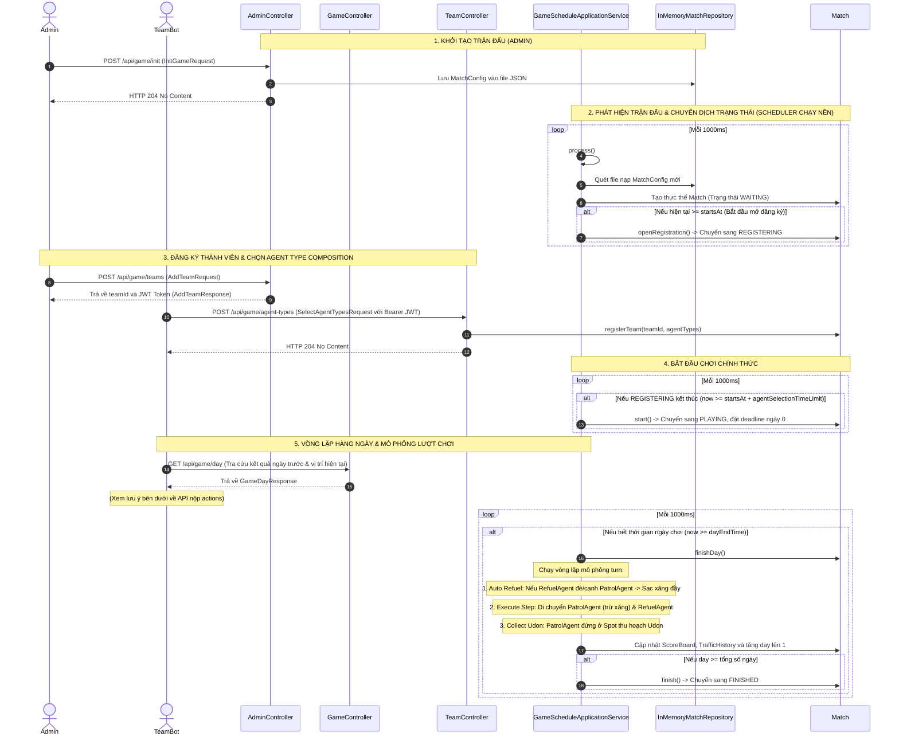

# Hexudon Server

Tài liệu này cung cấp hướng dẫn chi tiết về module `server` của dự án **Hexudon** dành cho các nhà phát triển. Module này đóng vai trò là Game Engine trung tâm để quản lý và mô phỏng các trận đấu Hexudon trên lưới lục giác.

---

## Overview

### 1. Vai trò của Server
`hexudon-server` là một ứng dụng backend Java Spring Boot đóng vai trò là **Game Engine** của hệ thống Hexudon. Nhiệm vụ chính của server bao gồm:
*   Quản lý vòng đời trận đấu thông qua các trạng thái (`WAITING`, `REGISTERING`, `PLAYING`, `FINISHED`).
*   Khởi tạo bản đồ lưới lục giác (Hexagonal Grid), tải cấu hình và tài nguyên (Udon spots) từ file JSON.
*   Quản lý danh sách các đội (`Team`) và các Agent (`PatrolAgent`, `RefuelAgent`).
*   Tiếp nhận đăng ký của các đội chơi, cấp mã định danh JWT và cấu hình loại Agent trước trận đấu qua REST API.
*   Tự động chạy chu kỳ vòng đấu (Turn Simulation) thông qua một Scheduler chạy nền để tự động phát hiện trận đấu mới, tính toán di chuyển, tiêu hao nhiên liệu, nạp nhiên liệu chéo và thu thập Udon của các Agent theo từng bước nhỏ.
*   Tính toán điểm số (`ScoreBoard`), lưu vết mật độ giao thông trên đường bộ (`TrafficHistory`) để cập nhật chi phí di chuyển động cho ngày chơi tiếp theo.

### 2. Tech Stack & Dependencies
*   **Java Version**: 21 (sử dụng các tính năng hiện đại như Records, Pattern Matching).
*   **Spring Boot Version**: 3.5.4
*   **Build Tool**: Maven 3.9+
*   **Dependencies quan trọng** (khai báo trong [server/pom.xml](file:///d:/Documents/GitHub/hexudon/server/pom.xml)):
    *   `spring-boot-starter-web`: Cung cấp các REST Controllers.
    *   `spring-boot-starter-validation`: Xác thực dữ liệu đầu vào của các REST DTOs (Jakarta Validation).
    *   `jjwt-api`, `jjwt-impl`, `jjwt-jackson` (v0.12.7): Cung cấp cơ chế tạo và xác thực mã JWT Token.
    *   `spring-boot-starter-test`: Thư viện kiểm thử (JUnit 5, AssertJ, Mockito).

---

## Architecture

Dự án tuân thủ nghiêm ngặt **Kiến trúc Lục giác (Hexagonal Architecture / Ports & Adapters)** và áp dụng các nguyên tắc của **Domain-Driven Design (DDD)**. Sự phân tách này đảm bảo Business Logic cốt lõi độc lập hoàn toàn với framework bên ngoài (Spring Boot, Jackson) và cơ sở hạ tầng lưu trữ.

```mermaid
graph TD
    subgraph Adapter Inbound (REST, Scheduler)
        AdminController --> |uses| GenerateMapUseCase
        AdminController --> |uses| InitializeGameUseCase
        AdminController --> |uses| DeleteGameUseCase
        AdminController --> |uses| AddTeamUseCase
        
        GameController --> |uses| GetGameBoardUseCase
        GameController --> |uses| GetGameDayUseCase
        GameController --> |uses| GetGameResultUseCase
        GameController --> |uses| GetGameListUseCase
        GameController --> |uses| GetGameStateUseCase

        TeamController --> |uses| GetGameConfigUseCase
        TeamController --> |uses| SelectAgentTypesUseCase

        GameScheduler --> |uses| ProcessGameScheduleUseCase
    end

    subgraph Application Core
        subgraph Inbound Ports (Use Cases)
            GenerateMapUseCase
            InitializeGameUseCase
            DeleteGameUseCase
            AddTeamUseCase
            GetGameBoardUseCase
            GetGameDayUseCase
            GetGameResultUseCase
            GetGameListUseCase
            GetGameStateUseCase
            GetGameConfigUseCase
            SelectAgentTypesUseCase
            SubmitActionsUseCase
            ProcessGameScheduleUseCase
        end

        subgraph Outbound Ports (SPI)
            MatchRepository
            MatchConfigRepository
            MatchConfigFileStore
            TokenValidator
        end

        AdminApplicationService -.-> |implements| AdminUseCases[GenerateMap/InitGame/DeleteGame/AddTeam UseCases]
        GameApplicationService -.-> |implements| GameUseCases[GetGameBoard/GetGameDay/GetGameResult/GetGameList/GetGameState UseCases]
        TeamApplicationService -.-> |implements| TeamUseCases[GetGameConfig/SelectAgentTypes/SubmitActions UseCases]
        GameScheduleApplicationService -.-> |implements| ProcessGameScheduleUseCase

        AdminApplicationService --> |uses| JwtTokenProvider[JwtTokenProvider]
        AdminApplicationService --> |calls| MatchConfigRepository
        AdminApplicationService --> |calls| MatchRepository
        
        GameApplicationService --> |calls| MatchConfigRepository
        GameApplicationService --> |calls| MatchRepository

        TeamApplicationService --> |calls| MatchConfigRepository
        TeamApplicationService --> |calls| MatchRepository

        GameScheduleApplicationService --> |calls| MatchConfigRepository
        GameScheduleApplicationService --> |calls| MatchRepository
    end

    subgraph Domain Model
        Match[Match Aggregate Root]
        MatchState[MatchState Entity]
        Team[Team Entity]
        Agent[Agent Entity]
        GameBoard[GameBoard Entity]
        TurnActionService[TurnActionService Domain Service]
        TrafficCalculationService[TrafficCalculationService Domain Service]
    end

    subgraph Adapter Outbound (Persistence, Security)
        InMemoryMatchRepository --> |implements| MatchRepository
        FileMatchConfigRepository --> |implements| MatchConfigRepository
        JsonMatchConfigFileStore --> |implements| MatchConfigFileStore
        JwtTokenValidator --> |implements| TokenValidator
    end

    InMemoryMatchRepository -.-> |stores| Match
    FileMatchConfigRepository --> |uses| JsonMatchConfigFileStore

    %% Dependency Styling
    classDef domain fill:#f9f,stroke:#333,stroke-width:2px;
    classDef application fill:#bbf,stroke:#333,stroke-width:2px;
    classDef adapter fill:#dfd,stroke:#333,stroke-width:2px;

    class Match,MatchState,Team,Agent,GameBoard,TurnActionService,TrafficCalculationService domain;
    class AdminApplicationService,GameApplicationService,TeamApplicationService,GameScheduleApplicationService,GenerateMapUseCase,InitializeGameUseCase,DeleteGameUseCase,AddTeamUseCase,GetGameBoardUseCase,GetGameDayUseCase,GetGameResultUseCase,GetGameListUseCase,GetGameStateUseCase,GetGameConfigUseCase,SelectAgentTypesUseCase,SubmitActionsUseCase,ProcessGameScheduleUseCase,MatchRepository,MatchConfigRepository,MatchConfigFileStore,TokenValidator application;
    class AdminController,GameController,TeamController,GameScheduler,InMemoryMatchRepository,FileMatchConfigRepository,JsonMatchConfigFileStore,JwtTokenValidator adapter;
```

### Chi tiết các Layer và Chiều Phụ thuộc (Dependency Direction)
1.  **Domain Layer** (Độc lập hoàn toàn với framework và các layer khác):
    *   Chứa mô hình nghiệp vụ cốt lõi, business rules và logic mô phỏng lượt chơi.
    *   Các thành phần chính: [Match](file:///d:/Documents/GitHub/hexudon/server/src/main/java/com/naprock/hexudon/domain/model/match/Match.java) (Aggregate Root), [MatchState](file:///d:/Documents/GitHub/hexudon/domain/model/match/MatchState.java) (Trạng thái và thời gian chơi), [Team](file:///d:/Documents/GitHub/hexudon/server/src/main/java/com/naprock/hexudon/domain/model/team/Team.java), [Agent](file:///d:/Documents/GitHub/hexudon/server/src/main/java/com/naprock/hexudon/domain/model/agent/Agent.java) (Patrol/Refuel), [GameBoard](file:///d:/Documents/GitHub/hexudon/server/src/main/java/com/naprock/hexudon/domain/model/board/GameBoard.java) và các Domain Services như [TurnActionService](file:///d:/Documents/GitHub/hexudon/server/src/main/java/com/naprock/hexudon/domain/service/TurnActionService.java).
2.  **Application Layer** (Chỉ phụ thuộc vào Domain Layer):
    *   Định nghĩa các luồng xử lý thông qua **Inbound Ports** (Use Cases) và giao tiếp với thế giới ngoài qua **Outbound Ports** (SPI).
    *   Các Application Services điều phối logic: nạp dữ liệu từ Outbound Ports, kích hoạt xử lý trên Domain Model/Domain Services và lưu lại trạng thái mới.
3.  **Adapter Layer** (Phụ thuộc vào Application và Domain Layer):
    *   **Inbound Adapters**: Lắng nghe yêu cầu từ bên ngoài và chuyển đổi sang dạng Use Case cần thiết. Ví dụ: REST Controllers (`AdminController`, `GameController`, `TeamController`) và nền chạy lập lịch Spring Scheduler (`GameScheduler`).
    *   **Outbound Adapters**: Triển khai các Outbound Ports để giao tiếp với hạ tầng như lưu trữ trạng thái trong bộ nhớ (`InMemoryMatchRepository`), đọc/ghi cấu hình từ file JSON (`FileMatchConfigRepository`, `JsonMatchConfigFileStore`) hoặc xác thực JWT Token (`JwtTokenValidator`).

---

## Domain Model

### 1. Phân loại và Trách nhiệm của các đối tượng Domain

| Class | Phân loại | Trách nhiệm chính |
| :--- | :--- | :--- |
| [Match](file:///d:/Documents/GitHub/hexudon/server/src/main/java/com/naprock/hexudon/domain/model/match/Match.java) | **Aggregate Root** | Quản lý thông tin trận đấu, lưới địa hình (`GameBoard`), danh sách đội chơi (`Team`), lịch sử ùn tắc (`TrafficHistory`), và bảng điểm (`ScoreBoard`). Điều phối các hành động như đăng ký đội chơi, bắt đầu trận đấu, chuyển ngày chơi. |
| [MatchState](file:///d:/Documents/GitHub/hexudon/server/src/main/java/com/naprock/hexudon/domain/model/match/MatchState.java) | **Entity** | Quản lý trạng thái vòng đời của trận đấu (`MatchStatus`), lưu giữ ngày chơi hiện tại (`currentDay`), thời điểm kết thúc lượt chơi (`stateEndTime`) và tính toán thời gian còn lại của ngày. |
| [Team](file:///d:/Documents/GitHub/hexudon/server/src/main/java/com/naprock/hexudon/domain/model/team/Team.java) | **Entity** | Đại diện cho một đội đăng ký tham gia trận đấu. Quản lý danh sách các Agent trực thuộc đội và thực thi chuỗi hành động của các Agent theo từng bước nhỏ (`executeStep`), đồng thời xử lý nạp nhiên liệu. |
| [Agent](file:///d:/Documents/GitHub/hexudon/server/src/main/java/com/naprock/hexudon/domain/model/agent/Agent.java) | **Entity (Abstract)** | Đối tượng Agent trừu tượng cơ sở. Quản lý vị trí hiện tại (`Coordinate`), mức nhiên liệu còn lại (`fuel`), số bước đi còn lại trong lượt chơi (`remainingSteps`) và danh sách hành động dự kiến thực thi (`actions`). |
| [PatrolAgent](file:///d:/Documents/GitHub/hexudon/server/src/main/java/com/naprock/hexudon/domain/model/agent/PatrolAgent.java) | **Entity** | Kế thừa từ `Agent`. Đại diện cho Agent tuần tra chịu trách nhiệm thu thập Udon tại các điểm Spot. Agent này **tiêu tốn nhiên liệu** khi di chuyển qua các Cell. |
| [RefuelAgent](file:///d:/Documents/GitHub/hexudon/server/src/main/java/com/naprock/hexudon/domain/model/agent/RefuelAgent.java) | **Entity** | Kế thừa từ `Agent`. Đại diện cho Agent tiếp tế xăng. Agent này **không tiêu tốn nhiên liệu** khi di chuyển (chỉ tiêu tốn số bước đi hành động). Nhiệm vụ của nó là nạp đầy nhiên liệu cho `PatrolAgent` cùng đội khi đứng chung một ô tọa độ. |
| [Spot](file:///d:/Documents/GitHub/hexudon/server/src/main/java/com/naprock/hexudon/domain/model/map/Spot.java) | **Entity** | Điểm cung cấp Udon. Quản lý tọa độ, loại thương hiệu Udon (`type`), số lượng tồn kho ban đầu (`initialStocks`) và bản đồ số lượng kho riêng biệt của từng đội (`teamStocks`). |
| [Cell](file:///d:/Documents/GitHub/hexudon/server/src/main/java/com/naprock/hexudon/domain/model/map/Cell.java) | **Value Object** | Đại diện cho một ô trên lưới lục giác. Chứa thông tin tọa độ (`coordinate`) và kiểu địa hình (`terrainType`). Kiểm tra xem ô đó có thể đi qua được không (`isWalkable`). |
| [Coordinate](file:///d:/Documents/GitHub/hexudon/server/src/main/java/com/naprock/hexudon/domain/model/geometry/Coordinate.java) | **Value Object** | Tọa độ lưới lục giác sử dụng hệ thống **Odd-R offset**. Hỗ trợ chuyển đổi sang tọa độ khối (Cube Coordinate) để tính toán khoảng cách hex (`distanceTo`), xác định các ô kề cận (`isAdjacentTo`) và lấy ô láng giềng theo hướng di chuyển (`getNeighbor`). |
| [MovementCost](file:///d:/Documents/GitHub/hexudon/server/src/main/java/com/naprock/hexudon/domain/model/movement/MovementCost.java) | **Value Object** | Chi phí di chuyển của Agent khi đi vào một ô cụ thể, bao gồm lượng xăng tiêu thụ (`fuelNeeded`) và số bước hành động tiêu phí (`stepsNeeded`). |
| [MoveResult](file:///d:/Documents/GitHub/hexudon/server/src/main/java/com/naprock/hexudon/domain/model/movement/MoveResult.java) | **Value Object** | Kết quả thực thi di chuyển của Agent tại một bước đi (trạng thái thành công/thất bại và tọa độ sau di chuyển). |
| [CollectResult](file:///d:/Documents/GitHub/hexudon/server/src/main/java/com/naprock/hexudon/domain/model/team/CollectResult.java) | **Value Object** | Kết quả thu thập Udon của Agent tại ô hiện tại (Thành công hay thất bại, thương hiệu Udon là gì). |
| [TrafficFlow](file:///d:/Documents/GitHub/hexudon/server/src/main/java/com/naprock/hexudon/domain/model/traffic/TrafficFlow.java) | **Value Object** | Quản lý lưu lượng giao thông trên một ô thuộc loại địa hình `ROAD` (số lượt lưu trú lượt trước, lượt này và mức độ ùn tắc `TrafficLevel`). |
| [TrafficTracker](file:///d:/Documents/GitHub/hexudon/server/src/main/java/com/naprock/hexudon/domain/model/traffic/TrafficTracker.java) | **Value Object** | Snapshot lưu lượng giao thông tại một lượt chơi (`turn`). Thực hiện ghi nhận di chuyển (`recordMovements`) và tính toán tỷ lệ ùn tắc dựa trên số lượng đội chơi thực tế. |
| [TrafficHistory](file:///d:/Documents/GitHub/hexudon/server/src/main/java/com/naprock/hexudon/domain/model/traffic/TrafficHistory.java) | **Value Object** | Lưu trữ toàn bộ chuỗi snapshot lưu lượng giao thông qua các lượt chơi của trận đấu. |
| [ScoreBoard](file:///d:/Documents/GitHub/hexudon/server/src/main/java/com/naprock/hexudon/domain/model/score/ScoreBoard.java) | **Value Object** | Bảng điểm chung quản lý danh sách điểm số `TeamScore` của tất cả các đội đăng ký. |
| [TeamScore](file:///d:/Documents/GitHub/hexudon/server/src/main/java/com/naprock/hexudon/domain/model/score/TeamScore.java) | **Value Object** | Ghi nhận chi tiết điểm số của một đội: danh sách các loại Udon đã thu thập trong suốt trận đấu, lịch sử thu thập theo từng ngày (`dailyUdonTypesHistory`), tổng số phần ăn phục vụ (`totalServings`), tổng thời gian phản hồi API (`totalResponseTimeMs`) và số lượt gửi API (`requestCount`). |

### 2. Các Enum Quan Trọng và Luật Nghiệp Vụ Đi Kèm

#### MatchStatus
Biểu diễn trạng thái của trận đấu:
*   `WAITING`: Đang chờ đến mốc bắt đầu trận đấu `startsAt` để mở đăng ký.
*   `REGISTERING`: Giai đoạn các đội chơi đăng ký tham gia trận đấu, chọn composition cho Agent (`POST /api/game/agent-types`). Giai đoạn này kết thúc sau `agentSelectionTimeLimit` giây.
*   `PLAYING`: Trận đấu đang diễn ra. Mỗi ngày (turn) trôi qua được mô phỏng chu trình di chuyển/nạp/thu hoạch.
*   `FINISHED`: Trận đấu kết thúc sau khi hoàn thành tất cả số ngày cấu hình.

#### AgentType
*   `PATROL(0)`: Agent tuần tra. Tiêu tốn nhiên liệu và thực hiện thu thập Udon.
*   `REFUEL(1)`: Agent tiếp tế. Không tốn nhiên liệu khi di chuyển, dùng để sạc xăng cho PatrolAgent.

#### TerrainType
Định nghĩa địa hình của ô bản đồ và các chi phí cơ sở:
*   `PLAIN(0)`: Đồng bằng. Tiêu thụ xăng = 1, Số bước đi tiêu hao = 2. Có thể đi qua.
*   `ROAD(1)`: Đường sá. Tiêu thụ xăng = 2, Số bước đi tiêu hao = 1. Có thể đi qua và bị ảnh hưởng bởi lưu lượng giao thông.
*   `MOUNTAIN(2)`: Núi non. Tiêu thụ xăng = 2, Số bước đi tiêu hao = 3. Có thể đi qua.
*   `POND(3)`: Ao hồ. Không thể đi qua (`isWalkable` = false). Chi phí xăng/bước = 0.

#### Direction
Biểu diễn 6 hướng di chuyển trên lưới lục giác ngang Odd-R:
*   `0 -> NORTHWEST` (Tây Bắc)
*   `1 -> NORTHEAST` (Đông Bắc)
*   `2 -> EAST` (Đông)
*   `3 -> SOUTHEAST` (Đông Nam)
*   `4 -> SOUTHWEST` (Tây Nam)
*   `5 -> WEST` (Tây)

#### TrafficLevel
Quyết định chi phí xăng bổ sung trên các ô đường (`ROAD`) tùy thuộc vào mật độ Agent lưu lại:
*   `NORMAL` (Thường): Hệ số chi phí xăng = 1 (Tương ứng 1 xăng).
*   `BUSY` (Đông): Hệ số chi phí xăng = 2 (Tương ứng 2 xăng).
*   `CONGESTED` (Ùn tắc): Hệ số chi phí xăng = 4 (Tương ứng 4 xăng).

---

## Application Flow

### Quy Trình Vòng Đời Trận Đấu

Vòng đời của một trận đấu diễn ra theo sơ đồ các bước dưới đây:



### Các Business Rules Quan Trọng:
1.  **Cơ chế Tự Động Tiếp Nhiên Liệu (`autoRefuel`)**:
    *   Trong quá trình mô phỏng, hệ thống chạy qua các bước nhỏ `step` (từ số bước đi lớn nhất giảm dần về 1).
    *   Tại mỗi bước, nếu có bất kỳ cặp `RefuelAgent` và `PatrolAgent` nào của cùng một đội chơi đang đứng tại cùng một ô tọa độ hoặc cạnh nhau (kề cận), xe tuần tra `PatrolAgent` sẽ được nạp đầy xăng ngay lập tức (`setFuel(maxFuel)`) trước khi di chuyển bước kế tiếp.
2.  **Cơ chế Tính Điểm & Kho Udon**:
    *   Kho mì Udon trên mỗi ô Spot là **riêng biệt theo từng đội chơi** (`teamStocks`). Việc một đội thu hoạch Udon ở một ô Spot hoàn toàn không làm giảm số lượng Udon mà đội khác có thể thu hoạch tại ô đó.
    *   Tại mỗi Spot, một `PatrolAgent` chỉ được thu hoạch Udon tối đa **1 lần mỗi lượt chơi** (lưu vết trong danh sách `visitedSpotsToday`). Lượng tồn kho riêng biệt của đội chơi sẽ bị giảm đi 1 sau khi thu hoạch thành công.
3.  **Cập nhật Lưu Lượng Giao Thông động**:
    *   Cuối mỗi lượt chơi, dựa vào hành động di chuyển của các đội trên các ô đường bộ (`ROAD`), hệ thống tính tỷ lệ ùn tắc: `trafficRate = (previousStaySteps + currentStaySteps) / totalPlayers`.
    *   Tỷ lệ này sẽ phân loại lại `TrafficLevel` (NORMAL nếu `< 2.0`, BUSY nếu `< 4.0`, ngược lại là CONGESTED). Mức chi phí xăng di chuyển (`fuelNeeded`) của ô đường đó ở lượt chơi tiếp theo sẽ được cập nhật bằng chi phí của `TrafficLevel` mới (tương ứng 1, 2 hoặc 4 xăng).

---

## API Documentation

Tất cả các API yêu cầu định danh của đội chơi sẽ sử dụng header chuẩn `Authorization: Bearer <JWT_Token>`. Token này được trả về từ API quản trị thêm đội (`POST /api/game/teams`).

### 1. Danh sách API khả dụng thực tế

#### A. Nhóm Quản Trị (Admin Only)

*   **POST** `/api/game/generate`
    *   **Mục đích**: Tạo ngẫu nhiên một sơ đồ bảng chơi hợp lệ có kết nối để xem trước bản đồ.
    *   **Request Body**:
        ```json
        {
          "width": 12,
          "height": 12,
          "teams": 2
        }
        ```
    *   **Response**: `200 OK` (Trả về sơ đồ địa hình `cells` và tọa độ các `spots`).

*   **POST** `/api/game/init`
    *   **Mục đích**: Khởi tạo cấu hình trận đấu mới và lưu vào file lưu trữ cấu hình.
    *   **Request Body**: Cấu trúc JSON chứa `game_id`, `startsAt` (epoch giây), `daySeconds` (danh sách thời gian của từng ngày chơi), `daySteps` (giới hạn bước đi), `map` (sơ đồ địa hình và kích thước), `spots` (vị trí spots Udon), `fuelLimits` và `players` (số lượng đội).
    *   **Response**: `204 No Content`.

*   **POST** `/api/game/teams`
    *   **Mục đích**: Đăng ký một đội chơi vào cơ sở dữ liệu và cấp phát JWT Token.
    *   **Request Body**:
        ```json
        {
          "teamId": "team_name"
        }
        ```
    *   **Response**: `201 Created`
        ```json
        {
          "teamId": "team_name",
          "token": "eyJhbGciOi..."
        }
        ```

*   **DELETE** `/api/game/{gameId}`
    *   **Mục đích**: Xóa cấu hình trận đấu được chỉ định.
    *   **Response**: `204 No Content`.

#### B. Nhóm Cấu Hình & Trạng Thái Trận Đấu (Public / Viewer / Bot)

*   **GET** `/api/game/list`
    *   **Mục đích**: Lấy danh sách tóm tắt tất cả các game config hiện có trên hệ thống.
    *   **Response**: `200 OK` (Trả về danh sách `summaries` gồm `gameId` và `status`).

*   **GET** `/api/game/board`
    *   **Mục đích**: Lấy thông tin bản đồ chi tiết của trận đấu.
    *   **Query Params**: `game_id` (Yêu cầu).
    *   **Response**: `200 OK` (Trả về `width`, `height`, lưới địa hình `cells` và danh sách `spots` Udon).

*   **GET** `/api/game/state`
    *   **Mục đích**: Tra cứu thông tin trạng thái vòng đời toàn cục của trận đấu.
    *   **Query Params**: `game_id` (Yêu cầu).
    *   **Response**: `200 OK`
        ```json
        {
          "status": "PLAYING",
          "day": 0,
          "stepsToday": 100,
          "remainingTime": 98,
          "teams": ["team_a", "team_b"]
        }
        ```

*   **GET** `/api/game/result`
    *   **Mục đích**: Tra cứu bảng xếp hạng chung cuộc và điểm số của trận đấu.
    *   **Query Params**: `game_id` (Yêu cầu).
    *   **Response**: `200 OK` (Trả về danh sách `ranks` gồm `teamId`, `score` chi tiết và vị trí `rank` xếp hạng).

#### C. Nhóm APIs Chơi Game dành cho Bot (Yêu cầu Bearer Token)

*   **GET** `/api/game/config`
    *   **Mục đích**: Lấy cấu hình trận đấu cụ thể dành cho đội chơi (Xem spawn positions của Agent).
    *   **Headers**: `Authorization: Bearer <token>`
    *   **Query Params**: `game_id` (Yêu cầu).
    *   **Response**: `200 OK` -> `GameConfigResponse`.

*   **POST** `/api/game/agent-types`
    *   **Mục đích**: Khởi tạo Agent và chỉ định composition cho từng Agent (0: Patrol, 1: Refuel) trong giai đoạn `REGISTERING`.
    *   **Headers**: `Authorization: Bearer <token>`
    *   **Request Body**:
        ```json
        {
          "game_id": "game-1",
          "types": [0, 0, 1]
        }
        ```
    *   **Response**: `204 No Content`.

*   **GET** `/api/game/day`
    *   **Mục đích**: Lấy trạng thái của lượt chơi hiện tại dưới góc nhìn của đội chơi (Vị trí, lượng xăng, bước đi, vị trí của đối thủ và mật độ giao thông).
    *   **Headers**: `Authorization: Bearer <token>`
    *   **Query Params**: `game_id` (Yêu cầu).
    *   **Response**: `200 OK` -> `GameDayResponse`.

---

### 2. Các API Chưa Được Triển Khai Trong Mã Nguồn (Known Limitations)

Mặc dù được mô tả trong tài liệu Open-API và thiết kế nghiệp vụ, các REST API sau **chưa có Endpoint mapping thực tế trong các Controller** của Server:

*   **POST** `/api/game/actions` *(Nộp chuỗi kế hoạch hành động)*: Mặc dù `SubmitActionsUseCase` và `TeamApplicationService.submitActions` đã được cài đặt đầy đủ logic mô phỏng nghiệp vụ, **không có endpoint REST nào được ánh xạ trong Controller** để tiếp nhận yêu cầu này từ Bot. Trong các trận đấu thực tế, hành động của các đội sẽ không thể nộp qua REST API của phiên bản server hiện tại (chỉ có thể giả lập qua test suite).
*   **GET** `/api/game/actions` *(Tra cứu lịch sử hành động đã nộp)*: Chưa có REST endpoint.
*   **GET** `/api/game/replay` *(Tải replay dạng frame-by-frame)*: Chưa có REST endpoint.
*   **Practice Mode Endpoints** (Nhóm API `/api/game/practice/*`):
    *   `POST /api/game/practice/actions`
    *   `GET /api/game/practice/peer`
    *   `POST /api/game/practice/copy`
    *   `POST /api/game/practice/reset`
    *   *Trạng thái*: Hoàn toàn chưa được triển khai.

---

## Configuration

Các cấu hình hoạt động của hệ thống được đặt tại file [resources/application.yml](file:///d:/Documents/GitHub/hexudon/server/src/main/resources/application.yml):

```yaml
game:
  config:
    file-path: data/match-config.json    # Đường dẫn lưu trữ danh sách cấu hình trận đấu
  scheduler:
    rate-ms: 1000                        # Chu kỳ chạy quét của Scheduler (mili-giây)

jwt:
  secret: 0123456789012345678901234567890123456789012345678901234567890123  # Mã bí mật ký Token JWT
```

---

## Exception Handling

Hệ thống xử lý ngoại lệ tập trung qua `@RestControllerAdvice` [GlobalExceptionHandler](file:///d:/Documents/GitHub/hexudon/server/src/main/java/com/naprock/hexudon/adapter/in/rest/advice/GlobalExceptionHandler.java):

*   **BusinessException** (Mã HTTP tương ứng với lỗi nghiệp vụ):
    *   `GameRuleViolationException` (Lỗi vi phạm luật chơi hoặc gửi bước đi không hợp lệ - **HTTP 400**)
    *   `MatchStateConflictException` (Lỗi xung đột trạng thái vòng đời trận đấu - **HTTP 400**)
    *   `ResourceNotFoundException` (Lỗi không tìm thấy đội chơi hoặc Agent - **HTTP 404**)
    *   `UnauthorizedException` (Lỗi xác thực Token sai/thiếu - **HTTP 401**)
*   **SystemException** (Mã HTTP 500):
    *   `ConfigLoadException` (Lỗi khi tải hoặc ghi file JSON cấu hình)

---

## Development Guide

### Hướng dẫn chạy server cục bộ (Run locally)
Từ thư mục gốc của repository, thực hiện lệnh:
```bash
# Biên dịch toàn bộ dự án
mvn clean install

# Khởi chạy ứng dụng Spring Boot Server
mvn spring-boot:run -pl server
```
Server sẽ lắng nghe tại cổng mặc định `8080`.

### Kiểm thử ứng dụng (Testing)
Chạy bộ kiểm thử unit test & integration test của server:
```bash
mvn test -pl server
```
*Lưu ý*: Thư viện kiểm thử kiến trúc `archunit` và kiểm thử `ArchitectureTest.java` đã được loại bỏ khỏi mã nguồn thực tế và không còn được áp dụng.
