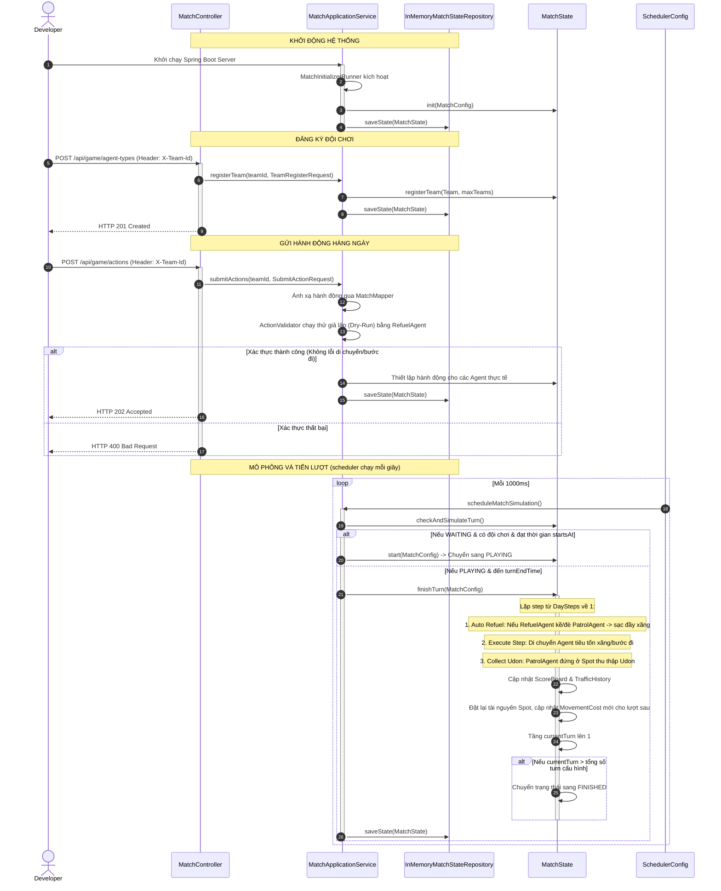

# Hexudon Server

Tài liệu này cung cấp hướng dẫn chi tiết về module `server` của dự án **Hexudon** dành cho các nhà phát triển. Module này đóng vai trò là Game Engine trung tâm để quản lý và mô phỏng các trận đấu Hexudon trên lưới lục giác.

---

## Overview

### 1. Vai trò của Server
`hexudon-server` là một ứng dụng backend Java Spring Boot đóng vai trò là **Game Engine Engine** của hệ thống Hexudon. Nhiệm vụ chính của server bao gồm:
*   Quản lý vòng đời trận đấu (Waiting, Playing, Finished).
*   Khởi tạo bản đồ lưới lục giác (Hexagonal Grid), tải tài nguyên (Udon spots) từ cấu hình.
*   Quản lý danh sách các đội (`Team`) và các Agent (`PatrolAgent`, `RefuelAgent`).
*   Tiếp nhận và xác thực danh sách hành động của các đội qua REST API.
*   Tự động chạy chu kỳ vòng đấu (Turn Simulation) thông qua Scheduler để tính toán di chuyển, tiêu thụ nhiên liệu, nạp nhiên liệu và thu thập Udon của các Agent.
*   Tính toán điểm số (`ScoreBoard`), lịch sử lưu lượng giao thông (`TrafficHistory`) và cập nhật chi phí di chuyển (`MovementCost`) động cho lượt chơi tiếp theo.

### 2. Tech Stack & Dependencies
*   **Java Version**: 21 (sử dụng các tính năng hiện đại như Records, Pattern Matching cho switch).
*   **Spring Boot Version**: 3.5.4
*   **Build Tool**: Maven 3.9+
*   **Dependencies quan trọng** (khai báo trong [server/pom.xml](file:///d:/Documents/GitHub/hexudon/server/pom.xml)):
    *   `spring-boot-starter-web`: Cung cấp REST API Controllers.
    *   `spring-boot-starter-validation`: Xác thực dữ liệu đầu vào của các REST DTOs (Jakarta Validation).
    *   `lombok`: Giảm mã boilerplate cho DTOs và logs.
    *   `spring-boot-starter-test`: Thư viện kiểm thử (JUnit 5, AssertJ, Mockito).
    *   `archunit-junit5` (v1.3.0): Kiểm thử ràng buộc kiến trúc hệ thống (Architecture Test).

---

## Architecture

Dự án tuân thủ nghiêm ngặt **Kiến trúc Lục giác (Hexagonal Architecture / Ports & Adapters)** và áp dụng các nguyên tắc của **Domain-Driven Design (DDD)**. Sự phân tách này đảm bảo Business Logic cốt lõi độc lập hoàn toàn với framework bên ngoài (Spring Boot, Jackson) và cơ sở hạ tầng lưu trữ.

```mermaid
graph TD
    subgraph Adapter Inbound (REST, Initializer, Scheduler)
        MatchController --> |uses| RegisterTeamUseCase
        MatchController --> |uses| SubmitActionsUseCase
        MatchController --> |uses| GetMatchStateUseCase
        MatchInitializerRunner --> |uses| InitializeMatchUseCase
        SchedulerConfig --> |uses| CheckAndSimulateTurnUseCase
    end

    subgraph Application Core
        subgraph Inbound Ports
            RegisterTeamUseCase[RegisterTeamUseCase]
            SubmitActionsUseCase[SubmitActionsUseCase]
            GetMatchStateUseCase[GetMatchStateUseCase]
            InitializeMatchUseCase[InitializeMatchUseCase]
            CheckAndSimulateTurnUseCase[CheckAndSimulateTurnUseCase]
        end

        subgraph Outbound Ports
            MatchStateStorePort[MatchStateStorePort]
            MatchConfigLoaderPort[MatchConfigLoaderPort]
        end

        MatchApplicationService[MatchApplicationService Service]
        MatchMapper[MatchMapper]
    end

    subgraph Domain Model
        MatchState[MatchState Aggregate Root]
        Team[Team Entity]
        Agent[Agent Entity]
        GameMap[GameMap Entity]
        ActionValidator[ActionValidator Domain Service]
    end

    subgraph Adapter Outbound (Persistence, File Loader)
        InMemoryMatchStateRepository --> |implements| MatchStateStorePort
        FileMatchConfigLoader --> |implements| MatchConfigLoaderPort
    end

    MatchApplicationService -.-> |implements| Inbound Ports
    MatchApplicationService --> |calls| Outbound Ports
    MatchApplicationService --> |invokes| MatchState
    MatchApplicationService --> |uses| ActionValidator
    
    %% Dependency Direction Rules
    classDef domain fill:#f9f,stroke:#333,stroke-width:2px;
    classDef application fill:#bbf,stroke:#333,stroke-width:2px;
    classDef adapter fill:#dfd,stroke:#333,stroke-width:2px;

    class MatchState,Team,Agent,GameMap,ActionValidator domain;
    class MatchApplicationService,RegisterTeamUseCase,SubmitActionsUseCase,GetMatchStateUseCase,InitializeMatchUseCase,CheckAndSimulateTurnUseCase,MatchStateStorePort,MatchConfigLoaderPort application;
    class MatchController,MatchInitializerRunner,SchedulerConfig,InMemoryMatchStateRepository,FileMatchConfigLoader adapter;
```

### Chi tiết các Layer và Chiều Phụ thuộc (Dependency Direction)
1.  **Domain Layer** (Không phụ thuộc vào bất kỳ layer nào khác, độc lập với framework Spring):
    *   Chứa mô hình nghiệp vụ cốt lõi, business rules và validations.
    *   Các thành phần chính: [MatchState](file:///d:/Documents/GitHub/hexudon/server/src/main/java/com/naprock/hexudon/domain/model/match/MatchState.java) (Aggregate Root), [Team](file:///d:/Documents/GitHub/hexudon/server/src/main/java/com/naprock/hexudon/domain/model/team/Team.java), [Agent](file:///d:/Documents/GitHub/hexudon/server/src/main/java/com/naprock/hexudon/domain/model/agent/Agent.java) (Entity), các Value Objects nghiệp vụ và [ActionValidator](file:///d:/Documents/GitHub/hexudon/server/src/main/java/com/naprock/hexudon/domain/service/ActionValidator.java) (Domain Service).
2.  **Application Layer** (Chỉ phụ thuộc vào Domain Layer):
    *   Định nghĩa các luồng xử lý nghiệp vụ thông qua **Inbound Ports** (Use Cases) và giao tiếp với bên ngoài qua **Outbound Ports** (SPI).
    *   [MatchApplicationService](file:///d:/Documents/GitHub/hexudon/server/src/main/java/com/naprock/hexudon/application/service/MatchApplicationService.java) điều phối các tác vụ nghiệp vụ, lấy dữ liệu từ các Outbound Ports, gọi các phương thức trên Domain Model và lưu lại trạng thái mới.
3.  **Adapter Layer** (Phụ thuộc vào Application và Domain Layer):
    *   **Inbound Adapters**: Nhận request từ bên ngoài và chuyển đổi sang dạng Use Case cần thiết. Ví dụ: REST API ([MatchController](file:///d:/Documents/GitHub/hexudon/server/src/main/java/com/naprock/hexudon/adapter/in/rest/MatchController.java)), Startup Inicializer ([MatchInitializerRunner](file:///d:/Documents/GitHub/hexudon/server/src/main/java/com/naprock/hexudon/adapter/in/initializer/MatchInitializerRunner.java)) và Spring Scheduler ([SchedulerConfig](file:///d:/Documents/GitHub/hexudon/server/src/main/java/com/naprock/hexudon/infrastructure/configuration/SchedulerConfig.java)).
    *   **Outbound Adapters**: Thực thi các Outbound Ports để giao tiếp với hạ tầng như lưu trữ trạng thái trong bộ nhớ ([InMemoryMatchStateRepository](file:///d:/Documents/GitHub/hexudon/server/src/main/java/com/naprock/hexudon/adapter/out/persistence/InMemoryMatchStateRepository.java)) hay đọc cấu hình từ file ([FileMatchConfigLoader](file:///d:/Documents/GitHub/hexudon/server/src/main/java/com/naprock/hexudon/adapter/out/loader/FileMatchConfigLoader.java)).

---

## Project Structure

Thư mục `server` được phân chia cấu trúc rõ ràng:

```text
server
├── src
│   ├── main
│   │   ├── java
│   │   │   └── com
│   │   │       └── naprock
│   │   │           └── hexudon
│   │   │               ├── HexudonApplication.java
│   │   │               ├── adapter
│   │   │               │   ├── in
│   │   │               │   │   ├── initializer         # CommandLineRunner chạy lúc khởi động
│   │   │               │   │   └── rest                # REST Controller & Exception Handler Advice
│   │   │               │   └── out
│   │   │               │       ├── configuration       # Cấu hình Bean cho Domain Services
│   │   │               │       ├── loader              # Loader nạp config trận đấu từ file json
│   │   │               │       └── persistence         # Lưu trữ MatchState tạm thời trong bộ nhớ
│   │   │               ├── application
│   │   │               │   ├── dto                     # REST Requests / Responses (Records)
│   │   │               │   ├── mapper                  # Ánh xạ giữa DTO và Domain Model
│   │   │               │   ├── model                   # DTO nội bộ của Application layer
│   │   │               │   ├── port
│   │   │               │   │   ├── in                  # Giao diện Use Cases (Inbound Ports)
│   │   │               │   │   └── out                 # Giao diện Persistence/SPI (Outbound Ports)
│   │   │               │   └── service                 # Triển khai Application Service
│   │   │               ├── domain
│   │   │               │   ├── exception               # Các ngoại lệ nghiệp vụ và lỗi hệ thống
│   │   │               │   ├── factory                 # Khởi tạo các đối tượng Agent
│   │   │               │   ├── model                   # Lõi nghiệp vụ (Aggregates, Entities, VOs, Enums)
│   │   │               │   ├── service                 # Domain Services (Xác thực hành động...)
│   │   │               │   └── validation              # Tiện ích kiểm tra tính hợp lệ của Domain
│   │   │               └── infrastructure
│   │   │                   ├── configuration           # Cấu hình Spring MVC CORS, Scheduler
│   │   │                   └── util                    # Các hàm tiện ích đọc file hệ thống
│   │   └── resources
│   │       ├── application.yml                         # Cấu hình ứng dụng Spring Boot
│   │       ├── match_config.json                       # Tệp cấu hình trận đấu mặc định
│   │       └── match_config.txt                        # Mô tả/tham chiếu định dạng file cấu hình
│   └── test
│       └── java                                        # Unit tests và Architecture tests
└── pom.xml
```

---

## Domain Model

### 1. Phân loại và Trách nhiệm của các đối tượng Domain

| Class | Phân loại | Trách nhiệm chính |
| :--- | :--- | :--- |
| [MatchState](file:///d:/Documents/GitHub/hexudon/server/src/main/java/com/naprock/hexudon/domain/model/match/MatchState.java) | **Aggregate Root** | Quản lý vòng đời trận đấu, trạng thái các đội chơi, bản đồ (`GameMap`), lưu lượng giao thông (`TrafficHistory`), bảng điểm (`ScoreBoard`). Nó kiểm soát các luật chơi chính như đăng ký đội chơi, bắt đầu trận đấu và mô phỏng từng lượt chơi (`finishTurn`). |
| [Team](file:///d:/Documents/GitHub/hexudon/server/src/main/java/com/naprock/hexudon/domain/model/team/Team.java) | **Entity** | Đại diện cho một đội đăng ký tham gia trận đấu. Quản lý danh sách các Agent trực thuộc đội và thực thi bước hành động của các Agent theo từng bước nhỏ (`executeStep`), đồng thời xử lý tự động tiếp nhiên liệu (`autoRefuel`). |
| [Agent](file:///d:/Documents/GitHub/hexudon/server/src/main/java/com/naprock/hexudon/domain/model/agent/Agent.java) | **Entity (Abstract)** | Đối tượng Agent trừu tượng cơ sở. Quản lý vị trí hiện tại (`Coordinate`), mức nhiên liệu còn lại (`fuel`), số bước đi còn lại trong lượt chơi (`remainingSteps`) và danh sách hành động dự kiến thực thi (`actions`). |
| [PatrolAgent](file:///d:/Documents/GitHub/hexudon/server/src/main/java/com/naprock/hexudon/domain/model/agent/PatrolAgent.java) | **Entity** | Kế thừa từ `Agent`. Đại diện cho Agent tuần tra chịu trách nhiệm thu thập Udon tại các điểm Spot. Agent này **tiêu tốn nhiên liệu** khi di chuyển qua các Cell. |
| [RefuelAgent](file:///d:/Documents/GitHub/hexudon/server/src/main/java/com/naprock/hexudon/domain/model/agent/RefuelAgent.java) | **Entity** | Kế thừa từ `Agent`. Đại diện cho Agent tiếp tế xăng. Agent này **không tiêu tốn nhiên liệu** khi di chuyển (chỉ tiêu tốn số bước đi hành động). Nhiệm vụ của nó là nạp đầy nhiên liệu cho `PatrolAgent` cùng đội khi đứng chung một ô tọa độ. |
| [Spot](file:///d:/Documents/GitHub/hexudon/server/src/main/java/com/naprock/hexudon/domain/model/map/Spot.java) | **Entity** | Điểm cung cấp Udon. Quản lý tọa độ, loại thương hiệu Udon (`type`), số lượng tồn kho ban đầu (`initialStocks`) và bản đồ số lượng kho riêng biệt của từng đội (`teamStocks`). |
| [Cell](file:///d:/Documents/GitHub/hexudon/server/src/main/java/com/naprock/hexudon/domain/model/map/Cell.java) | **Value Object** | Đại diện cho một ô trên lưới lục giác. Chứa thông tin tọa độ (`coordinate`) và kiểu địa hình (`terrainType`). Kiểm tra xem ô đó có thể đi qua được không (`isWalkable`). |
| [Coordinate](file:///d:/Documents/GitHub/hexudon/server/src/main/java/com/naprock/hexudon/domain/model/geometry/Coordinate.java) | **Value Object** | Tọa độ lưới lục giác sử dụng hệ thống **Odd-R offset**. Hỗ trợ chuyển đổi sang tọa độ khối (Cube Coordinate) để tính toán khoảng cách hex (`distanceTo`), xác định các ô kề cận (`isAdjacentTo`) và lấy ô láng giềng theo hướng di chuyển (`getNeighbor`). |
| [MovementCost](file:///d:/Documents/GitHub/hexudon/server/src/main/java/com/naprock/hexudon/domain/model/movement/MovementCost.java) | **Value Object** | Chi phí di chuyển của Agent khi đi vào một ô cụ thể, bao gồm lượng xăng tiêu thụ (`fuelNeeded`) và số bước hành động tiêu phí (`stepsNeeded`). |
| [MoveResult](file:///d:/Documents/GitHub/hexudon/server/src/main/java/com/naprock/hexudon/domain/model/movement/MoveResult.java) | **Value Object** | Kết quả thực thi di chuyển của Agent tại một bước đi (trạng thái thành công/thất bại và tọa độ sau di chuyển). |
| [CollectResult](file:///d:/Documents/GitHub/hexudon/server/src/main/java/com/naprock/hexudon/domain/model/team/CollectResult.java) | **Value Object** | Kết quả thu thập Udon của Agent tại ô hiện tại (Thành công hay thất bại, thương hiệu Udon là gì). |
| [TrafficFlow](file:///d:/Documents/GitHub/hexudon/server/src/main/java/com/naprock/hexudon/domain/model/traffic/TrafficFlow.java) | **Value Object** | Quản lý lưu lượng giao thông trên một ô thuộc loại địa hình `ROAD` (số lượt lưu trú lượt trước, lượt này và mức độ ùn tắc `TrafficLevel`). |
| [TrafficTracker](file:///d:/Documents/GitHub/hexudon/server/src/main/java/com/naprock/hexudon/domain/model/traffic/TrafficTracker.java) | **Value Object** | Snapshot lưu lượng giao thông tại một lượt chơi (`turn`). Thực hiện ghi nhận di chuyển (`recordMovements`) và tính toán tỷ lệ ùn tắc dựa trên số lượng đội chơi thực tế. |
| [TrafficHistory](file:///d:/Documents/GitHub/hexudon/server/src/main/java/com/naprock/hexudon/domain/model/traffic/TrafficHistory.java) | **Value Object** | Lưu trữ toàn bộ chuỗi snapshot lưu lượng giao thông qua các lượt chơi của trận đấu. |
| [ScoreBoard](file:///d:/Documents/GitHub/hexudon/server/src/main/java/com/naprock/hexudon/domain/model/score/ScoreBoard.java) | **Value Object** | Bảng điểm chung quản lý danh sách điểm số `TeamScore` của tất cả các đội đăng ký. |
| [TeamScore](file:///d:/Documents/GitHub/hexudon/server/src/main/java/com/naprock/hexudon/domain/model/score/TeamScore.java) | **Value Object** | Ghi nhận chi tiết điểm số của một đội: danh sách các loại Udon đã thu thập trong suốt trận đấu, lịch sử thu thập theo từng ngày (`dailyUdonTypesHistory`), tổng số phần ăn phục vụ (`totalServings`), tổng thời gian phản hồi API (`totalResponseTimeMs`) và số lượt gửi API (`requestCount`). |

### 2. Các Enum Quan Trọng và Luật Nghiệp Vụ Đi Kèm

#### MatchStatus
Biểu diễn trạng thái của trận đấu:
*   `WAITING`: Đang chờ các đội chơi đăng ký Agent và cấu hình loại Agent.
*   `PLAYING`: Trận đấu đang diễn ra. Mỗi ngày trôi qua được mô phỏng từng lượt chơi.
*   `FINISHED`: Trận đấu kết thúc khi hoàn thành tất cả số ngày cấu hình.

#### AgentType
*   `PATROL(0)`: Agent tuần tra. Tiêu tốn nhiên liệu và thực hiện thu thập Udon.
*   `REFUEL(1)`: Agent tiếp tế. Không tốn nhiên liệu khi di chuyển, dùng để sạc xăng cho PatrolAgent.

#### TerrainType
Định nghĩa địa hình của ô bản đồ và các chi phí cơ sở:
*   `PLAIN(0)`: Đồng bằng. Tiêu thụ xăng = 1, Số bước đi tiêu hao = 2. Có thể đi qua.
*   `ROAD(1)`: Đường sá. Tiêu thụ xăng = 2, Số bước đi tiêu hao = 1. Có thể đi qua và bị ảnh hưởng bởi lưu lượng giao thông.
*   `MOUNTAIN(2)`: Núi non. Tiêu thụ xăng = 2, Số bước đi tiêu hao = 3. Có thể đi qua.
*   `POND(3)`: Ao hồ. Không thể đi qua (`isWalkable` = false). Chi phí xăng/bước = 0.

#### Direction
Biểu diễn 6 hướng di chuyển trên lưới lục giác ngang Odd-R:
*   `0 -> NORTHWEST` (Tây Bắc)
*   `1 -> NORTHEAST` (Đông Bắc)
*   `2 -> EAST` (Đông)
*   `3 -> SOUTHEAST` (Đông Nam)
*   `4 -> SOUTHWEST` (Tây Nam)
*   `5 -> WEST` (Tây)

#### TrafficLevel
Quyết định chi phí xăng bổ sung trên các ô đường (`ROAD`) tùy thuộc vào mật độ Agent lưu lại:
*   `NORMAL` (Thường): Hệ số chi phí xăng = 1 (Tương ứng 1 xăng).
*   `BUSY` (Đông): Hệ số chi phí xăng = 2 (Tương ứng 2 xăng).
*   `CONGESTED` (Ùn tắc): Hệ số chi phí xăng = 4 (Tương ứng 4 xăng).

---

## Application Flow

### Quy Trình Vòng Đời Trận Đấu

Vòng đời của một trận đấu diễn ra theo sơ đồ các bước dưới đây:



### Các Business Rules Quan Trọng Cần Lưu Ý:
1.  **Cách nạp hành động (`Action.fromApiValue`)**:
    *   Nếu giá trị hành động gửi lên `>= 0`: Được diễn giải là hành động di chuyển `MOVE` tương ứng với hướng có mã số tương ứng từ 0 đến 5.
    *   Nếu giá trị hành động gửi lên `< 0`: Được diễn giải là hành động đứng chờ `WAIT`. Số lượng hành động chờ bằng trị tuyệt đối của số âm đó (Ví dụ: `-3` nghĩa là thêm 3 hành động đứng chờ liên tiếp vào hàng đợi).
2.  **Nguyên lý xác thực hành động gửi lên**:
    *   Quá trình xác thực trong [ActionValidator](file:///d:/Documents/GitHub/hexudon/server/src/main/java/com/naprock/hexudon/domain/service/ActionValidator.java) sẽ tạo ra một bản sao giả lập bằng `RefuelAgent` (do `RefuelAgent` không tiêu tốn nhiên liệu nên không bị chặn bởi mức xăng của Agent hiện tại). Bộ xác thực chỉ tập trung kiểm tra:
        *   Các ô di chuyển tới có hợp lệ (không phải ao hồ `POND` và nằm trong bản đồ).
        *   Tổng chi phí bước đi (`stepsNeeded`) của lộ trình không vượt quá số bước hành động còn lại (`remainingSteps`) của Agent trong ngày đó.
3.  **Cơ chế Tự Động Tiếp Nhiên Liệu (`autoRefuel`)**:
    *   Khi vòng đấu tiến hành chạy mô phỏng, ở mỗi bước nhỏ `step` (chạy lùi từ tổng số bước đi tối đa của ngày về 1):
    *   Hệ thống kiểm tra xem có bất kỳ cặp `RefuelAgent` và `PatrolAgent` nào của cùng một đội đang đứng tại cùng một ô tọa độ hay không.
    *   Nếu có, `PatrolAgent` sẽ được nạp đầy xăng ngay lập tức (`setFuel(maxFuel)`) trước khi thực hiện bước đi tiếp theo.
4.  **Cơ chế Tính Điểm & Kho Udon**:
    *   Kho hàng Udon trên mỗi ô Spot là **riêng biệt theo từng đội** (`teamStocks`). Việc một đội thu hoạch Udon ở một ô Spot hoàn toàn không làm giảm số lượng Udon mà đội khác có thể thu hoạch tại ô đó.
    *   Tại mỗi Spot, một `PatrolAgent` chỉ được thu hoạch Udon tối đa **1 lần mỗi lượt chơi** (được lưu vết trong danh sách `visitedSpotsToday`). Lượng tồn kho riêng biệt của đội chơi sẽ bị giảm đi 1 sau khi thu hoạch thành công.
5.  **Cập nhật Lưu Lượng Giao Thông động**:
    *   Cuối mỗi lượt chơi, dựa vào hành động di chuyển của các đội trên các ô đường bộ (`ROAD`), hệ thống tính tỷ lệ ùn tắc: `trafficRate = (previousStaySteps + currentStaySteps) / totalPlayers`.
    *   Tỷ lệ này sẽ phân loại lại `TrafficLevel` (NORMAL nếu `< 2.0`, BUSY nếu `< 4.0`, ngược lại là CONGESTED). Mức chi phí xăng di chuyển (`fuelNeeded`) của ô đường đó ở lượt chơi tiếp theo sẽ được cập nhật bằng chi phí của `TrafficLevel` mới (tương ứng 1, 2 hoặc 4 xăng).

---

## API Documentation

Dưới đây là các REST API thực tế được cung cấp bởi `MatchController`. Dữ liệu trao đổi sử dụng định dạng JSON, yêu cầu định danh đội qua header `X-Team-Id`.

| Method | Endpoint | Description | Request Body | Response Body | Validation Rules | Cấc lỗi có thể xảy ra (ErrorCode) |
| :--- | :--- | :--- | :--- | :--- | :--- | :--- |
| **POST** | `/api/game/agent-types` | Đăng ký đội chơi và cấu hình loại cho từng Agent (0: Patrol, 1: Refuel) | [TeamRegisterRequest](file:///d:/Documents/GitHub/hexudon/server/src/main/java/com/naprock/hexudon/application/dto/team/TeamRegisterRequest.java) | *None* | Danh sách `types` không được rỗng. Mỗi giá trị phải nằm trong khoảng `[0, 1]`. Độ dài của danh sách phải bằng số lượng Agent quy định của trận đấu trong cấu hình. | `VALIDATION_ERROR` (Mã loại lỗi hoặc độ dài Agent sai)<br>`MATCH_NOT_WAITING` (Trận đấu đã chạy)<br>`TEAM_ALREADY_EXISTS` (Đội đã tồn tại)<br>`MAX_TEAMS_REACHED` (Đầy slot đội) |
| **GET** | `/api/game/config` | Lấy cấu hình trận đấu hiện tại công khai | *None* | [MatchConfigResponse](file:///d:/Documents/GitHub/hexudon/server/src/main/java/com/naprock/hexudon/application/dto/match/MatchConfigResponse.java) | *None* | *None* |
| **GET** | `/api/game/state` | Lấy trạng thái hiện tại của trận đấu từ góc nhìn của đội gửi yêu cầu | *None* | [MatchStateResponse](file:///d:/Documents/GitHub/hexudon/server/src/main/java/com/naprock/hexudon/application/dto/match/MatchStateResponse.java) | Yêu cầu Header `X-Team-Id` phải có giá trị và không để trống. | `TEAM_NOT_FOUND` (Nếu đội chơi chưa được đăng ký trong trận đấu)<br>`MISSING_REQUEST_HEADER` (Header X-Team-Id trống) |
| **POST** | `/api/game/actions` | Gửi danh sách chuỗi hành động của toàn bộ Agent trong lượt chơi hiện tại | [SubmitActionRequest](file:///d:/Documents/GitHub/hexudon/server/src/main/java/com/naprock/hexudon/application/dto/match/SubmitActionRequest.java) | *None* | `day` phải `>= 0`. Danh sách `actions` không được null. Mỗi giá trị hành động số nguyên phải nằm trong khoảng từ `-6` đến `6`. Số lượng danh sách hành động con phải khớp chính xác số lượng Agent của đội. | `TEAM_NOT_FOUND` (Đội không tồn tại)<br>`VALIDATION_ERROR` (Số hành động sai, hành động di chuyển không hợp lệ, hoặc vượt quá số bước đi khả dụng của Agent) |

> [!NOTE]
> **Đối chiếu các API ví dụ**:
> *   Các API như `/api/match/register`, `/api/match/start`, `/api/match/action`, `/api/match/actions` và `/api/game/board` từ tài liệu phác thảo **chưa được implement** hoặc đã được thiết kế lại thành các endpoint `/api/game/*` ở bảng trên để phù hợp với kiến trúc thực tế của sản phẩm.

---

## Configuration

Các cấu hình chính của hệ thống nằm trong thư mục [resources](file:///d:/Documents/GitHub/hexudon/server/src/main/resources):

### 1. File application.yml
Cấu hình Spring Boot và thời gian chu kỳ quét của Scheduler:
```yaml
spring:
  application:
    name: hexudon-server

server:
  port: 8080

match:
  scheduler:
    interval: 1000  # Khoảng thời gian quét của Scheduler (tính bằng mili-giây)
```

### 2. File match_config.json
Quy định tất cả thông số thiết lập của một trận đấu:
*   `startsAt`: Thời điểm trận đấu có thể bắt đầu tính bằng giây epoch (sẽ được adapter `FileMatchConfigLoader` tự động ghi đè bằng `Thời gian hiện tại + 100 giây` khi tải cấu hình lần đầu).
*   `daySeconds`: Mảng quy định thời gian giới hạn của từng ngày chơi/lượt chơi (tính bằng giây).
*   `daySteps`: Mảng giới hạn số bước đi hoạt động (`remainingSteps`) của Agent trong ngày chơi tương ứng.
*   `map`: Chứa kích thước `width`, `height` và lưới địa hình hai chiều `cells` (giá trị ô từ 0 đến 3 biểu thị Plain, Road, Mountain, Pond).
*   `spots`: Danh sách các điểm Spot phân bổ Udon (chứa thương hiệu `brand`, chỉ số tọa độ phẳng `pos` và số lượng tồn kho `stocks` cung cấp).
*   `agents`: Các chỉ số tọa độ phẳng nơi sinh ra (spawn) mặc định cho các Agent của từng đội.
*   `fuelLimits`: Dung tích xăng tối đa của các Agent (ví dụ: `20`).
*   `players`: Số lượng đội chơi tối đa cho phép tham gia trận đấu.
*   `busyThreshold` / `jammedThreshold`: Ngưỡng mật độ dùng cho việc tính toán trạng thái tắc nghẽn (tương ứng `2.0` và `4.0` trong cấu hình, tuy nhiên hệ thống hiện tại đang sử dụng các hằng số cứng trong `TrafficTracker`).

---

## Scheduler

Lớp [SchedulerConfig](file:///d:/Documents/GitHub/hexudon/server/src/main/java/com/naprock/hexudon/infrastructure/configuration/SchedulerConfig.java) kích hoạt một luồng chạy nền với tần suất dựa vào giá trị cấu hình `match.scheduler.interval` (mặc định mỗi **1000ms**).

Nhiệm vụ của Scheduler:
1.  Gọi `CheckAndSimulateTurnUseCase.checkAndSimulateTurn()`.
2.  Kiểm tra xem thời gian thực tế hiện tại đã vượt quá thời điểm kết thúc lượt chơi (`turnEndTime`) hay chưa.
3.  **Tiến trình xử lý**:
    *   **Bắt đầu trận đấu**: Nếu trận đấu đang ở trạng thái `WAITING`, có ít nhất một đội đã đăng ký, và thời gian hiện tại đạt hoặc vượt quá thời điểm bắt đầu trận đấu, Scheduler sẽ tự động gọi `state.start(config)` để đổi trạng thái sang `PLAYING`, khởi tạo ngày đầu tiên và nạp nhiên liệu đầy cho tất cả Agent.
    *   **Mô phỏng lượt chơi**: Nếu trận đấu đang ở trạng thái `PLAYING` và đến hạn đổi lượt, hệ thống sẽ thực hiện mô phỏng di chuyển/thu thập Udon (`finishTurn`), cập nhật giao thông, phân bổ lại điểm số, tăng biến đếm ngày chơi và đặt lại thời gian kết thúc lượt chơi tiếp theo. Nếu vượt quá số ngày cấu hình, trạng thái trận đấu tự động chuyển sang `FINISHED`.

---

## Exception Handling

Hệ thống xử lý ngoại lệ tập trung thông qua lớp `@RestControllerAdvice` [GlobalExceptionHandler](file:///d:/Documents/GitHub/hexudon/server/src/main/java/com/naprock/hexudon/adapter/in/rest/advice/GlobalExceptionHandler.java):

### 1. Sơ đồ phân cấp ngoại lệ (Exception Hierarchy)
*   **RuntimeException**
    *   [BusinessException](file:///d:/Documents/GitHub/hexudon/server/src/main/java/com/naprock/hexudon/domain/exception/base/BusinessException.java) (Chứa ErrorCode và mã HTTP Status tùy chọn)
        *   [GameRuleViolationException](file:///d:/Documents/GitHub/hexudon/server/src/main/java/com/naprock/hexudon/domain/exception/business/GameRuleViolationException.java) (Lỗi vi phạm luật chơi hoặc gửi bước đi không hợp lệ - **HTTP 400**)
        *   [MatchStateConflictException](file:///d:/Documents/GitHub/hexudon/server/src/main/java/com/naprock/hexudon/domain/exception/business/MatchStateConflictException.java) (Lỗi xung đột trạng thái vòng đời trận đấu - **HTTP 400**)
        *   [ResourceNotFoundException](file:///d:/Documents/GitHub/hexudon/server/src/main/java/com/naprock/hexudon/domain/exception/business/ResourceNotFoundException.java) (Lỗi không tìm thấy đội chơi hoặc Agent - **HTTP 404**)
        *   [RateLimitExceededException](file:///d:/Documents/GitHub/hexudon/server/src/main/java/com/naprock/hexudon/domain/exception/business/RateLimitExceededException.java) (Lỗi vượt quá số lượng cuộc gọi cho phép - **HTTP 429** - *Chưa được tích hợp bộ lọc chặn*)
    *   [SystemException](file:///d:/Documents/GitHub/hexudon/server/src/main/java/com/naprock/hexudon/domain/exception/base/SystemException.java)
        *   [ConfigLoadException](file:///d:/Documents/GitHub/hexudon/server/src/main/java/com/naprock/hexudon/domain/exception/system/ConfigLoadException.java) (Lỗi hệ thống khi tải tệp tin cấu hình không thành công)

### 2. Định dạng phản hồi lỗi (ErrorResponse)
Khi xảy ra lỗi, API sẽ trả về cấu trúc lỗi tiêu chuẩn dạng JSON:
```json
{
  "code": "VALIDATION_ERROR",
  "message": "Request body validation failed.",
  "timestamp": 1719875612345,
  "errors": [
    {
      "field": "types",
      "rejectedValue": "[]",
      "message": "Types must not be empty"
    }
  ]
}
```

---

## Development Guide

### Yêu cầu hệ thống (Requirements)
*   **Java SE Development Kit (JDK)**: Phiên bản 21 trở lên.
*   **Apache Maven**: Phiên bản 3.9 trở lên.

### Hướng dẫn chạy server cục bộ (Run locally)
Từ thư mục gốc của dự án (nơi chứa file `pom.xml` cha), thực hiện các lệnh sau bằng PowerShell hoặc terminal:

```bash
# Biên dịch toàn bộ dự án
mvn clean install

# Khởi chạy ứng dụng Spring Boot Server
mvn spring-boot:run -pl server
```
Sau khi khởi chạy thành công, Server sẽ lắng nghe tại cổng `8080`. Bạn sẽ thấy dòng log chào mừng dạng:
`[HEXUDON] Game Map has been generated and initialized successfully at startup.`

### Kiểm thử ứng dụng (Testing)
Để chạy các bộ kiểm thử unit test, integration test và kiểm tra kiến trúc của module server:
```bash
mvn test -pl server
```

Các ca kiểm thử đặc biệt bao gồm:
*   [ArchitectureTest.java](file:///d:/Documents/GitHub/hexudon/server/src/test/java/com/naprock/hexudon/ArchitectureTest.java): Chạy các quy tắc kiểm thử ArchUnit để bảo đảm không có sự vi phạm chiều phụ thuộc trong Kiến trúc Lục giác (ví dụ: Domain không được phép phụ thuộc vào Application hay các Adapter bên ngoài).

---

## Extension Guide

Nhờ vào thiết kế lỏng của kiến trúc Ports & Adapters, các nhà phát triển có thể mở rộng các chức năng nghiệp vụ của Server mà không làm ảnh hưởng đến cấu trúc cốt lõi:

1.  **Traffic System (Hệ thống lưu lượng giao thông)**:
    *   *Mở rộng*: Hiện tại tỷ lệ mật độ giao thông đang được so sánh với ngưỡng cố định 2.0 và 4.0 tại `TrafficTracker`. Bạn có thể cập nhật để lấy các tham số `busyThreshold` và `jammedThreshold` trực tiếp từ đối tượng cấu hình `MatchConfig` truyền xuống từ luồng của hệ thống.
2.  **Ranking System (Hệ thống xếp hạng)**:
    *   *Mở rộng*: Thêm một Domain Service tính toán xếp hạng chung cuộc dựa trên số lượng servings, sự phong phú loại udon thu thập và tổng thời gian phản hồi API trung bình tích lũy trong `ScoreBoard`.
3.  **Event History & Communication Logging (Nhật ký sự kiện)**:
    *   *Mở rộng*: Triển khai một Outbound Persistence Adapter mới kế thừa các sự kiện thay đổi trạng thái di chuyển của Agent hoặc nhật ký cuộc gọi API của các đội để lưu trữ vào cơ sở dữ liệu quan hệ (như PostgreSQL) phục vụ phân tích trực quan.
4.  **Recovery System (Khôi phục trạng thái)**:
    *   *Mở rộng*: Viết lại lớp thực thi `MatchStateStorePort`. Thay vì sử dụng bộ nhớ RAM tạm thời như `InMemoryMatchStateRepository`, có thể lưu trữ và phục hồi trạng thái `MatchState` trực tiếp từ tệp tin JSON hoặc Redis để bảo đảm khả năng phục hồi dữ liệu khi máy chủ bị dừng đột ngột.
