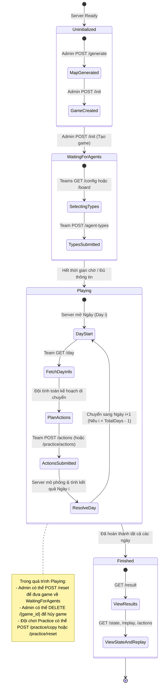
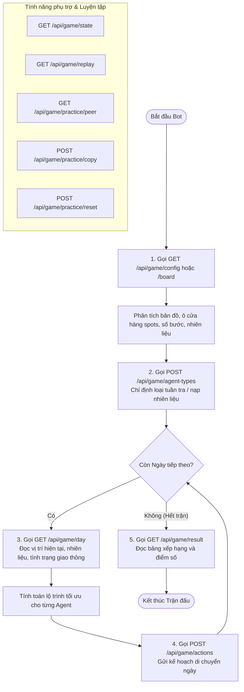

# Vòng đời trận đấu & API (Lifecycle Diagram)

Tài liệu này mô tả vòng đời của một trận đấu HEXUDON và sự chuyển đổi giữa các trạng thái thông qua các API tương ứng.

---

## 1. Sơ đồ trạng thái Trận đấu (Game State Machine)

---

## 2. Vòng đời sử dụng API theo góc nhìn Client (Bot Lifecycle Flowchart)

