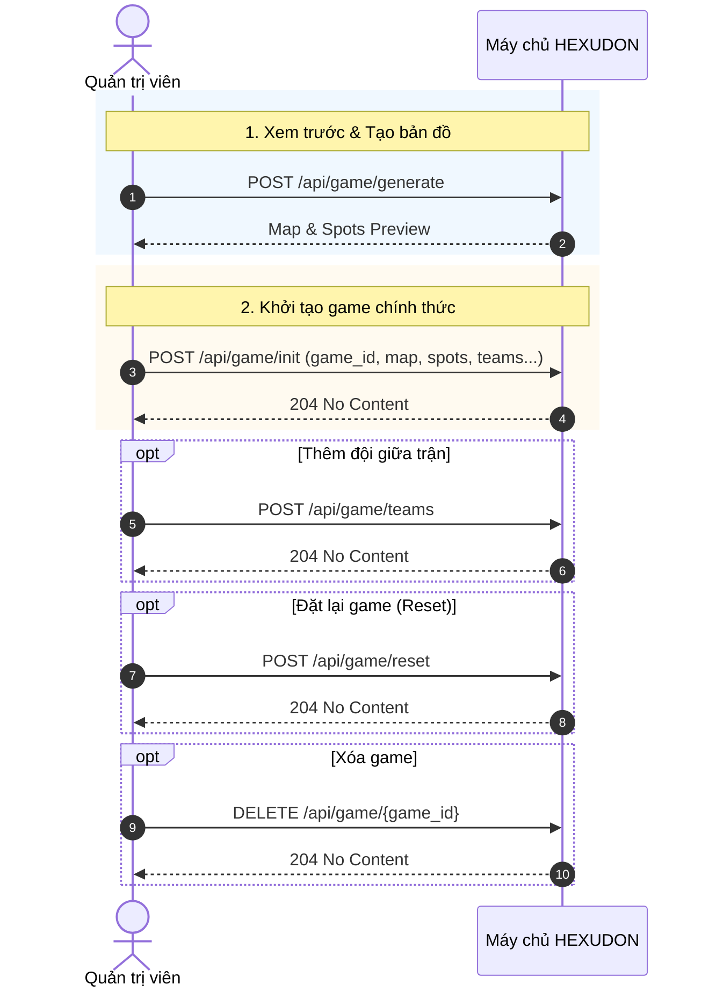
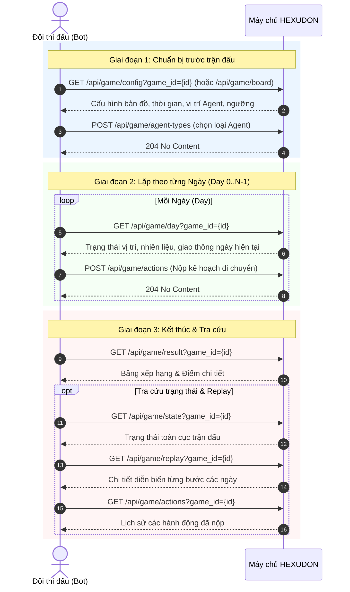
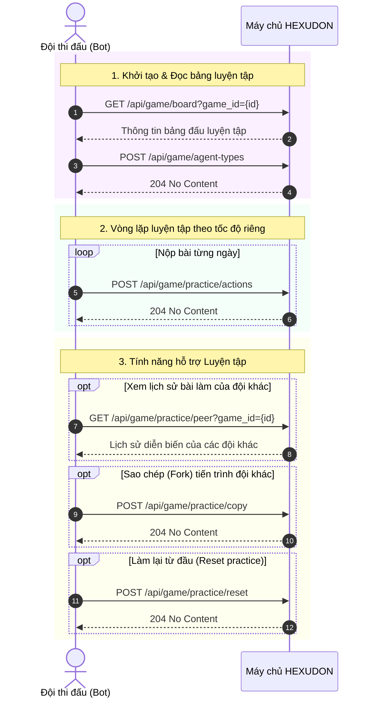

# Luồng gọi API (Request Flow)

Tài liệu này mô tả chi tiết các luồng tương tác API giữa Đội (Bot/Client), Quản trị viên (Admin UI/Server) và Máy chủ HEXUDON.

---

## 1. Luồng khởi tạo & Quản lý trận đấu (Admin Flow)

Mô tả cách Admin tạo bản đồ, khởi tạo trận đấu, thêm đội, reset hoặc xóa game.

---

## 2. Luồng thi đấu chính thức (Tournament Match Flow)

Mô tả toàn bộ vòng thi đấu của Đội tham gia: từ đọc cấu hình, chọn loại Agent, nộp kế hoạch hàng ngày đến nhận kết quả chung cuộc.

---

## 3. Luồng luyện tập tự chọn tốc độ (Practice Mode Flow)

Mô tả luồng thi đấu chế độ Luyện tập (Practice Mode), hỗ trợ tự nộp kế hoạch, so sánh với đội khác, sao chép tiến trình (fork) và đặt lại bài tập.

